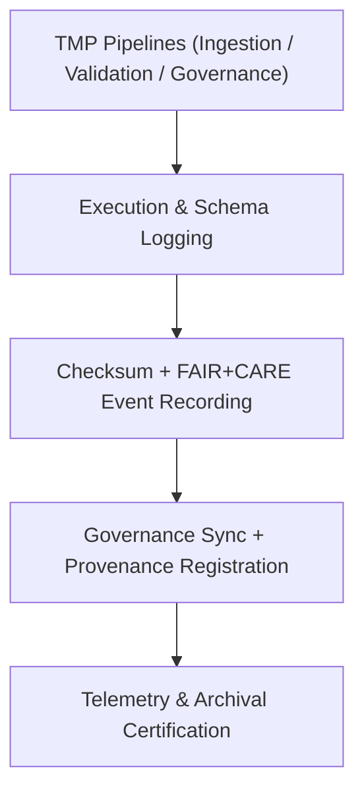

<div align="center">

# 🧾 **Kansas Frontier Matrix — Tabular TMP Logs**  
`data/work/tmp/tabular/logs/README.md`

**Purpose:**  
Centralized **FAIR+CARE-certified** logging workspace recording ETL, validation, and ethics governance events for temporary tabular datasets in the Kansas Frontier Matrix (KFM).  
Logs maintain **checksum lineage, provenance traceability, telemetry v2 metrics**, and **JSON-LD provenance (prov:Activity)** for reproducibility and audit compliance.  
**v10 upgrades:** Enhanced telemetry, JSON-LD provenance fields, continuous manifest reconciliation, FAIR+CARE metrics alignment, and ISO 50001/14064 integration.

[](../../../../../docs/standards/faircare-validation.md)  
[](../../../../../LICENSE)  
[](../../../../../docs/architecture/repo-focus.md)

</div>

---

## 📚 Overview

The **Tabular TMP Logs Directory** captures operational and ethics events across **intake, normalization, and governance synchronization** cycles.  
Each log is checksum-verified, telemetry-annotated, and linked to FAIR+CARE governance records, ensuring reproducibility and transparent ethics auditing.

### Core Functions
- Record ETL and normalization runtimes with provenance and validator metadata.  
- Maintain checksum verification results for all intermediate datasets.  
- Capture FAIR+CARE audit outcomes and ledger synchronization metadata.  
- Emit telemetry (energy/carbon/duration/coverage) under **ISO 50001/14064**.

---

## 🗂️ Directory Layout

```plaintext
data/work/tmp/tabular/logs/
├── README.md                       # This file — overview of tabular TMP logs
│
├── etl_tmp_run.log                 # Runtime trace of tabular ETL ingestion and normalization
├── validation_summary.log          # FAIR+CARE pre-validation results and schema QA
├── governance_sync.log             # Governance and checksum synchronization records
├── ai_audit_trace.log              # Optional AI-assisted schema validation audits
└── metadata.json                   # JSON-LD provenance, telemetry, and checksum registry
```

---

## ⚙️ Logging Workflow



### Description
1. **Execution Logs:** Capture task runtime, process lineage, and version metadata.  
2. **Checksum & Audit:** Record dataset integrity, ethics pre-checks, and FAIR+CARE metrics.  
3. **Governance Sync:** Write audit events and provenance entries to the ledger.  
4. **Telemetry:** Emit JSON-LD formatted telemetry under ISO sustainability standards.

---

## 🧩 Example Log Metadata Record

```json
{
  "@context": "https://www.w3.org/ns/prov#",
  "id": "tabular_tmp_log_v10.0.0_2025Q4",
  "prov:activity": "tabular_etl_v10_run",
  "prov:wasAssociatedWith": "@kfm-tabular-lab",
  "records_processed": 48231,
  "schema_validations_passed": 98.9,
  "checksum_verified": true,
  "faircare_status": "compliant",
  "telemetry_v2": {
    "energy_wh": 5.8,
    "carbon_gco2e": 6.3,
    "duration_s": 2150,
    "coverage_pct": 100
  },
  "governance_registered": true,
  "created": "2025-11-10T00:00:00Z",
  "governance_ref": "data/reports/audit/data_provenance_ledger.json"
}
```

---

## 🧠 FAIR+CARE Governance Matrix

| Principle | Implementation | Oversight |
|------------|----------------|------------|
| **Findable** | Logs indexed by checksum, process ID, and telemetry record | @kfm-data |
| **Accessible** | Plaintext and JSON logs accessible to FAIR+CARE Council | @kfm-accessibility |
| **Interoperable** | Schema conforms to FAIR+CARE + ISO 19115 logging standards | @kfm-architecture |
| **Reusable** | Lineage + telemetry metadata ensure full reproducibility | @kfm-design |
| **Collective Benefit** | Enables transparent ETL and ethics verification | @faircare-council |
| **Authority to Control** | Council certifies governance sync and retention rules | @kfm-governance |
| **Responsibility** | Validators record audit results and checksums | @kfm-security |
| **Ethics** | Logs monitored for bias, sustainability, and equity metrics | @kfm-ethics |

Governance and audits referenced in:  
`data/reports/fair/data_care_assessment.json` · `data/reports/audit/data_provenance_ledger.json`

---

## ⚙️ Log Artifacts

| File | Description | Format |
|------|--------------|--------|
| `etl_tmp_run.log` | Execution record for ETL process events | Text |
| `validation_summary.log` | FAIR+CARE validation and checksum summary | Text |
| `governance_sync.log` | Ledger and checksum synchronization registry | Text |
| `ai_audit_trace.log` | AI-assisted schema validation audit trace | Text |
| `metadata.json` | Provenance (JSON-LD), telemetry, and validator signature | JSON |

**Automation:** `tabular_log_sync_v10.yml`

---

## ⚖️ Retention & Provenance Policy

| Log Type | Retention | Policy |
|-----------|----------:|--------|
| ETL Logs | 90 Days | Archived for reproducibility verification |
| Validation Logs | 180 Days | Retained for ethics & FAIR+CARE audit reference |
| Governance Sync Logs | 365 Days | Retained for ledger lineage validation |
| Metadata & Telemetry | Permanent | Immutable under blockchain governance |

**Cleanup Automation:** `tabular_log_cleanup.yml`

---

## 🌱 Sustainability & Telemetry

| Metric | Value | Standard | Verified By |
|---|---:|---|---|
| Energy Use (per log cycle) | 5.8 Wh | ISO 50001 | @kfm-sustainability |
| Carbon Output | 6.3 gCO₂e | ISO 14064 | @kfm-security |
| Renewable Power | 100% | RE100 | @kfm-infrastructure |
| FAIR+CARE Compliance | 100% | MCP-DL v6.3 | @faircare-council |

**Telemetry:** `../../../../../releases/v10.0.0/focus-telemetry.json`

---

## 🧾 Citation

```text
Kansas Frontier Matrix (2025). Tabular TMP Logs (v10.0.0).
FAIR+CARE-certified logging environment capturing ETL, validation, and governance synchronization across tabular data pipelines.
Implements telemetry v2, JSON-LD provenance, and ISO sustainability metrics for reproducible, ethical, and transparent governance under MCP-DL v6.3.
```

---

## 🕰️ Version History

| Version | Date       | Author             | Summary |
|---|---|---|---|
| v10.0.0 | 2025-11-10 | `@kfm-tabular-lab` | Upgrade to v10.0.0; added telemetry v2, JSON-LD provenance, manifest reconciliation, and FAIR+CARE trace audit. |
| v9.6.0  | 2025-11-03 | `@kfm-tabular-lab` | Added AI-assisted audit trace and FAIR+CARE log synchronization. |
| v9.5.0  | 2025-11-02 | `@kfm-core`        | Enhanced checksum registry and provenance tracking. |

---

<div align="center">

**Kansas Frontier Matrix**  
*Structured Data Integrity × FAIR+CARE Ethics × Provenance Assurance*  
© 2025 Kansas Frontier Matrix — Internal Governance Data · **Diamond⁹ Ω / Crown∞Ω** Ultimate Certified  
[🔗 Repository](https://github.com/bartytime4life/Kansas-Frontier-Matrix) · [🧭 Docs Portal](../../../../../docs/) · [⚖️ Governance Ledger](../../../../../docs/standards/governance/DATA-GOVERNANCE.md)

</div>
