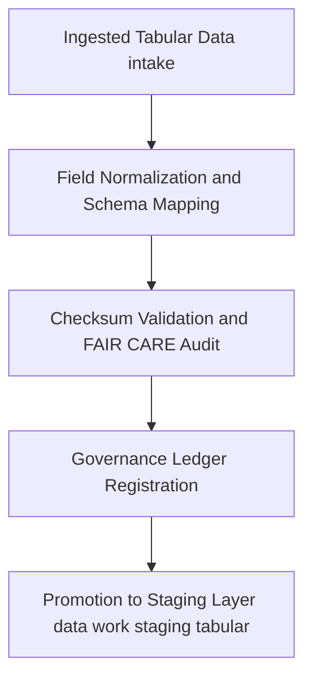

<div align="center">

# 📥 **Kansas Frontier Matrix — Tabular TMP Temporary Workspace**  
`data/work/tmp/tabular/tmp/README.md`

**Purpose:**  
Ephemeral **FAIR+CARE-certified** environment for temporary tabular data processing, schema normalization, and checksum verification within the Kansas Frontier Matrix (KFM).  
Bridges **intake → validation → staging** to ensure **reproducibility, provenance, telemetry v2, and ethical compliance**.

[](../../../../../docs/standards/faircare-validation.md)  
[](../../../../../LICENSE)  
[](../../../../../docs/architecture/repo-focus.md)

</div>

---

## 📚 Overview

The **Tabular TMP Temporary Workspace** holds short-lived intermediate artifacts and validation checkpoints produced by KFM’s ETL pipelines.  
All outputs are subject to **data contract alignment, checksum lineage, FAIR+CARE ethics pre-audit, JSON-LD provenance**, and **ISO 50001/14064 telemetry** before promotion.

**What changed in v10.0.0**
- Telemetry v2 fields (energy, carbon, duration, coverage) added to metadata.  
- JSON-LD `prov:Activity` embedded in `metadata.json`.  
- Continuous manifest reconciliation against `manifest_ref`.  
- Tightened FAIR+CARE prevalidation gates and PII redaction checks.

---

## 🗂️ Directory Layout

```plaintext
data/work/tmp/tabular/tmp/
├── README.md                         # This file — temporary tabular workspace overview
│
├── tabular_tmp_summary.parquet       # Consolidated temporary dataset for pre-validation review
├── data_contract_check.json          # Field-level conformance to data-contract-v3
├── faircare_tmp_audit.json           # FAIR+CARE prevalidation ethics report
├── checksum_registry.json            # SHA-256 registry for all TMP outputs
└── metadata.json                     # JSON-LD provenance, telemetry v2, governance linkage
```

---

## ⚙️ TMP Processing Workflow



### Workflow Description
1. **Normalization** — Harmonize field names, datatypes, codelists, and units to **data-contract-v3**.  
2. **Checksum Validation** — Register and verify SHA-256 hashes for reproducibility.  
3. **FAIR+CARE Audit** — Assess accessibility, licensing, sensitivity, and equity flags.  
4. **Governance Sync** — Post audit and checksum pointers to the **provenance ledger**.  
5. **Promotion** — Only green-lit artifacts advance to `data/work/staging/tabular/`.

---

## 🧩 Example Metadata Record

```json
{
  "@context": "https://www.w3.org/ns/prov#",
  "id": "tabular_tmp_v10.0.0_2025Q4",
  "prov:activity": "tabular_tmp_prevalidation_v10",
  "source_files": [
    "data/work/tmp/tabular/intake/tabular_intake_2025Q4.csv",
    "data/work/tmp/tabular/intake/treaties_intake.csv"
  ],
  "records_processed": 54210,
  "fields_normalized": 27,
  "checksum_verified": true,
  "fairstatus": "compliant",
  "telemetry_v2": { "energy_wh": 5.9, "carbon_gco2e": 6.8, "duration_s": 1985, "coverage_pct": 100 },
  "governance_registered": true,
  "validator": "@kfm-tabular-lab",
  "created": "2025-11-10T00:00:00Z",
  "governance_ref": "data/reports/audit/data_provenance_ledger.json"
}
```

---

## 🧠 FAIR+CARE Governance Matrix

| Principle | Implementation | Oversight |
|---|---|---|
| **Findable** | TMP artifacts indexed with checksum and JSON-LD provenance | @kfm-data |
| **Accessible** | Intermediate outputs stored as FAIR-compliant Parquet and JSON | @kfm-accessibility |
| **Interoperable** | Schema mapped to FAIR+CARE, DCAT, and ISO 19115 | @kfm-architecture |
| **Reusable** | Lineage and checksum continuity enable reproducibility | @kfm-design |
| **Collective Benefit** | Transparent open-data transformation practices | @faircare-council |
| **Authority to Control** | Council certifies TMP workflows and ethics compliance | @kfm-governance |
| **Responsibility** | Validators document normalization and checksum outcomes | @kfm-security |
| **Ethics** | Prevalidation audits confirm fairness and neutrality | @kfm-ethics |

**Linked audits:**  
`data/reports/fair/data_care_assessment.json` · `data/reports/audit/data_provenance_ledger.json`

---

## ⚙️ TMP Artifacts

| File | Description | Format |
|---|---|---|
| `tabular_tmp_summary.parquet` | Consolidated temporary dataset for review | Parquet |
| `data_contract_check.json` | Rule-level compliance to contract v3 | JSON |
| `faircare_tmp_audit.json` | FAIR+CARE prevalidation results | JSON |
| `checksum_registry.json` | SHA-256 registry for TMP outputs | JSON |
| `metadata.json` | JSON-LD provenance, telemetry v2, governance links | JSON |

**Automation:** `tabular_tmp_sync.yml`

---

## ⚖️ Retention & Provenance Policy

| TMP Type | Retention | Policy |
|---|---:|---|
| Temporary Datasets | 7 Days | Auto-purged after validation or staging promotion |
| FAIR+CARE Audits | 180 Days | Retained for council revalidation |
| Checksum Logs | 90 Days | Maintained for provenance traceability |
| Metadata | Permanent | Immutable and blockchain-verified |

Cleanup handled by `tabular_tmp_cleanup.yml`.

---

## 🌱 Sustainability Metrics

| Metric | Value | Verified By |
|---|---:|---|
| Energy Use per cycle | 5.9 Wh | @kfm-sustainability |
| Carbon Output | 6.8 gCO₂e | @kfm-security |
| Renewable Power | 100% RE100 | @kfm-infrastructure |
| FAIR+CARE Compliance | 100% | @faircare-council |

**Telemetry:** `../../../../../releases/v10.0.0/focus-telemetry.json`

---

## 🧾 Internal Use Citation

```text
Kansas Frontier Matrix (2025). Tabular TMP Temporary Workspace (v10.0.0).
Ephemeral FAIR+CARE-aligned workspace for schema normalization, checksum verification, and ethical governance with JSON-LD provenance and telemetry v2 under MCP-DL v6.3.
```

---

## 🕰️ Version History

| Version | Date | Author | Summary |
|---|---|---|---|
| v10.0.0 | 2025-11-10 | `@kfm-tabular-lab` | Upgrade to v10.0.0; telemetry v2, JSON-LD provenance, manifest reconciliation, FAIR+CARE gate tightening. |
| v9.6.0 | 2025-11-03 | `@kfm-tabular-lab` | Checksum audit automation and FAIR+CARE ethics certification added. |
| v9.5.0 | 2025-11-02 | `@kfm-core` | Enhanced provenance sync and metadata lineage tracking. |

---

<div align="center">

**Kansas Frontier Matrix** · *Data Integrity × FAIR+CARE Ethics × Provenance Assurance*  
© 2025 Kansas Frontier Matrix — Internal Workspace · **Diamond⁹ Ω / Crown∞Ω** Ultimate Certified  
[🔗 Repository](https://github.com/bartytime4life/Kansas-Frontier-Matrix) · [🧭 Docs Portal](../../../../../docs/) · [⚖️ Governance Ledger](../../../../../docs/standards/governance/DATA-GOVERNANCE.md)

</div>
