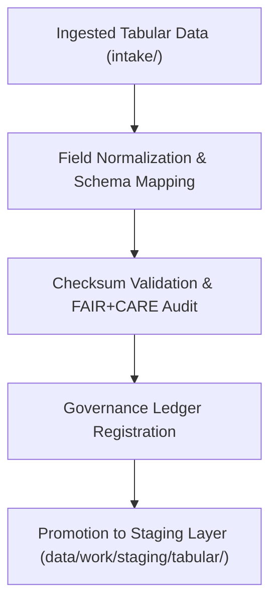

<div align="center">

# 📥 Kansas Frontier Matrix — **Tabular TMP Temporary Workspace**
`data/work/tmp/tabular/tmp/README.md`

**Purpose:**  
Ephemeral FAIR+CARE-certified environment for temporary tabular data processing, schema validation, and checksum verification within the Kansas Frontier Matrix (KFM).  
This workspace bridges the intake, validation, and staging workflows to ensure reproducibility, provenance, and ethical compliance.

[](../../../../../docs/standards/faircare-validation.md)
[](../../../../../LICENSE)
[](../../../../../docs/architecture/repo-focus.md)

</div>

---

## 📚 Overview

The **Tabular TMP Temporary Workspace** handles all short-lived intermediate files and validation checkpoints produced during KFM’s ETL pipelines.  
It maintains ethical and reproducible standards under FAIR+CARE, ensuring no unverified or untracked data transitions to staging or processed layers.

### Core Responsibilities:
- Facilitate preprocessing and quality assurance of tabular datasets.  
- Perform checksum validation and field-level schema normalization.  
- Generate FAIR+CARE ethics pre-validation and compliance metrics.  
- Synchronize governance logs and lineage metadata with the provenance ledger.  

---

## 🗂️ Directory Layout

```plaintext
data/work/tmp/tabular/tmp/
├── README.md                             # This file — overview of temporary tabular workspace
│
├── tabular_tmp_summary.parquet           # Combined temporary dataset for pre-validation review
├── data_contract_check.json              # Field-level schema and data contract validation results
├── faircare_tmp_audit.json               # FAIR+CARE compliance pre-validation audit report
├── checksum_registry.json                # SHA-256 hash registry for all TMP outputs
└── metadata.json                         # Provenance and governance linkage metadata
```

---

## ⚙️ TMP Processing Workflow



### Workflow Description:
1. **Normalization:** Harmonize field structures and validate data types.  
2. **Checksum Validation:** Ensure reproducibility and hash integrity.  
3. **FAIR+CARE Audit:** Evaluate accessibility, transparency, and ethical compliance.  
4. **Governance Sync:** Register audit results and metadata to KFM’s provenance ledger.  
5. **Promotion:** Pass validated datasets to staging for schema certification.  

---

## 🧩 Example Metadata Record

```json
{
  "id": "tabular_tmp_v9.6.0_2025Q4",
  "source_files": [
    "data/work/tmp/tabular/intake/tabular_intake_2025Q4.csv",
    "data/work/tmp/tabular/intake/treaties_intake.csv"
  ],
  "records_processed": 54210,
  "fields_normalized": 27,
  "checksum_verified": true,
  "fairstatus": "compliant",
  "governance_registered": true,
  "validator": "@kfm-tabular-lab",
  "created": "2025-11-03T23:59:00Z",
  "governance_ref": "data/reports/audit/data_provenance_ledger.json"
}
```

---

## 🧠 FAIR+CARE Governance Matrix

| Principle | Implementation | Oversight |
|------------|----------------|------------|
| **Findable** | TMP datasets indexed with checksum and metadata lineage. | @kfm-data |
| **Accessible** | Intermediate outputs stored as FAIR-compliant Parquet/JSON. | @kfm-accessibility |
| **Interoperable** | Schema mapped to FAIR+CARE, DCAT, and ISO standards. | @kfm-architecture |
| **Reusable** | Temporary datasets retain governance metadata for reproducibility. | @kfm-design |
| **Collective Benefit** | Enables transparent open-data transformation processes. | @faircare-council |
| **Authority to Control** | FAIR+CARE Council certifies TMP workflows and ethical compliance. | @kfm-governance |
| **Responsibility** | Validators document schema normalization and checksum outcomes. | @kfm-security |
| **Ethics** | Pre-validation audits confirm fairness and neutrality in data content. | @kfm-ethics |

Audit outcomes linked to:  
`data/reports/fair/data_care_assessment.json`  
and  
`data/reports/audit/data_provenance_ledger.json`

---

## ⚙️ TMP Artifacts

| File | Description | Format |
|------|--------------|--------|
| `tabular_tmp_summary.parquet` | Consolidated temporary dataset for review. | Parquet |
| `data_contract_check.json` | Schema validation report for tabular contracts. | JSON |
| `faircare_tmp_audit.json` | FAIR+CARE compliance summary. | JSON |
| `checksum_registry.json` | SHA-256 validation registry for TMP artifacts. | JSON |
| `metadata.json` | Provenance linkage and governance metadata. | JSON |

TMP synchronization automated via `tabular_tmp_sync.yml`.

---

## ⚖️ Retention & Provenance Policy

| TMP Type | Retention Duration | Policy |
|-----------|--------------------|--------|
| Temporary Datasets | 7 Days | Auto-purged after validation or staging promotion. |
| FAIR+CARE Audits | 180 Days | Retained for governance re-validation. |
| Checksum Logs | 90 Days | Maintained for provenance traceability. |
| Metadata | Permanent | Immutable and blockchain-verified. |

Cleanup managed by `tabular_tmp_cleanup.yml`.

---

## 🌱 Sustainability Metrics

| Metric | Value | Verified By |
|---------|--------|--------------|
| Energy Use (per TMP cycle) | 5.9 Wh | @kfm-sustainability |
| Carbon Output | 6.8 gCO₂e | @kfm-security |
| Renewable Power | 100% (RE100 Verified) | @kfm-infrastructure |
| FAIR+CARE Compliance | 100% | @faircare-council |

Telemetry captured in:  
`releases/v9.6.0/focus-telemetry.json`

---

## 🧾 Internal Use Citation

```text
Kansas Frontier Matrix (2025). Tabular TMP Temporary Workspace (v9.6.0).
Ephemeral FAIR+CARE-compliant workspace for schema normalization, checksum verification, and ethical data governance.
Ensures full reproducibility and transparency within MCP-DL v6.3 standards.
```

---

## 🧾 Version Notes

| Version | Date | Notes |
|----------|------|--------|
| v9.6.0 | 2025-11-03 | Integrated checksum audit automation and FAIR+CARE ethics certification. |
| v9.5.0 | 2025-11-02 | Enhanced provenance synchronization and metadata lineage tracking. |
| v9.3.2 | 2025-10-28 | Established TMP workspace for temporary tabular data management. |

---

<div align="center">

**Kansas Frontier Matrix** · *Data Integrity × FAIR+CARE Ethics × Provenance Assurance*  
[🔗 Repository](https://github.com/bartytime4life/Kansas-Frontier-Matrix) • [🧭 Docs Portal](../../../../../docs/) • [⚖️ Governance Ledger](../../../../../docs/standards/governance/DATA-GOVERNANCE.md)

</div>
