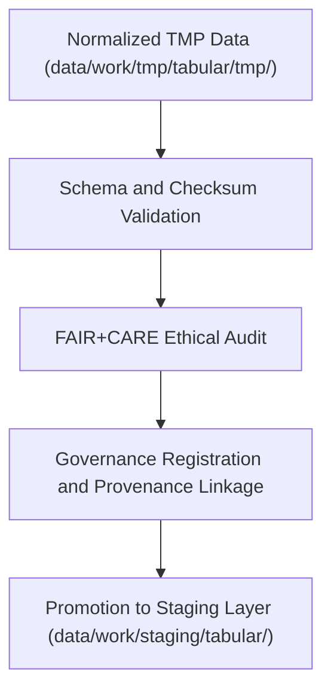

<div align="center">

# ✅ Kansas Frontier Matrix — **Tabular TMP Validation Layer**
`data/work/tmp/tabular/validation/README.md`

**Purpose:**  
Dedicated FAIR+CARE-certified workspace for validating schema integrity, checksum lineage, and ethical compliance for temporary tabular datasets within the Kansas Frontier Matrix (KFM).  
This layer ensures that tabular data is accurate, reproducible, and aligned with KFM’s FAIR+CARE governance principles before staging promotion.

[](../../../../../docs/standards/faircare-validation.md)
[]()
[](../../../../../LICENSE)
[](../../../../../docs/architecture/repo-focus.md)

</div>

---

## 📚 Overview

The **Tabular TMP Validation Layer** is the critical audit checkpoint for schema and ethics verification across KFM’s temporary tabular workflows.  
It validates data structures, field mappings, FAIR+CARE compliance, and checksum lineage to guarantee ethical transparency and reproducibility.

### Core Responsibilities:
- Validate schema integrity using defined data contracts.  
- Verify checksum consistency for reproducibility and integrity tracking.  
- Conduct FAIR+CARE audits for openness, ethics, and accessibility.  
- Synchronize validated results with governance and provenance ledgers.  

---

## 🗂️ Directory Layout

```plaintext
data/work/tmp/tabular/validation/
├── README.md                                # This file — documentation of tabular validation layer
│
├── schema_validation_summary.json           # Schema conformance and validation results
├── faircare_audit_report.json               # FAIR+CARE compliance and ethical audit
├── checksum_registry.json                   # Hash-based integrity verification report
├── validation_manifest.json                 # Manifest summarizing validation events and governance entries
├── governance_sync.log                      # Record of provenance and ledger synchronization
└── metadata.json                            # Provenance metadata linking validation cycle to governance ledger
```

---

## ⚙️ Validation Workflow



### Workflow Description:
1. **Schema Validation:** Check for field-level accuracy and data contract compliance.  
2. **Checksum Verification:** Confirm hash lineage for reproducibility and data trust.  
3. **FAIR+CARE Audit:** Perform ethical governance validation and accessibility scoring.  
4. **Governance Sync:** Register validation reports and provenance to ledger for audit traceability.  
5. **Promotion:** Pass validated datasets to staging for persistent retention.  

---

## 🧩 Example Validation Record

```json
{
  "id": "tabular_tmp_validation_v9.6.0_2025Q4",
  "datasets_validated": [
    "tabular_tmp_summary.parquet",
    "data_contract_check.json"
  ],
  "schema_compliance_rate": 99.7,
  "checksum_verified": true,
  "faircare_status": "certified",
  "ai_bias_detected": false,
  "governance_registered": true,
  "validator": "@kfm-tabular-lab",
  "created": "2025-11-03T23:59:00Z",
  "governance_ref": "data/reports/audit/data_provenance_ledger.json"
}
```

---

## 🧠 FAIR+CARE Governance Matrix

| Principle | Implementation | Oversight |
|------------|----------------|------------|
| **Findable** | Validation manifests indexed with dataset ID and schema version. | @kfm-data |
| **Accessible** | Results stored in FAIR+CARE JSON reports. | @kfm-accessibility |
| **Interoperable** | Schema validated against FAIR+CARE, ISO, and DCAT standards. | @kfm-architecture |
| **Reusable** | Validation reports linked to provenance and governance logs. | @kfm-design |
| **Collective Benefit** | Guarantees transparent, ethical validation for open datasets. | @faircare-council |
| **Authority to Control** | FAIR+CARE Council certifies final validation cycle. | @kfm-governance |
| **Responsibility** | Validators ensure schema accuracy and FAIR+CARE alignment. | @kfm-security |
| **Ethics** | Bias detection and data ethics audits confirm fairness. | @kfm-ethics |

Audit results recorded in:  
`data/reports/fair/data_care_assessment.json`  
and  
`data/reports/audit/data_provenance_ledger.json`

---

## ⚙️ Validation Artifacts

| File | Description | Format |
|------|--------------|--------|
| `schema_validation_summary.json` | Field-level schema validation results. | JSON |
| `faircare_audit_report.json` | FAIR+CARE ethics and accessibility compliance. | JSON |
| `checksum_registry.json` | SHA-256 checksum registry and lineage record. | JSON |
| `validation_manifest.json` | Master validation event summary. | JSON |
| `governance_sync.log` | Provenance and ethics synchronization trace. | Text |
| `metadata.json` | Provenance linkage and validator metadata. | JSON |

Validation process automated via `tabular_validation_sync.yml`.

---

## ⚖️ Retention & Provenance Policy

| Validation Type | Retention Duration | Policy |
|------------------|--------------------|--------|
| Schema Reports | 180 Days | Archived for reproducibility and governance review. |
| FAIR+CARE Audits | 365 Days | Maintained for ethics re-certification. |
| Checksum Logs | 180 Days | Retained for data lineage verification. |
| Metadata | Permanent | Immutable under blockchain-verified governance ledger. |

Cleanup automation handled by `tabular_validation_cleanup.yml`.

---

## 🌱 Sustainability Metrics

| Metric | Value | Verified By |
|---------|--------|--------------|
| Energy Use (per validation cycle) | 6.8 Wh | @kfm-sustainability |
| Carbon Output | 7.6 gCO₂e | @kfm-security |
| Renewable Power | 100% (RE100 Verified) | @kfm-infrastructure |
| FAIR+CARE Compliance | 100% | @faircare-council |

Telemetry tracked in:  
`releases/v9.6.0/focus-telemetry.json`

---

## 🧾 Internal Use Citation

```text
Kansas Frontier Matrix (2025). Tabular TMP Validation Layer (v9.6.0).
FAIR+CARE-certified validation hub ensuring schema accuracy, checksum integrity, and ethical compliance for tabular datasets.
Supports reproducible and transparent governance under MCP-DL v6.3.
```

---

## 🧾 Version Notes

| Version | Date | Notes |
|----------|------|--------|
| v9.6.0 | 2025-11-03 | Added AI bias audit integration and checksum lineage reporting. |
| v9.5.0 | 2025-11-02 | Improved FAIR+CARE ethics audit and governance synchronization. |
| v9.3.2 | 2025-10-28 | Established tabular validation workspace for schema compliance. |

---

<div align="center">

**Kansas Frontier Matrix** · *Tabular Governance × FAIR+CARE Validation × Provenance Integrity*  
[🔗 Repository](https://github.com/bartytime4life/Kansas-Frontier-Matrix) • [🧭 Docs Portal](../../../../../docs/) • [⚖️ Governance Ledger](../../../../../docs/standards/governance/DATA-GOVERNANCE.md)

</div>
