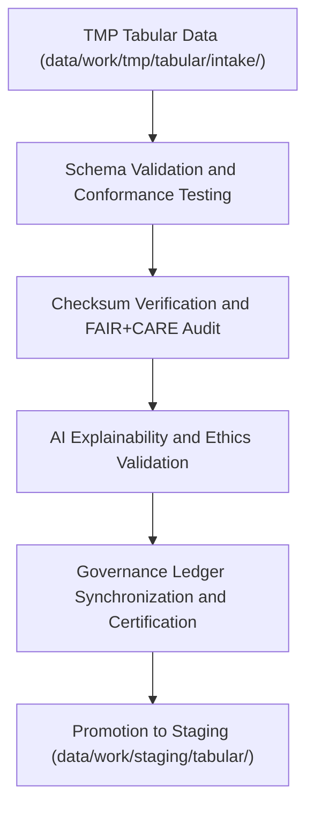

<div align="center">

# ✅ Kansas Frontier Matrix — **Tabular TMP Validation Workspace**
`data/work/tmp/tabular/validation/README.md`

**Purpose:**  
FAIR+CARE-certified environment for **schema conformance, data integrity verification, and ethical audit validation** of tabular datasets in the Kansas Frontier Matrix (KFM).  
Ensures all tabular data passing through TMP pipelines meets FAIR+CARE ethics, schema, and reproducibility standards before staging or archival promotion.

[](../../../../../docs/standards/faircare-validation.md)
[](../../../../../LICENSE)
[](../../../../../docs/architecture/repo-focus.md)

</div>

---

## 📚 Overview

The `data/work/tmp/tabular/validation/` directory serves as a **temporary quality assurance and ethics checkpoint** for tabular datasets before staging publication.  
This workspace performs schema validation, checksum integrity tests, FAIR+CARE ethical audits, and AI model explainability checks.

### Core Responsibilities
- Validate all TMP tabular data against KFM schema and metadata standards.  
- Perform FAIR+CARE compliance and accessibility audits.  
- Verify checksums and reproducibility alignment with provenance registries.  
- Log ethics, schema, and validation outcomes to governance ledgers.  

---

## 🗂️ Directory Layout

```plaintext
data/work/tmp/tabular/validation/
├── README.md                               # This file — documentation for Tabular TMP validation workspace
│
├── schema_validation_summary.json          # Schema field validation and datatype verification
├── faircare_audit_report.json              # FAIR+CARE ethics compliance and accessibility audit
├── checksum_registry.json                  # Checksum validation for TMP files
├── ai_explainability_report.json           # AI explainability and bias transparency record
├── governance_review.json                  # Governance validation and FAIR+CARE council oversight
└── metadata.json                           # Provenance and checksum linkage metadata
```

---

## ⚙️ Validation Workflow



### Workflow Description
1. **Schema Validation:** Cross-check field definitions, types, and constraints.  
2. **Checksum Verification:** Validate file integrity and structural consistency.  
3. **FAIR+CARE Audit:** Conduct ethics and governance review for accessibility and compliance.  
4. **AI Explainability:** Validate transparency of any AI-assisted data normalization.  
5. **Governance Registration:** Log validation summaries in KFM’s provenance ledger.  

---

## 🧩 Example Validation Metadata Record

```json
{
  "id": "tabular_tmp_validation_v9.5.0_2025Q4",
  "datasets_validated": [
    "hazards_intake_2025.csv",
    "climate_indices_intake.parquet"
  ],
  "records_validated": 112305,
  "schema_validation_passed": true,
  "checksum_verified": true,
  "faircare_score": 98.4,
  "ai_explainability_score": 0.987,
  "fairstatus": "certified",
  "governance_registered": true,
  "telemetry_ref": "releases/v9.5.0/focus-telemetry.json",
  "governance_ref": "reports/audit/ai_tabular_ledger.json",
  "created": "2025-11-02T23:50:00Z",
  "validator": "@kfm-tabular-validation"
}
```

---

## 🧠 FAIR+CARE Governance Matrix

| Principle | Implementation |
|------------|----------------|
| **Findable** | Validation reports indexed with dataset IDs and checksum records. |
| **Accessible** | Stored in open FAIR+CARE-compliant formats for audit and review. |
| **Interoperable** | Conforms to DCAT 3.0, JSON Schema, and ISO 19115 standards. |
| **Reusable** | Metadata includes provenance, ethics results, and schema validation. |
| **Collective Benefit** | Supports transparent and equitable access to validated datasets. |
| **Authority to Control** | FAIR+CARE Council oversees schema and ethical compliance. |
| **Responsibility** | Validators document and review all schema and FAIR+CARE results. |
| **Ethics** | Validation enforces ethical, accessible, and responsible data use. |

Governance records stored in:  
`reports/audit/ai_tabular_ledger.json` • `reports/fair/tabular_validation_summary.json`

---

## ⚙️ QA & Validation Artifacts

| File | Description | Format |
|------|--------------|--------|
| `schema_validation_summary.json` | Schema and field-level validation summary. | JSON |
| `faircare_audit_report.json` | FAIR+CARE compliance review and scoring. | JSON |
| `checksum_registry.json` | SHA-256 hash validation and reproducibility log. | JSON |
| `ai_explainability_report.json` | Explainability and transparency validation for AI models. | JSON |
| `governance_review.json` | Governance council’s ethical approval and certification log. | JSON |
| `metadata.json` | Provenance and validation linkage metadata. | JSON |

Automation managed via `tabular_validation_sync.yml`.

---

## 🧾 Retention Policy

| File Type | Retention Duration | Policy |
|------------|--------------------|--------|
| Validation Reports | 365 days | Archived for audit reproducibility. |
| FAIR+CARE Audits | Permanent | Retained indefinitely for governance traceability. |
| Checksum Registries | Permanent | Maintained in provenance ledgers. |
| Metadata | Permanent | Stored under KFM’s governance chain for continuity. |

Cleanup automated via `tabular_validation_cleanup.yml`.

---

## 🧾 Internal Use Citation

```text
Kansas Frontier Matrix (2025). Tabular TMP Validation Workspace (v9.5.0).
FAIR+CARE-certified QA workspace for schema, checksum, and ethics validation of tabular datasets.
Ensures transparent, ethical, and reproducible data governance under MCP-DL v6.3 compliance.
```

---

## 🧾 Version Notes

| Version | Date | Notes |
|----------|------|--------|
| v9.5.0 | 2025-11-02 | Introduced AI explainability auditing and expanded FAIR+CARE validation metrics. |
| v9.3.2 | 2025-10-28 | Enhanced governance synchronization and ethics scoring schema. |
| v9.3.0 | 2025-10-26 | Established tabular validation workspace for TMP QA and governance tracking. |

---

<div align="center">

**Kansas Frontier Matrix** · *Tabular QA × FAIR+CARE Ethics × Provenance Integrity*  
[🔗 Repository](https://github.com/bartytime4life/Kansas-Frontier-Matrix) • [🧭 Docs Portal](../../../../../docs/) • [⚖️ Governance Ledger](../../../../../docs/standards/governance/)

</div>