<div align="center">

# ✅ **Kansas Frontier Matrix — Tabular TMP Validation Layer**  
`data/work/tmp/tabular/validation/README.md`

**Purpose:**  
FAIR+CARE-certified **quality assurance and governance layer** validating schema, checksum, and ethics compliance for tabular datasets within the Kansas Frontier Matrix (KFM).  
This layer certifies each dataset for **reproducibility, provenance lineage, and transparency** before staging or processed promotion.  
**v10 upgrades:** JSON-LD provenance, telemetry v2, manifest reconciliation, AI bias scoring integration, and continuous governance sync.

[](../../../../../docs/standards/faircare-validation.md)  
[]()  
[](../../../../../LICENSE)  
[](../../../../../docs/architecture/repo-focus.md)

</div>

---

## 📚 Overview

The **Tabular TMP Validation Layer** is KFM’s core checkpoint for technical and ethical quality assurance.  
It verifies **schema compliance**, **checksum lineage**, and **FAIR+CARE ethics** before any dataset transitions to long-term storage or publication.  
Validation metadata is written in **JSON-LD (prov:Activity)** format with energy, carbon, and bias telemetry metrics aligned to **ISO 50001/14064**.

### Core Responsibilities
- Validate field structures and datatype integrity against **data-contract-v3**.  
- Confirm SHA-256 lineage (raw → intake → tmp → validation).  
- Audit FAIR+CARE openness, accessibility, and sensitivity controls.  
- Register bias and explainability metrics for AI-assisted data transformations.  
- Synchronize reports to provenance ledger and update telemetry streams.

---

## 🗂️ Directory Layout

```plaintext
data/work/tmp/tabular/validation/
├── README.md                           # This file — documentation of validation layer
│
├── schema_validation_summary.json      # Field-level schema compliance results
├── faircare_audit_report.json          # FAIR+CARE ethics and accessibility audit
├── checksum_registry.json              # Integrity lineage (SHA-256)
├── ai_bias_explainability.json         # Bias/explainability scoring (if applicable)
├── validation_manifest.json            # Aggregated validation cycle and ledger entries
└── metadata.json                       # Provenance JSON-LD + telemetry + governance refs
```

---

## ⚙️ Validation Workflow

```mermaid
flowchart TD
    A["Normalized TMP Data (../tmp/)"] --> B["Schema Validation (data-contract-v3)"]
    B --> C["Checksum Verification + FAIR·CARE Ethics Review"]
    C --> D["AI Bias & Explainability Analysis (if applicable)"]
    D --> E["Governance Ledger Registration & Manifest Update"]
    E --> F["Promotion to Staging Layer (data/work/staging/tabular/)"]
```



### Description
1. **Schema Validation** — Evaluate structural accuracy, types, and constraints.  
2. **Checksum Verification** — Validate continuity between intake and tmp layers.  
3. **FAIR+CARE Audit** — Ethics, accessibility, reuse, and sensitivity scoring.  
4. **Bias Assessment** — Detect model or preprocessing bias if AI applied.  
5. **Governance Sync** — Post validation results and telemetry to ledger and manifest.

---

## 🧩 Example Validation Record

```json
{
  "@context": "https://www.w3.org/ns/prov#",
  "id": "tabular_tmp_validation_v10.0.0_2025Q4",
  "prov:activity": "tabular_validation_v10",
  "datasets_validated": [
    "tabular_tmp_summary.parquet",
    "data_contract_check.json"
  ],
  "schema_compliance_rate": 99.8,
  "checksum_verified": true,
  "faircare_status": "certified",
  "ai_bias_score": 0.02,
  "telemetry_v2": {
    "energy_wh": 6.7,
    "carbon_gco2e": 7.5,
    "duration_s": 2450,
    "coverage_pct": 100
  },
  "governance_registered": true,
  "validator": "@kfm-tabular-lab",
  "created": "2025-11-10T00:00:00Z",
  "governance_ref": "data/reports/audit/data_provenance_ledger.json"
}
```

---

## 🧠 FAIR+CARE Governance Matrix

| Principle | Implementation | Oversight |
|---|---|---|
| **Findable** | Indexed in `validation_manifest.json` with checksum lineage | @kfm-data |
| **Accessible** | FAIR+CARE JSON artifacts with CC-BY licensing | @kfm-accessibility |
| **Interoperable** | Aligned with FAIR+CARE, DCAT, and ISO 19115 | @kfm-architecture |
| **Reusable** | Checksum lineage and schema compliance ensure reproducibility | @kfm-design |
| **Collective Benefit** | Promotes transparency and equitable access to data | @faircare-council |
| **Authority to Control** | FAIR+CARE Council validates certification & governance sync | @kfm-governance |
| **Responsibility** | Validators document results and ethics audit outcomes | @kfm-security |
| **Ethics** | Ensures transparency, accessibility, and fairness in validation | @kfm-ethics |

**Audits and Governance Records:**  
`data/reports/fair/data_care_assessment.json` · `data/reports/audit/data_provenance_ledger.json`

---

## ⚙️ Validation Artifacts

| File | Description | Format |
|---|---|---|
| `schema_validation_summary.json` | Schema structure validation results | JSON |
| `faircare_audit_report.json` | FAIR+CARE ethics & accessibility audit report | JSON |
| `checksum_registry.json` | SHA-256 integrity verification results | JSON |
| `ai_bias_explainability.json` | AI bias & interpretability outcomes | JSON |
| `validation_manifest.json` | Cross-linked validation report summary | JSON |
| `metadata.json` | JSON-LD provenance record with telemetry v2 | JSON |

**Automation:** `tabular_validation_sync_v10.yml`

---

## ⚖️ Retention & Provenance Policy

| Validation Type | Retention Duration | Policy |
|---|---:|---|
| Schema Reports | 180 Days | Retained for reproducibility audits |
| FAIR+CARE Audits | 365 Days | Archived for ethics review and re-certification |
| AI Bias Logs | 365 Days | Maintained for transparency verification |
| Metadata | Permanent | Immutable under blockchain governance |

Cleanup automation: `tabular_validation_cleanup.yml`

---

## 🌱 Sustainability Metrics

| Metric | Value | Standard | Verified By |
|---|---:|---|---|
| Energy Use | 6.7 Wh | ISO 50001 | @kfm-sustainability |
| Carbon Output | 7.5 gCO₂e | ISO 14064 | @kfm-security |
| Renewable Power | 100% | RE100 | @kfm-infrastructure |
| FAIR+CARE Compliance | 100% | MCP-DL v6.3 | @faircare-council |

**Telemetry:** `../../../../../releases/v10.0.0/focus-telemetry.json`

---

## 🧾 Citation

```text
Kansas Frontier Matrix (2025). Tabular TMP Validation Layer (v10.0.0).
FAIR+CARE-certified validation workspace ensuring schema, checksum, and ethical compliance for tabular datasets.
Implements telemetry v2, JSON-LD provenance, and AI bias scoring for governance traceability under MCP-DL v6.3 and ISO 19115.
```

---

## 🕰️ Version History

| Version | Date | Author | Summary |
|---|---|---|---|
| v10.0.0 | 2025-11-10 | `@kfm-tabular-lab` | Upgraded to v10; added telemetry v2, JSON-LD provenance, AI bias integration, manifest reconciliation. |
| v9.6.0 | 2025-11-03 | `@kfm-tabular-lab` | Introduced bias detection and checksum lineage reports. |
| v9.5.0 | 2025-11-02 | `@kfm-core` | FAIR+CARE ethics audit automation and provenance sync. |

---

<div align="center">

**Kansas Frontier Matrix**  
*Tabular Validation × FAIR+CARE Ethics × Provenance Transparency*  
© 2025 Kansas Frontier Matrix — CC-BY 4.0 · **Diamond⁹ Ω / Crown∞Ω** Ultimate Certified  
[🔗 Repository](https://github.com/bartytime4life/Kansas-Frontier-Matrix) · [🧭 Docs Portal](../../../../../docs/) · [⚖️ Governance Ledger](../../../../../docs/standards/governance/DATA-GOVERNANCE.md)

</div>
