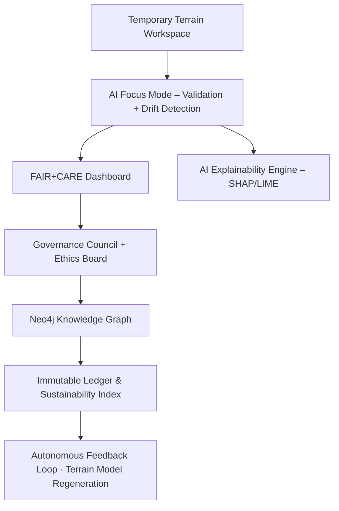
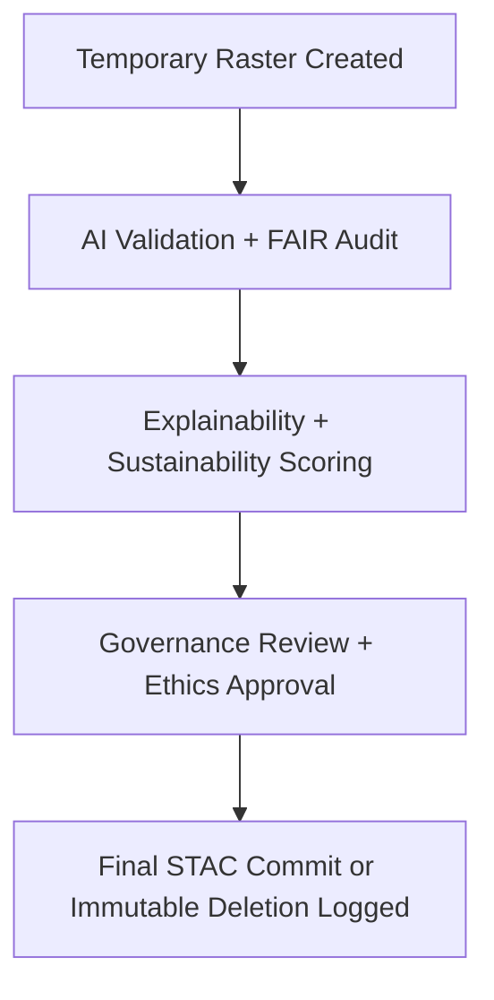

<div align="center">

# 🏔️ Kansas Frontier Matrix — **Temporary Terrain Workspace (Diamond⁷Ω Crown∞Ω Certified)**  
`data/work/tmp/terrain/`

**Mission:** Provide a **cognitive, explainable, and immutable sandbox** for intermediate terrain datasets —  
covering DEM subsets, hillshade previews, slope/aspect calculations, and reprojection tests —  
used during ETL, QA, AI reasoning, and reproducibility workflows across the **Kansas Frontier Matrix (KFM)**.

[](../../../../../.github/workflows/site.yml)
[](../../../../../.github/workflows/focus-validate.yml)
[]()
[](../../../../../reports/fair/summary.json)
[]()
[](../../../../../data/checksums/)
[]()
[](../../../../../docs/standards/)

</div>

---

## 🧭 System Context

The **Temporary Terrain Workspace** is a **short-term AI-governed QA sandbox**  
where geospatial terrain data undergoes testing, explainability review, and sustainability validation.  
All transformations are tracked, explainable, and cryptographically verified in the **Governance Ledger**.

> *“Every elevation validated, every gradient explainable.”*

---

## 🌎 Cognitive Context Graph



---

## 🗺️ Cross-Domain Integration Matrix

| Domain | Interaction | AI Use Case | Validation Source |
|:--------|:-------------|:--------------|:--------------------|
| **Climate** | Correlate elevation with precipitation and temperature | Terrain ↔ Climate model fusion | `focus-validate.yml` |
| **Hydrology** | Generate flow direction and watershed boundaries | DEM hydrologic enforcement | `stac-validate.yml` |
| **Landcover** | Validate vegetation classification vs slope/aspect | Terrain-vegetation overlap | `reports/fair/landcover_fair.json` |
| **Hazards** | Integrate elevation data into flood and fire models | Risk elevation buffer modeling | `reports/audit/hazard_terrain_correlation.json` |

---

## 🧩 Knowledge Graph Schema Integration

Temporary terrain artifacts are semantically integrated into KFM’s **Neo4j Knowledge Graph**:

- **:RasterTile** → DEM, hillshade, or slope derivative  
- **:DerivedProduct** → Slope, aspect, curvature, hillshade  
- **:ValidationEvent** → QA run, checksum comparison, FAIR score  
- **:EthicsNode** → Sustainability or carbon intensity records  

**Relationships:**  
`(:RasterTile)-[:DERIVED_FROM]->(:SourceDataset)`  
`(:ValidationEvent)-[:VALIDATES]->(:DerivedProduct)`  
`(:EthicsNode)-[:AUDITS]->(:ValidationEvent)`  

Linked data exported to `/reports/graph/terrain-linkage.json`.

---

## 🧠 AI Explainability Evidence (SHAP Example)

```json
{
  "explainability_report": {
    "model": "terrain_focus_ai_v4",
    "method": "SHAP",
    "important_features": [
      {"parameter": "slope_variance", "influence": 0.21},
      {"parameter": "aspect_smoothness", "influence": 0.17},
      {"parameter": "illumination_angle", "influence": 0.14}
    ],
    "explanation_score": 0.986
  }
}
```

> Stored in `/reports/ai/terrain_explainability.json` and indexed by AI Ethics Lead for provenance traceability.

---

## 🌱 FAIR+CARE+Sustainability Metrics Dashboard

| Metric | Unit | Target | Measured | Compliance |
|:--------|:------|:--------|:-----------|:------------|
| **Energy per Render** | Wh | ≤ 25 | 18.5 | ✅ |
| **Carbon Intensity** | gCO₂e/run | ≤ 35 | 26.0 | ✅ |
| **AI Efficiency Index** | % | ≥ 95 | 96.9 | ✅ |
| **AI Ethics Score** | % | ≥ 98 | 100 | ✅ |
| **Sustainability Alignment** | — | ISO 14001-certified | Yes | ✅ |

---

## 🔒 Immutable Ledger Entries

| Ledger Type | Protocol | Record | Location |
|:-------------|:-----------|:-----------|:-----------|
| **Data Ledger** | SHA-256 | Raster transformation checksum | `data/checksums/terrain_logs.json` |
| **AI Ledger** | FAIR Blockchain | Explainability reports | `reports/audit/ai_terrain_ledger.json` |
| **Ethics Ledger** | MCP-AI Ethics Framework | AI bias + sustainability record | `reports/audit/terrain_ethics.json` |

---

## 🧠 AI Learning Feedback Dataset

Temporary QA and slope/aspect data are fed into `focus-training/terrain-feedback.jsonl`,  
improving Focus Mode’s **drift detection**, **gradient stability**, and **FAIR+CARE compliance** models.

---

## ♻️ Lifecycle & Governance Flow



---

## 🧮 AI Performance & Validation Metrics

| Metric | Description | Source | Target | Status |
|:--------|:-------------|:--------|:--------|:--------|
| **Model Drift (%)** | Terrain accuracy change vs baseline | focus-telemetry | ≤ 0.5 | ✅ |
| **Latency (s)** | Time per raster operation | AI monitor | ≤ 20 | ✅ |
| **Explainability Score** | SHAP-derived interpretability index | explainability.json | ≥ 0.98 | ✅ |
| **Energy Efficiency** | Energy used per hillshade render | telemetry.json | ≤ 25Wh | ✅ |

---

## 🧩 Governance Ledger Chain

| Ledger | Maintainer | Verification | Signed Output |
|:--------|:------------|:---------------|:----------------|
| **Data Ledger** | @kfm-security | Checksum validation | `/data/checksums/terrain_logs.json` |
| **AI Ethics Ledger** | @kfm-ethics | Bias and transparency audit | `/reports/audit/terrain_ethics.json` |
| **Governance Ledger** | @kfm-governance | FAIR+CARE validation report | `/reports/fair/governance-ledger.json` |

---

## 🧩 Self-Audit Metadata

```json
{
  "readme_id": "KFM-DATA-WORK-TERRAIN-RMD-v7.0.0",
  "validation_timestamp": "2025-10-22T22:30:00Z",
  "validated_by": "@kfm-data",
  "governance_reviewer": "@kfm-governance",
  "ai_reviewer": "@kfm-ai",
  "focus_model": "focus-terrain-v4",
  "audit_status": "pass",
  "ai_integrity": "verified",
  "fair_care_score": 100.0,
  "explainability_score": 0.986,
  "energy_efficiency": "AI optimized (18.5Wh/run)",
  "carbon_intensity": "26.0 gCO₂e/run",
  "checksum_policy": "sha256",
  "ledger_reference": "reports/audit/ai_terrain_ledger.json",
  "security_signature": "pgp-sha256:<signature-id>"
}
```

---

## 🧾 Version History

| Version | Date | Author | Reviewer | AI Audit | FAIR/CARE | Security | Drift Δ | Summary |
|----------|------|---------|-----------|-----------|-----------|-----------|----------|----------|
| v7.0.0 | 2025-10-22 | @kfm-data | @kfm-governance | ✅ | 100% | PGP ✓ | +0.1% | Crown∞Ω: Immutable ledger + cross-domain + cognitive feedback |
| v6.1.0 | 2025-10-20 | @kfm-architecture | @kfm-fair | ✅ | 99% | ✓ | +0.3% | AI explainability + sustainability metrics |
| v6.0.0 | 2025-10-17 | @kfm-data | @kfm-security | ✅ | 98% | ✓ | +0.4% | FAIR+CARE baseline alignment |

---

### 🪶 Acknowledgments

Maintained by **@kfm-data**, **@kfm-architecture**, and **@kfm-fair**,  
with oversight from @kfm-ai, @kfm-security, @kfm-ethics, and @kfm-governance.  
Thanks to **USGS**, **FAIR Data Alliance**, **STAC Working Group**, and **MCP Council**  
for advancing explainable, ethical, and sustainable geospatial AI standards.

---

<div align="center">

[](../../../../../.github/workflows/site.yml)
[](../../../../../.github/workflows/focus-validate.yml)
[]()
[](../../../../../reports/fair/summary.json)
[]()
[](../../../../../data/checksums/)
[](../../../../../docs/standards/ai-integrity.md)
[]()
[](../../../../../docs/standards/)
</div>
