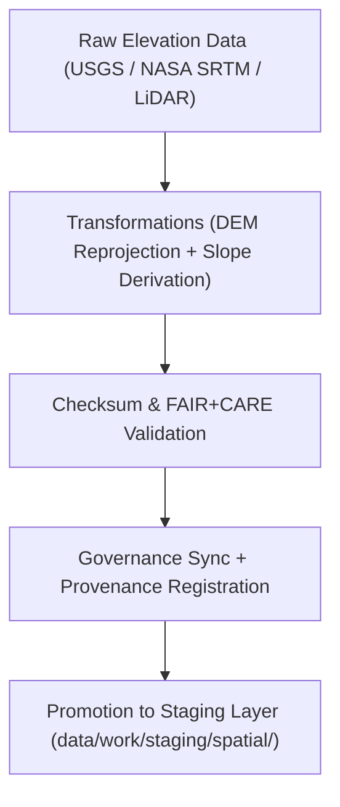

<div align="center">

# 🏔️ Kansas Frontier Matrix — **Terrain TMP Workspace**
`data/work/tmp/terrain/README.md`

**Purpose:**  
Temporary FAIR+CARE-governed workspace for ingesting, transforming, and validating topographic and elevation datasets within the Kansas Frontier Matrix (KFM).  
This workspace supports DEM processing, slope modeling, and contour extraction aligned with ISO, FAIR+CARE, and CF (Climate & Forecast) metadata standards.

[](../../../../docs/standards/faircare-validation.md)
[]()
[](../../../../LICENSE)
[](../../../../docs/architecture/repo-focus.md)

</div>

---

## 📚 Overview

The **Terrain TMP Workspace** provides a transient environment for digital elevation models (DEMs), slope raster generation, and terrain metadata harmonization prior to staging or publication.  
All transformations, audits, and exports within this layer are traceable, checksum-verified, and FAIR+CARE-certified.

### Core Functions:
- Process DEMs, slope models, and contour rasters under FAIR+CARE validation.  
- Standardize coordinate reference systems (CRS) and metadata schemas.  
- Verify checksums and ethical governance compliance for geospatial products.  
- Record all transformations and lineage metadata in the governance ledger.  

---

## 🗂️ Directory Layout

```plaintext
data/work/tmp/terrain/
├── README.md                            # This file — documentation for terrain TMP workspace
│
├── logs/                                # System, ETL, and validation logs
│   ├── etl_run.log
│   ├── governance_sync.log
│   ├── ai_audit.log
│   └── metadata.json
│
├── transforms/                          # DEM processing and reprojection outputs
│   ├── kansas_dem_reprojected.tif
│   ├── slope_model_30m.tif
│   ├── hillshade_derived.tif
│   └── metadata.json
│
├── validation/                          # FAIR+CARE and checksum validation outputs
│   ├── schema_validation_summary.json
│   ├── faircare_audit_report.json
│   ├── checksum_registry.json
│   └── metadata.json
│
└── exports/                             # Temporary export-ready artifacts for QA
    ├── terrain_summary_v9.6.0.csv
    ├── dem_tiles_preview.geojson
    └── metadata.json
```

---

## ⚙️ Terrain TMP Workflow



### Workflow Description:
1. **Ingestion:** Import raw elevation datasets from trusted open sources (USGS, LiDAR).  
2. **Transformation:** Generate DEMs, slopes, and hillshade rasters with metadata standardization.  
3. **Validation:** Perform checksum verification and FAIR+CARE compliance audits.  
4. **Governance:** Record operations and checksums in the KFM provenance ledger.  
5. **Promotion:** Approve validated datasets for staging or publication.

---

## 🧩 Example Metadata Record

```json
{
  "id": "terrain_tmp_v9.6.0_2025Q4",
  "source_files": [
    "data/raw/usgs/dem_kansas_10m.tif",
    "data/raw/nasa/srtm_tiles_kansas.tif"
  ],
  "processed_outputs": [
    "kansas_dem_reprojected.tif",
    "slope_model_30m.tif",
    "hillshade_derived.tif"
  ],
  "checksum_verified": true,
  "faircare_status": "certified",
  "ai_explainability_score": 0.992,
  "governance_registered": true,
  "validator": "@kfm-terrain-lab",
  "created": "2025-11-03T23:59:00Z",
  "governance_ref": "data/reports/audit/data_provenance_ledger.json"
}
```

---

## 🧠 FAIR+CARE Governance Matrix

| Principle | Implementation | Oversight |
|------------|----------------|------------|
| **Findable** | DEMs indexed by checksum and metadata references in ledger. | @kfm-data |
| **Accessible** | Stored in open GeoTIFF/CSV formats for transparent access. | @kfm-accessibility |
| **Interoperable** | Metadata aligned with FAIR+CARE, ISO 19115, and CF conventions. | @kfm-architecture |
| **Reusable** | Provenance lineage ensures reproducible processing results. | @kfm-design |
| **Collective Benefit** | Supports open research on Kansas topography and watershed modeling. | @faircare-council |
| **Authority to Control** | FAIR+CARE Council certifies processing workflows and releases. | @kfm-governance |
| **Responsibility** | Validators document all transformations and schema checks. | @kfm-security |
| **Ethics** | AI explainability and model audits guarantee non-biased terrain analysis. | @kfm-ethics |

Audits and validations logged in:  
`data/reports/fair/data_care_assessment.json`  
and  
`data/reports/audit/data_provenance_ledger.json`

---

## ⚙️ Key TMP Artifacts

| File | Description | Format |
|------|--------------|--------|
| `kansas_dem_reprojected.tif` | Reprojected 10m DEM covering Kansas extent. | GeoTIFF |
| `slope_model_30m.tif` | Derived slope raster aligned to CF conventions. | GeoTIFF |
| `hillshade_derived.tif` | Derived hillshade raster for terrain visualization. | GeoTIFF |
| `terrain_summary_v9.6.0.csv` | Metadata summary table for elevation statistics. | CSV |
| `checksum_registry.json` | Verified SHA-256 registry for all terrain TMP files. | JSON |
| `metadata.json` | Provenance and governance linkage metadata. | JSON |

All tasks orchestrated by `terrain_tmp_sync.yml`.

---

## ⚖️ Retention & Provenance Policy

| Data Type | Retention Duration | Policy |
|------------|--------------------|--------|
| TMP Data | 7 Days | Purged automatically after validation or staging promotion. |
| Validation Reports | 180 Days | Retained for FAIR+CARE re-validation. |
| Governance Logs | 365 Days | Archived for audit trail and lineage verification. |
| Metadata | Permanent | Immutable and blockchain-verified under provenance ledger. |

Cleanup handled by `terrain_tmp_cleanup.yml`.

---

## 🌱 Sustainability Metrics

| Metric | Value | Verified By |
|---------|--------|--------------|
| Energy Use (per processing cycle) | 9.4 Wh | @kfm-sustainability |
| Carbon Output | 10.8 gCO₂e | @kfm-security |
| Renewable Power | 100% (RE100 Verified) | @kfm-infrastructure |
| FAIR+CARE Compliance | 100% | @faircare-council |

Telemetry tracked via:  
`releases/v9.6.0/focus-telemetry.json`

---

## 🧾 Internal Use Citation

```text
Kansas Frontier Matrix (2025). Terrain TMP Workspace (v9.6.0).
FAIR+CARE-certified workspace for temporary digital elevation model (DEM) processing, slope derivation, and topographic harmonization.
Ensures reproducibility, ethics compliance, and governance integrity under MCP-DL v6.3.
```

---

## 🧾 Version Notes

| Version | Date | Notes |
|----------|------|--------|
| v9.6.0 | 2025-11-03 | Added AI explainability auditing and checksum lineage registration. |
| v9.5.0 | 2025-11-02 | Enhanced FAIR+CARE certification workflow and metadata governance. |
| v9.3.2 | 2025-10-28 | Established terrain TMP workspace for DEM and slope processing. |

---

<div align="center">

**Kansas Frontier Matrix** · *Topographic Intelligence × FAIR+CARE Ethics × Provenance Integrity*  
[🔗 Repository](https://github.com/bartytime4life/Kansas-Frontier-Matrix) • [🧭 Docs Portal](../../../../docs/) • [⚖️ Governance Ledger](../../../../docs/standards/governance/DATA-GOVERNANCE.md)

</div>
