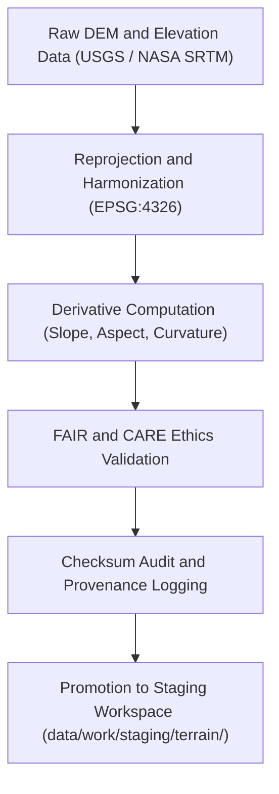

<div align="center">

# 🏔️ Kansas Frontier Matrix — **Terrain TMP Workspace**
`data/work/tmp/terrain/README.md`

**Purpose:**  
Governed FAIR+CARE-certified workspace for **terrain data processing, DEM normalization, slope derivation, and hydrological alignment** within the Kansas Frontier Matrix (KFM).  
This TMP layer serves as an ethical, reproducible sandbox for terrain ETL workflows prior to staging, ensuring full checksum validation and governance traceability.

[](../../../../docs/standards/faircare-validation.md)
[](../../../../LICENSE)
[](../../../../docs/architecture/repo-focus.md)

</div>

---

## 📚 Overview

The `data/work/tmp/terrain/` directory serves as the **temporary ETL and validation environment** for digital elevation models (DEMs), slope rasters, and terrain classification datasets.  
All transformations are FAIR+CARE-certified, checksum-tracked, and aligned with CF conventions for environmental interoperability.

### Core Responsibilities
- Reproject and harmonize terrain data to standard CRS (EPSG:4326).  
- Generate slope, aspect, and curvature derivatives from DEMs.  
- Validate geospatial integrity and FAIR+CARE ethics compliance.  
- Synchronize lineage, checksum, and governance logs with KFM’s ledger system.  

---

## 🗂️ Directory Layout

```plaintext
data/work/tmp/terrain/
├── README.md                              # This file — overview of Terrain TMP workspace
│
├── transforms/                            # DEM transformations, resampling, slope/aspect generation
│   ├── dem_normalized.tif
│   ├── slope_derivative.tif
│   ├── aspect_derivative.tif
│   └── metadata.json
│
├── validation/                            # Schema, checksum, and FAIR+CARE validation reports
│   ├── schema_validation_summary.json
│   ├── faircare_audit_report.json
│   ├── checksum_registry.json
│   └── metadata.json
│
├── logs/                                  # Execution traces and governance sync records
│   ├── etl_tmp_run.log
│   ├── governance_sync.log
│   └── metadata.json
│
└── metadata.json                          # TMP workspace metadata and governance linkage
```

---

## ⚙️ TMP Workflow



### Workflow Description
1. **Ingestion:** Load DEM and elevation tiles from raw repositories.  
2. **Transformation:** Reproject, mosaic, and harmonize spatial datasets.  
3. **Derivation:** Generate slope, aspect, and surface curvature products.  
4. **Validation:** Apply schema checks, FAIR+CARE audit, and checksum verification.  
5. **Governance:** Record provenance metadata into ledgers and telemetry records.  

---

## 🧩 Example TMP Metadata Record

```json
{
  "id": "terrain_tmp_v9.5.0_2025Q4",
  "datasets_processed": [
    "usgs_dem_kansas_10m.tif",
    "nasa_srtm_30m.tif"
  ],
  "records_transformed": 2143520,
  "derivatives_generated": ["slope", "aspect", "curvature"],
  "checksum_verified": true,
  "fairstatus": "certified",
  "governance_registered": true,
  "telemetry_ref": "releases/v9.5.0/focus-telemetry.json",
  "governance_ref": "reports/audit/ai_terrain_ledger.json",
  "created": "2025-11-02T23:45:00Z",
  "validator": "@kfm-terrain-etl"
}
```

---

## 🧠 FAIR+CARE Governance Matrix

| Principle | Implementation |
|------------|----------------|
| **Findable** | Datasets indexed by DEM identifier, checksum, and provenance record. |
| **Accessible** | Stored in open GeoTIFF and JSON formats for FAIR+CARE governance review. |
| **Interoperable** | Compliant with CF conventions, ISO 19115 lineage, and DCAT 3.0. |
| **Reusable** | Metadata includes checksum verification, schema alignment, and FAIR+CARE audit. |
| **Collective Benefit** | Promotes transparent use of geospatial terrain data for environmental research. |
| **Authority to Control** | FAIR+CARE Council validates transformation and derivative generation. |
| **Responsibility** | Validators record all transformations and FAIR+CARE reports. |
| **Ethics** | Ensures accuracy and ethical interpretation of geophysical terrain data. |

Governance records maintained in:  
`reports/audit/ai_terrain_ledger.json` • `reports/fair/terrain_tmp_summary.json`

---

## ⚙️ QA & Validation Artifacts

| File | Description | Format |
|------|--------------|--------|
| `dem_normalized.tif` | Harmonized DEM dataset reprojected to EPSG:4326. | GeoTIFF |
| `slope_derivative.tif` | Derived slope raster computed from DEM. | GeoTIFF |
| `aspect_derivative.tif` | Aspect direction layer derived from DEM gradients. | GeoTIFF |
| `schema_validation_summary.json` | Validation results for schema and metadata conformity. | JSON |
| `faircare_audit_report.json` | FAIR+CARE ethics and accessibility audit. | JSON |
| `checksum_registry.json` | Hash validation report for dataset reproducibility. | JSON |
| `metadata.json` | Provenance and governance metadata record. | JSON |

Automation managed via `terrain_tmp_sync.yml`.

---

## 🧾 Retention Policy

| File Type | Retention Duration | Policy |
|------------|--------------------|--------|
| TMP Data | 14 days | Deleted after successful staging promotion. |
| Logs | 30 days | Archived for audit and governance traceability. |
| Metadata | 365 days | Retained under provenance records. |
| FAIR+CARE Reports | Permanent | Stored under governance for ethics certification. |

Cleanup handled via `terrain_tmp_cleanup.yml`.

---

## 🧾 Internal Use Citation

```text
Kansas Frontier Matrix (2025). Terrain TMP Workspace (v9.5.0).
FAIR+CARE-certified environment for DEM normalization, slope derivation, and terrain validation workflows.
Ensures reproducibility, ethics, and open data governance under MCP-DL v6.3 compliance.
```

---

## 🧾 Version Notes

| Version | Date | Notes |
|----------|------|--------|
| v9.5.0 | 2025-11-02 | Added slope/aspect generation and checksum lineage tracking. |
| v9.3.2 | 2025-10-28 | Improved FAIR+CARE audit schema and validation registration. |
| v9.3.0 | 2025-10-26 | Established Terrain TMP workspace for DEM processing and validation. |

---

<div align="center">

**Kansas Frontier Matrix** · *Terrain Intelligence × FAIR+CARE Governance × Provenance Integrity*  
[🔗 Repository](https://github.com/bartytime4life/Kansas-Frontier-Matrix) • [🧭 Docs Portal](../../../../docs/) • [⚖️ Governance Ledger](../../../../docs/standards/governance/)

</div>