<div align="center">

# 🏔️ **Kansas Frontier Matrix — Terrain TMP Workspace**  
`data/work/tmp/terrain/README.md`

**Purpose:**  
FAIR+CARE-governed **temporary** workspace for **ingesting, transforming, validating, and governing** topographic datasets (DEMs, slopes, contours, hillshade) in the Kansas Frontier Matrix (KFM).  
Supports reproducible DEM processing, slope modeling, and contour extraction aligned to **ISO 19115**, **CF conventions**, and **MCP-DL v6.3** with immutable provenance.

[](../../../../docs/architecture/README.md)
[](../../../../LICENSE)
[](../../../../docs/standards/faircare-validation.md)
[]()

</div>

---

## 📘 Overview

The **Terrain TMP Workspace** is a short-lived, auditable layer where elevation products are prepared for staging.  
All actions—**schema validation, CRS normalization (EPSG:4326), checksum verification, ethics/XAI auditing, telemetry capture**, and **ledger registration**—are enforced prior to promotion.

### Core Responsibilities
- Process **USGS 3DEP/SRTM/LiDAR** DEMs; derive **slope/hillshade/contours** under FAIR+CARE.  
- Normalize CRS/metadata and enrich with **CF/ISO** attributes for interoperability.  
- Verify **SHA-256** integrity and register lineage to governance manifests.  
- Emit **energy/carbon telemetry** (ISO 50001/14064) and XAI metrics when models are used.

---

## 🗂️ Directory Layout

```plaintext
data/work/tmp/terrain/
├── README.md
│
├── logs/
│   ├── etl_run.log
│   ├── governance_sync.log
│   ├── ai_audit.log
│   └── metadata.json
│
├── transforms/
│   ├── kansas_dem_reprojected.tif
│   ├── slope_model_30m.tif
│   ├── hillshade_derived.tif
│   └── metadata.json
│
├── validation/
│   ├── schema_validation_summary.json
│   ├── faircare_audit_report.json
│   ├── checksum_registry.json
│   └── metadata.json
│
└── exports/
    ├── terrain_summary_v10.0.0.csv
    ├── dem_tiles_preview.geojson
    └── metadata.json
```

---

## ⚙️ Terrain TMP Workflow

```mermaid
flowchart TD
    A["Raw Elevation Data (USGS · NASA SRTM · LiDAR)"] --> B["Transformations (DEM Reprojection · Slope · Hillshade)"]
    B --> C["Checksum & FAIR·CARE Validation"]
    C --> D["Governance Sync · Provenance Registration"]
    D --> E["Promotion → Staging (data/work/staging/spatial/)"]
```



**Description**
1. **Ingestion:** Import authoritative elevation sources (USGS 3DEP, SRTM, LiDAR).  
2. **Transformation:** Reproject to **EPSG:4326**, derive slope/hillshade, harmonize CF/ISO metadata.  
3. **Validation:** Run schema checks, checksum verification, and FAIR+CARE ethics audit.  
4. **Governance:** Register operations, checksums, and sign-offs in the provenance ledger.  
5. **Promotion:** Approve validated outputs for staging/publication.

---

## 🧩 Example TMP Metadata Record

```json
{
  "id": "terrain_tmp_v10.0.0_2025Q4",
  "source_files": [
    "data/raw/usgs/dem_kansas_10m.tif",
    "data/raw/nasa/srtm_tiles_kansas.tif"
  ],
  "processed_outputs": [
    "kansas_dem_reprojected.tif",
    "slope_model_30m.tif",
    "hillshade_derived.tif"
  ],
  "checksum_verified": true,
  "faircare_status": "certified",
  "ai_explainability_score": 0.992,
  "telemetry": { "energy_wh": 9.1, "carbon_gco2e": 10.5 },
  "governance_registered": true,
  "validator": "@kfm-terrain-lab",
  "created": "2025-11-10T00:00:00Z",
  "governance_ref": "data/reports/audit/data_provenance_ledger.json"
}
```

---

## 🧠 FAIR+CARE Governance Matrix

| Principle | Implementation | Oversight |
|---|---|---|
| **Findable** | DEMs indexed by checksum & metadata references in ledger | @kfm-data |
| **Accessible** | Open GeoTIFF/CSV/GeoJSON with licensing & alt-text | @kfm-accessibility |
| **Interoperable** | CF/ISO 19115 metadata; EPSG:4326 normalization | @kfm-architecture |
| **Reusable** | Provenance lineage & manifest checksums for reproducibility | @kfm-design |
| **Collective Benefit** | Enables open research for topography & hydrology | @faircare-council |
| **Authority to Control** | Council certifies processing workflows & releases | @kfm-governance |
| **Responsibility** | Validators document transforms & schema/QA outcomes | @kfm-security |
| **Ethics** | XAI & ethics audits ensure non-biased terrain analytics | @kfm-ethics |

**Audit Records:**  
`data/reports/fair/data_care_assessment.json` · `data/reports/audit/data_provenance_ledger.json`

---

## ⚙️ Key TMP Artifacts

| File | Description | Format |
|---|---|---|
| `kansas_dem_reprojected.tif` | Reprojected DEM covering Kansas | GeoTIFF |
| `slope_model_30m.tif` | Derived slope raster (CF-aligned) | GeoTIFF |
| `hillshade_derived.tif` | Hillshade for visualization/QA | GeoTIFF |
| `terrain_summary_v10.0.0.csv` | Elevation statistics & metadata summary | CSV |
| `checksum_registry.json` | Verified SHA-256 registry for TMP files | JSON |
| `metadata.json` | Provenance & governance linkage metadata | JSON |

---

## ⚖️ Retention & Provenance Policy

| Data Type | Retention | Policy |
|---|---:|---|
| TMP Data | 7 Days | Purged after validation or staging promotion |
| Validation Reports | 180 Days | Retained for FAIR+CARE re-validation |
| Governance Logs | 365 Days | Archived for audit trail & lineage verification |
| Metadata | Permanent | Immutable and blockchain-verified in ledger |

---

## 🌱 Sustainability Metrics

| Metric | Value | Verified By |
|---|---:|---|
| Energy Use (per processing cycle) | 9.1 Wh | @kfm-sustainability |
| Carbon Output | 10.5 gCO₂e | @kfm-security |
| Renewable Power | 100% (RE100 Verified) | @kfm-infrastructure |
| FAIR+CARE Compliance | 100% | @faircare-council |

**Telemetry:** `../../../../releases/v10.0.0/focus-telemetry.json`

---

## 🧾 Citation

```text
Kansas Frontier Matrix (2025). Terrain TMP Workspace (v10.0.0).
FAIR+CARE-certified workspace for DEM processing, slope derivation, and topographic harmonization.
Ensures reproducibility, ethics compliance, and governance integrity under MCP-DL v6.3 and ISO 19115.
```

---

## 🕰️ Version History

| Version | Date | Notes |
|---|---|---|
| v10.0.0 | 2025-11-10 | Upgraded telemetry/paths to v10; added telemetry metrics; refined FAIR+CARE/CF alignment and governance sync. |
| v9.6.0 | 2025-11-03 | Added XAI auditing and checksum lineage registration. |
| v9.5.0 | 2025-11-02 | Enhanced FAIR+CARE certification workflow and metadata governance. |
| v9.3.2 | 2025-10-28 | Established terrain TMP workspace for DEM and slope processing. |

---

<div align="center">

**Kansas Frontier Matrix** · *Topographic Intelligence × FAIR+CARE Ethics × Provenance Integrity*  
© 2025 Kansas Frontier Matrix — CC-BY 4.0 · **Diamond⁹ Ω / Crown∞Ω** Ultimate Certified

[Back to Work TMP](../README.md) · [Docs Portal](../../../../docs/) · [Governance Charter](../../../../docs/standards/governance/DATA-GOVERNANCE.md)

</div>
