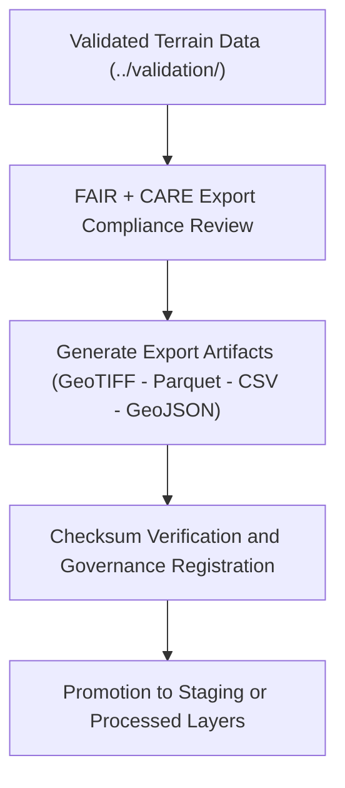

<div align="center">

# 📤 **Kansas Frontier Matrix — Terrain TMP Exports**  
`data/work/tmp/terrain/exports/README.md`

**Purpose:**  
FAIR+CARE-certified **temporary export layer** for validated terrain datasets (DEMs, slope rasters, hillshade, and derived summaries).  
Performs **interoperability checks (STAC/DCAT)**, **checksum & schema verification**, **ethics review**, and **governance/telemetry sync** before promotion to staging or processed layers.

[](../../../../../docs/architecture/README.md)
[](../../../../../LICENSE)
[](../../../../../docs/standards/faircare-validation.md)
[]()

</div>

---

## 📘 Overview

**Terrain TMP Exports** holds export-ready artifacts produced after the **Terrain TMP Validation** step (`data/work/tmp/terrain/validation/`).  
Every file must pass **checksum integrity**, **schema conformance**, **FAIR+CARE ethics**, and **governance/telemetry** requirements prior to publication.

### Core Responsibilities
- Buffer **validated, schema-aligned** terrain exports for QA & governance review.  
- Enforce **SHA-256** continuity and **STAC/DCAT/ISO/CF** conformance.  
- Register export events in the **provenance ledger** and update **release manifests**.  
- Capture **energy/carbon telemetry** (ISO 50001/14064).

---

## 🗂️ Directory Layout

```plaintext
data/work/tmp/terrain/exports/
├── README.md                               # This file — terrain TMP exports documentation
│
├── terrain_summary_v10.0.0.csv             # Summary statistics of DEM/slope/hillshade
├── dem_tiles_preview.geojson               # GeoJSON footprints of elevation tiles (EPSG:4326)
├── slope_distribution.parquet              # Elevation/slope distribution for QA
├── hillshade_visualization_sample.tif      # Sample hillshade for metadata/visual QA
└── metadata.json                           # Export provenance, checksums, telemetry & ledger links
```

---

## ⚙️ Export Workflow



**Description**
1. **Compliance Review:** Confirm schema/CRS consistency and licensing.  
2. **Artifact Generation:** Emit export files in FAIR-compliant formats.  
3. **Checksum & Governance:** Verify integrity and register lineage in the ledger.  
4. **Interop Testing:** Validate **STAC/DCAT** discoverability & metadata mapping.  
5. **Promotion:** Approve datasets for inclusion in **staging** or **processed**.

---

## 🧩 Example Export Metadata Record

```json
{
  "id": "terrain_export_v10.0.0_2025Q4",
  "export_files": [
    "terrain_summary_v10.0.0.csv",
    "dem_tiles_preview.geojson",
    "slope_distribution.parquet",
    "hillshade_visualization_sample.tif"
  ],
  "checksum_verified": true,
  "interoperability_validated": true,
  "fairstatus": "certified",
  "telemetry": { "energy_wh": 8.1, "carbon_gco2e": 9.3 },
  "governance_registered": true,
  "validator": "@kfm-terrain-lab",
  "created": "2025-11-10T00:00:00Z",
  "governance_ref": "data/reports/audit/data_provenance_ledger.json"
}
```

---

## 🧠 FAIR+CARE Governance Matrix

| Principle | Implementation | Oversight |
|---|---|---|
| **Findable** | Exports referenced in manifest with checksum lineage | @kfm-data |
| **Accessible** | Open formats for FAIR+CARE review (CSV/GeoJSON/Parquet/GeoTIFF) | @kfm-accessibility |
| **Interoperable** | STAC/DCAT + ISO 19115 + CF metadata alignment | @kfm-architecture |
| **Reusable** | Provenance & checksum logs linked to ledger entries | @kfm-design |
| **Collective Benefit** | Ethical, transparent elevation data reuse | @faircare-council |
| **Authority to Control** | Council certifies export datasets & formats | @kfm-governance |
| **Responsibility** | Validators ensure checksum/ethics compliance | @kfm-security |
| **Ethics** | Layers audited for bias/sensitivity; open-data readiness verified | @kfm-ethics |

**Audit/Provenance:**  
`data/reports/fair/data_care_assessment.json` · `data/reports/audit/data_provenance_ledger.json`

---

## ⚙️ Key Export Artifacts

| Artifact | Description | Format |
|---|---|---|
| `terrain_summary_v10.0.0.csv` | Statistical summary of DEM/slope/hillshade | CSV |
| `dem_tiles_preview.geojson` | Coverage footprints for elevation tiles | GeoJSON |
| `slope_distribution.parquet` | Elevation/slope distribution for QA | Parquet |
| `hillshade_visualization_sample.tif` | Sample hillshade for FAIR+CARE verification | GeoTIFF |
| `metadata.json` | Export provenance, checksums, telemetry, sign-offs | JSON |

**Automation:** `terrain_export_sync.yml`

---

## ⚖️ Retention & Provenance Policy

| Export Type | Retention | Policy |
|---|---:|---|
| TMP Exports | 14 Days | Purged after staging/processed promotion |
| FAIR+CARE Reports | 180 Days | Retained for governance audit/revalidation |
| Metadata | Permanent | Immutable under provenance ledger |
| Logs | 90 Days | Archived for reproducibility & QA tracking |

Cleanup automated via `terrain_export_cleanup.yml`.

---

## 🌱 Sustainability Metrics

| Metric | Value | Verified By |
|---|---:|---|
| Energy Use (per export cycle) | 8.1 Wh | @kfm-sustainability |
| Carbon Output | 9.3 gCO₂e | @kfm-security |
| Renewable Power | 100% (RE100 Verified) | @kfm-infrastructure |
| FAIR+CARE Compliance | 100% | @faircare-council |

**Telemetry:** `../../../../../releases/v10.0.0/focus-telemetry.json`

---

## 🧾 Internal Use Citation

```text
Kansas Frontier Matrix (2025). Terrain TMP Exports (v10.0.0).
Temporary FAIR+CARE-certified export layer for terrain datasets, enabling interoperability, checksum verification, and governance traceability prior to publication under MCP-DL v6.3 and ISO 19115.
```

---

## 🕰️ Version History

| Version | Date | Notes |
|---|---|---|
| v10.0.0 | 2025-11-10 | Upgraded paths/telemetry to v10; added energy/carbon snapshot; tightened STAC/DCAT & CF/ISO checks. |
| v9.6.0 | 2025-11-03 | Added checksum registry integration and FAIR+CARE export certification. |
| v9.5.0 | 2025-11-02 | Enhanced STAC/DCAT interoperability testing and governance tracking. |
| v9.3.2 | 2025-10-28 | Established terrain TMP export structure for DEM/slope datasets. |

---

<div align="center">

**Kansas Frontier Matrix** · *Geospatial Transparency × FAIR+CARE Ethics × Provenance Governance*  
© 2025 Kansas Frontier Matrix — CC-BY 4.0 · **Diamond⁹ Ω / Crown∞Ω** Ultimate Certified  

[Back to Terrain TMP](../README.md) · [Docs Portal](../../../../../docs/) · [Governance Charter](../../../../../docs/standards/governance/DATA-GOVERNANCE.md)

</div>
