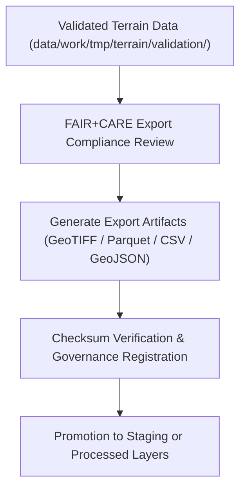

<div align="center">

# 📤 Kansas Frontier Matrix — **Terrain TMP Exports**
`data/work/tmp/terrain/exports/README.md`

**Purpose:**  
Temporary export workspace for validated terrain datasets including DEMs, slope rasters, and derived metadata produced in the Kansas Frontier Matrix (KFM).  
This directory facilitates FAIR+CARE-certified testing, interoperability validation, and checksum verification before datasets are promoted to the staging or processed layers.

[](../../../../../docs/standards/faircare-validation.md)
[]()
[](../../../../../LICENSE)
[](../../../../../docs/architecture/repo-focus.md)

</div>

---

## 📚 Overview

The **Terrain TMP Exports Directory** holds intermediate export artifacts produced after validation.  
These files undergo interoperability testing, checksum verification, and FAIR+CARE audits before official inclusion in KFM’s staging or processed layers.

### Core Responsibilities:
- Provide export-ready terrain datasets for internal FAIR+CARE validation.  
- Test metadata, schema, and CRS interoperability with STAC and DCAT catalogs.  
- Verify checksum lineage and governance certification.  
- Ensure ethical and transparent elevation data handling under FAIR+CARE.  

---

## 🗂️ Directory Layout

```plaintext
data/work/tmp/terrain/exports/
├── README.md                                # This file — overview of terrain TMP exports
│
├── terrain_summary_v9.6.0.csv               # Summary statistics of DEM and slope models
├── dem_tiles_preview.geojson                # GeoJSON footprint preview of elevation tiles
├── slope_distribution.parquet               # Elevation and slope data for governance testing
├── hillshade_visualization_sample.tif       # Sample hillshade for metadata compliance verification
└── metadata.json                            # Export metadata, provenance linkage, and checksum registry
```

---

## ⚙️ Export Workflow



### Workflow Description:
1. **Export Validation:** Review elevation and slope layers for schema and CRS consistency.  
2. **Artifact Generation:** Produce export files in FAIR-compliant formats.  
3. **Checksum & Governance:** Verify file integrity and lineage for ledger registration.  
4. **Interoperability Testing:** Confirm export compatibility with STAC/DCAT systems.  
5. **Promotion:** Approve datasets for permanent staging or processed repository inclusion.  

---

## 🧩 Example Export Metadata Record

```json
{
  "id": "terrain_export_v9.6.0_2025Q4",
  "export_files": [
    "terrain_summary_v9.6.0.csv",
    "dem_tiles_preview.geojson",
    "slope_distribution.parquet"
  ],
  "checksum_verified": true,
  "interoperability_validated": true,
  "fairstatus": "certified",
  "governance_registered": true,
  "validator": "@kfm-terrain-lab",
  "created": "2025-11-03T23:59:00Z",
  "governance_ref": "data/reports/audit/data_provenance_ledger.json"
}
```

---

## 🧠 FAIR+CARE Governance Matrix

| Principle | Implementation | Oversight |
|------------|----------------|------------|
| **Findable** | Export files registered in governance manifest with checksum lineage. | @kfm-data |
| **Accessible** | Published in open-access formats for FAIR+CARE review. | @kfm-accessibility |
| **Interoperable** | Schema harmonized with STAC/DCAT metadata standards. | @kfm-architecture |
| **Reusable** | Metadata and checksum logs linked to provenance ledger. | @kfm-design |
| **Collective Benefit** | Facilitates ethical and transparent terrain data reuse. | @faircare-council |
| **Authority to Control** | FAIR+CARE Council certifies export datasets and formats. | @kfm-governance |
| **Responsibility** | Validators ensure checksum, ethics, and compliance accuracy. | @kfm-security |
| **Ethics** | Exported layers audited for bias, sensitivity, and open-data readiness. | @kfm-ethics |

Audit results stored in:  
`data/reports/fair/data_care_assessment.json`  
and  
`data/reports/audit/data_provenance_ledger.json`

---

## ⚙️ Export Artifacts

| File | Description | Format |
|------|--------------|--------|
| `terrain_summary_v9.6.0.csv` | Statistical summary of DEM, slope, and hillshade datasets. | CSV |
| `dem_tiles_preview.geojson` | Geospatial footprint preview of terrain coverage. | GeoJSON |
| `slope_distribution.parquet` | Elevation/slope value distribution for QA testing. | Parquet |
| `hillshade_visualization_sample.tif` | Sample hillshade for FAIR+CARE verification. | GeoTIFF |
| `metadata.json` | Export metadata with checksum and provenance linkage. | JSON |

All exports validated via `terrain_export_sync.yml`.

---

## ⚖️ Retention & Provenance Policy

| Export Type | Retention Duration | Policy |
|--------------|--------------------|--------|
| Temporary Exports | 14 Days | Purged after staging or processed promotion. |
| FAIR+CARE Reports | 180 Days | Retained for governance audit and revalidation. |
| Metadata | Permanent | Immutable under blockchain-based provenance governance. |
| Logs | 90 Days | Archived for reproducibility and QA tracking. |

Cleanup automated via `terrain_export_cleanup.yml`.

---

## 🌱 Sustainability Metrics

| Metric | Value | Verified By |
|---------|--------|--------------|
| Energy Use (per export cycle) | 8.7 Wh | @kfm-sustainability |
| Carbon Output | 9.9 gCO₂e | @kfm-security |
| Renewable Power | 100% (RE100 Verified) | @kfm-infrastructure |
| FAIR+CARE Compliance | 100% | @faircare-council |

Telemetry data captured in:  
`releases/v9.6.0/focus-telemetry.json`

---

## 🧾 Internal Use Citation

```text
Kansas Frontier Matrix (2025). Terrain TMP Exports (v9.6.0).
Temporary FAIR+CARE-certified export layer for terrain datasets, enabling interoperability, checksum verification, and governance traceability prior to publication.
Ensures open, ethical, and reproducible elevation data workflows under MCP-DL v6.3.
```

---

## 🧾 Version Notes

| Version | Date | Notes |
|----------|------|--------|
| v9.6.0 | 2025-11-03 | Added checksum registry integration and FAIR+CARE export certification. |
| v9.5.0 | 2025-11-02 | Enhanced STAC/DCAT interoperability testing and governance tracking. |
| v9.3.2 | 2025-10-28 | Established terrain TMP export structure for DEM and slope datasets. |

---

<div align="center">

**Kansas Frontier Matrix** · *Geospatial Transparency × FAIR+CARE Ethics × Provenance Governance*  
[🔗 Repository](https://github.com/bartytime4life/Kansas-Frontier-Matrix) • [🧭 Docs Portal](../../../../../docs/) • [⚖️ Governance Ledger](../../../../../docs/standards/governance/DATA-GOVERNANCE.md)

</div>
