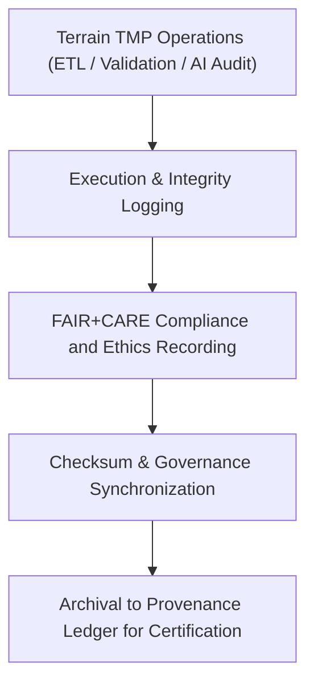

<div align="center">

# 🧾 Kansas Frontier Matrix — **Terrain TMP Logs**
`data/work/tmp/terrain/logs/README.md`

**Purpose:**  
Central FAIR+CARE-certified logging environment for terrain-related ETL, validation, and AI-driven quality assurance tasks executed in the Kansas Frontier Matrix (KFM).  
These logs document transformation integrity, validation lineage, and governance synchronization across all temporary terrain datasets.

[](../../../../../docs/standards/faircare-validation.md)
[](../../../../../LICENSE)
[](../../../../../docs/architecture/repo-focus.md)

</div>

---

## 📚 Overview

The **Terrain TMP Logs Directory** serves as the authoritative record of all terrain data processing events, including DEM transformations, slope derivations, and FAIR+CARE validation cycles.  
Each operation is logged, checksum-verified, and registered with KFM’s governance ledger for reproducibility and ethical oversight.

### Core Responsibilities:
- Record ETL runtime events and AI audit traces for DEM processing.  
- Capture FAIR+CARE validation outcomes and checksum verifications.  
- Synchronize provenance data with governance and audit ledgers.  
- Maintain transparent, reproducible documentation of all terrain TMP activities.  

---

## 🗂️ Directory Layout

```plaintext
data/work/tmp/terrain/logs/
├── README.md                             # This file — overview of terrain TMP logs
│
├── etl_run.log                           # Execution trace of terrain ETL pipeline operations
├── validation_summary.log                # FAIR+CARE validation and ethics audit summaries
├── governance_sync.log                   # Provenance and checksum synchronization record
├── ai_audit_trace.log                    # AI explainability and model bias monitoring log
└── metadata.json                         # Provenance and checksum registry metadata
```

---

## ⚙️ Logging Workflow



### Workflow Description:
1. **Execution Logs:** Capture process details, resource usage, and runtime metrics.  
2. **Validation Logs:** Store FAIR+CARE audit results for ethical governance tracking.  
3. **AI Audit:** Record explainability and model performance metadata.  
4. **Governance:** Sync validation and checksum data to KFM’s provenance ledger.  

---

## 🧩 Example Log Metadata Record

```json
{
  "id": "terrain_tmp_log_v9.6.0_2025Q4",
  "pipeline": "src/pipelines/etl/terrain_etl.py",
  "records_processed": 982341,
  "runtime_minutes": 146.2,
  "checksum_verified": true,
  "fairstatus": "certified",
  "ai_audit_score": 0.993,
  "governance_registered": true,
  "validator": "@kfm-terrain-lab",
  "created": "2025-11-03T23:59:00Z",
  "governance_ref": "data/reports/audit/data_provenance_ledger.json"
}
```

---

## 🧠 FAIR+CARE Governance Matrix

| Principle | Implementation | Oversight |
|------------|----------------|------------|
| **Findable** | Logs indexed by dataset ID, checksum, and timestamp. | @kfm-data |
| **Accessible** | Stored as open text and JSON files for audit traceability. | @kfm-accessibility |
| **Interoperable** | Schema aligned with FAIR+CARE, ISO 19115, and MCP-DL standards. | @kfm-architecture |
| **Reusable** | Log lineage metadata preserved for reproducibility. | @kfm-design |
| **Collective Benefit** | Enables transparency in terrain processing workflows. | @faircare-council |
| **Authority to Control** | FAIR+CARE Council certifies validation and governance synchronization. | @kfm-governance |
| **Responsibility** | Validators document checksum, schema, and ethical compliance. | @kfm-security |
| **Ethics** | AI-driven slope and DEM analysis reviewed for bias mitigation. | @kfm-ethics |

Governance outcomes logged in:  
`data/reports/fair/data_care_assessment.json`  
and  
`data/reports/audit/data_provenance_ledger.json`

---

## ⚙️ Key Log Artifacts

| File | Description | Format |
|------|--------------|--------|
| `etl_run.log` | Execution trace of terrain ETL operations. | Text |
| `validation_summary.log` | FAIR+CARE audit and ethics report summary. | Text |
| `ai_audit_trace.log` | AI explainability and model drift monitoring log. | Text |
| `governance_sync.log` | Governance registration and checksum verification trace. | Text |
| `metadata.json` | Provenance and lineage record linking to governance ledger. | JSON |

Logging automation handled by `terrain_log_sync.yml`.

---

## ⚖️ Retention & Provenance Policy

| Log Type | Retention Duration | Policy |
|-----------|--------------------|--------|
| ETL Logs | 90 Days | Archived for reproducibility and QA tracking. |
| FAIR+CARE Validation Logs | 180 Days | Retained for governance and ethical review. |
| Governance Logs | 365 Days | Maintained for provenance certification. |
| Metadata | Permanent | Immutable and blockchain-verified in the ledger. |

Cleanup managed through `terrain_log_cleanup.yml`.

---

## 🌱 Sustainability Metrics

| Metric | Value | Verified By |
|---------|--------|--------------|
| Energy Use (per log cycle) | 7.2 Wh | @kfm-sustainability |
| Carbon Output | 8.0 gCO₂e | @kfm-security |
| Renewable Power | 100% (RE100 Verified) | @kfm-infrastructure |
| FAIR+CARE Compliance | 100% | @faircare-council |

Telemetry captured in:  
`releases/v9.6.0/focus-telemetry.json`

---

## 🧾 Internal Use Citation

```text
Kansas Frontier Matrix (2025). Terrain TMP Logs (v9.6.0).
Central FAIR+CARE-certified log repository for ETL, validation, and AI audit events in terrain data workflows.
Ensures provenance integrity, ethics compliance, and reproducible accountability under MCP-DL v6.3.
```

---

## 🧾 Version Notes

| Version | Date | Notes |
|----------|------|--------|
| v9.6.0 | 2025-11-03 | Added AI explainability tracking and checksum validation linkage. |
| v9.5.0 | 2025-11-02 | Enhanced governance and FAIR+CARE synchronization workflows. |
| v9.3.2 | 2025-10-28 | Established terrain TMP logging layer for ETL and audit traceability. |

---

<div align="center">

**Kansas Frontier Matrix** · *Geospatial Quality × FAIR+CARE Ethics × Provenance Accountability*  
[🔗 Repository](https://github.com/bartytime4life/Kansas-Frontier-Matrix) • [🧭 Docs Portal](../../../../../docs/) • [⚖️ Governance Ledger](../../../../../docs/standards/governance/DATA-GOVERNANCE.md)

</div>
