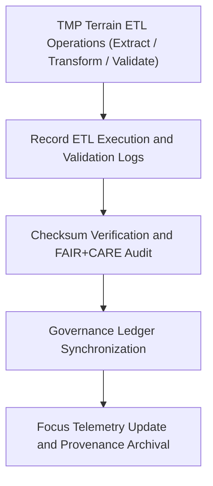

<div align="center">

# 🧾 Kansas Frontier Matrix — **Terrain TMP Logs**
`data/work/tmp/terrain/logs/README.md`

**Purpose:**  
Central FAIR+CARE-governed log workspace for **ETL, validation, and governance processes** in the Terrain TMP layer of the Kansas Frontier Matrix (KFM).  
Provides complete lineage, audit, and checksum verification for terrain data operations under MCP-DL v6.3 and FAIR+CARE ethics compliance.

[](../../../../../docs/standards/faircare-validation.md)
[](../../../../../LICENSE)
[](../../../../../docs/architecture/repo-focus.md)

</div>

---

## 📚 Overview

The `data/work/tmp/terrain/logs/` directory stores all **activity, validation, and governance synchronization logs** generated during terrain TMP ETL workflows.  
It provides a verifiable, reproducible audit trail ensuring that terrain datasets undergo transparent, ethical, and compliant processing.

### Core Responsibilities
- Log ETL (Extract, Transform, Load) execution events and system diagnostics.  
- Track FAIR+CARE validation and checksum verification operations.  
- Register audit-ready metadata for governance and provenance.  
- Provide Focus Telemetry integration for continuous monitoring.  

---

## 🗂️ Directory Layout

```plaintext
data/work/tmp/terrain/logs/
├── README.md                              # This file — documentation for Terrain TMP Logs
│
├── etl_tmp_run.log                        # Primary ETL runtime execution trace
├── governance_sync.log                    # FAIR+CARE governance and provenance registration record
├── validation_audit.log                   # Schema and checksum validation trace
├── performance_metrics.json               # Terrain ETL runtime metrics and QA performance data
└── metadata.json                          # Provenance and checksum linkage metadata
```

---

## ⚙️ Logging Workflow



### Workflow Description
1. **ETL Logging:** Record all processing events from ingestion through transformation.  
2. **Checksum Verification:** Confirm integrity of each TMP file and derivative output.  
3. **FAIR+CARE Validation:** Apply ethical review and accessibility verification.  
4. **Governance Sync:** Register logs into provenance ledger and manifest records.  
5. **Telemetry Integration:** Push metrics to Focus Mode dashboards for monitoring.  

---

## 🧩 Example Log Metadata Record

```json
{
  "id": "terrain_tmp_logs_v9.5.0_2025Q4",
  "log_categories": ["etl", "validation", "governance"],
  "entries_recorded": 9423,
  "checksum_verified": true,
  "governance_synced": true,
  "fairstatus": "compliant",
  "telemetry_ref": "releases/v9.5.0/focus-telemetry.json",
  "governance_ref": "reports/audit/ai_terrain_ledger.json",
  "created": "2025-11-02T23:59:00Z",
  "validator": "@kfm-terrain-etl"
}
```

---

## 🧠 FAIR+CARE Governance Matrix

| Principle | Implementation |
|------------|----------------|
| **Findable** | Logs indexed by ETL stage, timestamp, and checksum ID. |
| **Accessible** | Open, human-readable and machine-parseable log formats. |
| **Interoperable** | Metadata aligned with ISO 19115 lineage and DCAT 3.0 governance schemas. |
| **Reusable** | Provenance and checksum tracking ensure reproducibility. |
| **Collective Benefit** | Fosters transparency in terrain data ETL and governance systems. |
| **Authority to Control** | FAIR+CARE Council reviews ETL governance synchronization. |
| **Responsibility** | Validators ensure comprehensive checksum and ethics traceability. |
| **Ethics** | Logs reviewed for compliance with open data and ethical terrain analysis standards. |

Audit outputs stored in:  
`reports/audit/ai_terrain_ledger.json` • `reports/fair/terrain_logs_summary.json`

---

## ⚙️ QA & Validation Artifacts

| File | Description | Format |
|------|--------------|--------|
| `etl_tmp_run.log` | Primary log recording ETL and validation events. | Text |
| `governance_sync.log` | Records provenance and ledger synchronization events. | Text |
| `validation_audit.log` | Schema and checksum validation record. | Text |
| `performance_metrics.json` | Records ETL runtime statistics and resource performance metrics. | JSON |
| `metadata.json` | Captures checksum validation and provenance linkage. | JSON |

All logging tasks managed by `terrain_logs_sync.yml`.

---

## 🧾 Retention Policy

| File Type | Retention Duration | Policy |
|------------|--------------------|--------|
| ETL and Validation Logs | 90 days | Archived after staging promotion. |
| Governance Logs | Permanent | Stored in provenance registry. |
| Performance Metrics | 180 days | Maintained for audit and optimization reviews. |
| Metadata | Permanent | Retained under FAIR+CARE lineage certification. |

Cleanup automated via `terrain_logs_cleanup.yml`.

---

## 🧾 Internal Use Citation

```text
Kansas Frontier Matrix (2025). Terrain TMP Logs (v9.5.0).
FAIR+CARE-certified logging environment documenting ETL, validation, and governance synchronization for terrain datasets.
Supports ethics, transparency, and provenance assurance under MCP-DL v6.3 governance framework.
```

---

## 🧾 Version Notes

| Version | Date | Notes |
|----------|------|--------|
| v9.5.0 | 2025-11-02 | Added telemetry linkage and checksum registry automation for terrain ETL logging. |
| v9.3.2 | 2025-10-28 | Expanded FAIR+CARE audit coverage and governance synchronization. |
| v9.3.0 | 2025-10-26 | Established Terrain TMP Logs workspace for reproducible ETL workflows. |

---

<div align="center">

**Kansas Frontier Matrix** · *Data Traceability × FAIR+CARE Ethics × Provenance Integrity*  
[🔗 Repository](https://github.com/bartytime4life/Kansas-Frontier-Matrix) • [🧭 Docs Portal](../../../../../docs/) • [⚖️ Governance Ledger](../../../../../docs/standards/governance/)

</div>