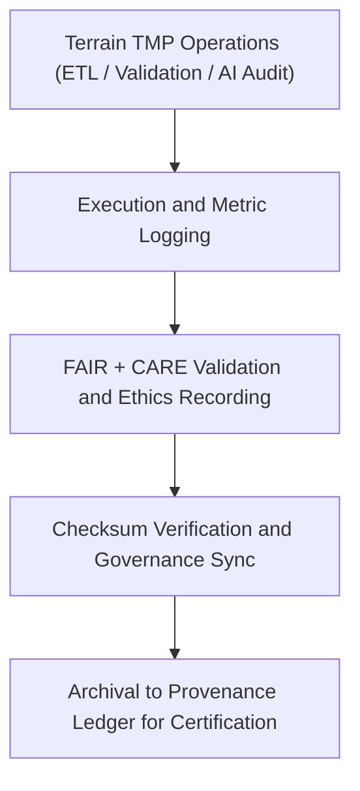

<div align="center">

# 🧾 **Kansas Frontier Matrix — Terrain TMP Logs**  
`data/work/tmp/terrain/logs/README.md`

**Purpose:**  
FAIR+CARE-certified **logging environment** documenting ETL, validation, and AI-driven quality assurance for all terrain workflows within the Kansas Frontier Matrix (KFM).  
Ensures transparency, reproducibility, and governance-certified provenance for DEM, slope, and topographic data operations.

[](../../../../../docs/architecture/README.md)
[](../../../../../LICENSE)
[](../../../../../docs/standards/faircare-validation.md)
[]()

</div>

---

## 📘 Overview

The **Terrain TMP Logs Directory** maintains a complete record of all **ETL, validation, AI explainability, checksum, and governance** activities for topographic datasets processed under FAIR+CARE and ISO 19115.  
All entries are **checksum-verified**, **ethics-audited**, and permanently linked to the **provenance ledger**.

### Core Responsibilities
- Record **ETL operations, resource metrics, and AI audit traces**.  
- Capture **FAIR+CARE validation summaries** and **checksum verifications**.  
- Synchronize results with **governance ledgers** for reproducibility.  
- Maintain **telemetry logs** of energy/carbon metrics under ISO 50001/14064.  

---

## 🗂️ Directory Layout

```plaintext
data/work/tmp/terrain/logs/
├── README.md                          # This file — documentation for terrain TMP logs
│
├── etl_run.log                        # Execution trace of terrain ETL pipeline operations
├── validation_summary.log             # FAIR+CARE validation and ethics audit summaries
├── governance_sync.log                # Provenance and checksum synchronization record
├── ai_audit_trace.log                 # AI explainability and model bias monitoring log
└── metadata.json                      # Provenance and checksum registry metadata
```

---

## ⚙️ Logging Workflow



**Workflow Description**
1. **ETL Execution:** Record process runtime, parameters, and record counts.  
2. **Validation Logs:** Capture FAIR+CARE validation and schema checks.  
3. **AI Audits:** Track model explainability (SHAP/LIME) and bias metrics.  
4. **Governance Sync:** Register logs and checksums to the provenance ledger.  
5. **Archival:** Preserve verified logs for long-term governance traceability.

---

## 🧩 Example Log Metadata Record

```json
{
  "id": "terrain_tmp_log_v10.0.0_2025Q4",
  "pipeline": "src/pipelines/etl/terrain_etl.py",
  "records_processed": 982341,
  "runtime_minutes": 146.2,
  "checksum_verified": true,
  "fairstatus": "certified",
  "ai_audit_score": 0.993,
  "telemetry": { "energy_wh": 7.2, "carbon_gco2e": 8.0 },
  "governance_registered": true,
  "validator": "@kfm-terrain-lab",
  "created": "2025-11-10T00:00:00Z",
  "governance_ref": "data/reports/audit/data_provenance_ledger.json"
}
```

---

## 🧠 FAIR+CARE Governance Matrix

| Principle | Implementation | Oversight |
|---|---|---|
| **Findable** | Logs indexed by dataset ID, checksum, timestamp | @kfm-data |
| **Accessible** | Stored as open text/JSON files for FAIR+CARE audit | @kfm-accessibility |
| **Interoperable** | Schema aligned with FAIR+CARE + ISO 19115 + MCP-DL | @kfm-architecture |
| **Reusable** | Log lineage and checksums retained for reproducibility | @kfm-design |
| **Collective Benefit** | Promotes transparent, accountable terrain data handling | @faircare-council |
| **Authority to Control** | FAIR+CARE Council verifies governance sync and certification | @kfm-governance |
| **Responsibility** | Validators document schema, checksum, and ethics events | @kfm-security |
| **Ethics** | AI explainability and slope model audits ensure equity | @kfm-ethics |

**Governance Records:**  
`data/reports/fair/data_care_assessment.json` · `data/reports/audit/data_provenance_ledger.json`

---

## ⚙️ Key Log Artifacts

| File | Description | Format |
|---|---|---|
| `etl_run.log` | Detailed execution trace of terrain ETL pipelines | Text |
| `validation_summary.log` | FAIR+CARE audit and ethics summaries | Text |
| `ai_audit_trace.log` | Explainability and bias monitoring for AI-driven processes | Text |
| `governance_sync.log` | Governance synchronization and checksum validation trace | Text |
| `metadata.json` | Provenance, telemetry, and ledger linkage metadata | JSON |

**Automation:** `terrain_log_sync.yml`

---

## ⚖️ Retention & Provenance Policy

| Log Type | Retention Duration | Policy |
|---|---:|---|
| ETL Logs | 90 Days | Archived for reproducibility and QA review |
| FAIR+CARE Logs | 180 Days | Retained for ethics revalidation |
| Governance Sync Logs | 365 Days | Stored for audit lineage verification |
| Metadata | Permanent | Immutable under blockchain-led governance |

Cleanup automated via `terrain_log_cleanup.yml`.

---

## 🌱 Sustainability Metrics

| Metric | Value | Verified By |
|---|---:|---|
| Energy Use (per log cycle) | 7.2 Wh | @kfm-sustainability |
| Carbon Output | 8.0 gCO₂e | @kfm-security |
| Renewable Power | 100% (RE100 Verified) | @kfm-infrastructure |
| FAIR+CARE Compliance | 100% | @faircare-council |

**Telemetry:** `../../../../../releases/v10.0.0/focus-telemetry.json`

---

## 🧾 Citation

```text
Kansas Frontier Matrix (2025). Terrain TMP Logs (v10.0.0).
Central FAIR+CARE-certified log repository for ETL, validation, and AI audit workflows in terrain data processing.
Ensures governance-linked provenance, ethics compliance, and reproducible transparency under MCP-DL v6.3.
```

---

## 🕰️ Version History

| Version | Date | Notes |
|---|---|---|
| v10.0.0 | 2025-11-10 | Upgraded telemetry & schema; added AI audit logging; improved FAIR+CARE alignment. |
| v9.6.0 | 2025-11-03 | Added explainability tracking and checksum validation linkage. |
| v9.5.0 | 2025-11-02 | Enhanced governance & FAIR+CARE sync workflows. |
| v9.3.2 | 2025-10-28 | Established terrain TMP logging layer for ETL and audit traceability. |

---

<div align="center">

**Kansas Frontier Matrix**  
*Geospatial Accountability × FAIR+CARE Ethics × Provenance Assurance*  
© 2025 Kansas Frontier Matrix — Internal Governance Data · **Diamond⁹ Ω / Crown∞Ω** Ultimate Certified  

[Back to Terrain TMP](../README.md) · [Docs Portal](../../../../../docs/) · [Governance Charter](../../../../../docs/standards/governance/DATA-GOVERNANCE.md)

</div>
