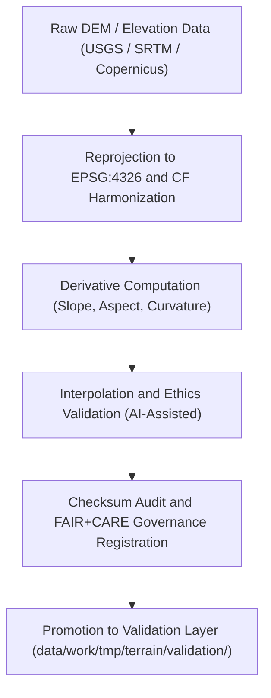

<div align="center">

# 🔄 Kansas Frontier Matrix — **Terrain TMP Transforms**
`data/work/tmp/terrain/transforms/README.md`

**Purpose:**  
FAIR+CARE-certified workspace for **terrain data harmonization, reprojection, and derivative transformation** within the Kansas Frontier Matrix (KFM).  
Ensures DEM and terrain derivative products are CF-compliant, checksum-verified, and ethically traceable under open governance standards.

[](../../../../../docs/standards/faircare-validation.md)
[](../../../../../LICENSE)
[](../../../../../docs/architecture/repo-focus.md)

</div>

---

## 📚 Overview

The `data/work/tmp/terrain/transforms/` directory manages **all transformation steps applied to terrain data**, including reprojection, interpolation, slope/aspect generation, and FAIR+CARE-compliant audits.  
This temporary layer bridges raw DEM ingestion and validation workflows, ensuring reproducibility, ethics, and governance compliance.

### Core Responsibilities
- Perform DEM reprojection and CF/ISO harmonization.  
- Compute terrain derivatives (slope, aspect, curvature).  
- Validate spatial accuracy, metadata, and checksum lineage.  
- Log provenance records and register transformation events to governance ledgers.  

---

## 🗂️ Directory Layout

```plaintext
data/work/tmp/terrain/transforms/
├── README.md                              # This file — documentation for Terrain TMP Transforms
│
├── dem_reprojected.tif                    # DEM after CRS normalization (EPSG:4326)
├── slope_computed.tif                     # Slope derivative raster
├── aspect_computed.tif                    # Aspect derivative raster
├── curvature_surface.tif                  # Terrain curvature derived from DEM
├── cf_compliance_report.json              # CF compliance and metadata validation report
├── interpolation_audit.json               # AI-assisted resampling and interpolation ethics audit
├── checksum_registry.json                 # SHA-256 checksum records for reproducibility
└── metadata.json                          # Provenance, governance linkage, and transformation metadata
```

---

## ⚙️ Transformation Workflow



### Workflow Description
1. **Reprojection:** Reproject DEM tiles to a common CRS (EPSG:4326) for standardization.  
2. **Derivative Computation:** Generate topographic derivatives using slope, aspect, and curvature algorithms.  
3. **Interpolation:** Apply AI-assisted interpolation to fill gaps and evaluate ethical data handling.  
4. **Checksum Validation:** Confirm all transformations are verifiable and reproducible.  
5. **Governance:** Register transformation events and results in provenance ledgers.  

---

## 🧩 Example Transformation Metadata Record

```json
{
  "id": "terrain_transforms_v9.5.0_2025Q4",
  "datasets_processed": [
    "usgs_dem_kansas_10m.tif",
    "nasa_srtm_30m.tif"
  ],
  "transformations_applied": [
    "Reprojection to EPSG:4326",
    "CF Harmonization",
    "Slope / Aspect Derivation"
  ],
  "records_transformed": 2431551,
  "checksum_verified": true,
  "ai_explainability_score": 0.985,
  "fairstatus": "certified",
  "governance_registered": true,
  "telemetry_ref": "releases/v9.5.0/focus-telemetry.json",
  "governance_ref": "reports/audit/ai_terrain_ledger.json",
  "created": "2025-11-02T23:59:00Z",
  "validator": "@kfm-terrain-etl"
}
```

---

## 🧠 FAIR+CARE Governance Matrix

| Principle | Implementation |
|------------|----------------|
| **Findable** | Transform outputs indexed via checksum and dataset metadata. |
| **Accessible** | Stored in open GeoTIFF and JSON formats under FAIR+CARE compliance. |
| **Interoperable** | Follows CF Conventions, ISO 19115 lineage, and DCAT 3.0 metadata. |
| **Reusable** | Metadata, lineage, and checksum tracking support reproducibility. |
| **Collective Benefit** | Enhances open environmental and geospatial research transparency. |
| **Authority to Control** | FAIR+CARE Council validates transformation ethics and accuracy. |
| **Responsibility** | Validators record process metadata and ethics compliance outcomes. |
| **Ethics** | Ensures AI interpolation maintains transparency and ethical alignment. |

Governance logs maintained in:  
`reports/audit/ai_terrain_ledger.json` • `reports/fair/terrain_transforms_summary.json`

---

## ⚙️ QA & Validation Artifacts

| File | Description | Format |
|------|--------------|--------|
| `dem_reprojected.tif` | Reprojected DEM (EPSG:4326) with metadata compliance. | GeoTIFF |
| `slope_computed.tif` | Raster derivative representing slope in degrees. | GeoTIFF |
| `aspect_computed.tif` | Aspect (directional slope) raster derived from DEM. | GeoTIFF |
| `curvature_surface.tif` | Surface curvature raster showing terrain complexity. | GeoTIFF |
| `cf_compliance_report.json` | CF and ISO 19115 compliance audit report. | JSON |
| `interpolation_audit.json` | AI-assisted ethics and quality audit. | JSON |
| `checksum_registry.json` | File integrity verification results. | JSON |
| `metadata.json` | Provenance and governance registration metadata. | JSON |

Synchronization managed by `terrain_transforms_sync.yml`.

---

## 🧾 Retention Policy

| File Type | Retention Duration | Policy |
|------------|--------------------|--------|
| TMP Transform Files | 14 days | Purged after successful validation promotion. |
| FAIR+CARE Reports | 365 days | Retained for ethics and reproducibility audit. |
| Metadata | Permanent | Maintained in governance provenance records. |
| Checksum Logs | Permanent | Stored for integrity assurance. |

Cleanup handled via `terrain_transforms_cleanup.yml`.

---

## 🧾 Internal Use Citation

```text
Kansas Frontier Matrix (2025). Terrain TMP Transforms (v9.5.0).
FAIR+CARE-certified workspace for terrain reprojection, derivative computation, and CF-compliant harmonization.
Supports ethical, reproducible, and transparent environmental data workflows under MCP-DL v6.3.
```

---

## 🧾 Version Notes

| Version | Date | Notes |
|----------|------|--------|
| v9.5.0 | 2025-11-02 | Added CF/ISO compliance tracking and AI interpolation ethics validation. |
| v9.3.2 | 2025-10-28 | Enhanced checksum verification and governance synchronization. |
| v9.3.0 | 2025-10-26 | Established Terrain TMP Transforms workspace for DEM reprojection and harmonization. |

---

<div align="center">

**Kansas Frontier Matrix** · *Topographic Intelligence × FAIR+CARE Governance × Provenance Integrity*  
[🔗 Repository](https://github.com/bartytime4life/Kansas-Frontier-Matrix) • [🧭 Docs Portal](../../../../../docs/) • [⚖️ Governance Ledger](../../../../../docs/standards/governance/)

</div>