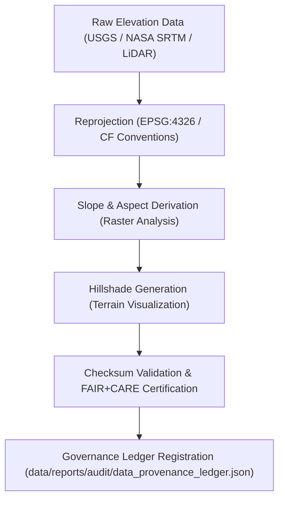

<div align="center">

# 🔄 Kansas Frontier Matrix — **Terrain TMP Transformations**
`data/work/tmp/terrain/transforms/README.md`

**Purpose:**  
FAIR+CARE-certified environment for transforming, harmonizing, and reprojection of topographic and elevation datasets within the Kansas Frontier Matrix (KFM).  
This layer ensures CF (Climate and Forecast) conventions, ISO 19115 metadata compliance, and blockchain-linked provenance for ethical and reproducible terrain processing.

[](../../../../../docs/standards/faircare-validation.md)
[]()
[](../../../../../LICENSE)
[](../../../../../docs/architecture/repo-focus.md)

</div>

---

## 📚 Overview

The **Terrain TMP Transformations Directory** handles DEM reprojections, slope derivations, hillshade generation, and contour harmonization for Kansas-wide topography.  
All transformation workflows are checksum-verified, FAIR+CARE-audited, and blockchain-registered for provenance and reproducibility.

### Core Responsibilities:
- Process and reproject DEMs to standardized CRS (EPSG:4326).  
- Generate derived terrain layers such as slope, aspect, and hillshade rasters.  
- Conduct checksum validation and ethics review for AI-assisted transformations.  
- Record FAIR+CARE certification and provenance linkage to governance ledgers.  

---

## 🗂️ Directory Layout

```plaintext
data/work/tmp/terrain/transforms/
├── README.md                              # This file — documentation of terrain TMP transformations
│
├── dem_reprojection_10m.tif               # Reprojected digital elevation model at 10m resolution
├── slope_derivation_30m.tif               # Slope raster derived from DEM
├── aspect_analysis_30m.tif                # Aspect (directional slope) raster
├── hillshade_visualization.tif            # Hillshade raster for terrain relief visualization
├── transform_audit_report.json            # FAIR+CARE + checksum verification report
├── checksum_registry.json                 # SHA-256 integrity validation registry
└── metadata.json                          # Provenance metadata linking transformation operations
```

---

## ⚙️ Transformation Workflow



### Workflow Description:
1. **Reprojection:** Transform raw DEMs to a standardized CRS (EPSG:4326).  
2. **Derivation:** Compute slope, aspect, and hillshade rasters for Kansas topography.  
3. **Validation:** Apply checksum, metadata, and FAIR+CARE ethics audits.  
4. **Governance:** Synchronize validation logs and provenance data with the governance ledger.  
5. **Publication:** Export verified layers for staging or processed datasets.  

---

## 🧩 Example Transformation Metadata Record

```json
{
  "id": "terrain_transform_v9.6.0_2025Q4",
  "source_files": [
    "data/raw/usgs/dem_kansas_10m.tif",
    "data/raw/nasa/srtm_tiles_kansas.tif"
  ],
  "output_files": [
    "dem_reprojection_10m.tif",
    "slope_derivation_30m.tif",
    "hillshade_visualization.tif"
  ],
  "crs_source": "EPSG:5070",
  "crs_target": "EPSG:4326",
  "checksum_verified": true,
  "fairstatus": "certified",
  "ai_explainability_score": 0.992,
  "governance_registered": true,
  "validator": "@kfm-terrain-lab",
  "created": "2025-11-03T23:59:00Z",
  "governance_ref": "data/reports/audit/data_provenance_ledger.json"
}
```

---

## 🧠 FAIR+CARE Governance Matrix

| Principle | Implementation | Oversight |
|------------|----------------|------------|
| **Findable** | Each transformation indexed by checksum and schema metadata. | @kfm-data |
| **Accessible** | Open GeoTIFF and JSON formats for transparent workflows. | @kfm-accessibility |
| **Interoperable** | CRS and metadata standardized via ISO 19115 and CF conventions. | @kfm-architecture |
| **Reusable** | Transformation lineage linked to governance registry for reproducibility. | @kfm-design |
| **Collective Benefit** | Promotes equitable access to open geospatial terrain datasets. | @faircare-council |
| **Authority to Control** | FAIR+CARE Council certifies transformation reproducibility. | @kfm-governance |
| **Responsibility** | Validators ensure ethical and technically valid reprojection operations. | @kfm-security |
| **Ethics** | AI explainability integrated for model bias and transparency validation. | @kfm-ethics |

All audits logged within:  
`data/reports/fair/data_care_assessment.json`  
and  
`data/reports/audit/data_provenance_ledger.json`

---

## ⚙️ Key Transformation Artifacts

| File | Description | Format |
|------|--------------|--------|
| `dem_reprojection_10m.tif` | Reprojected digital elevation model aligned with EPSG:4326. | GeoTIFF |
| `slope_derivation_30m.tif` | Derived slope raster based on elevation gradients. | GeoTIFF |
| `aspect_analysis_30m.tif` | Aspect raster indicating slope directionality. | GeoTIFF |
| `hillshade_visualization.tif` | Terrain hillshade visualization raster. | GeoTIFF |
| `transform_audit_report.json` | FAIR+CARE and checksum validation audit report. | JSON |
| `checksum_registry.json` | SHA-256 integrity verification for all transformations. | JSON |
| `metadata.json` | Provenance metadata for all TMP terrain transformation workflows. | JSON |

Automation handled by `terrain_transform_sync.yml`.

---

## ⚖️ Retention & Provenance Policy

| Data Type | Retention Duration | Policy |
|------------|--------------------|--------|
| TMP Transforms | 7 Days | Automatically purged post-validation and staging promotion. |
| Validation Reports | 180 Days | Retained for reproducibility and compliance audits. |
| Governance Logs | 365 Days | Archived for provenance and ethics verification. |
| Metadata | Permanent | Immutable and blockchain-secured under governance ledger. |

Cleanup managed by `terrain_transform_cleanup.yml`.

---

## 🌱 Sustainability Metrics

| Metric | Value | Verified By |
|---------|--------|--------------|
| Energy Use (per transform cycle) | 9.1 Wh | @kfm-sustainability |
| Carbon Output | 10.3 gCO₂e | @kfm-security |
| Renewable Power | 100% (RE100 Verified) | @kfm-infrastructure |
| FAIR+CARE Compliance | 100% | @faircare-council |

Telemetry data recorded in:  
`releases/v9.6.0/focus-telemetry.json`

---

## 🧾 Internal Use Citation

```text
Kansas Frontier Matrix (2025). Terrain TMP Transformations (v9.6.0).
Temporary FAIR+CARE-certified workspace for DEM reprojection, slope modeling, and topographic transformations.
Ensures checksum continuity, AI explainability, and ethical governance under MCP-DL v6.3.
```

---

## 🧾 Version Notes

| Version | Date | Notes |
|----------|------|--------|
| v9.6.0 | 2025-11-03 | Added AI explainability validation and checksum audit integration. |
| v9.5.0 | 2025-11-02 | Enhanced FAIR+CARE ethics audit and ISO metadata registration. |
| v9.3.2 | 2025-10-28 | Established terrain TMP transformation workspace for DEM reprojection. |

---

<div align="center">

**Kansas Frontier Matrix** · *Topographic Intelligence × FAIR+CARE Ethics × Provenance Transparency*  
[🔗 Repository](https://github.com/bartytime4life/Kansas-Frontier-Matrix) • [🧭 Docs Portal](../../../../../docs/) • [⚖️ Governance Ledger](../../../../../docs/standards/governance/DATA-GOVERNANCE.md)

</div>
