<div align="center">

# 🔄 **Kansas Frontier Matrix — Terrain TMP Transformations**  
`data/work/tmp/terrain/transforms/README.md`

**Purpose:**  
FAIR+CARE-certified environment for **DEM reprojection, slope/aspect derivation, hillshade generation**, and **metadata harmonization** for terrain datasets in the Kansas Frontier Matrix (KFM).  
Guarantees **CF compliance**, **ISO 19115 alignment**, **checksum continuity**, and **governance traceability** for reproducible topographic processing.

[](../../../../../docs/architecture/README.md)
[](../../../../../LICENSE)
[](../../../../../docs/standards/faircare-validation.md)
[]()

</div>

---

## 📘 Overview

The **Terrain TMP Transformations** workspace executes transient reprojection and analytical transformations (e.g., DEM → slope, aspect, hillshade).  
All workflows conform to **FAIR+CARE**, **CF Conventions**, and **ISO 19115** standards and are checksum-verified for provenance integrity.

### Core Responsibilities
- Reproject DEMs to EPSG:4326 and harmonize CF/ISO metadata.  
- Derive **slope**, **aspect**, and **hillshade** rasters under FAIR+CARE ethics.  
- Conduct checksum verification and governance registration.  
- Validate model transparency and energy use via AI explainability + telemetry.

---

## 🗂️ Directory Layout

```plaintext
data/work/tmp/terrain/transforms/
├── README.md                             # This file — documentation of terrain TMP transformations
│
├── dem_reprojection_10m.tif              # Reprojected DEM at 10m resolution
├── slope_derivation_30m.tif              # Derived slope raster
├── aspect_analysis_30m.tif               # Aspect raster (slope direction)
├── hillshade_visualization.tif           # Hillshade for terrain relief visualization
├── transform_audit_report.json           # FAIR+CARE + checksum verification report
├── checksum_registry.json                # SHA-256 integrity registry
└── metadata.json                         # Provenance and governance linkage metadata
```

---

## ⚙️ Transformation Workflow

```mermaid
flowchart TD
    A["Raw Elevation Data (USGS · NASA SRTM · LiDAR)"] --> B["Reprojection (EPSG:4326 / CF Conventions)"]
    B --> C["Slope / Aspect Derivation (Raster Analysis)"]
    C --> D["Hillshade Generation (Terrain Visualization)"]
    D --> E["Checksum Verification and FAIR+CARE Validation"]
    E --> F["Governance Ledger Sync (data/reports/audit/data_provenance_ledger.json)"]
```



### Description
1. **Reprojection** — Convert raw elevation rasters to standardized CRS (EPSG:4326).  
2. **Derivation** — Compute slope, aspect, and hillshade layers.  
3. **Validation** — Perform checksum verification and FAIR+CARE ethics audits.  
4. **Governance** — Register transformation metadata to the provenance ledger.  
5. **Export** — Promote validated terrain products for QA and staging.

---

## 🧩 Example Transformation Metadata Record

```json
{
  "id": "terrain_transform_v10.0.0_2025Q4",
  "source_files": [
    "data/raw/usgs/dem_kansas_10m.tif",
    "data/raw/nasa/srtm_tiles_kansas.tif"
  ],
  "outputs": [
    "dem_reprojection_10m.tif",
    "slope_derivation_30m.tif",
    "hillshade_visualization.tif"
  ],
  "crs_source": "EPSG:5070",
  "crs_target": "EPSG:4326",
  "checksum_verified": true,
  "fairstatus": "certified",
  "ai_explainability_score": 0.992,
  "telemetry": { "energy_wh": 9.1, "carbon_gco2e": 10.3 },
  "validator": "@kfm-terrain-lab",
  "governance_registered": true,
  "created": "2025-11-10T00:00:00Z",
  "governance_ref": "data/reports/audit/data_provenance_ledger.json"
}
```

---

## 🧠 FAIR+CARE Governance Matrix

| Principle | Implementation | Oversight |
|---|---|---|
| **Findable** | Transformations indexed by checksum & schema metadata | @kfm-data |
| **Accessible** | GeoTIFF/JSON formats for reproducible analysis | @kfm-accessibility |
| **Interoperable** | ISO 19115 + CF-compliant metadata for all rasters | @kfm-architecture |
| **Reusable** | Provenance linkage ensures reproducibility | @kfm-design |
| **Collective Benefit** | Enables transparent terrain modeling for Kansas | @faircare-council |
| **Authority to Control** | FAIR+CARE Council certifies reproducibility | @kfm-governance |
| **Responsibility** | Validators record schema, checksum, & energy telemetry | @kfm-security |
| **Ethics** | AI explainability audits enforce non-bias in modeling | @kfm-ethics |

**Audit Trail:**  
`data/reports/fair/data_care_assessment.json` · `data/reports/audit/data_provenance_ledger.json`

---

## ⚙️ Key Transformation Artifacts

| File | Description | Format |
|---|---|---|
| `dem_reprojection_10m.tif` | Reprojected DEM in EPSG:4326 | GeoTIFF |
| `slope_derivation_30m.tif` | Derived slope raster | GeoTIFF |
| `aspect_analysis_30m.tif` | Directional aspect raster | GeoTIFF |
| `hillshade_visualization.tif` | Terrain relief hillshade | GeoTIFF |
| `transform_audit_report.json` | FAIR+CARE and checksum validation report | JSON |
| `checksum_registry.json` | Integrity verification registry | JSON |
| `metadata.json` | Provenance and ledger references | JSON |

**Automation:** `terrain_transform_sync.yml`

---

## ⚖️ Retention & Provenance Policy

| Type | Retention | Policy |
|---|---:|---|
| TMP Transforms | 7 Days | Purged after validation or staging promotion |
| Validation Reports | 180 Days | Retained for reproducibility and ethics review |
| Governance Logs | 365 Days | Archived for lineage certification |
| Metadata | Permanent | Immutable and blockchain-verified |

Cleanup handled via `terrain_transform_cleanup.yml`.

---

## 🌱 Sustainability Metrics

| Metric | Value | Verified By |
|---|---:|---|
| Energy Use (per transform cycle) | 9.1 Wh | @kfm-sustainability |
| Carbon Output | 10.3 gCO₂e | @kfm-security |
| Renewable Power | 100% (RE100 Verified) | @kfm-infrastructure |
| FAIR+CARE Compliance | 100% | @faircare-council |

**Telemetry:** `../../../../../releases/v10.0.0/focus-telemetry.json`

---

## 🧾 Citation

```text
Kansas Frontier Matrix (2025). Terrain TMP Transformations (v10.0.0).
FAIR+CARE-certified transformation workspace for DEM reprojection, slope modeling, and hillshade generation.
Ensures ethical reproducibility, checksum lineage, and AI audit transparency under MCP-DL v6.3 and ISO 19115.
```

---

## 🕰️ Version History

| Version | Date | Notes |
|---|---|---|
| v10.0.0 | 2025-11-10 | Upgraded telemetry schema; improved CF/ISO and AI ethics integration. |
| v9.6.0 | 2025-11-03 | Added explainability validation and checksum integration. |
| v9.5.0 | 2025-11-02 | Enhanced FAIR+CARE audit and ISO metadata governance. |
| v9.3.2 | 2025-10-28 | Established terrain TMP transformation workspace. |

---

<div align="center">

**Kansas Frontier Matrix**  
*Topographic Intelligence × FAIR+CARE Ethics × Provenance Governance*  
© 2025 Kansas Frontier Matrix — CC-BY 4.0 · Master Coder Protocol v6.3 · **Diamond⁹ Ω / Crown∞Ω** Ultimate Certified  

[Back to Terrain TMP](../README.md) · [Docs Portal](../../../../../docs/) · [Governance Charter](../../../../../docs/standards/governance/DATA-GOVERNANCE.md)

</div>
