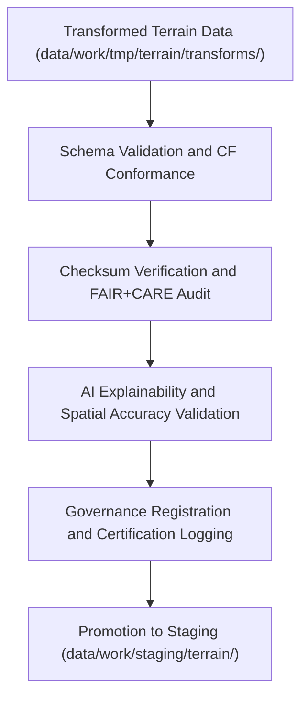

<div align="center">

# ✅ Kansas Frontier Matrix — **Terrain TMP Validation Workspace**
`data/work/tmp/terrain/validation/README.md`

**Purpose:**  
FAIR+CARE-certified QA and governance layer for **schema, checksum, and geospatial accuracy validation** of terrain datasets in the Kansas Frontier Matrix (KFM).  
This workspace ensures that terrain derivatives and DEM transformations meet FAIR+CARE, ISO, and CF standards before staging or publication.

[](../../../../../docs/standards/faircare-validation.md)
[](../../../../../LICENSE)
[](../../../../../docs/architecture/repo-focus.md)

</div>

---

## 📚 Overview

The `data/work/tmp/terrain/validation/` directory provides a **structured, reproducible environment for terrain validation**, including geospatial, ethical, and technical QA operations.  
It bridges the transformation and staging layers by applying FAIR+CARE governance, checksum verification, and ethical compliance testing.

### Core Responsibilities
- Validate DEM and derivative layers for accuracy and reproducibility.  
- Perform checksum audits and FAIR+CARE ethics reviews.  
- Confirm CF and ISO compliance for geospatial metadata.  
- Register all validation outcomes in the KFM governance ledger.  

---

## 🗂️ Directory Layout

```plaintext
data/work/tmp/terrain/validation/
├── README.md                               # This file — documentation for Terrain TMP validation workspace
│
├── schema_validation_summary.json           # Schema conformity report for terrain datasets
├── faircare_audit_report.json               # FAIR+CARE governance ethics and accessibility audit
├── checksum_registry.json                   # SHA-256 checksum verification report
├── ai_explainability_report.json            # AI-driven validation interpretability and drift report
├── cf_compliance_audit.json                 # CF and ISO compliance validation report
├── governance_review.json                   # Council oversight record for ethics and validation certification
└── metadata.json                            # Provenance and checksum linkage metadata
```

---

## ⚙️ Validation Workflow



### Workflow Description
1. **Schema Validation:** Cross-check terrain metadata, structure, and CRS definitions.  
2. **Checksum Audit:** Verify reproducibility through SHA-256 hashing.  
3. **FAIR+CARE Audit:** Validate accessibility, openness, and ethics alignment.  
4. **AI Explainability:** Review model integrity and interpolation ethics for derivative generation.  
5. **Governance Logging:** Register results into provenance ledgers and checksum manifests.  

---

## 🧩 Example Validation Metadata Record

```json
{
  "id": "terrain_tmp_validation_v9.5.0_2025Q4",
  "datasets_validated": [
    "dem_reprojected.tif",
    "slope_computed.tif",
    "aspect_computed.tif"
  ],
  "records_validated": 2431551,
  "schema_validation_passed": true,
  "checksum_verified": true,
  "cf_compliance_score": 99.8,
  "fairstatus": "certified",
  "ai_explainability_score": 0.987,
  "governance_registered": true,
  "telemetry_ref": "releases/v9.5.0/focus-telemetry.json",
  "governance_ref": "reports/audit/ai_terrain_ledger.json",
  "created": "2025-11-02T23:59:00Z",
  "validator": "@kfm-terrain-validation"
}
```

---

## 🧠 FAIR+CARE Governance Matrix

| Principle | Implementation |
|------------|----------------|
| **Findable** | Validation results indexed with checksum, schema, and governance records. |
| **Accessible** | Reports stored in open JSON format and linked to provenance logs. |
| **Interoperable** | Follows CF conventions, ISO 19115 lineage, and DCAT 3.0 standards. |
| **Reusable** | Metadata includes checksum and FAIR+CARE validation details. |
| **Collective Benefit** | Enables transparent terrain dataset validation for open research. |
| **Authority to Control** | FAIR+CARE Council reviews validation and ethics results. |
| **Responsibility** | Validators document compliance, checksum, and ethical metrics. |
| **Ethics** | Enforces open and responsible environmental data validation. |

Governance and audit records stored in:  
`reports/audit/ai_terrain_ledger.json` • `reports/fair/terrain_validation_summary.json`

---

## ⚙️ QA & Validation Artifacts

| File | Description | Format |
|------|--------------|--------|
| `schema_validation_summary.json` | Schema and metadata validation report. | JSON |
| `faircare_audit_report.json` | FAIR+CARE ethics and accessibility validation. | JSON |
| `checksum_registry.json` | SHA-256 hash verification log for reproducibility. | JSON |
| `ai_explainability_report.json` | AI model validation and interpretability audit. | JSON |
| `cf_compliance_audit.json` | CF and ISO geospatial validation report. | JSON |
| `governance_review.json` | Governance oversight certification report. | JSON |
| `metadata.json` | Provenance and checksum registry linkage metadata. | JSON |

Automation handled via `terrain_validation_sync.yml`.

---

## 🧾 Retention Policy

| File Type | Retention Duration | Policy |
|------------|--------------------|--------|
| Validation Reports | 365 days | Archived for governance and reproducibility audits. |
| FAIR+CARE Audits | Permanent | Stored for ethics and provenance certification. |
| Checksum Logs | Permanent | Maintained under governance integrity registry. |
| Metadata | Permanent | Preserved for lineage tracking and audit verification. |

Cleanup automated by `terrain_validation_cleanup.yml`.

---

## 🧾 Internal Use Citation

```text
Kansas Frontier Matrix (2025). Terrain TMP Validation Workspace (v9.5.0).
FAIR+CARE-certified validation workspace for terrain dataset schema, checksum, and ethical compliance verification.
Ensures transparent, reproducible, and explainable QA workflows under MCP-DL v6.3 governance.
```

---

## 🧾 Version Notes

| Version | Date | Notes |
|----------|------|--------|
| v9.5.0 | 2025-11-02 | Added CF/ISO compliance audit and AI explainability validation. |
| v9.3.2 | 2025-10-28 | Enhanced FAIR+CARE governance alignment and checksum registry tracking. |
| v9.3.0 | 2025-10-26 | Established Terrain TMP Validation workspace for geospatial QA and ethics review. |

---

<div align="center">

**Kansas Frontier Matrix** · *Topographic Validation × FAIR+CARE Ethics × Provenance Accountability*  
[🔗 Repository](https://github.com/bartytime4life/Kansas-Frontier-Matrix) • [🧭 Docs Portal](../../../../../docs/) • [⚖️ Governance Ledger](../../../../../docs/standards/governance/)

</div>