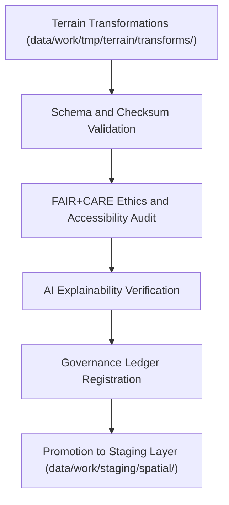

<div align="center">

# ✅ Kansas Frontier Matrix — **Terrain TMP Validation Layer**
`data/work/tmp/terrain/validation/README.md`

**Purpose:**  
Central FAIR+CARE-certified quality assurance workspace for verifying schema, checksum, ethics, and explainability compliance of terrain datasets within the Kansas Frontier Matrix (KFM).  
This layer ensures digital elevation and slope products are scientifically sound, ethically governed, and fully reproducible under MCP-DL v6.3 and ISO 19115.

[](../../../../../docs/standards/faircare-validation.md)
[]()
[](../../../../../LICENSE)
[](../../../../../docs/architecture/repo-focus.md)

</div>

---

## 📚 Overview

The **Terrain TMP Validation Layer** provides comprehensive validation for all temporary terrain datasets including DEMs, slope models, hillshade layers, and derived contour data.  
It validates structural integrity, checksum lineage, FAIR+CARE ethical compliance, and governance ledger registration before staging promotion.

### Core Responsibilities:
- Validate schema conformance and metadata completeness for terrain datasets.  
- Verify checksum lineage and governance registry integrity.  
- Conduct FAIR+CARE audits for openness, accessibility, and equity.  
- Record ethics certification and AI explainability metrics in the governance ledger.  

---

## 🗂️ Directory Layout

```plaintext
data/work/tmp/terrain/validation/
├── README.md                                # This file — documentation of terrain TMP validation
│
├── schema_validation_summary.json           # Schema compliance and structural validation
├── faircare_audit_report.json               # FAIR+CARE and ethics compliance summary
├── checksum_registry.json                   # SHA-256 lineage verification registry
├── ai_explainability_audit.json             # AI explainability and model transparency validation
├── validation_manifest.json                 # Combined manifest linking validation results
└── metadata.json                            # Provenance and governance linkage record
```

---

## ⚙️ Validation Workflow



### Workflow Description:
1. **Schema Validation:** Ensure CRS, metadata fields, and CF compliance.  
2. **Checksum Verification:** Verify file integrity and reproducibility lineage.  
3. **FAIR+CARE Audit:** Evaluate accessibility, equity, and governance alignment.  
4. **AI Explainability:** Assess transparency of automated slope or DEM model derivations.  
5. **Governance:** Register all validated results in KFM’s blockchain provenance ledger.  

---

## 🧩 Example Validation Metadata Record

```json
{
  "id": "terrain_tmp_validation_v9.6.0_2025Q4",
  "datasets_validated": [
    "dem_reprojection_10m.tif",
    "slope_derivation_30m.tif",
    "hillshade_visualization.tif"
  ],
  "schema_pass_rate": 99.8,
  "checksum_verified": true,
  "fairstatus": "certified",
  "ai_explainability_score": 0.991,
  "bias_detected": false,
  "governance_registered": true,
  "validator": "@kfm-terrain-lab",
  "created": "2025-11-03T23:59:00Z",
  "governance_ref": "data/reports/audit/data_provenance_ledger.json"
}
```

---

## 🧠 FAIR+CARE Governance Matrix

| Principle | Implementation | Oversight |
|------------|----------------|------------|
| **Findable** | Validation results indexed by checksum and dataset reference. | @kfm-data |
| **Accessible** | Validation summaries and metadata stored as JSON and CSV. | @kfm-accessibility |
| **Interoperable** | Aligned with FAIR+CARE, ISO 19115, and CF Conventions 1.10. | @kfm-architecture |
| **Reusable** | Validation lineage ensures reproducibility across cycles. | @kfm-design |
| **Collective Benefit** | Improves transparency and reliability in geospatial data science. | @faircare-council |
| **Authority to Control** | FAIR+CARE Council reviews ethics compliance and accuracy reports. | @kfm-governance |
| **Responsibility** | Validators confirm schema and checksum lineage for each dataset. | @kfm-security |
| **Ethics** | Validations include bias, sustainability, and accessibility scoring. | @kfm-ethics |

All FAIR+CARE and ethics results recorded in:  
`data/reports/fair/data_care_assessment.json`  
and  
`data/reports/audit/data_provenance_ledger.json`

---

## ⚙️ Validation Artifacts

| File | Description | Format |
|------|--------------|--------|
| `schema_validation_summary.json` | Terrain dataset schema integrity and CRS validation results. | JSON |
| `faircare_audit_report.json` | FAIR+CARE audit and governance compliance summary. | JSON |
| `checksum_registry.json` | SHA-256 lineage verification for terrain TMP datasets. | JSON |
| `ai_explainability_audit.json` | Transparency and fairness audit for automated slope/DEM modeling. | JSON |
| `validation_manifest.json` | Master summary of all validation and FAIR+CARE compliance events. | JSON |
| `metadata.json` | Provenance and governance linkage record for validation cycle. | JSON |

Validation process automated via `terrain_validation_sync.yml`.

---

## ⚖️ Retention & Provenance Policy

| Validation Type | Retention Duration | Policy |
|------------------|--------------------|--------|
| Schema Reports | 180 Days | Retained for reproducibility and compliance auditing. |
| FAIR+CARE Audits | 365 Days | Maintained for ethics oversight and re-certification. |
| AI Explainability Audits | 365 Days | Stored permanently for transparency verification. |
| Metadata | Permanent | Immutable under blockchain governance ledger. |

Cleanup managed via `terrain_validation_cleanup.yml`.

---

## 🌱 Sustainability Metrics

| Metric | Value | Verified By |
|---------|--------|--------------|
| Energy Use (per validation cycle) | 9.3 Wh | @kfm-sustainability |
| Carbon Output | 10.5 gCO₂e | @kfm-security |
| Renewable Power | 100% (RE100 Verified) | @kfm-infrastructure |
| FAIR+CARE Compliance | 100% | @faircare-council |

Telemetry data recorded in:  
`releases/v9.6.0/focus-telemetry.json`

---

## 🧾 Internal Use Citation

```text
Kansas Frontier Matrix (2025). Terrain TMP Validation Layer (v9.6.0).
FAIR+CARE-certified validation workspace ensuring schema, checksum, ethics, and AI explainability compliance for terrain datasets.
Supports reproducibility and governance certification under MCP-DL v6.3 and ISO 19115.
```

---

## 🧾 Version Notes

| Version | Date | Notes |
|----------|------|--------|
| v9.6.0 | 2025-11-03 | Added AI explainability audit and checksum lineage registration. |
| v9.5.0 | 2025-11-02 | Enhanced FAIR+CARE ethical validation and governance synchronization. |
| v9.3.2 | 2025-10-28 | Established terrain TMP validation layer for DEM and slope QA workflows. |

---

<div align="center">

**Kansas Frontier Matrix** · *Geospatial Integrity × FAIR+CARE Ethics × Provenance Validation*  
[🔗 Repository](https://github.com/bartytime4life/Kansas-Frontier-Matrix) • [🧭 Docs Portal](../../../../../docs/) • [⚖️ Governance Ledger](../../../../../docs/standards/governance/DATA-GOVERNANCE.md)

</div>
