<div align="center">

# ✅ **Kansas Frontier Matrix — Terrain TMP Validation Layer**  
`data/work/tmp/terrain/validation/README.md`

**Purpose:**  
FAIR+CARE-certified QA workspace for validating **schema, checksum, ethics, and explainability** compliance of temporary terrain datasets (DEMs, slope, aspect, hillshade) within the Kansas Frontier Matrix (KFM).  
Ensures scientifically sound, ethically governed, and fully reproducible outputs aligned with **MCP-DL v6.3** and **ISO 19115** before promotion to staging.

[](../../../../../docs/architecture/README.md)
[](../../../../../LICENSE)
[](../../../../../docs/standards/faircare-validation.md)
[]()

</div>

---

## 📘 Overview

The Terrain TMP Validation Layer confirms that all transformation outputs from `../transforms/` meet **STAC/DCAT/CF/ISO** schema expectations, demonstrate **reproducible integrity** via checksums, and pass **FAIR+CARE** ethics and **XAI** (SHAP/LIME) transparency checks. Certified validations are synchronized to the **provenance ledger** and associated **telemetry**.

### Core Responsibilities
- Validate schemas and metadata (CRS **EPSG:4326**, CF attributes, ISO lineage).  
- Verify **SHA-256** continuity from source → transform → validation.  
- Conduct FAIR+CARE audits for openness, accessibility, and equity.  
- Assess AI explainability and drift for automated terrain derivatives.  
- Register results to the governance ledger and update release manifests.

---

## 🗂️ Directory Layout

```plaintext
data/work/tmp/terrain/validation/
├── README.md
├── schema_validation_summary.json      # STAC/DCAT/CF/ISO conformance & structural checks
├── faircare_audit_report.json          # FAIR+CARE ethics & accessibility outcomes
├── checksum_registry.json              # SHA-256 continuity registry
├── ai_explainability_audit.json        # SHAP/LIME transparency & drift findings
├── validation_manifest.json            # Cross-links all artifacts to ledger entries
└── metadata.json                       # Validators, signatures, telemetry refs, governance links
```

---

## ⚙️ Validation Workflow

```mermaid
flowchart TD
    A["Transformed Terrain (data/work/tmp/terrain/transforms/)"] --> B["Schema & CF/ISO Validation"]
    B --> C["Checksum Verification & FAIR·CARE Ethics Audit"]
    C --> D["AI Explainability Verification"]
    D --> E["Governance Ledger Registration"]
    E --> F["Promotion → data/work/staging/spatial/"]
```



### Description
1. **Schema & CF/ISO Validation** — Confirm CRS, fields, CF attributes, ISO lineage completeness.  
2. **Checksum & FAIR+CARE** — Verify hashes and certify ethical openness & accessibility.  
3. **Explainability** — Validate SHAP/LIME transparency and drift for model-assisted layers.  
4. **Governance** — Publish results to `data/reports/audit/data_provenance_ledger.json` and update `manifest_ref`.  
5. **Promotion** — Only certified datasets advance to staging.

---

## 🧩 Example Validation Metadata Record

```json
{
  "id": "terrain_tmp_validation_v9.7.0_2025Q4",
  "datasets_validated": [
    "dem_reprojection_10m.tif",
    "slope_derivation_30m.tif",
    "hillshade_visualization.tif"
  ],
  "schema_pass_rate": 99.8,
  "checksum_verified": true,
  "faircare_status": "certified",
  "ai_explainability_score": 0.991,
  "bias_detected": false,
  "governance_registered": true,
  "validator": "@kfm-terrain-lab",
  "created": "2025-11-10T00:00:00Z",
  "governance_ref": "data/reports/audit/data_provenance_ledger.json"
}
```

---

## 🧠 FAIR+CARE Governance Matrix

| Principle | Implementation | Oversight |
|---|---|---|
| **Findable** | Validation results indexed by checksum and dataset reference | @kfm-data |
| **Accessible** | JSON reports and logs available for Council review | @kfm-accessibility |
| **Interoperable** | Aligned with FAIR+CARE · ISO 19115 · CF Conventions | @kfm-architecture |
| **Reusable** | End-to-end checksum lineage ensures reproducibility | @kfm-design |
| **Collective Benefit** | Improves transparency and reliability in geospatial science | @faircare-council |
| **Authority to Control** | Council reviews ethics and accuracy certifications | @kfm-governance |
| **Responsibility** | Validators confirm schema and checksum lineage per dataset | @kfm-security |
| **Ethics** | Includes bias, sustainability, and accessibility scoring | @kfm-ethics |

**Audit links:** `data/reports/fair/data_care_assessment.json` · `data/reports/audit/data_provenance_ledger.json`

---

## ⚙️ Validation Artifacts

| File | Description | Format |
|---|---|---|
| `schema_validation_summary.json` | CRS/CF/ISO schema integrity results | JSON |
| `faircare_audit_report.json` | FAIR+CARE ethics & accessibility summary | JSON |
| `checksum_registry.json` | SHA-256 continuity log (source → transform → validation) | JSON |
| `ai_explainability_audit.json` | Transparency & drift audit for automated derivations | JSON |
| `validation_manifest.json` | Master cross-reference to artifacts & ledger entries | JSON |
| `metadata.json` | Provenance, validators, telemetry & signatures | JSON |

Automation: `terrain_validation_sync.yml`

---

## ⚖️ Retention & Provenance Policy

| Validation Type | Retention | Policy |
|---|---:|---|
| Schema & CF/ISO Reports | 180 Days | Archived for reproducibility & audits |
| FAIR+CARE Audits | 365 Days | Retained for ethics oversight & re-certification |
| XAI Audits | 365 Days | Preserved for transparency verification |
| Metadata & Manifests | Permanent | Immutable under blockchain governance |

---

## 🌱 Sustainability Metrics

| Metric | Value | Verified By |
|---|---:|---|
| Energy Use (per validation cycle) | 9.3 Wh | @kfm-sustainability |
| Carbon Output | 10.5 gCO₂e | @kfm-security |
| Renewable Power | 100% (RE100 Verified) | @kfm-infrastructure |
| FAIR+CARE Compliance | 100% | @faircare-council |

**Telemetry:** `../../../../../releases/v9.7.0/focus-telemetry.json`

---

## 🧾 Citation

```text
Kansas Frontier Matrix (2025). Terrain TMP Validation Layer (v9.7.0).
FAIR+CARE-certified validation workspace ensuring schema, checksum, ethics, and AI explainability compliance for terrain datasets, with full provenance under MCP-DL v6.3 and ISO 19115.
```

---

## 🕰️ Version History

| Version | Date | Notes |
|---|---|---|
| v9.7.0 | 2025-11-10 | Upgraded telemetry and governance links; aligned badges; clarified CF/ISO checks. |
| v9.6.0 | 2025-11-03 | Added AI explainability audit and checksum lineage registration. |
| v9.5.0 | 2025-11-02 | Enhanced FAIR+CARE validation and governance synchronization. |
| v9.3.2 | 2025-10-28 | Established terrain TMP validation layer for DEM and slope QA. |

---

<div align="center">

**Kansas Frontier Matrix**  
*Geospatial Integrity × FAIR+CARE Ethics × Provenance Validation*  
© 2025 Kansas Frontier Matrix — CC-BY 4.0 · Master Coder Protocol v6.3 · **Diamond⁹ Ω / Crown∞Ω** Ultimate Certified  

[Back to Terrain TMP](../README.md) · [Docs Portal](../../../../../docs/) · [Governance Charter](../../../../../docs/standards/governance/DATA-GOVERNANCE.md)

</div>
