<div align="center">

# ✅ **Kansas Frontier Matrix — Terrain TMP Validation Layer (v10.0.0)**  
`data/work/tmp/terrain/validation/README.md`

**Purpose:**  
FAIR+CARE-certified **quality assurance workspace** for validating **schema, checksum, explainability, and ethics compliance** of temporary terrain datasets (DEMs, slope, aspect, hillshade) within the Kansas Frontier Matrix (KFM).  
Guarantees scientifically valid, ethically governed, and reproducible terrain data aligned with **MCP-DL v6.3**, **ISO 19115**, and **CF Conventions 1.10**, prior to staging or publication.

[](../../../../../docs/architecture/README.md)  
[](../../../../../LICENSE)  
[](../../../../../docs/standards/faircare-validation.md)  
[]()

</div>

---

## 📘 Overview

The **Terrain TMP Validation Layer** (v10.0.0) ensures every terrain transformation output conforms to **FAIR+CARE**, **STAC/DCAT**, **ISO**, and **CF** schema standards.  
It performs checksum lineage validation, ethical and accessibility audits, and AI explainability checks, registering all results in KFM’s **provenance ledger** and **telemetry reports**.

### Core Responsibilities
- Validate CRS, schema, and metadata completeness (ISO 19115, CF).  
- Verify **checksum lineage continuity** and reproducibility integrity.  
- Conduct **FAIR+CARE audits** for transparency and accessibility.  
- Perform **AI explainability validation** (SHAP/LIME) on derived slope or DEM models.  
- Synchronize validation metadata to governance ledger and sustainability telemetry.

---

## 🗂️ Directory Layout

```plaintext
data/work/tmp/terrain/validation/
├── README.md
├── schema_validation_summary.json      # STAC/DCAT/CF/ISO compliance & field checks
├── faircare_audit_report.json          # FAIR+CARE ethics & accessibility audit
├── checksum_registry.json              # SHA-256 lineage registry
├── ai_explainability_audit.json        # Model transparency & drift verification
├── validation_manifest.json            # Cross-links all validation artifacts to governance records
└── metadata.json                       # Provenance, validator details, and telemetry references
```

---

## ⚙️ Validation Workflow

```mermaid
flowchart TD
    A["Transformed Terrain Data (../transforms/)"] --> B["Schema Validation (ISO/CF/STAC/DCAT)"]
    B --> C["Checksum Verification & FAIR·CARE Audit"]
    C --> D["AI Explainability + Drift Detection"]
    D --> E["Governance Ledger Registration"]
    E --> F["Promotion → Staging Layer (data/work/staging/spatial/)"]
```



### Description
1. **Schema Validation** — Validate structure, CF attributes, CRS = EPSG:4326, and metadata lineage.  
2. **Checksum Verification** — Ensure cryptographic hash continuity from source → transform → validation.  
3. **Ethics & FAIR+CARE** — Evaluate openness, bias, equity, and accessibility compliance.  
4. **Explainability** — Assess model transparency and bias detection using SHAP/LIME.  
5. **Governance Sync** — Register results in the provenance ledger, update manifest, and emit telemetry.

---

## 🧩 Example Validation Metadata Record

```json
{
  "id": "terrain_tmp_validation_v10.0.0_2025Q4",
  "datasets_validated": [
    "dem_reprojection_10m.tif",
    "slope_derivation_30m.tif",
    "hillshade_visualization.tif"
  ],
  "schema_pass_rate": 99.9,
  "checksum_verified": true,
  "faircare_status": "certified",
  "ai_explainability_score": 0.993,
  "bias_detected": false,
  "governance_registered": true,
  "validator": "@kfm-terrain-lab",
  "created": "2025-11-10T00:00:00Z",
  "telemetry": { "energy_wh": 9.2, "carbon_gco2e": 10.4 },
  "governance_ref": "data/reports/audit/data_provenance_ledger.json"
}
```

---

## 🧠 FAIR+CARE Governance Matrix

| Principle | Implementation | Oversight |
|---|---|---|
| **Findable** | Indexed by checksum, schema, and dataset references | @kfm-data |
| **Accessible** | FAIR+CARE JSON artifacts available for review | @kfm-accessibility |
| **Interoperable** | Conforms to STAC/DCAT/CF + ISO 19115 metadata | @kfm-architecture |
| **Reusable** | Lineage and manifest continuity guarantee reproducibility | @kfm-design |
| **Collective Benefit** | Increases transparency and geospatial accountability | @faircare-council |
| **Authority to Control** | Council validates schema and ethics certification | @kfm-governance |
| **Responsibility** | Validators document compliance and checksum lineage | @kfm-security |
| **Ethics** | Sustainability and explainability audits confirm neutrality | @kfm-ethics |

**Audit & Governance Links:**  
`data/reports/fair/data_care_assessment.json` · `data/reports/audit/data_provenance_ledger.json`

---

## ⚙️ Validation Artifacts

| File | Description | Format |
|---|---|---|
| `schema_validation_summary.json` | Structural, CRS, and metadata checks | JSON |
| `faircare_audit_report.json` | FAIR+CARE ethics & accessibility audit results | JSON |
| `checksum_registry.json` | SHA-256 lineage for traceable reproducibility | JSON |
| `ai_explainability_audit.json` | Model explainability and bias report | JSON |
| `validation_manifest.json` | Cross-linked ledger and artifact record | JSON |
| `metadata.json` | Provenance, validator, and telemetry signatures | JSON |

**Automation Pipeline:** `terrain_validation_sync.yml`

---

## ⚖️ Retention & Provenance Policy

| Validation Type | Retention Duration | Policy |
|---|---:|---|
| Schema Reports | 180 Days | Retained for reproducibility and revalidation |
| FAIR+CARE Audits | 365 Days | Archived for ethical and accessibility compliance |
| XAI Reports | 365 Days | Retained for transparency verification |
| Metadata & Manifests | Permanent | Immutable under blockchain governance |

Cleanup handled by `terrain_validation_cleanup.yml`.

---

## 🌱 Sustainability & Telemetry Metrics

| Metric | Value | Verified By |
|---|---:|---|
| Energy Use (per validation cycle) | 9.2 Wh | @kfm-sustainability |
| Carbon Output | 10.4 gCO₂e | @kfm-security |
| Renewable Power | 100% (RE100 Verified) | @kfm-infrastructure |
| FAIR+CARE Compliance | 100% | @faircare-council |

**Telemetry Reference:**  
`../../../../../releases/v10.0.0/focus-telemetry.json`

---

## 🧾 Citation

```text
Kansas Frontier Matrix (2025). Terrain TMP Validation Layer (v10.0.0).
FAIR+CARE-certified validation workspace for DEM, slope, and hillshade datasets — ensuring schema integrity, checksum lineage, and AI explainability under MCP-DL v6.3 and ISO 19115 standards.
```

---

## 🕰️ Version History

| Version | Date | Summary |
|---|---|---|
| v10.0.0 | 2025-11-10 | Upgraded telemetry schema; enhanced XAI metrics; improved CF/ISO checks. |
| v9.7.0 | 2025-11-07 | Added telemetry integration, refined FAIR+CARE matrix. |
| v9.6.0 | 2025-11-03 | Introduced explainability audit and checksum lineage registry. |
| v9.5.0 | 2025-11-02 | Expanded ethics auditing and governance synchronization. |

---

<div align="center">

**Kansas Frontier Matrix**  
*Topographic Validation × FAIR+CARE Ethics × Provenance Certification*  
© 2025 Kansas Frontier Matrix — CC-BY 4.0 · Master Coder Protocol v6.3 · **Diamond⁹ Ω / Crown∞Ω** Ultimate Certified  

[Back to Terrain TMP](../README.md) · [Docs Portal](../../../../../docs/) · [Governance Charter](../../../../../docs/standards/governance/DATA-GOVERNANCE.md)

</div>
