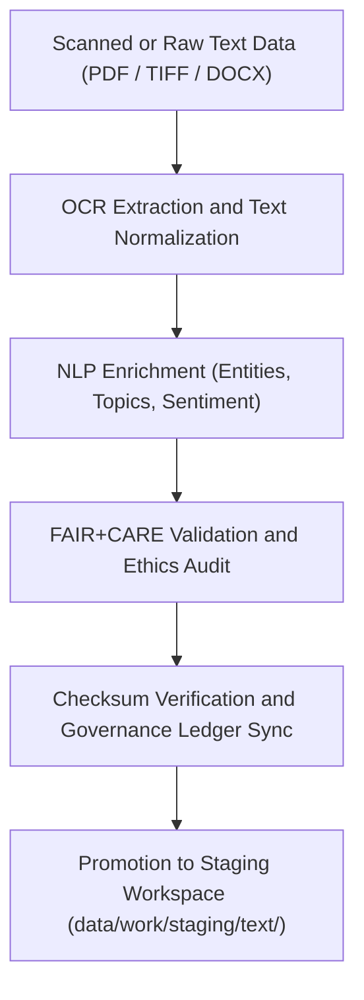

<div align="center">

# 📜 Kansas Frontier Matrix — **Text TMP Workspace**
`data/work/tmp/text/README.md`

**Purpose:**  
Governed FAIR+CARE-certified workspace for **text data ingestion, OCR processing, NLP enrichment, and AI explainability audits** in the Kansas Frontier Matrix (KFM).  
Supports ethical digitization, metadata extraction, and semantic modeling of historical and archival texts under open governance.

[](../../../../docs/standards/faircare-validation.md)
[](../../../../LICENSE)
[](../../../../docs/architecture/repo-focus.md)

</div>

---

## 📚 Overview

The `data/work/tmp/text/` directory provides a **temporary FAIR+CARE-compliant environment** for managing text-based data processing, including OCR transcription, language modeling, and content validation.  
This workspace serves as a reproducible ETL layer for textual assets such as archival documents, historical treaties, diaries, and field reports.

### Core Responsibilities
- Perform OCR and text extraction from scanned or digitized sources.  
- Normalize text encoding (UTF-8) and perform NLP-based metadata tagging.  
- Validate textual datasets through FAIR+CARE ethical governance.  
- Register provenance, schema, and checksum data in governance ledgers.  

---

## 🗂️ Directory Layout

```plaintext
data/work/tmp/text/
├── README.md                              # This file — documentation for Text TMP workspace
│
├── ocr/                                   # Optical Character Recognition outputs (raw text and JSON transcripts)
│   ├── treaty_ocr_output_2025.txt
│   ├── report_transcript.json
│   └── metadata.json
│
├── nlp/                                   # NLP enrichment and named-entity recognition (NER) results
│   ├── entities_extracted.json
│   ├── topic_classification.json
│   ├── sentiment_analysis.json
│   └── metadata.json
│
├── validation/                            # Schema and FAIR+CARE validation reports
│   ├── schema_validation_summary.json
│   ├── faircare_audit_report.json
│   ├── checksum_registry.json
│   └── metadata.json
│
├── logs/                                  # Runtime and governance synchronization logs
│   ├── etl_tmp_run.log
│   ├── ocr_process_trace.log
│   ├── governance_sync.log
│   └── metadata.json
│
└── metadata.json                          # TMP-level provenance and checksum record
```

---

## ⚙️ TMP Workflow



### Workflow Description
1. **OCR Extraction:** Convert scanned or image-based documents into machine-readable text.  
2. **NLP Enrichment:** Perform entity recognition, topic modeling, and summarization.  
3. **Validation:** Run FAIR+CARE audits and schema checks for accessibility and ethics.  
4. **Checksum Verification:** Register file integrity and governance records.  
5. **Promotion:** Move verified text datasets into staging for archival or research use.  

---

## 🧩 Example TMP Metadata Record

```json
{
  "id": "text_tmp_v9.5.0_2025Q4",
  "source_files": [
    "data/raw/archives/treaty_scan_1875.pdf",
    "data/raw/reports/environmental_survey_1902.tif"
  ],
  "records_processed": 853,
  "ocr_engine": "Tesseract v6.0",
  "nlp_pipeline": "spaCy v3.8 (custom KFM model)",
  "checksum_verified": true,
  "fairstatus": "certified",
  "ai_explainability_score": 0.986,
  "governance_registered": true,
  "telemetry_ref": "releases/v9.5.0/focus-telemetry.json",
  "governance_ref": "reports/audit/ai_text_ledger.json",
  "created": "2025-11-02T23:45:00Z",
  "validator": "@kfm-text-etl"
}
```

---

## 🧠 FAIR+CARE Governance Matrix

| Principle | Implementation |
|------------|----------------|
| **Findable** | Text data indexed by checksum and provenance metadata. |
| **Accessible** | Stored in open UTF-8 plain text and JSON formats. |
| **Interoperable** | Metadata aligned with DCAT 3.0 and NLP schema standards. |
| **Reusable** | Provenance, schema, and checksum details recorded in governance. |
| **Collective Benefit** | Enables ethical, equitable reuse of digitized historical content. |
| **Authority to Control** | FAIR+CARE Council validates OCR/NLP pipelines and ethics review. |
| **Responsibility** | Validators log text normalization, OCR accuracy, and ethics audits. |
| **Ethics** | All textual data reviewed for cultural sensitivity and transparency. |

Audit records stored in:  
`reports/audit/ai_text_ledger.json` • `reports/fair/text_tmp_summary.json`

---

## ⚙️ QA & Validation Artifacts

| File | Description | Format |
|------|--------------|--------|
| `treaty_ocr_output_2025.txt` | OCR-generated text file from historical treaty scan. | TXT |
| `entities_extracted.json` | NLP-identified entities (locations, persons, organizations). | JSON |
| `schema_validation_summary.json` | Schema and encoding validation report. | JSON |
| `faircare_audit_report.json` | FAIR+CARE compliance and ethics validation summary. | JSON |
| `checksum_registry.json` | Integrity verification for OCR and NLP outputs. | JSON |
| `metadata.json` | Provenance and governance metadata record. | JSON |

Synchronization handled via `text_tmp_sync.yml`.

---

## 🧾 Retention Policy

| File Type | Retention Duration | Policy |
|------------|--------------------|--------|
| TMP OCR/NLP Files | 14 days | Deleted after validation or promotion to staging. |
| Logs | 30 days | Archived for audit and QA reviews. |
| FAIR+CARE Reports | Permanent | Retained for ethics and governance certification. |
| Metadata | Permanent | Stored for provenance continuity. |

Cleanup automated via `text_tmp_cleanup.yml`.

---

## 🧾 Internal Use Citation

```text
Kansas Frontier Matrix (2025). Text TMP Workspace (v9.5.0).
FAIR+CARE-certified workspace for OCR, NLP enrichment, and ethical governance validation of textual datasets.
Supports transparent, explainable AI and reproducible archival workflows under MCP-DL v6.3 compliance.
```

---

## 🧾 Version Notes

| Version | Date | Notes |
|----------|------|--------|
| v9.5.0 | 2025-11-02 | Added NLP enrichment and AI explainability validation under FAIR+CARE governance. |
| v9.3.2 | 2025-10-28 | Enhanced OCR checksum verification and metadata governance linkage. |
| v9.3.0 | 2025-10-26 | Established text TMP workspace for OCR and archival digitization governance. |

---

<div align="center">

**Kansas Frontier Matrix** · *Textual Intelligence × FAIR+CARE Ethics × Provenance Transparency*  
[🔗 Repository](https://github.com/bartytime4life/Kansas-Frontier-Matrix) • [🧭 Docs Portal](../../../../docs/) • [⚖️ Governance Ledger](../../../../docs/standards/governance/)

</div>