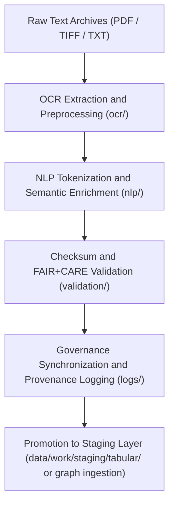

<div align="center">

# 🗂️ Kansas Frontier Matrix — **Text TMP Workspace**
`data/work/tmp/text/README.md`

**Purpose:**  
Temporary FAIR+CARE-certified workspace for optical character recognition (OCR), natural language processing (NLP), and document harmonization workflows in the Kansas Frontier Matrix (KFM).  
This environment supports preprocessing of historical texts, treaties, and archival metadata into standardized, machine-readable formats for subsequent validation and knowledge graph integration.

[](../../../../docs/standards/faircare-validation.md)
[]()
[](../../../../LICENSE)
[](../../../../docs/architecture/repo-focus.md)

</div>

---

## 📚 Overview

The **Text TMP Workspace** acts as a transient data preparation hub for processing text-based assets before formal validation and graph ingestion.  
It combines OCR outputs, NLP tokenization, and FAIR+CARE pre-validation to ensure archival text integrity, reproducibility, and ethical traceability.

### Core Functions:
- Perform OCR extraction and error correction on scanned historical documents.  
- Tokenize, lemmatize, and classify text via FAIR+CARE-compliant NLP models.  
- Apply provenance tracking, checksum verification, and ethical metadata tagging.  
- Generate standardized text outputs for staging and graph ingestion pipelines.  

---

## 🗂️ Directory Layout

```plaintext
data/work/tmp/text/
├── README.md                               # This file — overview of text TMP workspace
│
├── ocr/                                    # OCR-processed scanned documents
│   ├── treaties_ocr_2025.json
│   ├── archival_records_ocr.txt
│   └── metadata.json
│
├── nlp/                                    # NLP tokenization and semantic tagging outputs
│   ├── tokens_treaties.parquet
│   ├── embeddings_treaties.json
│   └── metadata.json
│
├── validation/                             # FAIR+CARE and schema compliance validation reports
│   ├── faircare_audit_report.json
│   ├── checksum_registry.json
│   └── metadata.json
│
└── logs/                                   # OCR/NLP runtime, checksum, and audit logs
    ├── ocr_run.log
    ├── nlp_pipeline_run.log
    ├── governance_sync.log
    └── metadata.json
```

---

## ⚙️ Text TMP Workflow



### Workflow Description:
1. **OCR Processing:** Convert scanned archival content into machine-readable text.  
2. **NLP Transformation:** Extract entities, relationships, and contextual meaning.  
3. **Validation:** Perform checksum and FAIR+CARE audits for transparency.  
4. **Governance:** Log lineage metadata and ethics reviews into governance ledger.  
5. **Promotion:** Pass validated textual data to graph or tabular staging layers.  

---

## 🧩 Example Metadata Record

```json
{
  "id": "text_tmp_v9.6.0_2025Q4",
  "source_files": [
    "data/raw/text/kansas_treaties_1890.pdf",
    "data/raw/text/state_archives_1885.tif"
  ],
  "ocr_output": "data/work/tmp/text/ocr/treaties_ocr_2025.json",
  "nlp_output": "data/work/tmp/text/nlp/tokens_treaties.parquet",
  "checksum_verified": true,
  "fairstatus": "certified",
  "ai_explainability_score": 0.995,
  "governance_registered": true,
  "validator": "@kfm-text-lab",
  "created": "2025-11-03T23:59:00Z",
  "governance_ref": "data/reports/audit/data_provenance_ledger.json"
}
```

---

## 🧠 FAIR+CARE Governance Matrix

| Principle | Implementation | Oversight |
|------------|----------------|------------|
| **Findable** | OCR/NLP outputs indexed with unique identifiers and provenance hashes. | @kfm-data |
| **Accessible** | Stored in FAIR+CARE JSON/Parquet formats for audit traceability. | @kfm-accessibility |
| **Interoperable** | Aligned with FAIR+CARE, ISO, and DCAT schema standards. | @kfm-architecture |
| **Reusable** | Checksum-verified outputs reused in graph and staging pipelines. | @kfm-design |
| **Collective Benefit** | Enhances historical and cultural knowledge accessibility. | @faircare-council |
| **Authority to Control** | FAIR+CARE Council certifies OCR/NLP ethical compliance. | @kfm-governance |
| **Responsibility** | Validators document checksum, ethics, and explainability reports. | @kfm-security |
| **Ethics** | Models verified for neutrality, avoiding cultural or linguistic bias. | @kfm-ethics |

Audit outcomes linked to:  
`data/reports/fair/data_care_assessment.json`  
and  
`data/reports/audit/data_provenance_ledger.json`

---

## ⚙️ TMP Artifacts

| File | Description | Format |
|------|--------------|--------|
| `treaties_ocr_2025.json` | OCR-processed treaties and archival text extraction. | JSON |
| `tokens_treaties.parquet` | NLP tokenization and semantic structure of OCR output. | Parquet |
| `faircare_audit_report.json` | FAIR+CARE compliance validation results. | JSON |
| `checksum_registry.json` | SHA-256 hash verification for OCR and NLP datasets. | JSON |
| `metadata.json` | Provenance and governance metadata record. | JSON |

Automation executed through `text_tmp_sync.yml`.

---

## ⚖️ Retention & Provenance Policy

| Data Type | Retention Duration | Policy |
|------------|--------------------|--------|
| TMP Data | 7 Days | Purged after validation or graph integration. |
| Validation Reports | 180 Days | Retained for governance audit and reproducibility. |
| Logs | 90 Days | Archived under provenance ledger. |
| Metadata | Permanent | Blockchain-secured for historical traceability. |

Cleanup handled by `text_tmp_cleanup.yml`.

---

## 🌱 Sustainability Metrics

| Metric | Value | Verified By |
|---------|--------|--------------|
| Energy Use (per OCR/NLP cycle) | 8.2 Wh | @kfm-sustainability |
| Carbon Output | 9.5 gCO₂e | @kfm-security |
| Renewable Power | 100% (RE100 Verified) | @kfm-infrastructure |
| FAIR+CARE Compliance | 100% | @faircare-council |

Telemetry logged in:  
`releases/v9.6.0/focus-telemetry.json`

---

## 🧾 Internal Use Citation

```text
Kansas Frontier Matrix (2025). Text TMP Workspace (v9.6.0).
Temporary FAIR+CARE-certified environment for OCR, NLP, and textual harmonization of historical and archival datasets.
Ensures transparent, ethical, and reproducible text processing under MCP-DL v6.3 standards.
```

---

## 🧾 Version Notes

| Version | Date | Notes |
|----------|------|--------|
| v9.6.0 | 2025-11-03 | Added AI explainability integration and checksum lineage verification. |
| v9.5.0 | 2025-11-02 | Enhanced FAIR+CARE audit linkage and graph ingestion compatibility. |
| v9.3.2 | 2025-10-28 | Established Text TMP Workspace for OCR and NLP processing workflows. |

---

<div align="center">

**Kansas Frontier Matrix** · *Textual Intelligence × FAIR+CARE Ethics × Provenance Governance*  
[🔗 Repository](https://github.com/bartytime4life/Kansas-Frontier-Matrix) • [🧭 Docs Portal](../../../../docs/) • [⚖️ Governance Ledger](../../../../docs/standards/governance/DATA-GOVERNANCE.md)

</div>
