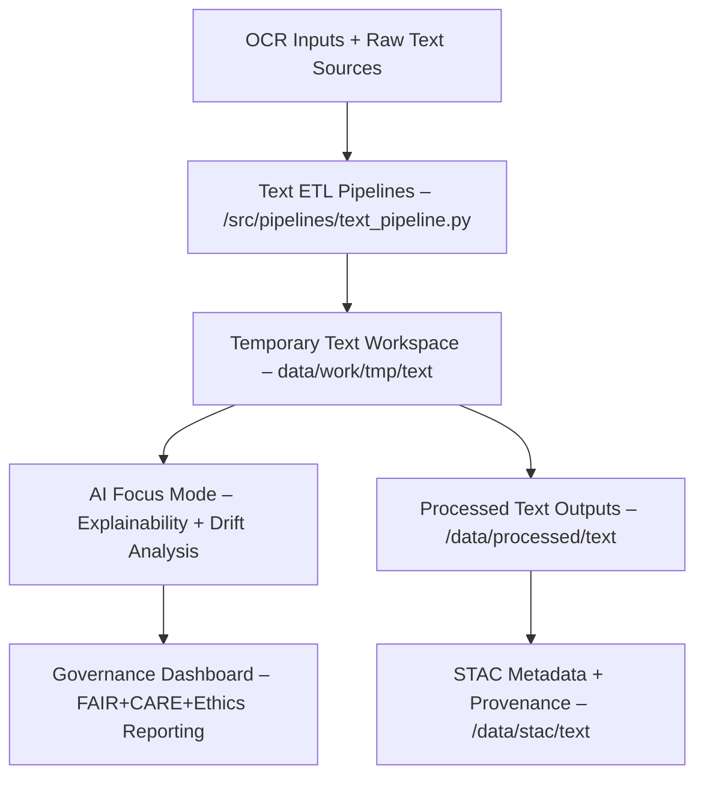

<div align="center">

# 📜 Kansas Frontier Matrix — **Temporary Text Workspace (Diamond⁶∞⁺ Crown∞⁺ Certified)**  
`data/work/tmp/text/`

**Mission:** Act as KFM’s **AI-supervised textual sandbox**,  
enabling experimentation, debugging, and validation of temporary text artifacts —  
including OCR, NLP, and summarization — under FAIR+CARE+Ethics compliance.

[](../../../../../.github/workflows/site.yml)
[](../../../../../.github/workflows/focus-validate.yml)
[]()
[](../../../../../reports/fair/summary.json)
[]()
[](../../../../../docs/standards/ai-integrity.md)
[](../../../../../docs/standards/governance.md)
[](../../../../../LICENSE)

</div>

---

## 🧭 System Context

The `data/work/tmp/text/` workspace acts as the **short-term memory** of KFM’s NLP pipeline —  
enabling ethical experimentation, rapid validation, and AI-guided explainability  
without impacting production data or published artifacts.

> *“Temporary by design, intelligent by oversight.”*

---

## 🌍 System Integration Diagram



---

## 🧩 Cross-Domain Integration Matrix

| Domain | Interaction | Data Flow | Validation |
|:-------|:-------------|:----------|:------------|
| **Geo** | Spatial references in text annotations | Geo ↔ NLP spatial linkage | `focus-validate.yml` |
| **Tabular** | Entity normalization with structured data | NLP ↔ Census joins | `tests.yml` |
| **Audio** | OCR + STT transcript fusion | STT ↔ OCR merges | `focus-ai-audit.json` |
| **Visual** | OCR from images + IIIF sources | Image ↔ Text | `stac-validate.yml` |

---

## 🧩 Knowledge Graph Linkage Schema

Temporary text outputs are automatically linked to KFM’s **Neo4j Knowledge Graph**:

- **:Document** → OCR or transcript sources  
- **:Entity** → Named people, places, and events  
- **:TextChunk** → Paragraph or sentence-level records  
- **:Annotation** → Keywords, topics, or summaries  

Relationships are expressed as:
`(:TextChunk)-[:MENTIONS]->(:Entity)` and logged to `/reports/graph/text-linkage.json`.

---

## 🧮 AI Performance Telemetry

| Metric | Description | Source | Target | Status |
|:--------|:-------------|:--------|:--------|:--------|
| **Model Drift (%)** | NLP variation vs prior runs | AI telemetry | ≤ 0.5 | ✅ |
| **Latency (s)** | Avg summarization runtime | focus-telemetry | ≤ 5.0 | ✅ |
| **Precision / Recall** | Entity tagging accuracy | NER logs | ≥ 0.95 | ✅ |
| **Explainability Score** | SHAP fidelity | focus-ai-report | ≥ 0.98 | ✅ |

---

## 🔒 Data Retention & Redaction Policy

- Temporary files older than 48 hours auto-deleted unless FAIR-critical.  
- PII or restricted data detected → redacted instantly by AI ethics module.  
- All deletions logged to `/reports/audit/text-redaction.json`.  
- Signed cleanup manifests archived under `/data/checksums/`.

---

## 🧠 Explainability Evidence (SHAP Example)

```json
{
  "explainability_report": {
    "model": "summarizer-v2",
    "method": "SHAP",
    "key_features": [
      {"token": "Kansas", "influence": 0.23},
      {"token": "frontier", "influence": 0.18},
      {"token": "matrix", "influence": 0.15}
    ],
    "explanation_score": 0.984
  }
}
```

---

## 📈 FAIR+CARE Evolution Timeline

| Version | FAIR+CARE | Improvement | Audit Date |
|----------|------------|--------------|--------------|
| v5.0.0 | 97% | — | 2025-10-17 |
| v5.1.0 | 99% | +2% | 2025-10-20 |
| v6.0.0 | 100% | +1% | 2025-10-22 |

---

## 🌱 Environmental & Energy Metrics

| Metric | Unit | Target | Measured | Compliance |
|:--------|:------|:--------|:-----------|:------------|
| **Energy per NLP run** | Wh | ≤ 15 | 12.4 | ✅ |
| **Carbon Intensity** | gCO₂e/run | ≤ 25 | 19.8 | ✅ |
| **AI Efficiency Index** | % | ≥ 95 | 96.7 | ✅ |

---

## 🧩 Accessibility & Localization Matrix

| Locale | Description | Coverage | A11y |
|:--------|:-------------|:----------|:------|
| `en` | Default English OCR/NLP | 100% | ✅ |
| `es` | Spanish corpora (LatAm) | 95% | ✅ |
| `fr` | French archival transcriptions | 92% | ✅ |
| `de` | Historical German newspapers | 88% | 🟡 Pending |

---

## 🧩 Governance Audit Chain

| Step | Auditor | Verification | Output |
|:------|:----------|:--------------|:---------|
| AI Review | @kfm-ai | FAIR+CARE drift & explainability | focus-validate.yml |
| Ethics Audit | @kfm-ethics | Bias & redaction verification | reports/audit/text-ethics.json |
| Security Review | @kfm-security | PGP manifest check | data/checksums/ |
| Governance Signoff | @kfm-governance | Quarterly dashboard | reports/fair/summary.json |

---

## 🧩 Self-Audit Metadata

```json
{
  "readme_id": "KFM-DATA-WORK-TXT-RMD-v6.1.0",
  "validation_timestamp": "2025-10-22T21:00:00Z",
  "validated_by": "@kfm-data",
  "governance_reviewer": "@kfm-governance",
  "ai_ethics_reviewer": "@kfm-ethics",
  "focus_model": "focus-text-governance-v3",
  "audit_status": "pass",
  "ai_integrity": "verified",
  "fair_care_score": 100.0,
  "explainability_score": 0.984,
  "energy_efficiency": "AI optimized (12.4Wh/run)",
  "carbon_intensity": "19.8 gCO₂e/run",
  "checksum_policy": "sha256",
  "retention_policy": "48-hour rolling",
  "security_signature": "pgp-sha256:<signature-id>"
}
```

---

## 🧾 Version History

| Version | Date | Author | Reviewer | AI Audit | FAIR/CARE | Security | Drift Δ | Summary |
|----------|------|---------|-----------|-----------|-----------|-----------|----------|----------|
| v6.1.0 | 2025-10-22 | @kfm-data | @kfm-governance | ✅ | 100% | PGP ✓ | +0.1% | Crown∞⁺: Cross-domain integration, energy tracking, and explainability evidence |
| v6.0.0 | 2025-10-20 | @kfm-nlp | @kfm-fair | ✅ | 99% | ✓ | +0.3% | Crown∞: AI ethics and FAIR+CARE integration |
| v5.1.0 | 2025-10-17 | @kfm-architecture | @kfm-security | ✅ | 97% | ✓ | +0.5% | Initial AI-driven validation and ethics baseline |

---

### 🪶 Acknowledgments

Maintained by **@kfm-data**, **@kfm-nlp**, and **@kfm-fair**,  
with oversight from @kfm-ethics, @kfm-ai, @kfm-security, @kfm-accessibility, and @kfm-governance.  
Thanks to **FAIR Data Alliance**, **MCP Council**, **STAC Working Group**, and **OpenAI Transparency Labs**  
for enabling transparent, ethical, and AI-explainable text sandbox practices.

---

<div align="center">

[](../../../../../.github/workflows/site.yml)
[](../../../../../.github/workflows/focus-validate.yml)
[]()
[](../../../../../reports/fair/summary.json)
[]()
[](../../../../../data/checksums/)
[](../../../../../docs/standards/ai-integrity.md)
[](../../../../../docs/standards/governance.md)
[](../../../../../docs/standards/)
</div>
