<div align="center">

# 🗂️ Kansas Frontier Matrix — **Text TMP Workspace**
`data/work/tmp/text/README.md`

**Purpose:**  
FAIR+CARE-certified **temporary text processing workspace** supporting **OCR (Optical Character Recognition)**, **NLP (Natural Language Processing)**, and **semantic enrichment** pipelines for the Kansas Frontier Matrix (KFM).  
Ensures historical, cultural, and archival texts are transformed into reproducible, ethical, and machine-readable formats for knowledge graph integration and governance traceability.

[](../../../../docs/architecture/README.md)  
[](../../../../docs/standards/faircare-validation.md)  
[]()  
[](../../../../LICENSE)

</div>

---

## 📘 Overview

The **Text TMP Workspace (v10.0.0)** is designed to manage transient OCR and NLP operations before validation and staging.  
It guarantees full **checksum lineage**, **ethics certification**, and **telemetry tracking** for transparency across historical, legal, and archival textual assets.

### Core Responsibilities
- Extract and standardize text from OCR scans (PDF, TIFF, image files).  
- Apply **tokenization, lemmatization, and entity recognition** using FAIR+CARE NLP.  
- Conduct **checksum lineage verification** and ethical governance audits.  
- Register metadata, FAIR+CARE outcomes, and sustainability telemetry to the **provenance ledger**.  
- Prepare datasets for **knowledge graph ingestion** and **semantic alignment**.

---

## 🗂️ Directory Layout

```plaintext
data/work/tmp/text/
├── README.md
│
├── ocr/                                    # OCR-processed historical scans
│   ├── treaties_ocr_2025.json
│   ├── archival_records_ocr.txt
│   └── metadata.json
│
├── nlp/                                    # NLP tokenization & semantic enrichment outputs
│   ├── tokens_treaties.parquet
│   ├── embeddings_treaties.json
│   └── metadata.json
│
├── validation/                             # FAIR+CARE and checksum validation reports
│   ├── faircare_audit_report.json
│   ├── checksum_registry.json
│   ├── ai_explainability_audit.json
│   └── metadata.json
│
└── logs/                                   # OCR/NLP runtime, checksum, & governance logs
    ├── ocr_run.log
    ├── nlp_pipeline_run.log
    ├── governance_sync.log
    └── metadata.json
```

---

## ⚙️ Text TMP Workflow

```mermaid
flowchart TD
    A["Raw Text Archives (PDF · TIFF · TXT)"] --> B["OCR Extraction + Cleaning (ocr/)"]
    B --> C["NLP Tokenization + Embedding Generation (nlp/)"]
    C --> D["Checksum & FAIR+CARE Validation (validation/)"]
    D --> E["AI Explainability + Governance Sync (logs/)"]
    E --> F["Promotion → Staging or Graph Layer (data/work/staging/text/graph/)"]
```



### Description
1. **OCR Extraction** — Convert scanned images into machine-readable structured text.  
2. **NLP Enrichment** — Tokenize, embed, and annotate entities and relationships.  
3. **Checksum & FAIR+CARE Validation** — Verify integrity and ethical transparency.  
4. **Explainability & Governance** — Log AI audit results and synchronize with ledger.  
5. **Promotion** — Advance validated text assets to graph ingestion or staging layers.

---

## 🧩 Example Metadata Record

```json
{
  "id": "text_tmp_v10.0.0_2025Q4",
  "source_files": [
    "data/raw/text/kansas_treaties_1890.pdf",
    "data/raw/text/state_archives_1885.tif"
  ],
  "ocr_output": "data/work/tmp/text/ocr/treaties_ocr_2025.json",
  "nlp_output": "data/work/tmp/text/nlp/tokens_treaties.parquet",
  "checksum_verified": true,
  "faircare_status": "certified",
  "ai_explainability_score": 0.997,
  "telemetry": { "energy_wh": 8.9, "carbon_gco2e": 9.4 },
  "governance_registered": true,
  "validator": "@kfm-text-lab",
  "created": "2025-11-10T00:00:00Z",
  "governance_ref": "data/reports/audit/data_provenance_ledger.json"
}
```

---

## 🧠 FAIR+CARE Governance Matrix

| Principle | Implementation | Oversight |
|---|---|---|
| **Findable** | Indexed OCR/NLP outputs via UUID + checksum lineage | @kfm-data |
| **Accessible** | Open formats (JSON, TXT, Parquet) under CC-BY 4.0 | @kfm-accessibility |
| **Interoperable** | Conforms to FAIR+CARE, ISO 19115, and DCAT schemas | @kfm-architecture |
| **Reusable** | Provenance and checksum lineage ensure reproducibility | @kfm-design |
| **Collective Benefit** | Increases accessibility to cultural and historical texts | @faircare-council |
| **Authority to Control** | Council approves use of NLP models for sensitive data | @kfm-governance |
| **Responsibility** | Validators record checksum, explainability, and ethics logs | @kfm-security |
| **Ethics** | NLP audited for neutrality, inclusivity, and contextual fairness | @kfm-ethics |

**Governance & Audit References:**  
`data/reports/fair/data_care_assessment.json` · `data/reports/audit/data_provenance_ledger.json`

---

## ⚙️ TMP Artifacts

| File | Description | Format |
|---|---|---|
| `ocr/treaties_ocr_2025.json` | OCR-processed archival treaty text | JSON |
| `nlp/tokens_treaties.parquet` | NLP tokenization & semantic tagging results | Parquet |
| `validation/faircare_audit_report.json` | FAIR+CARE audit outcomes | JSON |
| `validation/checksum_registry.json` | Hash verification registry for TMP text assets | JSON |
| `metadata.json` | Provenance, validator signatures, telemetry, governance refs | JSON |

**Automation:** `text_tmp_sync.yml`

---

## ⚖️ Retention & Provenance Policy

| Data Type | Retention | Policy |
|---|---:|---|
| TMP Data | 7 Days | Purged post-validation or ingestion |  
| Validation Reports | 180 Days | Retained for reproducibility & ethics re-audit |  
| Governance Logs | 365 Days | Archived under provenance chain |  
| Metadata | Permanent | Immutable under blockchain governance ledger |

Cleanup handled via `text_tmp_cleanup.yml`.

---

## 🌱 Sustainability & Telemetry Metrics

| Metric | Value | Verified By |
|---|---:|---|
| Energy Use (per OCR/NLP cycle) | 8.9 Wh | @kfm-sustainability |
| Carbon Output | 9.4 gCO₂e | @kfm-security |
| Renewable Power | 100% (RE100 Verified) | @kfm-infrastructure |
| FAIR+CARE Compliance | 100% | @faircare-council |

**Telemetry Reference:**  
`../../../../releases/v10.0.0/focus-telemetry.json`

---

## 🧾 Citation

```text
Kansas Frontier Matrix (2025). Text TMP Workspace (v10.0.0).
FAIR+CARE-certified OCR and NLP workspace for ethical, transparent, and reproducible text transformation and provenance auditing under MCP-DL v6.3.
```

---

## 🕰️ Version History

| Version | Date | Summary |
|---|---|---|
| v10.0.0 | 2025-11-10 | Upgraded telemetry schema; integrated advanced XAI & FAIR+CARE pre-validation; improved checksum lineage tracking. |
| v9.6.0 | 2025-11-03 | Added AI explainability integration and checksum lineage verification. |
| v9.5.0 | 2025-11-02 | Enhanced FAIR+CARE linkage and graph ingestion compatibility. |

---

<div align="center">

**Kansas Frontier Matrix**  
*Textual Intelligence × FAIR+CARE Ethics × Provenance Governance*  
© 2025 Kansas Frontier Matrix — CC-BY 4.0 · Master Coder Protocol v6.3 · **Diamond⁹ Ω / Crown∞Ω** Ultimate Certified  

[Back to TMP Layer](../README.md) · [Docs Portal](../../../../docs/) · [Governance Charter](../../../../docs/standards/governance/DATA-GOVERNANCE.md)

</div>
