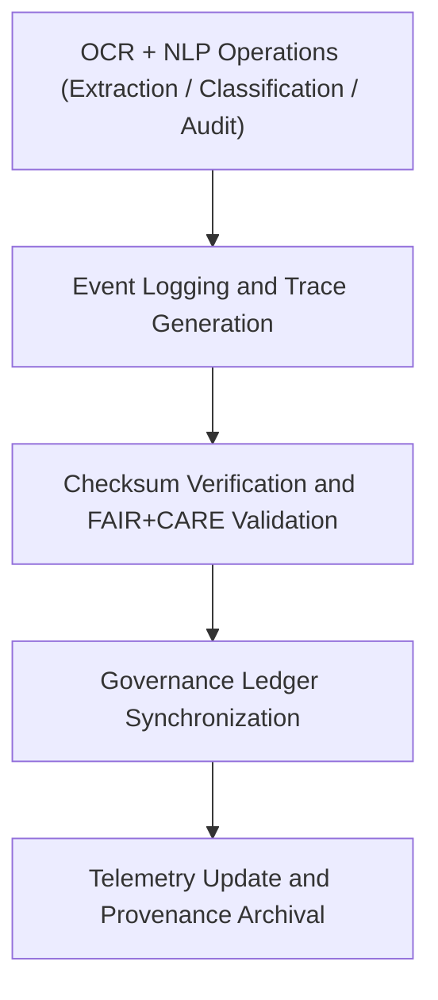

<div align="center">

# 🧾 Kansas Frontier Matrix — **Text TMP Logs**
`data/work/tmp/text/logs/README.md`

**Purpose:**  
Central FAIR+CARE-certified log workspace for **OCR, NLP, and governance operations** within the Text TMP layer of the Kansas Frontier Matrix (KFM).  
Ensures every OCR extraction, NLP enrichment, and validation process is auditable, checksum-tracked, and ethically compliant under MCP-DL v6.3 governance.

[](../../../../../docs/standards/faircare-validation.md)
[](../../../../../LICENSE)
[](../../../../../docs/architecture/repo-focus.md)

</div>

---

## 📚 Overview

The `data/work/tmp/text/logs/` directory captures **activity logs, ethics audits, and governance synchronization traces** generated during text ingestion, OCR, NLP, and FAIR+CARE validation workflows.  
All entries are reproducible, verifiable, and linked to checksum and provenance ledgers.

### Core Responsibilities
- Record OCR and NLP workflow executions.  
- Log FAIR+CARE ethics and provenance validation events.  
- Synchronize ledger updates with governance registries.  
- Maintain provenance metadata for reproducibility and transparency.  

---

## 🗂️ Directory Layout

```plaintext
data/work/tmp/text/logs/
├── README.md                              # This file — documentation for Text TMP Logs
│
├── ocr_process_run.log                    # OCR extraction runtime trace
├── nlp_pipeline_trace.log                 # NLP enrichment process execution log
├── governance_sync.log                    # Governance and ledger synchronization record
├── faircare_audit_trace.log               # FAIR+CARE ethics and validation tracking
└── metadata.json                          # Provenance and checksum linkage metadata
```

---

## ⚙️ Logging Workflow



### Workflow Description
1. **Process Logging:** Record OCR and NLP pipeline executions with timestamps.  
2. **Checksum Verification:** Confirm data integrity for text and model outputs.  
3. **FAIR+CARE Validation:** Capture ethics and accessibility compliance status.  
4. **Governance Synchronization:** Register log references in provenance ledgers.  
5. **Telemetry Integration:** Push governance updates to Focus Mode dashboards.  

---

## 🧩 Example Log Metadata Record

```json
{
  "id": "text_tmp_logs_v9.5.0_2025Q4",
  "log_categories": ["ocr", "nlp", "governance", "ethics"],
  "entries_recorded": 14253,
  "checksum_verified": true,
  "governance_synced": true,
  "fairstatus": "compliant",
  "telemetry_ref": "releases/v9.5.0/focus-telemetry.json",
  "governance_ref": "reports/audit/ai_text_ledger.json",
  "created": "2025-11-02T23:59:00Z",
  "validator": "@kfm-text-etl"
}
```

---

## 🧠 FAIR+CARE Governance Matrix

| Principle | Implementation |
|------------|----------------|
| **Findable** | Logs indexed by OCR/NLP process IDs and checksum references. |
| **Accessible** | Stored in open text and JSON formats under FAIR+CARE access policies. |
| **Interoperable** | Aligned with DCAT 3.0, ISO 19115 lineage, and NLP schema conventions. |
| **Reusable** | Logs include checksum lineage, metadata linkage, and provenance context. |
| **Collective Benefit** | Promotes accountability in text processing and AI model governance. |
| **Authority to Control** | FAIR+CARE Council certifies governance and ethics audit compliance. |
| **Responsibility** | Validators document all OCR/NLP actions and checksum verifications. |
| **Ethics** | Logs reviewed to ensure ethical representation and privacy preservation. |

Governance and audit outputs stored in:  
`reports/audit/ai_text_ledger.json` • `reports/fair/text_logs_summary.json`

---

## ⚙️ QA & Validation Artifacts

| File | Description | Format |
|------|--------------|--------|
| `ocr_process_run.log` | OCR engine runtime execution and extraction details. | Text |
| `nlp_pipeline_trace.log` | NLP enrichment log for entity, topic, and sentiment analysis. | Text |
| `governance_sync.log` | Records synchronization with KFM governance ledger. | Text |
| `faircare_audit_trace.log` | FAIR+CARE ethics validation and provenance tracking. | Text |
| `metadata.json` | Provenance metadata and checksum verification record. | JSON |

Automation managed via `text_logs_sync.yml`.

---

## 🧾 Retention Policy

| Log Type | Retention Duration | Policy |
|-----------|--------------------|--------|
| OCR and NLP Logs | 90 days | Archived after staging promotion. |
| Governance Logs | Permanent | Stored in provenance registry. |
| FAIR+CARE Logs | 365 days | Retained for ethics and reproducibility review. |
| Metadata | Permanent | Maintained for lineage verification. |

Cleanup handled via `text_logs_cleanup.yml`.

---

## 🧾 Internal Use Citation

```text
Kansas Frontier Matrix (2025). Text TMP Logs (v9.5.0).
Central FAIR+CARE-certified logging workspace for OCR, NLP, and governance synchronization activities.
Ensures transparency, accountability, and reproducibility under MCP-DL v6.3 compliance.
```

---

## 🧾 Version Notes

| Version | Date | Notes |
|----------|------|--------|
| v9.5.0 | 2025-11-02 | Added FAIR+CARE ethics trace logging and Focus Telemetry integration. |
| v9.3.2 | 2025-10-28 | Expanded OCR/NLP provenance tracking and checksum validation. |
| v9.3.0 | 2025-10-26 | Established Text TMP Logs workspace for governance-compliant traceability. |

---

<div align="center">

**Kansas Frontier Matrix** · *Text Governance × FAIR+CARE Ethics × Provenance Assurance*  
[🔗 Repository](https://github.com/bartytime4life/Kansas-Frontier-Matrix) • [🧭 Docs Portal](../../../../../docs/) • [⚖️ Governance Ledger](../../../../../docs/standards/governance/)

</div>