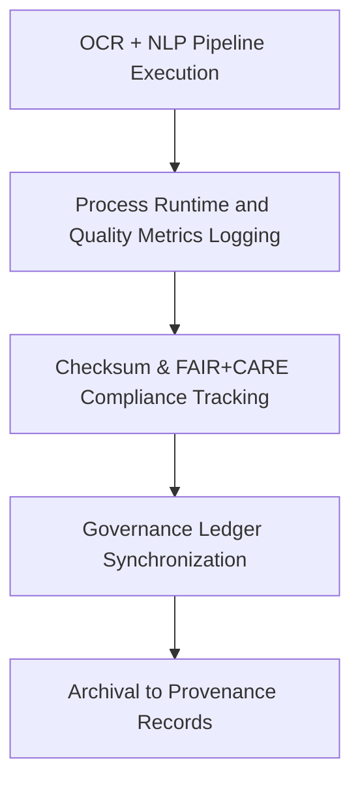

<div align="center">

# 🧾 Kansas Frontier Matrix — **Text TMP Logs**
`data/work/tmp/text/logs/README.md`

**Purpose:**  
Central FAIR+CARE-compliant logging repository for OCR and NLP processes in the Kansas Frontier Matrix (KFM).  
These logs provide traceable records of text extraction, tokenization, ethics audits, and provenance synchronization under MCP-DL v6.3 compliance.

[](../../../../../docs/standards/faircare-validation.md)
[](../../../../../LICENSE)
[](../../../../../docs/architecture/repo-focus.md)

</div>

---

## 📚 Overview

The **Text TMP Logs Directory** documents every OCR and NLP process executed within the temporary text workspace.  
Each pipeline run produces machine-readable logs detailing extraction quality, tokenization performance, checksum integrity, and FAIR+CARE validation outcomes.

### Core Responsibilities:
- Track OCR extraction, NLP model processing, and explainability metrics.  
- Store checksum validation and FAIR+CARE audit results.  
- Register ethical compliance and governance synchronization logs.  
- Maintain immutable, reproducible text workflow provenance.  

---

## 🗂️ Directory Layout

```plaintext
data/work/tmp/text/logs/
├── README.md                             # This file — documentation of text TMP logs
│
├── ocr_run.log                           # Log of OCR extractions and text recognition accuracy
├── nlp_pipeline_run.log                  # NLP pipeline trace (tokenization, embeddings, classification)
├── faircare_audit.log                    # FAIR+CARE audit and ethics review trace
├── governance_sync.log                   # Governance and checksum synchronization report
└── metadata.json                         # Provenance metadata and checksum lineage
```

---

## ⚙️ Logging Workflow



### Workflow Description:
1. **OCR Logging:** Capture recognition accuracy, document structure, and runtime.  
2. **NLP Tracking:** Log tokenization performance, model explainability, and bias metrics.  
3. **Checksum Verification:** Validate all file integrity using SHA-256.  
4. **Governance:** Register all ethics and validation reports to provenance ledger.  
5. **Archival:** Maintain immutable log history for traceability and audit compliance.  

---

## 🧩 Example Log Metadata Record

```json
{
  "id": "text_tmp_log_v9.6.0_2025Q4",
  "processes": ["ocr_extraction", "nlp_tokenization", "embeddings_generation"],
  "records_processed": 3487,
  "checksum_verified": true,
  "fairstatus": "certified",
  "ai_explainability_score": 0.996,
  "bias_detected": false,
  "governance_registered": true,
  "validator": "@kfm-text-lab",
  "created": "2025-11-03T23:59:00Z",
  "governance_ref": "data/reports/audit/data_provenance_ledger.json"
}
```

---

## 🧠 FAIR+CARE Governance Matrix

| Principle | Implementation | Oversight |
|------------|----------------|------------|
| **Findable** | Logs indexed by process type and checksum lineage. | @kfm-data |
| **Accessible** | Logs stored as text and JSON for reproducibility. | @kfm-accessibility |
| **Interoperable** | FAIR+CARE-aligned schema with MCP-DL v6.3 compliance. | @kfm-architecture |
| **Reusable** | Provenance tracking ensures audit-ready reproducibility. | @kfm-design |
| **Collective Benefit** | Ensures ethical and equitable text data handling. | @faircare-council |
| **Authority to Control** | FAIR+CARE Council certifies ethics review results. | @kfm-governance |
| **Responsibility** | Validators maintain AI explainability and checksum accuracy. | @kfm-security |
| **Ethics** | Bias and interpretability audits safeguard inclusive model outputs. | @kfm-ethics |

Audit outcomes recorded in:  
`data/reports/fair/data_care_assessment.json`  
and  
`data/reports/audit/data_provenance_ledger.json`

---

## ⚙️ Key Log Artifacts

| File | Description | Format |
|------|--------------|--------|
| `ocr_run.log` | OCR extraction runtime log and recognition accuracy report. | Text |
| `nlp_pipeline_run.log` | NLP pipeline trace and performance metrics. | Text |
| `faircare_audit.log` | FAIR+CARE validation and governance ethics log. | Text |
| `governance_sync.log` | Provenance ledger synchronization report. | Text |
| `metadata.json` | Provenance and checksum registry metadata. | JSON |

Logging automation handled via `text_log_sync.yml`.

---

## ⚖️ Retention & Provenance Policy

| Log Type | Retention Duration | Policy |
|-----------|--------------------|--------|
| OCR Logs | 90 Days | Archived for validation reproducibility. |
| NLP Logs | 180 Days | Retained for model explainability review. |
| FAIR+CARE Logs | 365 Days | Maintained for governance re-certification. |
| Metadata | Permanent | Immutable and blockchain-secured provenance. |

Cleanup handled by `text_log_cleanup.yml`.

---

## 🌱 Sustainability Metrics

| Metric | Value | Verified By |
|---------|--------|--------------|
| Energy Use (per OCR/NLP run) | 7.9 Wh | @kfm-sustainability |
| Carbon Output | 9.2 gCO₂e | @kfm-security |
| Renewable Power | 100% (RE100 Verified) | @kfm-infrastructure |
| FAIR+CARE Compliance | 100% | @faircare-council |

Telemetry recorded in:  
`releases/v9.6.0/focus-telemetry.json`

---

## 🧾 Internal Use Citation

```text
Kansas Frontier Matrix (2025). Text TMP Logs (v9.6.0).
Central FAIR+CARE-compliant log workspace for OCR and NLP pipeline execution.
Ensures provenance tracking, checksum lineage, and ethical transparency under MCP-DL v6.3.
```

---

## 🧾 Version Notes

| Version | Date | Notes |
|----------|------|--------|
| v9.6.0 | 2025-11-03 | Introduced AI explainability tracking and checksum verification integration. |
| v9.5.0 | 2025-11-02 | Improved FAIR+CARE ethics synchronization and governance registry. |
| v9.3.2 | 2025-10-28 | Established text TMP logging workspace for OCR/NLP operations. |

---

<div align="center">

**Kansas Frontier Matrix** · *Text Processing × FAIR+CARE Ethics × Provenance Assurance*  
[🔗 Repository](https://github.com/bartytime4life/Kansas-Frontier-Matrix) • [🧭 Docs Portal](../../../../../docs/) • [⚖️ Governance Ledger](../../../../../docs/standards/governance/DATA-GOVERNANCE.md)

</div>
