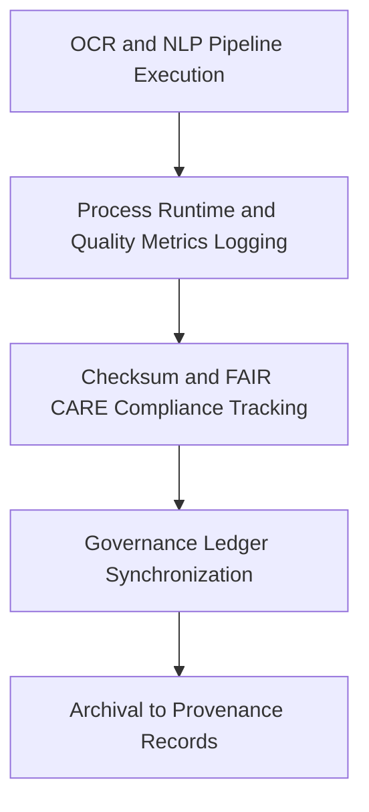

<div align="center">

# 🧾 Kansas Frontier Matrix — **Text TMP Logs**
`data/work/tmp/text/logs/README.md`

**Purpose:**  
FAIR+CARE-certified centralized logging repository for **OCR** and **NLP** pipelines in the Kansas Frontier Matrix (KFM).  
Captures traceable records of text extraction, tokenization, explainability, checksum lineage, and governance synchronization — aligned with **MCP-DL v6.3** and **ISO 19115**.

[](../../../../../docs/architecture/README.md)
[](../../../../../docs/standards/faircare-validation.md)
[]()
[](../../../../../LICENSE)

</div>

---

## 📘 Overview

The **Text TMP Logs Directory** documents every OCR and NLP process executed within the temporary text workspace.  
Each run emits machine-readable logs covering recognition quality, tokenization performance, **SHA-256** integrity, **FAIR+CARE** outcomes, and governance synchronization. Telemetry (energy/carbon) is captured for sustainability auditing.

---

## 🗂️ Directory Layout

```plaintext
data/work/tmp/text/logs/
├── README.md                           # This file — Text TMP logging overview
│
├── ocr_run.log                         # OCR extractions, accuracy, runtime
├── nlp_pipeline_run.log                # Tokenization/embedding/classification trace
├── faircare_audit.log                  # FAIR+CARE ethics/accessibility audit trace
├── governance_sync.log                 # Provenance and checksum ledger sync
└── metadata.json                       # Log session provenance, checksums, telemetry refs
```

---

## ⚙️ Logging Workflow



### Workflow Description
1. **OCR Logging** — Record recognition accuracy, page structure, runtimes.  
2. **NLP Tracking** — Log tokenization throughput, model outputs, and explainability results.  
3. **Checksum Verification** — Validate integrity for all intermediate and final artifacts.  
4. **Governance Sync** — Register ethics and validation reports to the provenance ledger.  
5. **Archival** — Maintain immutable history for reproducibility and audit.

---

## 🧩 Example Log Metadata Record

```json
{
  "id": "text_tmp_log_v10.0.0_2025Q4",
  "processes": ["ocr_extraction", "nlp_tokenization", "embeddings_generation"],
  "records_processed": 3487,
  "checksum_verified": true,
  "faircare_status": "certified",
  "ai_explainability_score": 0.996,
  "bias_detected": false,
  "telemetry": { "energy_wh": 7.9, "carbon_gco2e": 9.2 },
  "governance_registered": true,
  "validator": "@kfm-text-lab",
  "created": "2025-11-10T00:00:00Z",
  "governance_ref": "data/reports/audit/data_provenance_ledger.json"
}
```

---

## 🧠 FAIR+CARE Governance Matrix

| Principle | Implementation | Oversight |
|---|---|---|
| **Findable** | Logs indexed by process type, checksum lineage, and cycle | @kfm-data |
| **Accessible** | Open text/JSON artifacts available for Council review | @kfm-accessibility |
| **Interoperable** | Logging schemas align with FAIR+CARE and MCP-DL | @kfm-architecture |
| **Reusable** | Provenance tracking supports audit-ready reproducibility | @kfm-design |
| **Collective Benefit** | Ensures ethical handling of cultural and historical texts | @faircare-council |
| **Authority to Control** | Council certifies ethics and governance synchronization | @kfm-governance |
| **Responsibility** | Validators maintain explainability and checksum accuracy | @kfm-security |
| **Ethics** | Bias and interpretability audits safeguard inclusive outputs | @kfm-ethics |

**Audit records:**  
`data/reports/fair/data_care_assessment.json` · `data/reports/audit/data_provenance_ledger.json`

---

## ⚙️ Key Log Artifacts

| File | Description | Format |
|---|---|---|
| `ocr_run.log` | OCR runtime and recognition accuracy summary | Text |
| `nlp_pipeline_run.log` | NLP pipeline performance and outputs | Text |
| `faircare_audit.log` | FAIR+CARE validation and ethics trace | Text |
| `governance_sync.log` | Provenance ledger synchronization report | Text |
| `metadata.json` | Checksums, signatures, telemetry, and lineage refs | JSON |

**Automation:** `text_log_sync.yml`

---

## ⚖️ Retention & Provenance Policy

| Log Type | Retention Duration | Policy |
|---|---:|---|
| OCR Logs | 90 Days | Archived for validation reproducibility |
| NLP Logs | 180 Days | Retained for explainability review |
| FAIR+CARE Logs | 365 Days | Maintained for governance re-certification |
| Metadata | Permanent | Immutable and blockchain-secured provenance |

Cleanup handled by `text_log_cleanup.yml`.

---

## 🌱 Sustainability & Telemetry

| Metric | Value | Verified By |
|---|---:|---|
| Energy Use (per OCR/NLP run) | 7.9 Wh | @kfm-sustainability |
| Carbon Output | 9.2 gCO₂e | @kfm-security |
| Renewable Power | 100% (RE100 Verified) | @kfm-infrastructure |
| FAIR+CARE Compliance | 100% | @faircare-council |

**Telemetry:** `../../../../../releases/v10.0.0/focus-telemetry.json`

---

## 🧾 Internal Use Citation

```text
Kansas Frontier Matrix (2025). Text TMP Logs (v10.0.0).
FAIR+CARE-compliant log workspace for OCR and NLP pipelines, ensuring provenance tracking, checksum lineage, and ethical transparency under MCP-DL v6.3.
```

---

## 🕰️ Version History

| Version | Date | Summary |
|---|---|---|
| v10.0.0 | 2025-11-10 | Upgraded to v10: telemetry schema v10, governance links refreshed, sustainability fields added. |
| v9.6.0 | 2025-11-03 | Introduced AI explainability tracking and checksum verification integration. |
| v9.5.0 | 2025-11-02 | Improved FAIR+CARE ethics synchronization and governance registry. |

---

<div align="center">

**Kansas Frontier Matrix**  
*Text Processing × FAIR+CARE Ethics × Provenance Assurance*  
© 2025 Kansas Frontier Matrix — Internal Governance Data · Master Coder Protocol v6.3 · **Diamond⁹ Ω / Crown∞Ω** Ultimate Certified  

[Back to Text TMP](../README.md) · [Docs Portal](../../../../../docs/) · [Governance Charter](../../../../../docs/standards/governance/DATA-GOVERNANCE.md)

</div>
