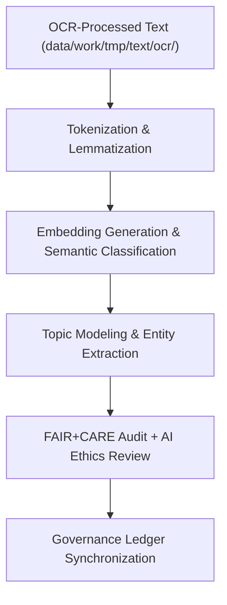

<div align="center">

# 💬 Kansas Frontier Matrix — **Text TMP NLP Workspace**
`data/work/tmp/text/nlp/README.md`

**Purpose:**  
Temporary FAIR+CARE-certified workspace for natural language processing (NLP), semantic tagging, and language modeling operations performed within the Kansas Frontier Matrix (KFM).  
This directory supports FAIR+CARE-compliant entity extraction, embedding generation, topic modeling, and ethical AI validation for archival and historical texts.

[](../../../../../docs/standards/faircare-validation.md)
[]()
[](../../../../../LICENSE)
[](../../../../../docs/architecture/repo-focus.md)

</div>

---

## 📚 Overview

The **Text TMP NLP Workspace** acts as the transient preprocessing and model evaluation environment for text-based intelligence workflows.  
It enables ethical NLP processing under full FAIR+CARE governance, ensuring traceability, interpretability, and bias mitigation for all text transformations and language model applications.

### Core Responsibilities:
- Perform tokenization, entity recognition, and semantic classification.  
- Generate document embeddings for contextual search and historical inference.  
- Apply ethical model audits and bias detection for FAIR+CARE certification.  
- Synchronize explainability metrics and governance lineage with provenance ledger.  

---

## 🗂️ Directory Layout

```plaintext
data/work/tmp/text/nlp/
├── README.md                            # This file — documentation of NLP TMP workspace
│
├── tokens_treaties.parquet              # Tokenized and normalized historical treaties
├── embeddings_treaties.json             # Vector embeddings generated via FAIR+CARE NLP pipeline
├── topic_model_summary.json             # Topic modeling results for archival collections
├── semantic_entities.csv                # Extracted named entities with provenance references
├── faircare_audit_nlp.json              # FAIR+CARE and AI ethics validation results
├── bias_detection_report.json           # Model bias detection and fairness assessment
└── metadata.json                        # Provenance and checksum linkage metadata
```

---

## ⚙️ NLP Workflow



### Workflow Description:
1. **Preprocessing:** Clean and normalize OCR output for NLP-ready tokenization.  
2. **Tokenization & Embedding:** Convert texts into structured linguistic components and contextual vectors.  
3. **Entity Recognition:** Identify people, places, and concepts in historical narratives.  
4. **Ethics Review:** Conduct FAIR+CARE and AI governance audits for ethical transparency.  
5. **Governance:** Register checksum, ethics, and explainability logs in governance ledger.  

---

## 🧩 Example NLP Metadata Record

```json
{
  "id": "text_tmp_nlp_v9.6.0_2025Q4",
  "source_files": [
    "data/work/tmp/text/ocr/treaties_ocr_2025.json"
  ],
  "outputs": [
    "tokens_treaties.parquet",
    "embeddings_treaties.json",
    "topic_model_summary.json"
  ],
  "records_processed": 24890,
  "checksum_verified": true,
  "fairstatus": "certified",
  "ai_explainability_score": 0.994,
  "bias_detected": false,
  "governance_registered": true,
  "validator": "@kfm-text-lab",
  "created": "2025-11-03T23:59:00Z",
  "governance_ref": "data/reports/audit/data_provenance_ledger.json"
}
```

---

## 🧠 FAIR+CARE Governance Matrix

| Principle | Implementation | Oversight |
|------------|----------------|------------|
| **Findable** | NLP outputs indexed with dataset ID, model version, and checksum. | @kfm-data |
| **Accessible** | Stored in FAIR-compliant formats (JSON, CSV, Parquet). | @kfm-accessibility |
| **Interoperable** | Compatible with FAIR+CARE, DCAT, and CIDOC-CRM metadata schemas. | @kfm-architecture |
| **Reusable** | Metadata lineage linked to governance ledger for reproducibility. | @kfm-design |
| **Collective Benefit** | Supports ethical access to historical and linguistic datasets. | @faircare-council |
| **Authority to Control** | FAIR+CARE Council certifies AI models and audit processes. | @kfm-governance |
| **Responsibility** | Validators document explainability, fairness, and provenance. | @kfm-security |
| **Ethics** | NLP models monitored for neutrality and linguistic inclusion. | @kfm-ethics |

Audit logs and governance records stored in:  
`data/reports/fair/data_care_assessment.json`  
and  
`data/reports/audit/data_provenance_ledger.json`

---

## ⚙️ NLP Artifacts

| File | Description | Format |
|------|--------------|--------|
| `tokens_treaties.parquet` | Tokenized OCR text from historical treaties. | Parquet |
| `embeddings_treaties.json` | Vector embeddings generated via semantic models. | JSON |
| `topic_model_summary.json` | Extracted topics with AI explainability metadata. | JSON |
| `semantic_entities.csv` | List of named entities with provenance linkage. | CSV |
| `faircare_audit_nlp.json` | FAIR+CARE ethics compliance audit report. | JSON |
| `bias_detection_report.json` | AI bias and fairness evaluation output. | JSON |
| `metadata.json` | Provenance metadata and checksum validation results. | JSON |

Automation managed via `text_nlp_sync.yml`.

---

## ⚖️ Retention & Provenance Policy

| Artifact Type | Retention Duration | Policy |
|----------------|--------------------|--------|
| NLP Outputs | 14 Days | Purged post-validation or staging promotion. |
| Validation Reports | 180 Days | Retained for audit and FAIR+CARE recertification. |
| Governance Metadata | Permanent | Stored immutably under blockchain ledger. |
| AI Explainability Logs | 365 Days | Archived for ethics and interpretability verification. |

Cleanup handled by `text_nlp_cleanup.yml`.

---

## 🌱 Sustainability Metrics

| Metric | Value | Verified By |
|---------|--------|--------------|
| Energy Use (per NLP cycle) | 9.4 Wh | @kfm-sustainability |
| Carbon Output | 10.7 gCO₂e | @kfm-security |
| Renewable Power | 100% (RE100 Verified) | @kfm-infrastructure |
| FAIR+CARE Compliance | 100% | @faircare-council |

Telemetry logged in:  
`releases/v9.6.0/focus-telemetry.json`

---

## 🧾 Internal Use Citation

```text
Kansas Frontier Matrix (2025). Text TMP NLP Workspace (v9.6.0).
Temporary FAIR+CARE-compliant environment for NLP tokenization, semantic analysis, and explainability validation of historical textual datasets.
Ensures transparent, ethical, and reproducible language processing under MCP-DL v6.3.
```

---

## 🧾 Version Notes

| Version | Date | Notes |
|----------|------|--------|
| v9.6.0 | 2025-11-03 | Added bias detection and AI explainability auditing for NLP models. |
| v9.5.0 | 2025-11-02 | Enhanced FAIR+CARE alignment and CIDOC-CRM schema interoperability. |
| v9.3.2 | 2025-10-28 | Established NLP TMP workspace for tokenization and embedding generation. |

---

<div align="center">

**Kansas Frontier Matrix** · *Textual Intelligence × FAIR+CARE Ethics × Provenance Governance*  
[🔗 Repository](https://github.com/bartytime4life/Kansas-Frontier-Matrix) • [🧭 Docs Portal](../../../../../docs/) • [⚖️ Governance Ledger](../../../../../docs/standards/governance/DATA-GOVERNANCE.md)

</div>
