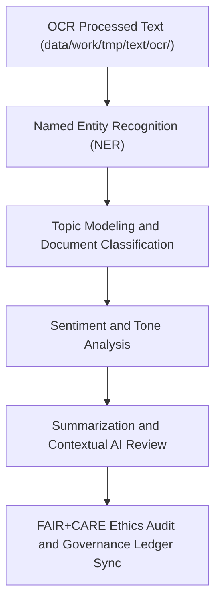

<div align="center">

# 🧠 Kansas Frontier Matrix — **Text TMP NLP Workspace**
`data/work/tmp/text/nlp/README.md`

**Purpose:**  
Governed FAIR+CARE-certified workspace for **Natural Language Processing (NLP), entity extraction, topic modeling, and sentiment analysis** in the Kansas Frontier Matrix (KFM).  
This TMP layer supports ethical, explainable, and reproducible text analytics across historical, archival, and environmental datasets.

[](../../../../../docs/standards/faircare-validation.md)
[](../../../../../LICENSE)
[](../../../../../docs/architecture/repo-focus.md)

</div>

---

## 📚 Overview

The `data/work/tmp/text/nlp/` directory serves as the **temporary FAIR+CARE-governed environment for text enrichment and NLP processing**.  
It manages machine learning outputs such as entity recognition, topic classification, summarization, and semantic tagging under strict governance and transparency protocols.

### Core Responsibilities
- Apply entity extraction (NER) and metadata tagging to textual content.  
- Perform topic modeling and classification on historical and archival records.  
- Conduct sentiment, tone, and contextual analysis for interpretive insight.  
- Ensure AI explainability and ethical NLP processing with FAIR+CARE validation.  

---

## 🗂️ Directory Layout

```plaintext
data/work/tmp/text/nlp/
├── README.md                              # This file — documentation for Text TMP NLP Workspace
│
├── entities_extracted.json                # Named entities recognized from text sources
├── topic_classification.json              # NLP topic modeling and clustering output
├── sentiment_analysis.json                # Sentiment and tone analysis results
├── summarization_output.json              # AI-generated document summaries
├── faircare_nlp_audit.json                # FAIR+CARE ethics and explainability audit report
└── metadata.json                          # Provenance and governance registration metadata
```

---

## ⚙️ NLP Workflow



### Workflow Description
1. **NER Extraction:** Identify entities such as people, places, and organizations.  
2. **Topic Modeling:** Cluster text content into semantically coherent topics.  
3. **Sentiment Analysis:** Evaluate tone and contextual polarity for interpretive insights.  
4. **Summarization:** Use explainable AI models to create short-form summaries.  
5. **Ethics Validation:** Conduct FAIR+CARE audits and register provenance results.  

---

## 🧩 Example NLP Metadata Record

```json
{
  "id": "text_tmp_nlp_v9.5.0_2025Q4",
  "datasets_processed": [
    "treaty_ocr_output_2025.txt",
    "survey_transcripts_1902.json"
  ],
  "nlp_tasks_executed": ["NER", "Topic Modeling", "Sentiment Analysis", "Summarization"],
  "records_analyzed": 12843,
  "checksum_verified": true,
  "fairstatus": "certified",
  "ai_explainability_score": 0.988,
  "governance_registered": true,
  "telemetry_ref": "releases/v9.5.0/focus-telemetry.json",
  "governance_ref": "reports/audit/ai_text_ledger.json",
  "created": "2025-11-02T23:59:00Z",
  "validator": "@kfm-text-nlp"
}
```

---

## 🧠 FAIR+CARE Governance Matrix

| Principle | Implementation |
|------------|----------------|
| **Findable** | NLP results indexed with provenance and checksum metadata. |
| **Accessible** | Open JSON outputs following FAIR+CARE and schema.org standards. |
| **Interoperable** | Compatible with DCAT 3.0, STAC 1.0, and ISO 19115 metadata schemas. |
| **Reusable** | Metadata includes audit logs, schema versions, and FAIR+CARE results. |
| **Collective Benefit** | Enhances transparent interpretation of archival texts for research and education. |
| **Authority to Control** | FAIR+CARE Council reviews AI-generated summaries and NLP classifications. |
| **Responsibility** | Validators ensure all NLP models are explainable and ethically aligned. |
| **Ethics** | NLP outputs reviewed for sensitive or biased language. |

Audit records stored in:  
`reports/audit/ai_text_ledger.json` • `reports/fair/text_nlp_summary.json`

---

## ⚙️ QA & Validation Artifacts

| File | Description | Format |
|------|--------------|--------|
| `entities_extracted.json` | List of entities extracted with context metadata. | JSON |
| `topic_classification.json` | Document classification and topic model results. | JSON |
| `sentiment_analysis.json` | Sentiment and polarity metrics for each text. | JSON |
| `summarization_output.json` | Machine-generated summaries with explainability scores. | JSON |
| `faircare_nlp_audit.json` | FAIR+CARE ethical and transparency audit report. | JSON |
| `metadata.json` | Provenance record linking NLP outputs to source documents. | JSON |

Automation managed via `text_nlp_sync.yml`.

---

## 🧾 Retention Policy

| File Type | Retention Duration | Policy |
|------------|--------------------|--------|
| NLP Outputs | 14 days | Purged after validation or staging promotion. |
| FAIR+CARE Audits | 365 days | Retained for governance and ethics verification. |
| Logs & Metadata | Permanent | Maintained for lineage and explainability tracking. |
| Summarization Reports | 90 days | Archived for review and audit purposes. |

Cleanup handled via `text_nlp_cleanup.yml`.

---

## 🧾 Internal Use Citation

```text
Kansas Frontier Matrix (2025). Text TMP NLP Workspace (v9.5.0).
FAIR+CARE-certified environment for entity extraction, topic modeling, and sentiment analysis of archival texts.
Ensures transparency, explainable AI, and ethical NLP governance under MCP-DL v6.3 compliance.
```

---

## 🧾 Version Notes

| Version | Date | Notes |
|----------|------|--------|
| v9.5.0 | 2025-11-02 | Added explainable AI audit for summarization and topic modeling outputs. |
| v9.3.2 | 2025-10-28 | Integrated checksum registry and FAIR+CARE validation schema for NLP pipelines. |
| v9.3.0 | 2025-10-26 | Established Text TMP NLP workspace for named entity recognition and ethics governance. |

---

<div align="center">

**Kansas Frontier Matrix** · *Text Intelligence × FAIR+CARE Ethics × Provenance Assurance*  
[🔗 Repository](https://github.com/bartytime4life/Kansas-Frontier-Matrix) • [🧭 Docs Portal](../../../../../docs/) • [⚖️ Governance Ledger](../../../../../docs/standards/governance/)

</div>