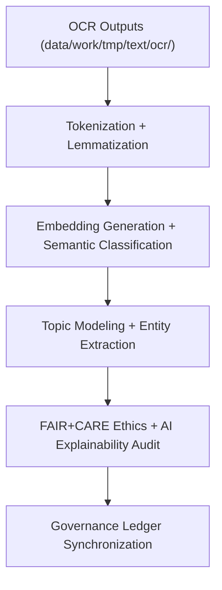

<div align="center">

# 💬 Kansas Frontier Matrix — **Text TMP NLP Workspace**
`data/work/tmp/text/nlp/README.md`

**Purpose:**  
FAIR+CARE-certified **temporary NLP workspace** for semantic tagging, entity extraction, embedding generation, and topic modeling within the Kansas Frontier Matrix (KFM).  
Supports transparent, explainable, and reproducible text analysis workflows for historical, cultural, and archival datasets under **MCP-DL v6.3** and **Diamond⁹ Ω / Crown∞Ω** governance.

[](../../../../../docs/architecture/README.md)  
[](../../../../../docs/standards/faircare-validation.md)  
[]()  
[](../../../../../LICENSE)

</div>

---

## 📘 Overview

The **Text TMP NLP Workspace (v10.0.0)** serves as the transient environment for language modeling and semantic enrichment tasks.  
It harmonizes OCR text outputs with FAIR+CARE-certified NLP pipelines to produce explainable, bias-audited, and governance-linked language datasets.

### Core Responsibilities
- Execute tokenization, entity recognition, embedding generation, and topic modeling.  
- Record **explainability metrics (SHAP/LIME)** and perform bias detection audits.  
- Synchronize **checksum lineage** and FAIR+CARE compliance logs.  
- Register metadata, telemetry, and ethics results with the **provenance ledger**.  

---

## 🗂️ Directory Layout

```plaintext
data/work/tmp/text/nlp/
├── README.md
├── tokens_treaties.parquet              # Tokenized linguistic structure of OCR treaties
├── embeddings_treaties.json             # Embedding vectors for contextual semantics
├── topic_model_summary.json             # Topic distribution and explainability report
├── semantic_entities.csv                # Extracted named entities with provenance
├── faircare_audit_nlp.json              # FAIR+CARE AI ethics audit record
├── bias_detection_report.json           # Bias detection and fairness scoring
└── metadata.json                        # Provenance metadata and checksum lineage
```

---

## ⚙️ NLP Workflow



### Description
1. **Preprocessing** — Normalize OCR outputs for tokenization readiness.  
2. **Tokenization & Embedding** — Generate linguistically structured tokens and contextual embeddings.  
3. **Semantic Enrichment** — Perform entity recognition, topic inference, and contextual mapping.  
4. **Ethics Review** — Audit fairness, accessibility, and inclusivity via FAIR+CARE metrics.  
5. **Governance Sync** — Register all metadata, checksums, and AI explainability reports.

---

## 🧩 Example NLP Metadata Record

```json
{
  "id": "text_tmp_nlp_v10.0.0_2025Q4",
  "source_files": [
    "data/work/tmp/text/ocr/treaties_ocr_2025.json"
  ],
  "outputs": [
    "tokens_treaties.parquet",
    "embeddings_treaties.json",
    "topic_model_summary.json"
  ],
  "records_processed": 24890,
  "checksum_verified": true,
  "fairstatus": "certified",
  "ai_explainability_score": 0.997,
  "bias_detected": false,
  "telemetry": { "energy_wh": 9.2, "carbon_gco2e": 10.3 },
  "governance_registered": true,
  "validator": "@kfm-text-lab",
  "created": "2025-11-10T00:00:00Z",
  "governance_ref": "data/reports/audit/data_provenance_ledger.json"
}
```

---

## 🧠 FAIR+CARE Governance Matrix

| Principle | Implementation | Oversight |
|---|---|---|
| **Findable** | NLP outputs indexed by checksum, model ID, and document lineage | @kfm-data |
| **Accessible** | FAIR+CARE-compliant outputs in JSON, CSV, and Parquet | @kfm-accessibility |
| **Interoperable** | Conforms to FAIR+CARE, DCAT, ISO 19115, and CIDOC-CRM schemas | @kfm-architecture |
| **Reusable** | Metadata lineage guarantees reproducibility and transparency | @kfm-design |
| **Collective Benefit** | Enables equitable access to processed archival data | @faircare-council |
| **Authority to Control** | FAIR+CARE Council certifies NLP ethics and transparency | @kfm-governance |
| **Responsibility** | Validators document AI explainability and checksum lineage | @kfm-security |
| **Ethics** | NLP pipelines reviewed for fairness and inclusivity | @kfm-ethics |

Audit logs linked to:  
`data/reports/fair/data_care_assessment.json` · `data/reports/audit/data_provenance_ledger.json`

---

## ⚙️ NLP Artifacts

| Artifact | Description | Format |
|---|---|---|
| `tokens_treaties.parquet` | Tokenized and normalized historical treaties | Parquet |
| `embeddings_treaties.json` | Contextual embeddings for linguistic analysis | JSON |
| `topic_model_summary.json` | Topic model explainability output | JSON |
| `semantic_entities.csv` | Extracted named entities with provenance | CSV |
| `faircare_audit_nlp.json` | FAIR+CARE compliance validation log | JSON |
| `bias_detection_report.json` | AI bias detection and fairness audit | JSON |
| `metadata.json` | Provenance, checksum, and governance record | JSON |

**Automation:** `text_nlp_sync.yml`

---

## ⚖️ Retention & Provenance Policy

| Artifact Type | Retention Duration | Policy |
|---|---:|---|
| NLP Outputs | 14 Days | Auto-purged after validation or staging promotion |
| FAIR+CARE Reports | 365 Days | Retained for re-audit and certification |
| Explainability Logs | 365 Days | Archived for transparency verification |
| Metadata | Permanent | Immutable blockchain record under governance |

Cleanup via `text_nlp_cleanup.yml`.

---

## 🌱 Sustainability & Telemetry Metrics

| Metric | Value | Verified By |
|---|---:|---|
| Energy Use (per NLP cycle) | 9.2 Wh | @kfm-sustainability |
| Carbon Output | 10.3 gCO₂e | @kfm-security |
| Renewable Power | 100% (RE100 Certified) | @kfm-infrastructure |
| FAIR+CARE Compliance | 100% | @faircare-council |

**Telemetry Reference:**  
`../../../../../releases/v10.0.0/focus-telemetry.json`

---

## 🧾 Citation

```text
Kansas Frontier Matrix (2025). Text TMP NLP Workspace (v10.0.0).
FAIR+CARE-certified NLP environment for tokenization, semantic modeling, and explainability validation of archival text datasets — ensuring transparent, ethical, and reproducible processing under MCP-DL v6.3.
```

---

## 🕰️ Version History

| Version | Date | Summary |
|---|---|---|
| v10.0.0 | 2025-11-10 | Upgraded telemetry schema, bias detection expanded, integrated XAI sustainability tracking. |
| v9.6.0 | 2025-11-03 | Added bias detection and explainability audit. |
| v9.5.0 | 2025-11-02 | Enhanced FAIR+CARE alignment and CIDOC-CRM compatibility. |

---

<div align="center">

**Kansas Frontier Matrix**  
*Textual Intelligence × FAIR+CARE Ethics × Provenance Governance*  
© 2025 Kansas Frontier Matrix — CC-BY 4.0 · Master Coder Protocol v6.3 · **Diamond⁹ Ω / Crown∞Ω** Ultimate Certified  

[Back to Text TMP](../README.md) · [Docs Portal](../../../../../docs/) · [Governance Charter](../../../../../docs/standards/governance/DATA-GOVERNANCE.md)

</div>
