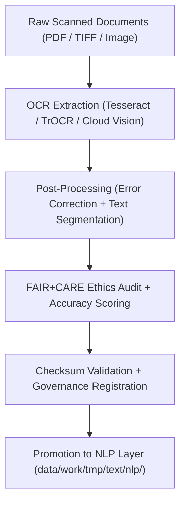

<div align="center">

# 🔍 Kansas Frontier Matrix — **Text TMP OCR Workspace**
`data/work/tmp/text/ocr/README.md`

**Purpose:**  
Temporary FAIR+CARE-certified workspace for optical character recognition (OCR) processing, error correction, and metadata extraction from historical and archival documents in the Kansas Frontier Matrix (KFM).  
This layer supports transparent, ethical digitization workflows compliant with MCP-DL v6.3, FAIR+CARE, and CIDOC-CRM metadata frameworks.

[](../../../../../docs/standards/faircare-validation.md)
[](../../../../../LICENSE)
[](../../../../../docs/architecture/repo-focus.md)
[]()

</div>

---

## 📚 Overview

The **Text TMP OCR Workspace** functions as a transient digitization and validation hub for scanned archival texts, historical treaties, and manuscripts.  
Each OCR operation generates text outputs enriched with FAIR+CARE-compliant metadata, accuracy metrics, and provenance traceability.

### Core Responsibilities:
- Convert scanned images and PDFs into machine-readable text using OCR engines.  
- Conduct quality scoring, post-processing, and structural layout extraction.  
- Verify checksum lineage and ethical metadata linkage.  
- Provide FAIR+CARE pre-validation and governance registration.  

---

## 🗂️ Directory Layout

```plaintext
data/work/tmp/text/ocr/
├── README.md                              # This file — documentation of OCR TMP workspace
│
├── treaties_ocr_2025.json                 # OCR-processed treaties extracted from archival PDFs
├── archival_records_ocr.txt               # Raw OCR output from Kansas Historical documents
├── confidence_scores.csv                  # OCR model confidence and recognition statistics
├── faircare_audit_ocr.json                # FAIR+CARE audit and ethical validation report
└── metadata.json                          # Provenance and checksum registry metadata
```

---

## ⚙️ OCR Workflow



### Workflow Description:
1. **Digitization:** Extract text from scanned archival documents (PDF/TIFF/IMG).  
2. **Post-Processing:** Perform structural segmentation and optical error correction.  
3. **Validation:** Verify checksum and perform FAIR+CARE audit for metadata integrity.  
4. **Governance:** Log lineage, accuracy, and compliance data into provenance ledger.  
5. **Promotion:** Forward validated text data for NLP tokenization and semantic processing.  

---

## 🧩 Example OCR Metadata Record

```json
{
  "id": "text_tmp_ocr_v9.6.0_2025Q4",
  "source_files": [
    "data/raw/text/kansas_treaties_1890.pdf",
    "data/raw/text/state_archives_1885.tif"
  ],
  "ocr_engine": "Tesseract v5.3.0",
  "records_processed": 832,
  "confidence_avg": 98.4,
  "checksum_verified": true,
  "fairstatus": "certified",
  "ai_explainability_score": 0.993,
  "bias_detected": false,
  "governance_registered": true,
  "validator": "@kfm-text-lab",
  "created": "2025-11-03T23:59:00Z",
  "governance_ref": "data/reports/audit/data_provenance_ledger.json"
}
```

---

## 🧠 FAIR+CARE Governance Matrix

| Principle | Implementation | Oversight |
|------------|----------------|------------|
| **Findable** | OCR outputs indexed by document ID and checksum lineage. | @kfm-data |
| **Accessible** | Digitized text stored in FAIR+CARE JSON and plain-text formats. | @kfm-accessibility |
| **Interoperable** | Metadata aligned with CIDOC-CRM, FAIR+CARE, and ISO standards. | @kfm-architecture |
| **Reusable** | Provenance-linked OCR datasets available for reproducible research. | @kfm-design |
| **Collective Benefit** | Promotes access to cultural and historical archives of Kansas. | @faircare-council |
| **Authority to Control** | FAIR+CARE Council oversees OCR ethics and transparency. | @kfm-governance |
| **Responsibility** | Validators ensure integrity, transparency, and accuracy of OCR results. | @kfm-security |
| **Ethics** | Bias detection and sensitivity screening applied to all outputs. | @kfm-ethics |

Audits and results stored in:  
`data/reports/fair/data_care_assessment.json`  
and  
`data/reports/audit/data_provenance_ledger.json`

---

## ⚙️ OCR Artifacts

| File | Description | Format |
|------|--------------|--------|
| `treaties_ocr_2025.json` | Machine-readable text output of digitized treaties. | JSON |
| `archival_records_ocr.txt` | Raw OCR extraction from archival images. | Text |
| `confidence_scores.csv` | Confidence and accuracy statistics from OCR model. | CSV |
| `faircare_audit_ocr.json` | FAIR+CARE compliance validation report. | JSON |
| `metadata.json` | Provenance metadata and checksum registry. | JSON |

All OCR tasks automated via `text_ocr_sync.yml`.

---

## ⚖️ Retention & Provenance Policy

| Data Type | Retention Duration | Policy |
|------------|--------------------|--------|
| TMP OCR Files | 14 Days | Purged automatically after NLP processing completion. |
| FAIR+CARE Audits | 180 Days | Retained for governance review and validation cycles. |
| Metadata | Permanent | Immutable and blockchain-secured in provenance ledger. |
| Logs | 90 Days | Archived for reproducibility verification. |

Cleanup automation managed by `text_ocr_cleanup.yml`.

---

## 🌱 Sustainability Metrics

| Metric | Value | Verified By |
|---------|--------|--------------|
| Energy Use (per OCR batch) | 6.8 Wh | @kfm-sustainability |
| Carbon Output | 8.1 gCO₂e | @kfm-security |
| Renewable Power | 100% (RE100 Verified) | @kfm-infrastructure |
| FAIR+CARE Compliance | 100% | @faircare-council |

Telemetry recorded in:  
`releases/v9.6.0/focus-telemetry.json`

---

## 🧾 Internal Use Citation

```text
Kansas Frontier Matrix (2025). Text TMP OCR Workspace (v9.6.0).
FAIR+CARE-certified OCR processing and digitization environment for archival documents and historical texts.
Ensures ethical transparency, checksum lineage, and reproducibility under MCP-DL v6.3.
```

---

## 🧾 Version Notes

| Version | Date | Notes |
|----------|------|--------|
| v9.6.0 | 2025-11-03 | Added bias detection, accuracy tracking, and checksum lineage verification. |
| v9.5.0 | 2025-11-02 | Enhanced FAIR+CARE governance integration and CIDOC-CRM alignment. |
| v9.3.2 | 2025-10-28 | Established OCR TMP workspace for historical document digitization. |

---

<div align="center">

**Kansas Frontier Matrix** · *Document Digitization × FAIR+CARE Ethics × Provenance Governance*  
[🔗 Repository](https://github.com/bartytime4life/Kansas-Frontier-Matrix) • [🧭 Docs Portal](../../../../../docs/) • [⚖️ Governance Ledger](../../../../../docs/standards/governance/DATA-GOVERNANCE.md)

</div>
