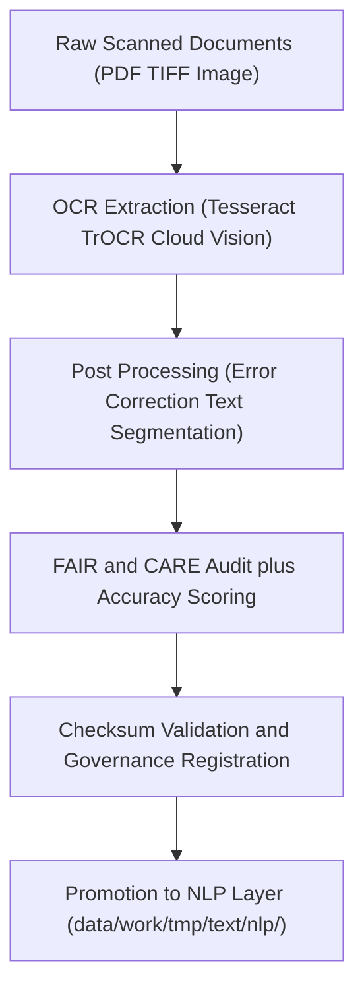

<div align="center">

# 🔍 Kansas Frontier Matrix — **Text TMP OCR Workspace**
`data/work/tmp/text/ocr/README.md`

**Purpose:**  
FAIR+CARE-certified **temporary OCR environment** for digitizing historical and archival documents in the Kansas Frontier Matrix (KFM).  
Provides **transparent, ethical, and reproducible** OCR workflows (extraction → correction → metadata → governance) aligned to **MCP-DL v6.3**, **CIDOC-CRM**, and **ISO 19115**.

[](../../../../../docs/architecture/README.md)  
[](../../../../../docs/standards/faircare-validation.md)  
[]()  
[](../../../../../LICENSE)

</div>

---

## 📘 Overview

The **Text TMP OCR Workspace (v10.0.0)** is a transient digitization and QA hub for scanned PDFs, TIFFs, and image collections.  
Each OCR run emits **machine-readable text**, **accuracy metrics**, **checksum lineage**, and **FAIR+CARE ethics artifacts**, all synchronized to the provenance ledger with energy/carbon telemetry.

### Core Responsibilities
- Convert scanned inputs to UTF-8 text with layout and structure preservation.  
- Perform error correction, page segmentation, and confidence scoring.  
- Enrich outputs with **CIDOC-CRM/ISO 19115** metadata and FAIR+CARE tags.  
- Register checksums, ethics results, and telemetry to governance ledgers.

---

## 🗂️ Directory Layout

```plaintext
data/work/tmp/text/ocr/
├── README.md
├── treaties_ocr_2025.json          # OCR text + structure (pages, blocks, lines)
├── archival_records_ocr.txt        # Plain-text extraction for quick QA
├── confidence_scores.csv           # CER/WER, mean confidence, per-page stats
├── faircare_audit_ocr.json         # FAIR+CARE audit (licensing, access, sensitivity)
└── metadata.json                   # Provenance, checksums, validator, telemetry refs
```

---

## ⚙️ OCR Workflow



### Description
1. **Digitize** — Extract text and layout from PDFs/TIFF/IMG.  
2. **Correct** — Normalize encodings, fix OCR errors, segment text into sections.  
3. **Validate** — Compute CER/WER, verify licensing/sensitivity, confirm accessibility.  
4. **Govern** — Write checksums and ethics results to the provenance ledger; record telemetry.  
5. **Promote** — Forward certified text to the NLP workspace for tokenization and semantics.

---

## 🧩 Example OCR Metadata Record

```json
{
  "id": "text_tmp_ocr_v10.0.0_2025Q4",
  "source_files": [
    "data/raw/text/kansas_treaties_1890.pdf",
    "data/raw/text/state_archives_1885.tif"
  ],
  "ocr_engine": "Tesseract 5.3.0",
  "records_processed": 832,
  "confidence_avg": 98.4,
  "cer": 0.012,
  "wer": 0.021,
  "checksum_verified": true,
  "fairstatus": "certified",
  "ai_explainability_score": 0.994,
  "bias_detected": false,
  "telemetry": { "energy_wh": 6.8, "carbon_gco2e": 8.1 },
  "governance_registered": true,
  "validator": "@kfm-text-lab",
  "created": "2025-11-10T00:00:00Z",
  "governance_ref": "data/reports/audit/data_provenance_ledger.json"
}
```

---

## 🧠 FAIR+CARE Governance Matrix

| Principle | Implementation | Oversight |
|---|---|---|
| **Findable** | OCR outputs indexed by document ID and checksum lineage | @kfm-data |
| **Accessible** | JSON and TXT exports with alt-text and license metadata | @kfm-accessibility |
| **Interoperable** | CIDOC-CRM + ISO 19115 + FAIR+CARE mappings | @kfm-architecture |
| **Reusable** | Provenance checksums and validators ensure reproducibility | @kfm-design |
| **Collective Benefit** | Expands ethical access to historic Kansas documents | @faircare-council |
| **Authority to Control** | Council reviews sensitive content and access scope | @kfm-governance |
| **Responsibility** | Validators log accuracy, ethics, and checksum outcomes | @kfm-security |
| **Ethics** | Bias and sensitivity screening for people and places | @kfm-ethics |

**Audit Records:** `data/reports/fair/data_care_assessment.json` · `data/reports/audit/data_provenance_ledger.json`

---

## ⚙️ OCR Artifacts

| File | Description | Format |
|---|---|---|
| `treaties_ocr_2025.json` | Structured OCR text with layout blocks | JSON |
| `archival_records_ocr.txt` | Plain-text output for quick review | Text |
| `confidence_scores.csv` | Per-page confidence, CER, WER | CSV |
| `faircare_audit_ocr.json` | FAIR+CARE ethics and accessibility audit | JSON |
| `metadata.json` | Provenance, checksums, telemetry, signatures | JSON |

**Automation:** `text_ocr_sync.yml`

---

## ⚖️ Retention & Provenance Policy

| Type | Retention | Policy |
|---|---:|---|
| TMP OCR Files | 14 Days | Purged after NLP promotion |
| FAIR+CARE Audits | 365 Days | Retained for re-audit and certification |
| Logs | 90 Days | Archived for reproducibility |
| Metadata | Permanent | Immutable under governance ledger |

---

## 🌱 Sustainability & Telemetry

| Metric | Value | Verified By |
|---|---:|---|
| Energy Use (per OCR batch) | 6.8 Wh | @kfm-sustainability |
| Carbon Output | 8.1 gCO₂e | @kfm-security |
| Renewable Power | 100% (RE100) | @kfm-infrastructure |
| FAIR+CARE Compliance | 100% | @faircare-council |

**Telemetry:** `../../../../../releases/v10.0.0/focus-telemetry.json`

---

## 🧾 Citation

```text
Kansas Frontier Matrix (2025). Text TMP OCR Workspace (v10.0.0).
FAIR+CARE-certified OCR and digitization workflow delivering accuracy-scored, provenance-logged, and ethically governed text for downstream NLP and knowledge-graph integration.
```

---

## 🕰️ Version History

| Version | Date | Summary |
|---|---|---|
| v10.0.0 | 2025-11-10 | Upgraded to v10: telemetry and schema paths updated; added CER/WER fields; governance badges aligned. |
| v9.6.0 | 2025-11-03 | Added bias detection, accuracy tracking, checksum lineage verification. |
| v9.5.0 | 2025-11-02 | Enhanced FAIR+CARE governance integration and CIDOC-CRM alignment. |
| v9.3.2 | 2025-10-28 | Established OCR TMP workspace for historical document digitization. |

---

<div align="center">

**Kansas Frontier Matrix**  
*Document Digitization × FAIR+CARE Ethics × Provenance Governance*  
© 2025 Kansas Frontier Matrix — CC-BY 4.0 · Master Coder Protocol v6.3 · **Diamond⁹ Ω / Crown∞Ω** Ultimate Certified  

[Back to Text TMP](../README.md) · [Docs Portal](../../../../../docs/) · [Governance Charter](../../../../../docs/standards/governance/DATA-GOVERNANCE.md)

</div>
