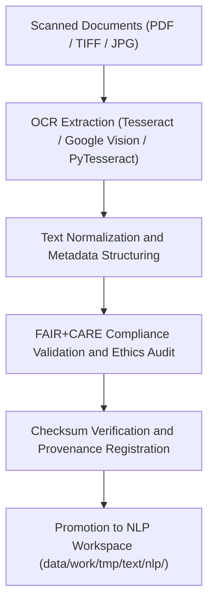

<div align="center">

# 🔍 Kansas Frontier Matrix — **Text TMP OCR Workspace**
`data/work/tmp/text/ocr/README.md`

**Purpose:**  
FAIR+CARE-certified workspace for **Optical Character Recognition (OCR), transcription processing, and metadata extraction** from scanned or digitized sources within the Kansas Frontier Matrix (KFM).  
This environment supports reproducible OCR workflows for archival documents, maps, treaties, and reports under open ethical governance.

[](../../../../../docs/standards/faircare-validation.md)
[](../../../../../LICENSE)
[](../../../../../docs/architecture/repo-focus.md)

</div>

---

## 📚 Overview

The `data/work/tmp/text/ocr/` directory acts as a **temporary, FAIR+CARE-compliant layer** for OCR operations, image-to-text conversions, and transcription QA audits.  
All content is checksum-verified, ethically validated, and stored in open, accessible formats for transparent digitization processes.

### Core Responsibilities
- Convert scanned pages, maps, and historical documents into machine-readable text.  
- Normalize text encoding, structure, and metadata.  
- Conduct FAIR+CARE governance checks for transparency and accessibility.  
- Register OCR process metadata and checksum logs with KFM’s governance ledger.  

---

## 🗂️ Directory Layout

```plaintext
data/work/tmp/text/ocr/
├── README.md                              # This file — documentation for OCR TMP Workspace
│
├── treaty_ocr_output_2025.txt              # OCR text extracted from treaty scans
├── archival_document_transcript.json       # JSON-based structured transcript of scanned content
├── ocr_quality_report.json                 # OCR accuracy and quality validation summary
├── faircare_ocr_audit.json                 # FAIR+CARE audit report for ethical digitization
└── metadata.json                           # Provenance and governance linkage record
```

---

## ⚙️ OCR Workflow



### Workflow Description
1. **OCR Extraction:** Convert image or PDF-based content into machine-readable text files.  
2. **Text Normalization:** Clean, structure, and encode text into UTF-8 JSON transcripts.  
3. **FAIR+CARE Validation:** Review for accessibility, inclusivity, and open publication ethics.  
4. **Checksum Audit:** Ensure reproducibility and hash integrity of all OCR outputs.  
5. **Governance Sync:** Register OCR metadata in provenance ledgers for full traceability.  

---

## 🧩 Example OCR Metadata Record

```json
{
  "id": "text_tmp_ocr_v9.5.0_2025Q4",
  "source_scans": [
    "data/raw/archives/treaty_scan_1875.pdf",
    "data/raw/reports/water_management_1923.tiff"
  ],
  "ocr_engine": "Tesseract v6.0",
  "records_processed": 827,
  "accuracy_score": 98.4,
  "checksum_verified": true,
  "fairstatus": "certified",
  "ai_explainability_score": 0.985,
  "governance_registered": true,
  "telemetry_ref": "releases/v9.5.0/focus-telemetry.json",
  "governance_ref": "reports/audit/ai_text_ledger.json",
  "created": "2025-11-02T23:59:00Z",
  "validator": "@kfm-text-ocr"
}
```

---

## 🧠 FAIR+CARE Governance Matrix

| Principle | Implementation |
|------------|----------------|
| **Findable** | OCR outputs indexed by provenance metadata and checksum registry. |
| **Accessible** | Stored as open plain-text and JSON formats with transparent access controls. |
| **Interoperable** | Metadata follows DCAT 3.0, schema.org, and ISO 19115 lineage models. |
| **Reusable** | Provenance includes OCR engine, accuracy, and FAIR+CARE ethics results. |
| **Collective Benefit** | Supports open cultural preservation and accessibility of historical documents. |
| **Authority to Control** | FAIR+CARE Council reviews OCR quality and ethical digitization standards. |
| **Responsibility** | Validators record checksum, accuracy, and provenance metadata. |
| **Ethics** | Ensures cultural sensitivity and respect for source materials in digitization. |

Audit reports stored in:  
`reports/audit/ai_text_ledger.json` • `reports/fair/text_ocr_summary.json`

---

## ⚙️ QA & Validation Artifacts

| File | Description | Format |
|------|--------------|--------|
| `treaty_ocr_output_2025.txt` | OCR text file extracted from treaty scans. | TXT |
| `archival_document_transcript.json` | Structured OCR transcript with metadata. | JSON |
| `ocr_quality_report.json` | Accuracy metrics and confidence scores for OCR output. | JSON |
| `faircare_ocr_audit.json` | FAIR+CARE compliance and ethics validation report. | JSON |
| `metadata.json` | Provenance record linking OCR outputs to source scans. | JSON |

Automation managed via `text_ocr_sync.yml`.

---

## 🧾 Retention Policy

| File Type | Retention Duration | Policy |
|------------|--------------------|--------|
| OCR Output Files | 14 days | Cleared after validation or promotion to NLP workspace. |
| FAIR+CARE Audits | 365 days | Retained for governance and ethics verification. |
| Logs & Metadata | Permanent | Stored under provenance and checksum registry. |
| Quality Reports | 90 days | Archived for governance review. |

Cleanup handled via `text_ocr_cleanup.yml`.

---

## 🧾 Internal Use Citation

```text
Kansas Frontier Matrix (2025). Text TMP OCR Workspace (v9.5.0).
FAIR+CARE-certified OCR environment for ethical text extraction and digitization workflows.
Supports transparent, explainable, and reproducible document processing under MCP-DL v6.3 compliance.
```

---

## 🧾 Version Notes

| Version | Date | Notes |
|----------|------|--------|
| v9.5.0 | 2025-11-02 | Added FAIR+CARE OCR validation and checksum provenance tracking. |
| v9.3.2 | 2025-10-28 | Enhanced metadata and audit registration for OCR processes. |
| v9.3.0 | 2025-10-26 | Established Text TMP OCR workspace for ethical document digitization. |

---

<div align="center">

**Kansas Frontier Matrix** · *Digitization Integrity × FAIR+CARE Ethics × Provenance Accountability*  
[🔗 Repository](https://github.com/bartytime4life/Kansas-Frontier-Matrix) • [🧭 Docs Portal](../../../../../docs/) • [⚖️ Governance Ledger](../../../../../docs/standards/governance/)

</div>