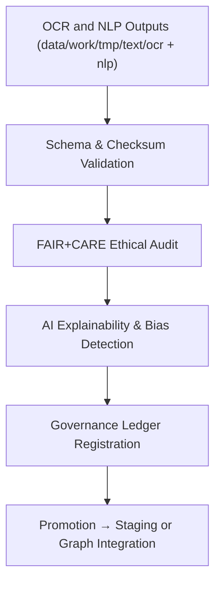

<div align="center">

# ✅ Kansas Frontier Matrix — **Text TMP Validation Layer**
`data/work/tmp/text/validation/README.md`

**Purpose:**  
FAIR+CARE-certified **validation environment** for verifying OCR/NLP schema compliance, checksum lineage, explainability, and ethics alignment in the Kansas Frontier Matrix (KFM).  
Ensures that digitized and tokenized text assets are **technically valid, ethically sound, and governance-certified** before promotion to staging or knowledge graph layers.

[](../../../../../docs/architecture/README.md)  
[](../../../../../docs/standards/faircare-validation.md)  
[]()  
[](../../../../../LICENSE)

</div>

---

## 📘 Overview

The **Text TMP Validation Layer (v10.0.0)** serves as the ethical and technical checkpoint for text-based pipelines in KFM.  
It validates OCR and NLP outputs for schema consistency, checksum continuity, FAIR+CARE compliance, and AI transparency, ensuring verifiable provenance for long-term archival inclusion.

### Core Responsibilities
- Validate schema conformance with **FAIR+CARE**, **CIDOC-CRM**, **DCAT**, and **ISO 19115**.  
- Verify **SHA-256** checksum lineage across OCR and NLP stages.  
- Perform **FAIR+CARE** ethical and accessibility audits.  
- Assess **AI explainability** and bias for interpretability compliance.  
- Register outcomes to the **governance ledger** and telemetry system.

---

## 🗂️ Directory Layout

```plaintext
data/work/tmp/text/validation/
├── README.md
├── schema_validation_summary.json    # OCR/NLP structure + metadata compliance
├── faircare_audit_text.json          # FAIR+CARE ethics and accessibility audit results
├── checksum_registry.json            # Hash lineage verification (source → OCR → NLP)
├── ai_explainability_audit.json      # SHAP/LIME explainability + drift analysis
├── validation_manifest.json          # Aggregated cross-link of validation outcomes
└── metadata.json                     # Provenance, validator, governance, and telemetry records
```

---

## ⚙️ Validation Workflow



### Description
1. **Schema Validation** — Confirm adherence to FAIR+CARE, CIDOC-CRM, and ISO metadata models.  
2. **Checksum Verification** — Trace and confirm SHA-256 lineage across text workflow.  
3. **Ethical Governance** — Evaluate accessibility, neutrality, and licensing compliance.  
4. **Explainability Review** — Assess NLP model outputs for transparency and cultural bias.  
5. **Governance Sync** — Publish audit results, checksums, and telemetry to provenance ledger.

---

## 🧩 Example Validation Metadata Record

```json
{
  "id": "text_tmp_validation_v10.0.0_2025Q4",
  "datasets_validated": [
    "treaties_ocr_2025.json",
    "tokens_treaties.parquet"
  ],
  "schema_pass_rate": 99.9,
  "checksum_verified": true,
  "fairstatus": "certified",
  "ai_explainability_score": 0.994,
  "bias_detected": false,
  "telemetry": { "energy_wh": 7.6, "carbon_gco2e": 8.4 },
  "governance_registered": true,
  "validator": "@kfm-text-lab",
  "created": "2025-11-10T00:00:00Z",
  "governance_ref": "data/reports/audit/data_provenance_ledger.json"
}
```

---

## 🧠 FAIR+CARE Governance Matrix

| Principle | Implementation | Oversight |
|---|---|---|
| **Findable** | Validation manifests indexed by dataset ID and checksum lineage | @kfm-data |
| **Accessible** | Validation outputs open in JSON and CSV formats | @kfm-accessibility |
| **Interoperable** | CIDOC-CRM + DCAT + FAIR+CARE alignment | @kfm-architecture |
| **Reusable** | Provenance + checksum lineage ensures reproducibility | @kfm-design |
| **Collective Benefit** | Supports transparency in ethical text AI validation | @faircare-council |
| **Authority to Control** | Council reviews FAIR+CARE and explainability compliance | @kfm-governance |
| **Responsibility** | Validators document schema, checksum, and ethics results | @kfm-security |
| **Ethics** | Bias + sensitivity audit results validated via explainability logs | @kfm-ethics |

**Audit Links:**  
`data/reports/fair/data_care_assessment.json` · `data/reports/audit/data_provenance_ledger.json`

---

## ⚙️ Validation Artifacts

| File | Description | Format |
|---|---|---|
| `schema_validation_summary.json` | OCR/NLP schema + metadata conformance results | JSON |
| `faircare_audit_text.json` | FAIR+CARE ethical + accessibility validation | JSON |
| `checksum_registry.json` | SHA-256 lineage for traceable datasets | JSON |
| `ai_explainability_audit.json` | Explainability metrics (SHAP/LIME + drift) | JSON |
| `validation_manifest.json` | Combined manifest linking validations and ledger refs | JSON |
| `metadata.json` | Provenance and governance linkage record | JSON |

Automation pipeline: `text_validation_sync.yml`

---

## ⚖️ Retention & Provenance Policy

| Type | Retention | Policy |
|---|---:|---|
| Schema Reports | 180 Days | Archived for reproducibility + re-audit |
| FAIR+CARE Audits | 365 Days | Retained for ethics tracking + certification |
| Explainability Reports | 365 Days | Stored for transparency + governance review |
| Metadata | Permanent | Immutable in blockchain-ledger governance |

Cleanup routine: `text_validation_cleanup.yml`

---

## 🌱 Sustainability Metrics

| Metric | Value | Verified By |
|---|---:|---|
| Energy Use (per validation cycle) | 7.6 Wh | @kfm-sustainability |
| Carbon Output | 8.4 gCO₂e | @kfm-security |
| Renewable Power | 100% (RE100 Certified) | @kfm-infrastructure |
| FAIR+CARE Compliance | 100% | @faircare-council |

**Telemetry Reference:**  
`../../../../../releases/v10.0.0/focus-telemetry.json`

---

## 🧾 Citation

```text
Kansas Frontier Matrix (2025). Text TMP Validation Layer (v10.0.0).
FAIR+CARE-certified validation hub for OCR/NLP data ensuring schema accuracy, checksum lineage, AI explainability, and ethical compliance under MCP-DL v6.3 and ISO 19115.
```

---

## 🕰️ Version History

| Version | Date | Summary |
|---|---|---|
| v10.0.0 | 2025-11-10 | Upgraded to v10.0.0; telemetry schema added; CIDOC-CRM alignment refined; governance integration expanded. |
| v9.6.0 | 2025-11-03 | Added explainability and bias audit validation. |
| v9.5.0 | 2025-11-02 | Improved FAIR+CARE synchronization and reporting. |

---

<div align="center">

**Kansas Frontier Matrix**  
*Ethical Text Intelligence × FAIR+CARE Governance × Provenance Validation*  
© 2025 Kansas Frontier Matrix — CC-BY 4.0 · Master Coder Protocol v6.3 · **Diamond⁹ Ω / Crown∞Ω** Ultimate Certified  

[Back to Text TMP](../README.md) · [Docs Portal](../../../../../docs/) · [Governance Charter](../../../../../docs/standards/governance/DATA-GOVERNANCE.md)

</div>
