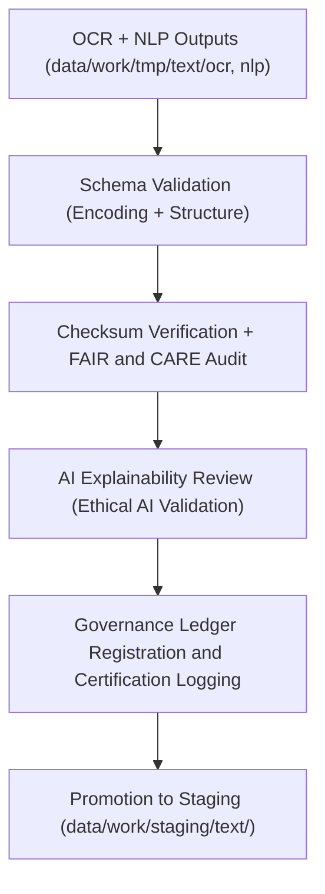

<div align="center">

# ✅ Kansas Frontier Matrix — **Text TMP Validation Workspace**
`data/work/tmp/text/validation/README.md`

**Purpose:**  
Governed FAIR+CARE-certified workspace for **schema conformance, ethical validation, checksum verification, and AI explainability** in the text ETL workflows of the Kansas Frontier Matrix (KFM).  
Ensures that all OCR and NLP outputs comply with FAIR+CARE governance, provenance traceability, and ethical standards before staging or archival promotion.

[](../../../../../docs/standards/faircare-validation.md)
[](../../../../../LICENSE)
[](../../../../../docs/architecture/repo-focus.md)

</div>

---

## 📚 Overview

The `data/work/tmp/text/validation/` directory acts as the **quality assurance checkpoint** for text data processed through OCR and NLP pipelines.  
This validation layer enforces schema alignment, ethics compliance, checksum reproducibility, and AI explainability under the KFM’s FAIR+CARE framework.

### Core Responsibilities
- Validate text datasets for encoding, metadata, and structure conformity.  
- Conduct FAIR+CARE ethical and accessibility audits.  
- Run checksum verification to confirm data reproducibility.  
- Assess AI model explainability and governance adherence.  
- Record validation results and certification metadata for provenance tracking.  

---

## 🗂️ Directory Layout

```plaintext
data/work/tmp/text/validation/
├── README.md                               # This file — documentation for Text TMP Validation workspace
│
├── schema_validation_summary.json          # Schema conformity validation results
├── faircare_audit_report.json              # FAIR+CARE ethics and governance validation
├── checksum_registry.json                  # SHA-256 checksum verification and lineage record
├── ai_explainability_report.json           # Explainable AI audit (for NLP and OCR pipelines)
├── governance_review.json                  # Governance council validation notes
└── metadata.json                           # Provenance metadata and checksum linkage
```

---

## ⚙️ Validation Workflow



### Workflow Description
1. **Schema Validation:** Ensure all text files and metadata conform to FAIR+CARE schemas.  
2. **Checksum Verification:** Recalculate and confirm all hashes for reproducibility.  
3. **Ethics Audit:** Assess accessibility, inclusivity, and ethical compliance.  
4. **Explainability Audit:** Validate AI decisions used in NLP summarization or entity extraction.  
5. **Governance Registration:** Store results in provenance ledgers for traceable certification.  

---

## 🧩 Example Validation Metadata Record

```json
{
  "id": "text_tmp_validation_v9.5.0_2025Q4",
  "datasets_validated": [
    "treaty_ocr_output_2025.txt",
    "entities_extracted.json",
    "topic_classification.json"
  ],
  "records_validated": 853,
  "schema_validation_passed": true,
  "checksum_verified": true,
  "fairstatus": "certified",
  "ai_explainability_score": 0.989,
  "governance_registered": true,
  "telemetry_ref": "releases/v9.5.0/focus-telemetry.json",
  "governance_ref": "reports/audit/ai_text_ledger.json",
  "created": "2025-11-02T23:59:00Z",
  "validator": "@kfm-text-validation"
}
```

---

## 🧠 FAIR+CARE Governance Matrix

| Principle | Implementation |
|------------|----------------|
| **Findable** | Validation results indexed by checksum and metadata reference. |
| **Accessible** | Validation reports stored in open JSON formats. |
| **Interoperable** | Complies with DCAT 3.0, ISO 19115, and schema.org metadata standards. |
| **Reusable** | Provenance and checksum data ensure reproducibility. |
| **Collective Benefit** | Supports equitable access and responsible archival digitization. |
| **Authority to Control** | FAIR+CARE Council certifies ethics and schema validation results. |
| **Responsibility** | Validators log all checksum and explainability outcomes. |
| **Ethics** | Reinforces responsible AI usage and data governance integrity. |

Audit records logged in:  
`reports/audit/ai_text_ledger.json` • `reports/fair/text_validation_summary.json`

---

## ⚙️ QA & Validation Artifacts

| File | Description | Format |
|------|--------------|--------|
| `schema_validation_summary.json` | Field-level schema and encoding validation. | JSON |
| `faircare_audit_report.json` | FAIR+CARE compliance and ethics validation summary. | JSON |
| `checksum_registry.json` | Hash verification record for reproducibility. | JSON |
| `ai_explainability_report.json` | Explainability metrics and interpretability validation. | JSON |
| `governance_review.json` | Governance council sign-off and validation notes. | JSON |
| `metadata.json` | Provenance and validation session metadata. | JSON |

Automation handled via `text_validation_sync.yml`.

---

## 🧾 Retention Policy

| File Type | Retention Duration | Policy |
|------------|--------------------|--------|
| Validation Reports | 365 days | Archived for audit and provenance review. |
| FAIR+CARE Audits | Permanent | Stored for governance and ethics continuity. |
| Checksum Records | Permanent | Maintained for long-term reproducibility assurance. |
| Metadata | Permanent | Retained under KFM governance system. |

Cleanup handled via `text_validation_cleanup.yml`.

---

## 🧾 Internal Use Citation

```text
Kansas Frontier Matrix (2025). Text TMP Validation Workspace (v9.5.0).
FAIR+CARE-certified workspace for schema validation, checksum verification, and AI explainability audits in text processing workflows.
Ensures transparency, ethics, and provenance assurance under MCP-DL v6.3 compliance.
```

---

## 🧾 Version Notes

| Version | Date | Notes |
|----------|------|--------|
| v9.5.0 | 2025-11-02 | Added AI explainability validation and expanded FAIR+CARE schema compliance. |
| v9.3.2 | 2025-10-28 | Improved checksum verification and governance linkage. |
| v9.3.0 | 2025-10-26 | Established Text TMP Validation workspace for FAIR+CARE-certified QA. |

---

<div align="center">

**Kansas Frontier Matrix** · *Text QA × FAIR+CARE Ethics × Provenance Integrity*  
[🔗 Repository](https://github.com/bartytime4life/Kansas-Frontier-Matrix) • [🧭 Docs Portal](../../../../../docs/) • [⚖️ Governance Ledger](../../../../../docs/standards/governance/)

</div>