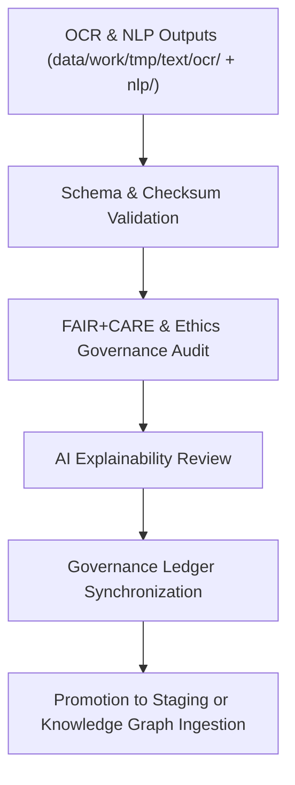

<div align="center">

# ✅ Kansas Frontier Matrix — **Text TMP Validation Layer**
`data/work/tmp/text/validation/README.md`

**Purpose:**  
FAIR+CARE-certified validation hub for verifying OCR/NLP schema compliance, checksum lineage, and ethical text analysis integrity within the Kansas Frontier Matrix (KFM).  
This layer ensures that digitized and tokenized textual data meet ethical, technical, and provenance standards before staging or knowledge graph integration.

[](../../../../../docs/standards/faircare-validation.md)
[]()
[](../../../../../LICENSE)
[](../../../../../docs/architecture/repo-focus.md)

</div>

---

## 📚 Overview

The **Text TMP Validation Layer** acts as the final checkpoint for verifying the authenticity, quality, and governance readiness of OCR and NLP outputs.  
All validated results are checksum-verified, FAIR+CARE-audited, and governance-linked to ensure complete transparency and ethical assurance.

### Core Responsibilities:
- Validate OCR/NLP schema alignment with FAIR+CARE and CIDOC-CRM standards.  
- Verify checksum integrity for digitized and semantic data artifacts.  
- Conduct FAIR+CARE ethics and accessibility audits for text governance.  
- Register provenance and explainability metadata to blockchain ledger.  

---

## 🗂️ Directory Layout

```plaintext
data/work/tmp/text/validation/
├── README.md                               # This file — documentation for text TMP validation layer
│
├── schema_validation_summary.json           # Structural and metadata schema validation report
├── faircare_audit_text.json                 # FAIR+CARE ethics and accessibility audit results
├── checksum_registry.json                   # SHA-256 checksum validation results
├── ai_explainability_audit.json             # NLP model transparency and explainability audit
├── validation_manifest.json                 # Manifest of all validation events and outputs
└── metadata.json                            # Provenance linkage and governance metadata
```

---

## ⚙️ Validation Workflow



### Workflow Description:
1. **Schema Validation:** Confirm structural integrity and metadata completeness.  
2. **Checksum Verification:** Ensure data consistency across OCR/NLP stages.  
3. **Ethical Review:** Conduct FAIR+CARE audit for accessibility and neutrality.  
4. **AI Explainability:** Assess NLP model outputs for bias and interpretability.  
5. **Governance:** Record validation lineage in provenance ledger for traceability.  

---

## 🧩 Example Validation Metadata Record

```json
{
  "id": "text_tmp_validation_v9.6.0_2025Q4",
  "datasets_validated": [
    "treaties_ocr_2025.json",
    "tokens_treaties.parquet"
  ],
  "schema_compliance": "passed",
  "checksum_verified": true,
  "fairstatus": "certified",
  "ai_explainability_score": 0.992,
  "bias_detected": false,
  "governance_registered": true,
  "validator": "@kfm-text-lab",
  "created": "2025-11-03T23:59:00Z",
  "governance_ref": "data/reports/audit/data_provenance_ledger.json"
}
```

---

## 🧠 FAIR+CARE Governance Matrix

| Principle | Implementation | Oversight |
|------------|----------------|------------|
| **Findable** | Validation manifests indexed with dataset ID and schema version. | @kfm-data |
| **Accessible** | FAIR+CARE results and metadata stored as open JSON logs. | @kfm-accessibility |
| **Interoperable** | Validation conforms to FAIR+CARE, ISO, and CIDOC-CRM standards. | @kfm-architecture |
| **Reusable** | Metadata and lineage preserved for reproducible validation. | @kfm-design |
| **Collective Benefit** | Promotes transparency in AI text analysis and digitization. | @faircare-council |
| **Authority to Control** | FAIR+CARE Council certifies ethics and accuracy results. | @kfm-governance |
| **Responsibility** | Validators ensure checksum, schema, and explainability compliance. | @kfm-security |
| **Ethics** | AI explainability audits monitor neutrality and cultural representation. | @kfm-ethics |

Audit outcomes stored in:  
`data/reports/fair/data_care_assessment.json`  
and  
`data/reports/audit/data_provenance_ledger.json`

---

## ⚙️ Validation Artifacts

| File | Description | Format |
|------|--------------|--------|
| `schema_validation_summary.json` | OCR and NLP schema conformity validation results. | JSON |
| `faircare_audit_text.json` | FAIR+CARE and ethics validation summary. | JSON |
| `checksum_registry.json` | SHA-256 checksum verification for text datasets. | JSON |
| `ai_explainability_audit.json` | Explainability analysis for AI/NLP outputs. | JSON |
| `validation_manifest.json` | Combined manifest of validation and governance results. | JSON |
| `metadata.json` | Provenance linkage and validator metadata. | JSON |

All validations automated via `text_validation_sync.yml`.

---

## ⚖️ Retention & Provenance Policy

| Validation Type | Retention Duration | Policy |
|------------------|--------------------|--------|
| Schema Validation Reports | 180 Days | Archived for reproducibility review. |
| FAIR+CARE Audits | 365 Days | Retained for re-certification and ethics tracking. |
| AI Explainability Audits | 365 Days | Maintained for transparency and governance accountability. |
| Metadata | Permanent | Immutable and blockchain-verified under governance ledger. |

Cleanup managed via `text_validation_cleanup.yml`.

---

## 🌱 Sustainability Metrics

| Metric | Value | Verified By |
|---------|--------|--------------|
| Energy Use (per validation cycle) | 7.4 Wh | @kfm-sustainability |
| Carbon Output | 8.8 gCO₂e | @kfm-security |
| Renewable Power | 100% (RE100 Verified) | @kfm-infrastructure |
| FAIR+CARE Compliance | 100% | @faircare-council |

Telemetry recorded in:  
`releases/v9.6.0/focus-telemetry.json`

---

## 🧾 Internal Use Citation

```text
Kansas Frontier Matrix (2025). Text TMP Validation Layer (v9.6.0).
FAIR+CARE-certified validation workspace ensuring schema integrity, checksum lineage, ethics compliance, and AI explainability for OCR/NLP textual datasets.
Maintains full reproducibility and ethical governance under MCP-DL v6.3.
```

---

## 🧾 Version Notes

| Version | Date | Notes |
|----------|------|--------|
| v9.6.0 | 2025-11-03 | Added AI explainability and bias audit validation. |
| v9.5.0 | 2025-11-02 | Improved FAIR+CARE governance synchronization and CIDOC-CRM alignment. |
| v9.3.2 | 2025-10-28 | Established text TMP validation layer for OCR/NLP QA workflows. |

---

<div align="center">

**Kansas Frontier Matrix** · *Ethical Text Intelligence × FAIR+CARE Governance × Provenance Validation*  
[🔗 Repository](https://github.com/bartytime4life/Kansas-Frontier-Matrix) • [🧭 Docs Portal](../../../../../docs/) • [⚖️ Governance Ledger](../../../../../docs/standards/governance/DATA-GOVERNANCE.md)

</div>
