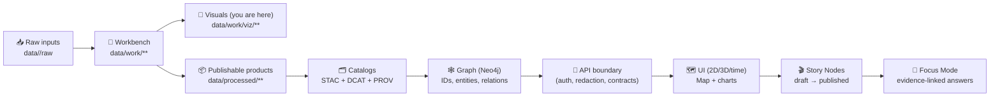

<div align="center">

# 🎨 Visualization Workbench — `data/work/viz/`


**Scratch visuals** (maps, charts, dashboards, storyboards, UI prototypes) that help us *decide what’s ready* for Kansas Frontier Matrix (KFM). 🧭📊  
This folder is **not** the canonical publication surface — if a visual becomes *evidence* used downstream, it must be promoted with **STAC + DCAT + PROV** (and handled via the API boundary). ✅

</div>

---

## 🚀 Quick links

- 🧰 Back to Workbench root → [`../README.md`](../README.md)
- 📦 Processed datasets (canonical outputs) → [`../../processed/`](../../processed/)
- 🛰️ STAC outputs → [`../../stac/`](../../stac/)
- 🗂️ DCAT outputs → [`../../catalog/dcat/`](../../catalog/dcat/)
- 🧬 PROV bundles → [`../../prov/`](../../prov/)
- 🕸️ Graph exports (if used) → [`../../graph/`](../../graph/)
- 🌐 Web UI code (if present) → [`../../../web/`](../../../web/)
- 🎬 Story Nodes (governed narrative) → `docs/reports/story_nodes/` *(repo root)*[^story_nodes_path]
- 🔐 Security policy → [`../../../SECURITY.md`](../../../SECURITY.md)

> [!TIP]
> Use `data/work/viz/` to **prove** a visualization is correct + reproducible.  
> Use `docs/reports/story_nodes/` (draft/published workflow) to **ship** narrative visuals that the public will rely on.[^story_nodes_path]

---

<details>
<summary><strong>📌 Table of contents</strong></summary>

- [🎯 What this folder is (and is not)](#-what-this-folder-is-and-is-not)
- [🧱 Where visualization fits in the KFM pipeline](#-where-visualization-fits-in-the-kfm-pipeline)
- [🗺️ Folder map (recommended)](#️-folder-map-recommended)
- [🧾 Visualization Package Standard (VPS)](#-visualization-package-standard-vps)
- [📦 Formats, naming, and “PR-friendly” rules](#-formats-naming-and-pr-friendly-rules)
- [🧬 Provenance, captions, and attributions](#-provenance-captions-and-attributions)
- [🔒 Sensitive data, redaction, and “don’t be creepy” rules](#-sensitive-data-redaction-and-dont-be-creepy-rules)
- [✅ QA checklists (maps, charts, dashboards)](#-qa-checklists-maps-charts-dashboards)
- [🚀 Promotion rules (viz → processed/catalogs/story)](#-promotion-rules-viz--processedcatalogsstory)
- [📚 Project reference shelf](#-project-reference-shelf)
- [🕰️ Version history](#️-version-history)
- [📎 Footnotes](#-footnotes)

</details>

---

## 🎯 What this folder is (and is not)

### ✅ This folder **IS**
- 🗺️ **Map exports**: screenshots, print layouts, and comparison panels (before publishing).
- 📊 **Analysis visuals**: EDA plots, QA plots, residual diagnostics, uncertainty plots.
- 🧩 **Dashboard artifacts**: exported chart specs (Vega/Vega-Lite), small HTML demos, screenshots/GIFs.
- 🎬 **Storyboarding**: draft panels that later become Story Node assets.
- 🧪 **UI experiments**: “does this interaction make sense?” prototypes (keep code in `web/`, keep artifacts here).

### ❌ This folder is **NOT**
- 📦 Canonical published datasets (those live in `data/processed/` + catalogs).
- 🔑 A place for secrets/tokens/keys (never).
- 🧨 A place for untracked “mystery visuals” with no provenance.
- 🧾 A replacement for Story Nodes (shipping narrative belongs in governed story paths).[^story_nodes_path]

> [!IMPORTANT]
> In KFM, “pretty” is not enough. A visualization is only trustworthy if it’s **reproducible + provenance-linked** and doesn’t bypass governance controls.[^kfm_arch_standards][^kfm_api_boundary]

---

## 🧱 Where visualization fits in the KFM pipeline

KFM’s ordering is strict so that narrative and UI never outrun evidence:

**ETL → STAC/DCAT/PROV → Graph → API → UI → Story Nodes → Focus Mode**[^pipeline_order]

- Story Nodes are described as curated sequences of maps + narrative content (each node carries a map-view configuration).[^kfm_story_nodes]
- The UI stack is designed to support 2D maps, 3D mode, and time-based exploration (timeline / temporal filters).[^kfm_map_stack]
- Focus Mode is intended to answer questions with citations and avoid speculation (and is expected to respect redaction/governance behaviors).[^focus_mode_redaction]



> [!NOTE]
> `data/work/viz/` is upstream proof.  
> Once a visual is used in UI/Story/Focus, it stops being “just a picture” and becomes **evidence output** with rules.

---

## 🗺️ Folder map (recommended)

Keep it flexible, but navigable and reviewable:

```text
📁 data/work/viz/
├── 📁 _templates/                 # 📋 copy/paste: manifests + captions + attributions
├── 📁 _scratch/                   # ⚠️ throwaway; keep empty in PRs
├── 📁 maps/                       # 🗺️ map exports + comparisons (PNG/SVG/PDF)
├── 📁 charts/                     # 📊 plots (EDA, QA, stats)
├── 📁 dashboards/                 # 🧩 dashboard exports (screens + small specs)
├── 📁 storyboards/                # 🎬 draft story panels (promote to story_nodes later)
├── 📁 ui_prototypes/              # 🌐 tiny demos (artifacts here; code in /web)
└── 📄 README.md                   # 👈 you are here
```

> [!TIP]
> “One folder = one intent.”  
> If you mix five experiments into one folder, it becomes unreviewable and un-reproducible.

---

## 🧾 Visualization Package Standard (VPS)

A **Visualization Package** is a folder we expect someone else to review, re-run, or promote.

### ✅ Naming convention

Use a timestamp + domain + short slug + version:

- `YYYY-MM-DD__<domain>__<short_slug>__vNN/`

Examples:
- `2026-01-02__remote_sensing__ndvi_timeseries_panels__v01/`
- `2026-01-05__history__railroad_expansion_storyboard__v02/`
- `2026-01-10__viz__maplibre_time_slider_mock__v01/`

### ✅ Required contents (minimum)

Every Visualization Package **must** include:

- `README.md` — purpose, what it shows, what it does **not** claim
- `viz_manifest.yaml` — inputs, parameters, commands, output list, hashes
- `outputs/` — exported visuals (small + reviewable)
- `sources/` — pointers to inputs (IDs + paths + links), not giant copies

### ⭐ Strongly recommended

- `spec/` — chart specs / map view state JSON / style JSON
- `thumbs/` — tiny previews (for PRs)
- `attribution.md` — licensing + data provider credits
- `caption.md` — human-readable caption + dataset IDs + time window
- `checksums.sha256` — integrity list for key outputs

---

## 📦 Formats, naming, and “PR-friendly” rules

### ✅ Preferred formats (by use)

| Use | Prefer | Avoid |
|---|---|---|
| PR previews / quick review | PNG / WEBP | gigantic uncompressed TIFF |
| Print layouts / vector diagrams | PDF / SVG | raster-only screenshots |
| Motion demos | MP4 (short) | huge GIFs |
| Interactive specs | JSON (Vega/VL), small HTML + README | committed `node_modules/` |

> [!NOTE]
> GitHub will sanitize some HTML; treat embedded HTML as **best-effort** and provide static fallbacks.[^markdown_html_limits]

### 🏷️ File naming (recommended)

Include dataset + view intent:

```text
<dataset_id>__<view>__<time_or_slice>__vNN.<ext>
# examples:
kfm.ks.agriculture.ndvi.2017_2025.v1__timeseries__statewide__v01.png
kfm.ks.hydrology.flood_extent.1993.v1__map__aoi_barton_county__v02.pdf
kfm.ks.history.railroads.1880_1930.v1__storyboard_panel_03__1895__v01.webp
```

### 📦 Keep PRs reviewable

- ✅ commit: manifests, small figures, small specs, thumbnails
- ✅ link out: large binaries, large raw exports, heavyweight assets
- ✅ if a file is too big: store externally and commit a **pointer + checksum receipt** (manifest entry)

---

## 🧬 Provenance, captions, and attributions

KFM’s UI goals include visible provenance and export behaviors that preserve attribution (e.g., export functions that include source citations/credits).[^layer_provenance_and_exports][^ui_layer_provenance_rule]

### 📌 Rule: every exported visual has a “metadata sidecar”

For each deliverable in `outputs/`, create either:
- `outputs/<name>.meta.yaml` **or**
- a folder-level `viz_manifest.yaml` that enumerates all outputs + metadata.

**Minimum sidecar fields (recommended):**
- `dataset_ids` (DCAT identifiers)
- `stac_refs` (collection/item IDs + paths)
- `prov_refs` (run/activity IDs)
- `time_filter` (timeline slider range / query window)
- `view_state` (center/zoom/bbox — **generalize if sensitive**)
- `render_tool` (e.g., Python/matplotlib, R/ggplot, MapLibre screenshot, QGIS)
- `license_and_attribution` (human-readable)
- `output_hash` (sha256)

### `viz_manifest.yaml` starter (copy/paste)

```yaml
id: 2026-01-10__viz__maplibre_time_slider_mock__v01
owner: "@your-handle"
created_at: "2026-01-10"
status: wip  # wip | review | archived | promoted

intent:
  question: "Does the timeline slider communicate change clearly?"
  audience: ["internal-review", "design", "data-steward"]

evidence_links:
  dcat_dataset_ids:
    - "kfm.ks.<domain>.<product>.<range>.v1"
  stac:
    collections:
      - "data/stac/collections/<collection_id>/collection.json"
    items:
      - "data/stac/items/<collection_id>/<item>.json"
  prov:
    - "data/prov/<run_id>/prov.jsonld"

render:
  tool: "maplibre"
  method: "screenshot"
  parameters:
    time_window: ["YYYY-MM-DD", "YYYY-MM-DD"]
    layer_style: "spec/style.json"
    view_state: "spec/view_state.json"
  command: "npm run dev && use in-app export (see README)"

outputs:
  - path: outputs/timeline_slider_statewide__v01.png
    kind: screenshot
    sha256: "<fill>"
    sensitivity: public

attribution:
  caption_file: caption.md
  attribution_file: attribution.md

notes:
  - "If promoted: move story-ready panels to docs/reports/story_nodes/... and keep a pointer here."
```

### Caption template (minimum)

```md
**Title:** <What this shows>
**Time window:** <start → end>
**Geography:** <generalized AOI>
**Source datasets:** <DCAT IDs>
**Method:** <high-level steps + link to PROV run ID>
**Caveats:** <what NOT to infer>
```

> [!IMPORTANT]
> “AI helped” is not provenance. If AI contributed to a visualization or caption, record *what* it did and link to the same evidence chain (STAC/DCAT/PROV).[^focus_mode_redaction]

---

## 🔒 Sensitive data, redaction, and “don’t be creepy” rules

### ✅ Default posture
Assume that visuals can leak more than you expect:
- precise locations
- patterns of life
- culturally sensitive sites
- implicit private attributes via inference

KFM governance explicitly expects redaction/generalization behaviors when sensitive layers are involved, and auditability of withheld/generalized information (including telemetry events indicating redaction notices).[^focus_mode_redaction]

### 🧭 Practical redaction patterns (recommended)

- **Generalize geometry**: county/region summaries instead of point locations
- **Fuzz coordinates**: H3/grid aggregation, rounding, or “area-only” bounding boxes[^sensitive_location_policy]
- **Replace raw exports**: publish only derived indicators (e.g., binned categories)
- **Avoid direct download URLs** in any visual that references restricted data (use an access request path)

> [!CAUTION]
> GitHub renders GeoJSON previews and makes them trivially downloadable in public repos — great for openness, risky for sensitive data. Use private workflows or publish generalized outputs only.[^geojson_github_visibility]

---

## ✅ QA checklists (maps, charts, dashboards)

### 🗺️ Maps (static or interactive)

- [ ] Legend exists (or a caption states classification rules)
- [ ] Time context is explicit (date range or slider snapshot)
- [ ] Spatial context is explicit (AOI name; scale; CRS if relevant)
- [ ] Symbology is readable and color-accessible (avoid “meaning by hue only”)
- [ ] Attributions present (data source + license)
- [ ] No sensitive coordinates exposed (if restricted)

KFM’s UI/UX goals call for clear layer legends, pop-ups, and accessibility-minded cartographic choices.[^kfm_ui_ux]

### 📈 Charts (EDA + QA)

- [ ] Units + axis labels + transforms stated
- [ ] Uncertainty shown (intervals or explicit caveats)
- [ ] Avoid chartjunk; avoid misleading scales
- [ ] If comparing models: keep baseline + residual diagnostics

### 🧩 Dashboards & UI prototypes

- [ ] Provide screenshots + a “what this proves” README
- [ ] Mobile/responsive sanity check (at least one narrow viewport)
- [ ] Provide a non-interactive fallback (static images) for GitHub

KFM’s roadmap includes mobile-first/responsive and offline-friendly packaging considerations; treat these as early design constraints, not late add-ons.[^mobile_offline]

---

## 🚀 Promotion rules (viz → processed/catalogs/story)

A visualization becomes “real” when it’s referenced by:
- UI features
- Story Nodes (draft or published)
- Focus Mode evidence panels
- decision-facing docs

### Promotion Definition of Done ✅

- [ ] The underlying artifact is promoted to `data/processed/<domain>/...` (or an appropriate governed docs path)
- [ ] STAC/DCAT/PROV are produced/updated (if the visual represents a dataset or derived product)[^kfm_arch_standards]
- [ ] The visual (or its source spec) is moved to the right home:
  - Story panels → `docs/reports/story_nodes/...` (draft/published workflow)[^story_nodes_path]
  - UI screenshots for docs → `docs/` (governed) or `web/` docs assets (repo convention)
- [ ] `data/work/viz/<package>/README.md` becomes a **pointer stub** (what moved where + why)

> [!TIP]
> Workbench is rehearsal 🎭.  
> Publication is opening night 🎟️.  
> Don’t ship rehearsal screenshots as evidence.

---

## 📚 Project reference shelf

> ⚠️ The library below is a **reading pack / influence map**. Licenses may differ from repo code/data.

### 🧭 Core KFM system & governance docs
- `Kansas Frontier Matrix (KFM) – Comprehensive Technical Documentation.docx`
- `🌟 Kansas Frontier Matrix – Latest Ideas & Future Proposals.docx`
- `MARKDOWN_GUIDE_v13.md.gdoc`
- `MASTER_GUIDE_v13.md.gdoc`
- `Comprehensive Markdown Guide_ Syntax, Extensions, and Best Practices.docx`
- `Kansas-Frontier-Matrix Design Audit – Gaps and Enhancement Opportunities.pdf`

### 🗺️ GIS, cartography, and mapping UX
- `making-maps-a-visual-guide-to-map-design-for-gis.pdf`
- `Mobile Mapping_ Space, Cartography and the Digital - 9789048535217.pdf`
- `python-geospatial-analysis-cookbook.pdf`
- `PostgreSQL Notes for Professionals - PostgreSQLNotesForProfessionals.pdf`
- `compressed-image-file-formats-jpeg-png-gif-xbm-bmp.pdf`

### 🛰️ Remote sensing
- `Cloud-Based Remote Sensing with Google Earth Engine-Fundamentals and Applications.pdf`

### 🌐 Web UI + 3D/graphics
- `responsive-web-design-with-html5-and-css3.pdf`
- `webgl-programming-guide-interactive-3d-graphics-programming-with-webgl.pdf`

### 📈 Statistics, EDA, and inference (for honest charts)
- `Understanding Statistics & Experimental Design.pdf`
- `regression-analysis-with-python.pdf`
- `Regression analysis using Python - slides-linear-regression.pdf`
- `graphical-data-analysis-with-r.pdf`
- `think-bayes-bayesian-statistics-in-python.pdf`

### 🧪 Simulation + modeling discipline
- `Scientific Modeling and Simulation_ A Comprehensive NASA-Grade Guide.pdf`
- `Generalized Topology Optimization for Structural Design.pdf`
- `Spectral Geometry of Graphs.pdf`

### ⚙️ Systems, scale, and interoperability
- `Scalable Data Management for Future Hardware.pdf`
- `concurrent-real-time-and-distributed-programming-in-java-threads-rtsj-and-rmi.pdf`
- `Data Spaces.pdf`

### ❤️ Ethics, autonomy, and policy context
- `Introduction to Digital Humanism.pdf`
- `Principles of Biological Autonomy - book_9780262381833.pdf`
- `On the path to AI Law’s prophecies and the conceptual foundations of the machine learning age.pdf`

### 🛡️ Security (defensive reference only)
- `ethical-hacking-and-countermeasures-secure-network-infrastructures.pdf`
- `Gray Hat Python - Python Programming for Hackers and Reverse Engineers (2009).pdf`

### 🧰 General programming shelf (bundles)
- `A programming Books.pdf`
- `B-C programming Books.pdf`
- `D-E programming Books.pdf`
- `F-H programming Books.pdf`
- `I-L programming Books.pdf`
- `M-N programming Books.pdf`
- `O-R programming Books.pdf`
- `S-T programming Books.pdf`
- `U-X programming Books.pdf`

---

## 🕰️ Version history

| Version | Date | Summary |
|---|---|---|
| v1.0.0 | 2026-01-11 | Created `data/work/viz/README.md`: visualization package standard, provenance+attribution rules, redaction guidance, and promotion workflow aligned to KFM pipeline. |

---

## 📎 Footnotes

[^pipeline_order]: Pipeline ordering and “evidence-first / contract-first” framing appear in the v13 guide materials (catalog/provenance before narrative).:contentReference[oaicite:0]{index=0}

[^story_nodes_path]: v13 guidance places story content under `docs/reports/story_nodes/` with a `draft/` vs `published/` workflow.:contentReference[oaicite:1]{index=1}

[^kfm_story_nodes]: Story Nodes described as curated sequences of maps + narrative content, with per-node map view configurations and transitions in the KFM UI.:contentReference[oaicite:2]{index=2}

[^kfm_map_stack]: KFM mapping stack includes 2D WebGL mapping and a 3D mode with temporal exploration patterns (timeline filtering).:contentReference[oaicite:3]{index=3}

[^kfm_arch_standards]: KFM emphasizes standards-based design (STAC, DCAT, PROV) for interoperability and governance-linked outputs.:contentReference[oaicite:4]{index=4}

[^kfm_api_boundary]: KFM architecture describes an API layer handling client requests and background workers for heavy jobs, reinforcing an access boundary approach.:contentReference[oaicite:5]{index=5}

[^kfm_ui_ux]: KFM UI/UX elements include layer lists, legends, pop-ups, and accessibility-minded cartographic considerations.:contentReference[oaicite:6]{index=6}

[^layer_provenance_and_exports]: “Layer provenance” panels and map export functions that include citations/attribution are proposed in KFM future proposals materials.:contentReference[oaicite:7]{index=7}

[^ui_layer_provenance_rule]: v13 Markdown guidance notes UI layers should tie back to provenance (e.g., popups/legends referencing catalog sources) and respect CARE/sensitivity constraints.:contentReference[oaicite:8]{index=8}

[^sensitive_location_policy]: Sensitive location handling guidance includes generalization/redaction patterns (e.g., fuzzing/aggregation rather than exposing precise coordinates).:contentReference[oaicite:9]{index=9}

[^focus_mode_redaction]: Governance guidance describes audit trails and redaction notices when sensitive data is withheld/generalized (e.g., telemetry events for redaction notices).:contentReference[oaicite:10]{index=10}

[^mobile_offline]: Mobile-first and offline-friendly goals (including timeline slider MVP and offline packs) are discussed in future proposals materials.:contentReference[oaicite:11]{index=11}

[^geojson_github_visibility]: GeoJSON can be visualized quickly via GitHub, and public repos make it downloadable; privacy/sensitivity implications are noted in geospatial cookbook materials.:contentReference[oaicite:12]{index=12}

[^markdown_html_limits]: GitHub Markdown behavior around HTML/embedded content (sanitization; preference for static fallbacks) is described in the project’s Markdown best-practices materials.:contentReference[oaicite:13]{index=13}

