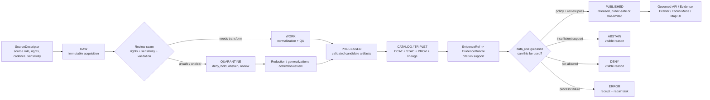

<!-- [KFM_META_BLOCK_V2]
doc_id: kfm://doc/NEEDS-VERIFICATION-data-use-readme
title: data_use/ README
type: standard
version: v1
status: draft
owners: OWNER_TBD
created: 2026-05-02
updated: 2026-05-02
policy_label: NEEDS VERIFICATION
related: [
  <NEEDS VERIFICATION: ../data/README.md>,
  <NEEDS VERIFICATION: ../data/registry/README.md>,
  <NEEDS VERIFICATION: ../data/catalog/README.md>,
  <NEEDS VERIFICATION: ../data/receipts/README.md>,
  <NEEDS VERIFICATION: ../data/proofs/README.md>,
  <NEEDS VERIFICATION: ../docs/sources/README.md>,
  <NEEDS VERIFICATION: ../docs/runbooks/README.md>,
  <NEEDS VERIFICATION: ../contracts/README.md>,
  <NEEDS VERIFICATION: ../schemas/README.md>,
  <NEEDS VERIFICATION: ../policy/README.md>,
  <NEEDS VERIFICATION: ../tests/README.md>,
  <NEEDS VERIFICATION: ../release/README.md>
]
tags: [kfm, data-use, governance, evidence, publication, rights, sensitivity]
notes: [
  "Target path requested by user: data_use/README.md.",
  "Current-session workspace did not expose a mounted KFM repository; data_use/ path, owner, policy label, and adjacent links remain NEEDS VERIFICATION.",
  "This README is a repo-useful draft for data-use governance. It does not prove current implementation behavior.",
  "Policy label applies to this README only after owner review; individual datasets, sources, claims, and artifacts keep their own policy labels."
]
[/KFM_META_BLOCK_V2] -->

<a id="top"></a>

# `data_use/`

Governed data-use guidance for turning KFM evidence into safe, cited, policy-aware outputs without crossing the trust membrane.

> [!IMPORTANT]
> **Status:** experimental  
> **Owners:** `OWNER_TBD`  
> **Path target:** `data_use/README.md`  
> **Truth posture:** CONFIRMED doctrine / PROPOSED path / UNKNOWN repo implementation depth  
> **Repo fit:** Data-use governance and review guidance; not a data storage zone, source registry, policy engine, schema home, release manifest, or proof object store.  
>
>        
>
> **Quick jump:** [Scope](#scope) · [Repo fit](#repo-fit) · [Accepted inputs](#accepted-inputs) · [Exclusions](#exclusions) · [Data-use lifecycle](#data-use-lifecycle) · [Decision matrix](#decision-matrix) · [Minimum packet](#minimum-data-use-packet) · [Reviewer quickstart](#reviewer-quickstart) · [Definition of done](#definition-of-done) · [Rollback](#rollback) · [FAQ](#faq) · [Appendix](#appendix)

---

## Scope

`data_use/` is the proposed home for **human-readable data-use guidance**: how contributors, reviewers, maintainers, and downstream consumers should decide whether KFM data can be cited, transformed, summarized, exported, rendered, or published.

It exists to keep data use aligned with KFM’s operating law:

```text
RAW -> WORK / QUARANTINE -> PROCESSED -> CATALOG / TRIPLET -> PUBLISHED
```

Publication is a governed state transition. A public map layer, API response, Focus Mode answer, story node, export, screenshot, dashboard, or narrative claim is only acceptable when it remains traceable to evidence, policy, review, and release state.

> [!NOTE]
> Current implementation depth is **UNKNOWN**. This README states KFM doctrine and a proposed directory role. It does not claim that `data_use/` already exists in the mounted repository, that linked paths are present, or that validators, policies, routes, receipts, manifests, dashboards, or workflows are currently wired.

[Back to top](#top)

---

## Repo fit

`data_use/` should act as a **data-use guidance lane** between evidence-bearing data surfaces and public-facing use surfaces.

| Direction | Neighboring surface | Expected role | Status |
| --- | --- | --- | --- |
| Upstream | `../docs/sources/` | Source role, source admission, authority notes, rights and cadence guidance | NEEDS VERIFICATION |
| Upstream | `../data/registry/` | SourceDescriptor and dataset/source lifecycle records | NEEDS VERIFICATION |
| Upstream | `../data/raw/`, `../data/work/`, `../data/quarantine/`, `../data/processed/` | Data lifecycle zones; not normal public paths | NEEDS VERIFICATION |
| Peer | `../contracts/` and `../schemas/` | Semantic object definitions and executable machine shapes | NEEDS VERIFICATION |
| Peer | `../policy/` | Executable allow / deny / abstain logic and obligations | NEEDS VERIFICATION |
| Peer | `../tests/` | Valid and invalid fixtures proving data-use boundaries | NEEDS VERIFICATION |
| Downstream | `../data/catalog/`, `../data/proofs/`, `../data/receipts/` | Catalog closure, release proof, and process memory | NEEDS VERIFICATION |
| Downstream | `../release/`, governed APIs, UI shells, Evidence Drawer, Focus Mode | Public or role-limited use after review and policy gates | NEEDS VERIFICATION |

### Authority statement

This README may be authoritative for:

- data-use review questions;
- use-case triage;
- citation and EvidenceBundle expectations;
- common deny / abstain cases;
- data-use reviewer checklists;
- links to the stronger authority surfaces that own schemas, policy, source descriptors, receipts, proofs, catalogs, and releases.

This README is **not** authoritative for:

- raw source meaning;
- machine contract shape;
- executable policy;
- actual release state;
- source activation;
- dataset licensing;
- sensitive-data clearance;
- route behavior;
- runtime model behavior;
- proof-pack validity.

[Back to top](#top)

---

## Accepted inputs

The following belong in `data_use/` when the directory exists and ownership is confirmed:

| Input family | Examples | Required posture |
| --- | --- | --- |
| Data-use guidance | “Can this be quoted?”, “Can this layer be exported?”, “Can this evidence support a story node?” | Evidence-bound and policy-aware |
| Use-case review checklists | public map popup, research note, API response, AI answer, export, screenshot, classroom use | Must include negative outcomes |
| Citation guidance | EvidenceRef expectations, EvidenceBundle resolution, source-role wording, freshness wording | Cite-or-abstain |
| Rights and sensitivity guidance | public-domain source notes, uncertain license handling, sensitive-location handling, living-person handling | Fail closed where unclear |
| Domain addenda | hydrology, soil, habitat/fauna, hazards, archaeology, people/land/DNA, infrastructure | Domain steward review required |
| Examples | public-safe example, abstention example, denial example, redaction/generalization example | Mark illustrative examples clearly |
| Review prompts | questions reviewers must ask before promotion, export, or publication | Must not replace policy tests |

[Back to top](#top)

---

## Exclusions

Do not place these in `data_use/`.

| Do not place here | Why not | Expected home |
| --- | --- | --- |
| RAW source payloads | They are immutable acquisition evidence, not guidance | `../data/raw/` — NEEDS VERIFICATION |
| WORK or QUARANTINE artifacts | They are not public or normal-use surfaces | `../data/work/`, `../data/quarantine/` — NEEDS VERIFICATION |
| PROCESSED artifacts | They are publishable data assets, not data-use docs | `../data/processed/` — NEEDS VERIFICATION |
| Catalog triplets | Catalogs expose metadata, assets, and lineage | `../data/catalog/` — NEEDS VERIFICATION |
| Receipts | Receipts record process memory | `../data/receipts/` — NEEDS VERIFICATION |
| Proof packs or release proof | Proof objects justify higher-order trust or promotion | `../data/proofs/` or `../release/` — NEEDS VERIFICATION |
| Machine schemas | Schemas define executable shape | `../schemas/` — NEEDS VERIFICATION |
| Human semantic contracts | Contracts define object meaning and invariants | `../contracts/` — NEEDS VERIFICATION |
| Executable policy | Policy owns allow / deny / abstain behavior | `../policy/` — NEEDS VERIFICATION |
| Connector code or live fetch scripts | Data-use guidance must not activate sources | `../connectors/`, `../pipelines/`, or repo-native equivalent — NEEDS VERIFICATION |
| Sensitive exact locations or living-person records | This README is not a restricted evidence vault | Restricted/steward path after policy review — NEEDS VERIFICATION |
| Emergency, legal, medical, financial, title, or safety instructions | KFM may support evidence context, not replace authoritative decision systems | Official authorities or reviewed domain runbooks |

> [!CAUTION]
> A source being visible, queryable, or visually compelling does not make it public-safe or claim-ready. Unknown rights, unclear source role, unresolved sensitivity, missing EvidenceBundle, missing review, or missing release state should produce **ABSTAIN**, **DENY**, or **NEEDS VERIFICATION**, not a polished answer.

[Back to top](#top)

---

## Data-use lifecycle

`data_use/` should make the review seam visible. It does not move data through the lifecycle by itself.



[Back to top](#top)

---

## Decision matrix

Use this matrix to decide whether a proposed data use can move forward.

| Proposed use | Minimum support | Allowed outcome | Fail-closed outcome |
| --- | --- | --- | --- |
| Public claim in README, report, story, popup, or dashboard | EvidenceRef resolves to EvidenceBundle; source role, spatial scope, temporal scope, review state, and policy label are visible | ANSWER with citation | ABSTAIN when evidence is missing or stale |
| Public map layer or feature popup | Released artifact, catalog closure, LayerManifest or equivalent, policy decision, rollback target | Render through governed interface | DENY direct RAW / WORK / QUARANTINE access |
| Data export or downloadable artifact | ReleaseManifest or equivalent, rights/attribution record, sensitivity review, proof closure | Export with license and citation terms | DENY or generalize if rights or sensitivity are unclear |
| AI / Focus Mode synthesis | Released evidence only, citation validation, runtime response envelope, finite outcome | ANSWER with bounded confidence | ABSTAIN / DENY / ERROR; never raw model output |
| Derived tile, graph, vector index, search result, summary, or scene | Traceable derivative from promoted records and catalog/proof state | Use as delivery or discovery surface | Do not treat derivative as sovereign truth |
| Sensitive location, ecological, archaeological, cultural, sovereignty, land/title, living-person, DNA, or security-relevant detail | Steward review, policy allowance, redaction/generalization receipt, release state | Generalized or role-limited use | DENY exact public disclosure by default |
| Rights-uncertain source | Rights snapshot, source terms, attribution requirements, policy decision | Use only after clearance | QUARANTINE / ABSTAIN |
| Correction or withdrawal | CorrectionNotice or equivalent, prior release link, rollback target, replacement evidence | Publish correction lineage | Do not silently overwrite public truth |

[Back to top](#top)

---

## Minimum data-use packet

Before approving consequential use, reviewers should be able to inspect this packet or a repo-native equivalent.

| Packet item | Purpose | Required before public or semi-public use? |
| --- | --- | --- |
| Source identity | What source family produced the claim or artifact | Yes |
| Source role | Whether the source is authoritative, contextual, modeled, derivative, community, archival, or otherwise constrained | Yes |
| EvidenceRef | Stable citation token or reference | Yes |
| EvidenceBundle | Resolved support, artifacts, provenance, restrictions, and citation basis | Yes |
| Spatial scope | Place, geometry support, generalization state, or uncertainty | Yes |
| Temporal scope | Observation time, valid time, publication time, or modeled period | Yes |
| Rights basis | License, public-domain basis, terms, attribution, embargo, or UNKNOWN | Yes |
| Sensitivity posture | Public, restricted, generalized, redacted, sensitive-location, living-person, cultural, archaeological, ecological, security-relevant, or UNKNOWN | Yes |
| Policy decision | Allow / deny / abstain / hold / error reason and obligations | Yes |
| Review state | Steward or reviewer action appropriate to significance | Yes |
| Release state | Candidate, published, withdrawn, superseded, or UNKNOWN | Yes |
| Rollback target | How to reverse, withdraw, or correct the output | Required for release-bearing use |
| Correction lineage | Previous and successor claims or artifacts | Required when replacing public truth |

[Back to top](#top)

---

## Reviewer quickstart

Use this sequence before a claim, map layer, export, AI answer, or story node leaves a private review context.

1. **Name the proposed use.** Is it a claim, map render, export, AI answer, citation, screenshot, dashboard, or derived artifact?
2. **Locate the evidence.** Confirm the EvidenceRef resolves to an EvidenceBundle or mark **ABSTAIN**.
3. **Check lifecycle state.** Confirm the support is downstream of `PROCESSED` and catalog/proof closure before public use.
4. **Check source role.** Do not use contextual, modeled, community, archival, or derivative sources as authoritative unless the source registry allows that role.
5. **Check rights.** Unknown license, missing attribution, unclear terms, or missing source terms should force **QUARANTINE**, **DENY**, or **NEEDS VERIFICATION**.
6. **Check sensitivity.** Exact sensitive locations, living-person, DNA, land/title, cultural, archaeological, ecological, or security-relevant details require fail-closed handling.
7. **Check release state.** Public clients should use governed APIs and released artifacts, not canonical/internal stores.
8. **Select an outcome.** Use `ANSWER`, `ABSTAIN`, `DENY`, or `ERROR` with reason codes or review notes.
9. **Record the review.** Attach or reference the receipt, proof object, review record, release manifest, correction notice, or rollback target expected by repo convention.
10. **Update this README if needed.** Material behavior changes should update docs, policy, schemas, or runbooks rather than becoming hidden reviewer folklore.

[Back to top](#top)

---

## Proposed directory tree

This tree is **PROPOSED** until the real repository confirms that `data_use/` is the accepted home.

```text
data_use/
├── README.md                         # this directory landing page
├── USE_DECISION_MATRIX.md            # PROPOSED: detailed use-case outcomes
├── CITATION_AND_EVIDENCE.md          # PROPOSED: EvidenceRef / EvidenceBundle use guidance
├── RIGHTS_AND_SENSITIVITY.md         # PROPOSED: rights, redaction, generalization, restrictions
├── RELEASE_AND_EXPORT.md             # PROPOSED: public export and publication guidance
├── domain_addenda/                   # PROPOSED: lane-specific use notes
│   ├── README.md
│   └── PATH_TBD_AFTER_REPO_INSPECTION.md
└── examples/                         # PROPOSED: illustrative pass / abstain / deny examples
    ├── README.md
    └── illustrative-data-use-review.md
```

> [!WARNING]
> Do not create a parallel authority system. If the mounted repo already has `docs/data-use/`, `docs/sources/`, `policy/data-use/`, or a stronger existing data-use home, this README should be moved, merged, or superseded through an ADR rather than creating duplicate guidance.

[Back to top](#top)

---

## Definition of done

This README is ready to promote from draft only after the following checks pass.

- [ ] Confirm `data_use/` exists or accept it through an ADR.
- [ ] Confirm owner or owner role.
- [ ] Confirm policy label for this README.
- [ ] Confirm adjacent links from the real repo checkout.
- [ ] Confirm whether `data_use/` overlaps with `docs/sources/`, `data/README.md`, `policy/`, or another existing data-use guidance surface.
- [ ] Add or link a source authority ladder.
- [ ] Add or link policy tests for at least one `ANSWER`, one `ABSTAIN`, one `DENY`, and one `ERROR` data-use scenario.
- [ ] Confirm no public path bypasses governed APIs or released artifacts.
- [ ] Confirm this README does not imply raw, work, quarantine, graph, tile, summary, vector, scene, dashboard, or model output is sovereign truth.
- [ ] Confirm rollback and correction paths for release-bearing data use.
- [ ] Add this README to any repo-native documentation index or canon register.
- [ ] Re-run repo-native Markdown checks after path verification.

[Back to top](#top)

---

## Rollback

Rollback is required if this README:

- creates parallel authority beside a stronger existing doc;
- routes data-use decisions around policy, source descriptors, evidence resolution, proof objects, review state, or release state;
- implies that `RAW`, `WORK`, `QUARANTINE`, internal stores, graph projections, vector indexes, tiles, scenes, summaries, dashboards, screenshots, or AI language can act as root truth;
- weakens sensitive-location, living-person, DNA, land/title, cultural, archaeological, ecological, or security-relevant controls;
- causes maintainers to publish unsupported or uncited claims.

Rollback target: `ROLLBACK_TARGET_TBD_AFTER_REPO_INSPECTION`

Minimum rollback action:

1. Revert the README change or move it to the confirmed canonical home.
2. Remove or update inbound links.
3. Add a correction note if the README was used to justify a release, export, or public claim.
4. Re-run link checks and documentation validation.
5. Record the rollback in the repo-native drift, correction, or review register.

[Back to top](#top)

---

## FAQ

### Is `data_use/` a data folder?

No. It is proposed as a guidance folder. Data artifacts belong in lifecycle, catalog, proof, receipt, or release homes confirmed by the repository.

### Can this README approve a public release?

No. It can help reviewers ask the right questions. Release still requires evidence, rights, sensitivity, validation, provenance, integrity, review, policy, proof, and rollback support appropriate to the artifact.

### Can a visually correct map layer be used as evidence?

Only as a downstream artifact. A map layer can help communicate a released claim, but it does not replace EvidenceBundle resolution, source role, catalog closure, policy, review, and release state.

### Can Focus Mode or another AI feature answer from this guidance?

Only as an interpretive layer over admissible evidence. AI output must remain bounded, cited, and policy-checked. Missing support should produce **ABSTAIN**, not confident prose.

### What happens when rights or sensitivity are unclear?

Default to **QUARANTINE**, **DENY**, **ABSTAIN**, staged access, redaction, generalization, or delayed publication. Record the reason.

[Back to top](#top)

---

## Appendix

### Evidence boundary

| Source class | Status for this README | What it supports | What it does not prove |
| --- | --- | --- | --- |
| Current user request | CONFIRMED | Target path and request to create `data_use/README.md` | Repo existence, owner, status, policy label |
| Current-session workspace scan | CONFIRMED | No mounted KFM Git repository was visible in this session | Public repo branch state or runtime behavior |
| KFM doctrine corpus | CONFIRMED doctrine / LINEAGE for older reports | Truth path, trust membrane, cite-or-abstain, bounded AI, publication gates, README style | Current route names, DTOs, validators, workflows, dashboards, proof objects |
| Proposed adjacent paths in this README | PROPOSED / NEEDS VERIFICATION | Reviewable placement assumptions | Actual repo topology |
| External source facts | NOT USED | Not applicable | Current source terms, APIs, version pins, laws, or provider behavior |

### Truth labels used here

| Label | Meaning |
| --- | --- |
| CONFIRMED | Verified in current session from request, workspace scan, or supplied KFM doctrine |
| PROPOSED | Recommended path, process, checklist, directory tree, or placement not verified as implemented |
| UNKNOWN | Not verifiable without mounted repo, tests, workflows, logs, dashboards, or runtime evidence |
| NEEDS VERIFICATION | Specific check required before treating a value as current or implemented |
| DENY | Use should not proceed under current evidence or policy conditions |
| ABSTAIN | Claim cannot be answered or published because support is insufficient |
| ERROR | Process failed due to input, tool, validation, or environment failure |

[Back to top](#top)
