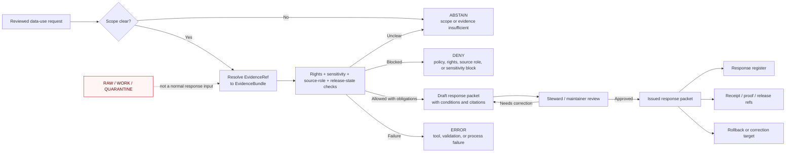

<!-- [KFM_META_BLOCK_V2]
doc_id: kfm://doc/NEEDS-VERIFICATION
title: Data Use Response
type: standard
version: v1
status: draft
owners: OWNER_TBD
created: 2026-05-02
updated: 2026-05-02
policy_label: public
related: [NEEDS_VERIFICATION:../data/README.md, NEEDS_VERIFICATION:../policy/README.md, NEEDS_VERIFICATION:../contracts/README.md, NEEDS_VERIFICATION:../schemas/README.md, NEEDS_VERIFICATION:../docs/runbooks/README.md, NEEDS_VERIFICATION:../release/README.md]
tags: [kfm, data-use-response, evidence, policy, publication, governance]
notes: [Target path and ownership require mounted-repo verification; this README is public documentation, but response artifacts may carry restricted policy labels.]
[/KFM_META_BLOCK_V2] -->

# Data Use Response

Governed response packets for requests to use, reuse, export, cite, publish, restrict, deny, or correct KFM data and derived artifacts.

> [!IMPORTANT]
> **Status:** experimental  
> **Owner:** OWNER_TBD  
> **Path:** `data_use_response/README.md`  
> **Truth posture:** CONFIRMED KFM doctrine / PROPOSED directory conventions / UNKNOWN current repo implementation depth  
> **Default release posture:** cite-or-abstain; deny or restrict when evidence, rights, sensitivity, review, or release state is insufficient

<p>
  
  
  
  
  
</p>

**Quick jumps:** [Scope](#scope) · [Repo fit](#repo-fit) · [Accepted inputs](#accepted-inputs) · [Exclusions](#exclusions) · [Directory map](#directory-map) · [Operating flow](#operating-flow) · [Response packet minimum](#response-packet-minimum) · [Review checklist](#review-checklist) · [Rollback](#rollback-and-correction) · [Verification backlog](#verification-backlog)

---

## Evidence boundary

> [!NOTE]
> This README states KFM doctrine where supported by the project corpus. Current implementation depth is **UNKNOWN** because the target repository, tests, workflows, emitted receipts, dashboards, runtime logs, and path inventory were not mounted in this session.
>
> Treat `data_use_response/` as the requested target path and as a **PROPOSED** repo convention until maintainers verify it against the actual checkout.

This directory is not a general customer-service inbox, not a raw-data store, and not an API response cache. It is a governed documentation and review surface for data-use decisions that must remain traceable to evidence, source roles, rights, policy, review state, release state, and correction lineage.

---

## Scope

`data_use_response/` stores human-reviewable response packets and registers for data-use decisions.

A data-use response may answer questions such as:

- May this dataset, layer, claim, map, table, export, or evidence bundle be reused?
- What citation, attribution, rights statement, redaction, or generalization is required?
- Why did KFM deny, abstain from, restrict, withdraw, or supersede a requested data use?
- Which EvidenceBundle, PolicyDecision, ReviewRecord, ReleaseManifest, CorrectionNotice, or receipt supports the response?
- What must be verified before a response can move from draft to issued?

The public unit of value remains the inspectable claim. A response packet should not ask readers to trust fluent prose when a governed evidence path is required.

[Back to top](#data-use-response)

---

## Repo fit

| Surface | Role | Status |
| --- | --- | --- |
| `data_use_response/README.md` | Orientation, guardrails, accepted inputs, exclusions, response flow, and review checklist for this directory. | **PROPOSED** target file from current request |
| `data_use_response/index.md` | Response register listing issued, denied, abstained, withdrawn, and superseded responses. | **PROPOSED** |
| `../data/registry/` | Source and dataset registry references that explain source role, rights, cadence, sensitivity, and activation posture. | **NEEDS VERIFICATION** |
| `../data/receipts/` | Durable process receipts, validation receipts, review receipts, redaction receipts, or run receipts. | **NEEDS VERIFICATION** |
| `../data/proofs/` | Proof packs and integrity evidence for release-significant artifacts. | **NEEDS VERIFICATION** |
| `../policy/` | Policy rules for rights, sensitivity, release, promotion, abstention, denial, and correction. | **NEEDS VERIFICATION** |
| `../contracts/` | Human-readable object meaning, lifecycle semantics, and invariants where the repo uses that split. | **NEEDS VERIFICATION** |
| `../schemas/` | Machine-checkable shapes, enums, and executable constraints where the repo uses that split. | **NEEDS VERIFICATION** |
| `../release/` and `../data/published/` | Released artifacts and publication surfaces. Response packets may refer to them but must not replace them. | **NEEDS VERIFICATION** |
| `../docs/runbooks/` | Operational runbooks for data-use review, promotion, correction, rollback, and platform verification. | **NEEDS VERIFICATION** |

> [!WARNING]
> Public clients and ordinary UI surfaces must not use `data_use_response/` as a bypass around governed APIs, released artifacts, policy decisions, or EvidenceBundle resolution.

[Back to top](#data-use-response)

---

## Accepted inputs

Only store reviewable response material that is safe for the directory’s policy label and supported by linked evidence.

| Accepted input | What it must contain | Notes |
| --- | --- | --- |
| Reviewed request summaries | Request scope, requester class if allowed, requested artifact or claim, intended use, time window, and policy label. | Do not store unnecessary personal information. |
| Draft response packets | Proposed disposition, evidence references, policy posture, rights/sensitivity summary, reviewer notes, open verification items. | Drafts must remain visibly non-authoritative. |
| Issued response packets | Final disposition, reviewer, date, evidence bundle refs, policy decision refs, conditions, citation obligations, rollback target. | Must be traceable to review and receipts. |
| Denial / abstention records | Reason codes, missing evidence, blocking policy, unresolved rights, sensitivity concerns, or source-role limits. | Negative outcomes are first-class records. |
| Supersession / withdrawal notes | Prior response ID, replacement response ID if any, reason, effective date, correction notice ref, reviewer. | Do not silently delete issued responses. |
| Response templates | Human-readable templates for consistent, evidence-bound response drafting. | Templates are not policy authority. |
| Response registers | Compact indexes for issued, pending, denied, abstained, withdrawn, and superseded responses. | Registers should point to packets and receipts rather than duplicating them. |

---

## Exclusions

| Do not store here | Use instead | Reason |
| --- | --- | --- |
| Raw source data, unpublished source records, or acquisition dumps | `../data/raw/`, `../data/work/`, or `../data/quarantine/` | Preserves the KFM trust membrane. |
| Processed canonical datasets | `../data/processed/` | Response text is not canonical data. |
| Published artifacts, map tiles, GeoParquet, PMTiles, COGs, or exports | `../data/published/` or `../release/` | Publication is a governed state transition, not a response-folder file move. |
| Source credentials, API keys, private tokens, or secret-bearing environment files | Secret-management surface outside repo content | Prevents accidental exposure. |
| Machine schema authority | `../schemas/` and/or `../contracts/` after ADR confirmation | Avoids parallel schema authority. |
| Policy rules or policy bundles | `../policy/` | Response packets consume policy; they do not define it. |
| Runtime API response caches | Runtime/cache surface after repo inspection | Prevents treating ephemeral responses as review records. |
| EvidenceBundle source payloads | Evidence and catalog homes after repo inspection | Response packets reference evidence; they do not replace it. |
| Exact sensitive geometry, living-person private data, restricted archaeological locations, DNA-derived details, or steward-controlled records | Quarantine, restricted review, or redacted/generalized release surfaces | KFM fails closed where sensitivity or rights are unresolved. |

[Back to top](#data-use-response)

---

## Directory map

**PROPOSED starter structure.** Adjust after mounted-repo inspection.

```text
data_use_response/
├── README.md
├── index.md                         # PROPOSED: response register
├── requests/
│   └── README.md                    # PROPOSED: reviewed request-summary rules
├── responses/
│   ├── draft/
│   ├── review/
│   ├── issued/
│   └── withdrawn/
├── templates/
│   ├── data_use_response.md
│   └── data_use_response.yaml
└── registers/
    ├── response_register.md
    └── supersession_register.md
```

Recommended file naming:

```text
YYYY-MM-DD_<short-scope>_<disposition>.md
```

Examples are illustrative only:

```text
2026-05-02_hydrology-huc12-public-layer_allow-with-limits.md
2026-05-02_sensitive-species-occurrence_exact-location_deny.md
2026-05-02_historic-map-export_rights-unclear_abstain.md
```

[Back to top](#data-use-response)

---

## Operating flow

A response starts with a scoped request. It may end in allow, allow with limits, deny, abstain, error, withdrawal, or supersession. It must not end in unsupported publication.



### PROPOSED response dispositions

| Disposition | Use when | Public posture |
| --- | --- | --- |
| `ALLOW` | Evidence, rights, sensitivity, release state, and review support the requested use. | Publish or share only through governed released paths. |
| `ALLOW_WITH_LIMITS` | Use is allowed only with citation, attribution, redaction, generalization, time limit, access limit, or other obligations. | Conditions must be visible in the response. |
| `DENY` | Policy, rights, sensitivity, source role, review state, or public-safety posture blocks the requested use. | Record reason; do not disclose restricted details unnecessarily. |
| `ABSTAIN` | KFM lacks enough evidence, source clarity, rights clarity, review state, or release support to answer. | Cite the missing support rather than guessing. |
| `ERROR` | A process, tool, validation, source, or environment failure prevents a trustworthy decision. | Do not convert errors into approval. |
| `NEEDS_REVIEW` | A draft is not ready for issue. | Not authoritative. |
| `WITHDRAWN` | An issued response should no longer be used. | Preserve lineage unless policy requires restricted handling. |
| `SUPERSEDED` | A later response replaces an earlier one. | Link both records and explain why. |

---

## Response packet minimum

A response packet should contain the smallest set of fields needed to make the decision inspectable.

| Field | Required? | Purpose |
| --- | --- | --- |
| `response_id` | Yes | Stable local identifier or placeholder until the repo ID convention is confirmed. |
| `status` | Yes | `draft`, `review`, `issued`, `withdrawn`, or `superseded`. |
| `disposition` | Yes | Finite response outcome. |
| `request_ref` | Yes | Link to reviewed request summary, not raw private request content. |
| `scope` | Yes | Dataset, layer, claim, geography, time range, export, or artifact covered. |
| `evidence_refs` | Yes when claim-bearing | EvidenceRef or EvidenceBundle references supporting the response. |
| `policy_refs` | Yes | Rights, sensitivity, release, promotion, or denial policy references. |
| `source_role_summary` | Yes | Whether cited sources can support the requested claim or use. |
| `release_state` | Yes | Whether the requested artifact is published, draft, restricted, quarantined, withdrawn, or unknown. |
| `conditions` | Required for `ALLOW_WITH_LIMITS` | Citation, attribution, redaction, access, time, geography, or redistribution obligations. |
| `reviewer` | Required before issue | Reviewer or role responsible for approval. Use `OWNER_TBD` until confirmed. |
| `receipt_refs` | Required when available | Pointers to review, validation, redaction, promotion, correction, or run receipts. |
| `rollback_target` | Required before issue | What to withdraw, correct, or supersede if the response is wrong. |
| `open_items` | Required for draft/review | Verification gaps blocking stronger posture. |

### Illustrative front matter

This example is **PROPOSED** and must be reconciled with actual schemas before use as a contract.

```yaml
response_id: RESPONSE_ID_TBD
status: draft
disposition: ABSTAIN
policy_label: restricted
request_ref: kfm://data-use-request/NEEDS-VERIFICATION
scope:
  artifact_ref: ARTIFACT_REF_TBD
  geography: NEEDS VERIFICATION
  valid_time: NEEDS VERIFICATION
  as_of_time: 2026-05-02
evidence_refs:
  - kfm://evidence/NEEDS-VERIFICATION
policy_refs:
  - kfm://policy/rights-sensitivity/NEEDS-VERIFICATION
source_role_summary: NEEDS VERIFICATION
release_state: UNKNOWN
conditions: []
reviewer: OWNER_TBD
receipt_refs: []
rollback_target: ROLLBACK_TARGET_TBD
open_items:
  - Confirm target artifact release state.
  - Confirm source rights and attribution.
  - Confirm sensitivity and redaction requirements.
```

[Back to top](#data-use-response)

---

## Policy and safety rules

> [!CAUTION]
> A data-use response must never convert restricted, unpublished, source-unclear, rights-unclear, or sensitivity-unclear material into public authority by phrasing.

Required posture:

- Cite-or-abstain for claim-bearing responses.
- Deny or abstain when rights, source role, sensitivity, release state, or review state are unresolved.
- Preserve the canonical lifecycle: `RAW -> WORK / QUARANTINE -> PROCESSED -> CATALOG / TRIPLET -> PUBLISHED`.
- Treat publication as a governed state transition, not a copy into this directory.
- Use redaction, generalization, staged access, or restricted review for sensitive locations and sensitive personal, cultural, ecological, archaeological, DNA, land/title, or security-relevant details.
- Store only the minimum request context needed for review and traceability.
- Keep secrets outside repository content.
- Preserve correction lineage for issued responses.

### AI boundary

AI may help draft a response only after admissible evidence, policy posture, and release state are known. AI may not approve data use, invent citations, bypass policy, read canonical/internal stores directly, or turn generated language into root truth.

[Back to top](#data-use-response)

---

## Quickstart

Use this checklist when creating or reviewing a response packet.

1. Confirm the request has a reviewed summary.
2. Confirm the requested artifact, claim, dataset, export, or layer is in scope.
3. Resolve EvidenceRef to EvidenceBundle before drafting claim-bearing text.
4. Confirm source role, rights, sensitivity, release state, review state, and correction lineage.
5. Choose a finite disposition.
6. Add conditions or denial/abstention reasons.
7. Link receipts, proof packs, release manifests, correction notices, or rollback targets where available.
8. Route the packet for steward review.
9. Add the issued response to the register only after review passes.
10. Reopen, withdraw, or supersede the packet if later evidence changes the decision.

After this path exists, a maintainer can inspect local response files with:

```bash
find data_use_response -maxdepth 3 -type f | sort
```

> [!NOTE]
> This command only inventories files. It does not validate policy, evidence closure, or release state.

---

## Review checklist

A response is not ready to issue until the following checks are satisfied or explicitly marked `ABSTAIN`, `DENY`, or `ERROR`.

- [ ] Request summary exists and avoids unnecessary private details.
- [ ] Scope is narrow enough to review.
- [ ] EvidenceRef resolves to EvidenceBundle for every claim-bearing statement.
- [ ] Source roles support the requested use.
- [ ] Rights and attribution are known or the response abstains/denies.
- [ ] Sensitivity classification is known or the response abstains/denies.
- [ ] Release state is known or the response abstains/denies.
- [ ] Required redaction or generalization is documented.
- [ ] Policy references are included.
- [ ] Review state is included.
- [ ] Receipt, proof, release, or correction references are included when available.
- [ ] Rollback or supersession target is identified.
- [ ] The response text does not imply legal, emergency, medical, financial, title, cultural, archaeological, ecological, or living-person authority beyond the supported evidence.
- [ ] The response register is updated after issue.

### Definition of done

This directory is mature enough for stronger claims only when:

- owners are confirmed;
- the path exists in the mounted repo;
- related contracts, schemas, policies, fixtures, validators, receipts, and runbooks are linked;
- at least one valid and one invalid response fixture exist;
- negative outcomes are tested;
- issued response packets are registered;
- withdrawal and supersession are demonstrated;
- no public path bypasses governed APIs or released artifacts.

[Back to top](#data-use-response)

---

## Rollback and correction

Rollback is required when a response:

- cites unsupported evidence;
- misstates source role, rights, sensitivity, release state, or review state;
- exposes restricted or sensitive detail;
- implies a legal or policy permission KFM cannot grant;
- bypasses a governed release path;
- conflicts with a later correction notice, withdrawal, or superseding response.

Rollback actions:

1. Mark the response `withdrawn` or `superseded`.
2. Add a correction or withdrawal note.
3. Update `registers/supersession_register.md`.
4. Link the prior response, replacement response, reason, reviewer, effective date, and rollback target.
5. Quarantine or restrict any leaked sensitive material according to policy.
6. Do not delete issued records merely to hide error history unless policy requires restricted removal.

Rollback target: `ROLLBACK_TARGET_TBD`

---

## Verification backlog

| Item | Status | Needed evidence |
| --- | --- | --- |
| Confirm `data_use_response/` exists or should be created at repo root | **UNKNOWN / NEEDS VERIFICATION** | Mounted repo tree and adjacent README conventions |
| Confirm owners | **UNKNOWN** | CODEOWNERS, team ownership file, or maintainer decision |
| Confirm doc ID | **NEEDS VERIFICATION** | Repo doc registry or generated UUID policy |
| Confirm response object schema home | **CONFLICTED / NEEDS VERIFICATION** | ADR resolving `contracts/` versus `schemas/` authority |
| Confirm policy references | **NEEDS VERIFICATION** | Policy inventory and rights/sensitivity rules |
| Confirm receipt/proof homes | **NEEDS VERIFICATION** | Emitted artifact inventory |
| Confirm valid/invalid fixtures | **UNKNOWN** | Fixture tree and tests |
| Confirm runbook link | **UNKNOWN** | `docs/runbooks/` inventory |
| Confirm public/restricted handling | **NEEDS VERIFICATION** | Policy labels and access-control model |
| Confirm retention and deletion rules | **NEEDS VERIFICATION** | Governance, legal, and sensitivity review |

<details>
<summary>Appendix: response-writing anti-patterns</summary>

Avoid:

- “Approved because it looks public.”
- “No citation needed; it is obvious.”
- “The map shows it, so the claim is true.”
- “The AI summary says it, so the response may cite the summary.”
- “The source exists, so rights are clear.”
- “The artifact is in a folder, so it is published.”
- “The request is small, so review can be skipped.”
- “The response can expose exact sensitive geometry because the requester asked for it.”
- “Deleting a response is the same as correcting it.”

Prefer:

- “ABSTAIN until EvidenceBundle, policy, and release state are confirmed.”
- “DENY exact geometry; offer generalized or restricted-access alternatives when policy allows.”
- “ALLOW_WITH_LIMITS with attribution, citation, redaction, and redistribution conditions.”
- “SUPERSEDE with a correction notice and rollback target.”

</details>

[Back to top](#data-use-response)
