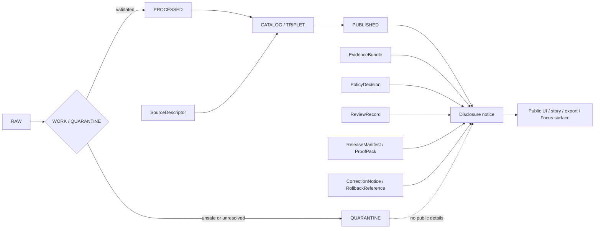

<!-- [KFM_META_BLOCK_V2]
doc_id: kfm://doc/NEEDS-VERIFICATION
title: Disclosure Directory README
type: standard
version: v1
status: draft
owners: OWNER_TBD
created: 2026-05-02
updated: 2026-05-02
policy_label: NEEDS_VERIFICATION
related: [PATH_TBD_AFTER_REPO_INSPECTION]
tags: [kfm, disclosure, publication, rights, sensitivity, evidence, release]
notes: [Target path disclosure/README.md is PROPOSED until mounted repo inspection confirms directory placement; implementation depth UNKNOWN; replace OWNER_TBD and related links before publication.]
[/KFM_META_BLOCK_V2] -->

# Disclosure

Public-facing disclosure guidance for KFM release, rights, sensitivity, correction, and evidence-visibility notices.

> [!IMPORTANT]
> **Directory status:** experimental  
> **Document status:** draft  
> **Owner:** OWNER_TBD  
> **Target path:** `disclosure/README.md` — PROPOSED until repo inspection confirms this directory  
> **Truth posture:** CONFIRMED KFM doctrine / PROPOSED directory behavior / UNKNOWN current repo implementation depth  
>
> 
> 
> 
> 
> 

**Quick jumps:** [Scope](#scope) · [Repo fit](#repo-fit) · [Accepted inputs](#accepted-inputs) · [Exclusions](#exclusions) · [Disclosure workflow](#disclosure-workflow) · [Review gates](#review-gates) · [Rollback](#rollback) · [Verification backlog](#verification-backlog)

---

## Scope

`disclosure/` is the proposed home for **public-safe disclosure notices** that explain what KFM has released, withheld, generalized, narrowed, corrected, superseded, or denied.

A disclosure notice is not root truth. It is a release-facing witness that helps a reader understand:

- what public artifact or claim is being disclosed;
- which EvidenceBundle, ReleaseManifest, PolicyDecision, ReviewRecord, or CorrectionNotice supports the disclosure;
- what rights, sensitivity, freshness, or review constraints apply;
- whether any details were generalized, withheld, delayed, narrowed, superseded, or withdrawn;
- how a maintainer can trace the public statement back to governed evidence without exposing restricted internals.

> [!NOTE]
> KFM’s public unit of value is the inspectable claim. A disclosure notice should make the public consequence inspectable without turning the notice into a substitute for evidence, proof, policy, or review state.

[Back to top](#disclosure)

---

## Repo fit

| Item | Status | Expected relationship |
| --- | --- | --- |
| Target path | `disclosure/README.md` — PROPOSED | Directory README for release-facing disclosure notices. |
| Upstream doctrine | `[Root README](../README.md)` — NEEDS VERIFICATION | Project framing and repo navigation. |
| Upstream policy | `[Policy](../policy/README.md)` — NEEDS VERIFICATION | Policy rules remain authoritative outside this directory. |
| Upstream release artifacts | `[Release](../release/README.md)` — NEEDS VERIFICATION | Release manifests, proof packs, and publication state should live outside disclosure unless repo convention says otherwise. |
| Upstream evidence artifacts | `[Evidence / catalog docs](../docs/README.md)` — NEEDS VERIFICATION | EvidenceBundle and catalog authority should be linked, not duplicated here. |
| Downstream UI surfaces | Evidence Drawer, story pages, exports, Focus Mode — NEEDS VERIFICATION | Public surfaces may summarize disclosures, but must still resolve evidence through governed interfaces. |

> [!CAUTION]
> Do not commit the relative links above until the real repo tree confirms those paths. Replace with repo-native links or mark unresolved links in the verification backlog.

---

## Accepted inputs

The following belong in `disclosure/` when they are public-safe, evidence-linked, and reviewable:

| Accepted input | What it should contain | Required posture |
| --- | --- | --- |
| Release disclosure notice | Public explanation of a released artifact, story, layer, dossier, export, or claim family | Must reference released scope and audit trail. |
| Sensitivity / geoprivacy notice | Explanation that exact details are generalized, withheld, delayed, or staged | Must avoid leaking the restricted fact through the notice itself. |
| Rights / attribution notice | Public-safe statement of reuse, attribution, redistribution, or rights limits | Must not grant rights broader than KFM has cleared. |
| Correction / withdrawal notice | Public explanation that prior outward meaning changed | Must preserve lineage and replacement references. |
| Staleness notice | Public explanation that a released surface remains visible but degraded by time, source status, or correction state | Must state freshness limits without overstating currency. |
| Denial / abstention rationale | Public-safe explanation of why KFM cannot publish or answer a consequential claim | Must expose the reason class, not restricted internals. |
| Disclosure checklist | Maintainer-facing release-readiness checklist for a disclosure notice | Must point to governing policy, release, and review artifacts. |

---

## Exclusions

The disclosure directory must not become a parallel source of truth.

| Do not place here | Goes instead | Reason |
| --- | --- | --- |
| RAW, WORK, or QUARANTINE data | Lifecycle storage — PATH_TBD_AFTER_REPO_INSPECTION | Public disclosure must not expose unpublished material. |
| EvidenceBundle source of truth | Evidence/catalog store — PATH_TBD_AFTER_REPO_INSPECTION | Disclosure may link to evidence; it must not replace it. |
| ReleaseManifest, ProofPack, or PromotionDecision authority | Release/proof object homes — PATH_TBD_AFTER_REPO_INSPECTION | Publication state is governed elsewhere. |
| Policy source files or Rego-like rules | `policy/` — NEEDS VERIFICATION | Policy authority must not split. |
| Contract or schema authority | `schemas/` or `contracts/` — CONFLICTED / NEEDS VERIFICATION | Avoid parallel schema homes without an ADR. |
| Secrets, tokens, keys, credentials, private endpoints | Secret manager / deployment config — PATH_TBD_AFTER_REPO_INSPECTION | Never disclose operational secrets. |
| Vulnerability reports or security exploit details | `SECURITY.md` or security workflow — NEEDS VERIFICATION | Responsible vulnerability disclosure is distinct from public release disclosure. |
| Exact sensitive coordinates or restricted attributes | Controlled evidence store / steward review | Public notices must fail closed where exposure risk exists. |
| Uncited generated AI text | Nowhere as authoritative content | AI output must be evidence-subordinate. |
| Emergency, medical, legal, financial, title, or life-safety instructions | Official authority or governed domain-specific path | KFM may cite official context; it must not become the authority for high-risk action. |

[Back to top](#disclosure)

---

## Disclosure model

Disclosure sits after governed release, not before it.



Disclosure notices should answer four questions:

1. **What can be shown?**
2. **What cannot be shown?**
3. **Why is that the governed outcome?**
4. **Where can the public or a reviewer inspect the evidence, release, policy, and correction trail?**

---

## Disclosure workflow

Use this sequence for every proposed disclosure notice.

1. **Define scope.** Identify the release, artifact, claim family, story, layer, export, or correction being disclosed.
2. **Resolve evidence.** Confirm that every consequential public statement can resolve from EvidenceRef to EvidenceBundle.
3. **Check release state.** Confirm ReleaseManifest, ProofPack, catalog closure, and promotion state.
4. **Check policy.** Confirm rights, sensitivity, review burden, freshness, source role, public geometry, and access class.
5. **Choose public posture.** Use finite outcomes such as `ALLOW`, `GENERALIZE`, `NARROW`, `HOLD`, `DENY`, `ABSTAIN`, `ERROR`, `QUARANTINE`, `STALE_VISIBLE`, `SUPERSEDED`, `WITHDRAWN`, or `CORRECTION_PENDING`.
6. **Write the notice.** Explain the public consequence without exposing restricted internals.
7. **Review.** Require reviewer or steward approval when the lane, source, sensitivity, or release class requires it.
8. **Link outward surfaces.** Ensure UI, story, export, or Focus Mode surfaces point back to the notice and still resolve governed evidence.
9. **Preserve lineage.** Update correction, supersession, withdrawal, or rollback references when public meaning changes.

---

## Outcome language

| Outcome | Use in disclosure |
| --- | --- |
| `ALLOW` | Public release or statement is admissible as scoped. |
| `GENERALIZE` | Public representation is intentionally coarser than internal evidence. |
| `NARROW` | Scope was reduced to a safer or better-supported subset. |
| `HOLD` | Disclosure is pending review, source clarification, rights work, or validation. |
| `DENY` | Rights, sensitivity, provenance, policy, or review state blocks outward disclosure. |
| `ABSTAIN` | KFM lacks sufficient evidence to make the consequential public claim. |
| `ERROR` | Technical failure prevented safe disclosure; do not fabricate a public answer. |
| `QUARANTINE` | Object remains unresolved or unsafe; no public release. |
| `STALE_VISIBLE` | Public artifact remains visible with explicit degraded freshness or correction state. |
| `SUPERSEDED` / `WITHDRAWN` / `CORRECTION_PENDING` | A previously public object changed status; preserve history and public consequence. |

> [!IMPORTANT]
> Negative states are product states. `ABSTAIN`, `DENY`, `QUARANTINE`, `WITHDRAWN`, and `SUPERSEDED` are how KFM avoids false certainty.

---

## Minimum disclosure record

The following is an illustrative record shape, not a canonical schema.

```yaml
# PROPOSED example only — do not treat as schema authority.
disclosure_id: disclosure:SOURCE_ID_TBD
status: draft
audience: public
release_ref: kfm://release/NEEDS-VERIFICATION
artifact_ref: kfm://artifact/NEEDS-VERIFICATION
claim_scope:
  spatial_scope: NEEDS VERIFICATION
  temporal_scope: NEEDS VERIFICATION
  subject_scope: NEEDS VERIFICATION
outcome: ABSTAIN
reason_codes:
  - missing_evidence_bundle
evidence_bundle_refs:
  - kfm://evidence-bundle/NEEDS-VERIFICATION
policy_decision_ref: kfm://policy-decision/NEEDS-VERIFICATION
review_record_ref: kfm://review/NEEDS-VERIFICATION
release_manifest_ref: kfm://release-manifest/NEEDS-VERIFICATION
rights_posture: NEEDS_VERIFICATION
sensitivity_posture: NEEDS_VERIFICATION
public_transform_refs:
  - kfm://transform/NEEDS-VERIFICATION
withheld_detail_summary: "Some detail is withheld pending rights, sensitivity, or review verification."
correction_refs: []
audit_ref: kfm://audit/NEEDS-VERIFICATION
notes:
  - "Replace all NEEDS VERIFICATION values before publication."
```

---

## Public-safe writing standard

A disclosure notice should be clear without being revealing.

Prefer:

- “This layer is shown at a generalized geography because exact locations are restricted.”
- “KFM is abstaining because the cited EvidenceBundle does not support the requested claim.”
- “This story was corrected on `TODO(date)`; the earlier interpretation is preserved in the correction lineage.”
- “The release is visible but stale; source freshness requires review before reuse.”

Avoid:

- exact coordinates, restricted IDs, private source URLs, or internal access paths;
- statements that reveal the existence of a sensitive site, species, person, facility, or record when the fact of existence is itself sensitive;
- broad rights language such as “free to reuse” unless rights are explicitly cleared;
- “AI says,” “map shows,” or “dataset proves” without evidence and source-role support;
- emergency or life-safety instructions.

---

## Review gates

A disclosure notice is not publishable until these checks pass.

- [ ] Target path and adjacent repo links are verified.
- [ ] Owner is known and recorded.
- [ ] Public artifact or claim scope is identified.
- [ ] EvidenceRef resolves to EvidenceBundle for every consequential statement.
- [ ] ReleaseManifest or equivalent release proof exists.
- [ ] PolicyDecision records rights, sensitivity, access, and publication posture.
- [ ] ReviewRecord exists where the lane or risk class requires it.
- [ ] No RAW, WORK, QUARANTINE, internal-only, or secret references are exposed.
- [ ] Exact sensitive geometry is absent or intentionally generalized with a transform receipt.
- [ ] Correction, supersession, withdrawal, or rollback references are recorded when applicable.
- [ ] Public UI, story, export, and Focus surfaces still use governed interfaces.
- [ ] `ABSTAIN`, `DENY`, `ERROR`, or `HOLD` outcomes remain visible rather than hidden.

---

## Proposed directory map

> [!NOTE]
> This map is PROPOSED. Confirm existing repo convention before creating subdirectories.

```text
disclosure/
├── README.md
├── notices/
│   └── YYYY-MM-DD--<release-or-claim-slug>--<outcome>.md
├── templates/
│   ├── disclosure_notice.template.md
│   ├── correction_notice.template.md
│   └── staleness_notice.template.md
├── registers/
│   └── disclosure_register.example.yaml
└── _superseded/
    └── README.md
```

Suggested naming pattern:

```text
YYYY-MM-DD--<release-or-claim-slug>--<outcome>.md
```

Examples:

```text
2026-05-02--huc12-public-layer--allow.md
2026-05-02--rare-species-occurrence--generalize.md
2026-05-02--historic-route-exact-geometry--deny.md
2026-05-02--county-story-population-claim--correction-pending.md
```

---

## Maintenance checklist

Run this checklist whenever this directory changes.

- [ ] Confirm whether `disclosure/` is the repo-native home or whether another path owns public disclosure.
- [ ] Confirm this README is linked from the root README or documentation index.
- [ ] Confirm no disclosure notice creates policy, schema, release, or evidence authority by accident.
- [ ] Confirm all placeholder tokens are searchable and intentional.
- [ ] Confirm any new notice has a rollback or correction path.
- [ ] Confirm public-facing wording is understandable to non-maintainers.
- [ ] Confirm reviewer/steward obligations are visible.
- [ ] Confirm no visual polish hides uncertainty, withheld detail, or evidence gaps.

---

## Rollback

Rollback is required when a disclosure change:

- exposes restricted locations, living-person details, DNA-related information, cultural or archaeological sensitivity, private property/title claims, critical infrastructure detail, or source-restricted data;
- implies public rights that are not cleared;
- bypasses EvidenceBundle, PolicyDecision, ReviewRecord, ReleaseManifest, or correction lineage;
- treats generated language, tiles, graph projections, search indexes, or summaries as sovereign truth;
- breaks stable public links without a correction or supersession notice;
- hides `DENY`, `ABSTAIN`, `ERROR`, `QUARANTINE`, `WITHDRAWN`, or `SUPERSEDED` states.

Rollback target: `ROLLBACK_TARGET_TBD`

Rollback actions:

1. Remove or unpublish the unsafe disclosure notice through the governed release process.
2. Emit or update `CorrectionNotice` / `WithdrawalNotice` where public meaning already escaped.
3. Rebuild affected public surfaces from the last valid ReleaseManifest.
4. Record the rollback reason, affected artifacts, evidence refs, and reviewer decision.
5. Add a regression check so the same leak or overclaim cannot recur silently.

---

## Verification backlog

The following must be resolved before this README is treated as final repo authority.

| Item | Status | Verification needed |
| --- | --- | --- |
| Target path `disclosure/README.md` | PROPOSED | Confirm the directory exists or approve creation. |
| Owner | UNKNOWN | Replace `OWNER_TBD` with the responsible team or maintainer. |
| Metadata `doc_id` | NEEDS VERIFICATION | Assign a real KFM document ID if the repo uses them. |
| Related links | NEEDS VERIFICATION | Replace placeholder related paths with valid repo-relative links. |
| Policy label | NEEDS VERIFICATION | Confirm whether this README is public, restricted, or another repo-defined label. |
| Schema home | CONFLICTED / NEEDS VERIFICATION | Do not create disclosure schemas here unless repo convention and ADR support it. |
| Release/proof homes | UNKNOWN | Confirm where ReleaseManifest, ProofPack, catalog closure, and rollback artifacts live. |
| Security disclosure process | UNKNOWN | Confirm whether `SECURITY.md` or another path governs vulnerability disclosure. |
| UI integration | UNKNOWN | Confirm how Evidence Drawer, stories, exports, and Focus Mode should reference disclosure notices. |
| CI checks | UNKNOWN | Confirm markdown link checks, metadata validation, and public-safety linting once repo workflows are visible. |

---

## Appendix: disclosure notice review questions

<details>
<summary>Maintainer review prompts</summary>

- What public artifact, claim, or release is this notice about?
- What evidence supports the notice?
- Is the notice repeating evidence, or only pointing to evidence?
- Which source role supports the claim?
- Which rights and sensitivity controls apply?
- Is exact geography safe, generalized, withheld, or denied?
- Does the notice reveal restricted existence by implication?
- Is the claim current, stale-visible, corrected, superseded, or withdrawn?
- Can a public user inspect the evidence path without seeing restricted internals?
- Can a reviewer reconstruct why the outward decision was made?
- Is rollback possible without losing correction lineage?
- Does the notice preserve the KFM trust membrane?

</details>

[Back to top](#disclosure)
