<div align="center">

# 🐳 Kansas-Frontier-Matrix — Docker Dev Toolkit

**Mission:** provide a **containerized, reproducible dev environment** for  
GDAL/PROJ + Python (wheels-first), with optional **Node · tippecanoe · pmtiles · S3 · PostGIS · Neo4j**.  
Keep your host clean while producing **reproducible data artifacts** and **valid STAC catalogs**.

[](https://github.com/bartytime4life/Kansas-Frontier-Matrix/actions/workflows/site.yml)
[](https://github.com/bartytime4life/Kansas-Frontier-Matrix/actions/workflows/tests.yml)
[](https://github.com/bartytime4life/Kansas-Frontier-Matrix/actions/workflows/stac-validate.yml)
[](https://github.com/bartytime4life/Kansas-Frontier-Matrix/actions/workflows/stac-badges.yml)

[](https://github.com/bartytime4life/Kansas-Frontier-Matrix/actions/workflows/docker.yml)
[](https://github.com/bartytime4life/Kansas-Frontier-Matrix/actions/workflows/sbom.yml)
[](https://github.com/bartytime4life/Kansas-Frontier-Matrix/actions/workflows/codeql.yml)
[](https://github.com/bartytime4life/Kansas-Frontier-Matrix/actions/workflows/trivy.yml)
[](https://github.com/bartytime4life/Kansas-Frontier-Matrix/actions/workflows/ossf-scorecard.yml)


</div>

> **Why containers?** Same tools, same versions, same flags — across macOS, Linux, and CI. No “works on my machine.”

---

## 🧪 TL;DR (3 steps)

```bash
# 1) Build (GDAL pinned; wheels-first Python)
docker build -t kfm:dev -f docker/Dockerfile .

# 2) Open a dev shell with the repo mounted (non-root = host UID/GID)
docker run --rm -it -u $(id -u):$(id -g) \
  -v "$PWD":/workspace -w /workspace kfm:dev bash

# 3) Run project targets *inside the container*
make terrain                # hillshade / slope / aspect (and configured terrain metrics)
make stac stac-validate     # build & validate STAC collections/items
make site                   # build viewer/site artifacts
````

Prefer the helper (buildx cache + one-liners):

```bash
# Open dev shell
./docker/build-and-run.sh

# Run Make targets (no manual docker commands)
./docker/build-and-run.sh make terrain
./docker/build-and-run.sh make stac stac-validate-items site

# Compose-based shell (brings services as needed)
./docker/build-and-run.sh --compose shell
./docker/build-and-run.sh --compose make prebuild
```

---

## 🏗️ What’s in the base image

* **GDAL/PROJ + core CLIs** (`gdal_translate`, `gdaldem`, `ogr2ogr`, …)
* **Python** (wheels-first; repo installed editable at runtime)
* **git-lfs** for large rasters
* **Non-root default user**; `/workspace` ready for bind mount
* **Healthchecks** for GDAL & geo toolchain (and tiling CLIs when enabled)

### 🔧 Feature flags (build args)

| ARG             | Default                                  | Purpose                                 |
| --------------- | ---------------------------------------- | --------------------------------------- |
| `GDAL_IMAGE`    | `ghcr.io/osgeo/gdal:ubuntu-small-latest` | Base image / GDAL pin                   |
| `BUILD_NATIVE`  | `0`                                      | Allow source builds when wheels missing |
| `ENABLE_NODE`   | `1`                                      | Install Node.js + corepack (web builds) |
| `ENABLE_TILES`  | `1`                                      | Install tippecanoe + pmtiles CLIs       |
| `ENABLE_AWSCLI` | `1`                                      | Install AWS CLI (S3/MinIO sync)         |
| `USER_ID`       | `10001`                                  | Image user UID                          |
| `GROUP_ID`      | `10001`                                  | Image user GID                          |
| `VCS_REF`       | (injected)                               | Git SHA provenance label                |
| `BUILD_DATE`    | (injected)                               | ISO build timestamp label               |

**Example:** pin GDAL & enable tiling

```bash
docker build -t kfm:dev -f docker/Dockerfile \
  --build-arg ENABLE_TILES=1 \
  --build-arg ENABLE_NODE=1 \
  --build-arg GDAL_IMAGE=ghcr.io/osgeo/gdal:ubuntu-small-3.9.0 \
  .
```

---

## 🧩 Compose stack (profiles)

`docker/compose.yml` defines a profile-driven stack:

* `kfm` — dev toolbox container
* `db` profile — **PostGIS + pgAdmin**
* `storage` profile — **MinIO** (S3-compatible) + bootstrap (buckets for `cogs/`, `tiles/`)
* `web` profile — **Caddy** (serves `_site/`) + **pmtiles-server**
* `graph` profile — **Neo4j** (knowledge graph) + volume persistence

```bash
# Shell in dev container (lean)
docker compose -f docker/compose.yml run --rm kfm bash

# Bring up PostGIS & pgAdmin
docker compose -f docker/compose.yml --profile db up -d

# Bring up MinIO + pmtiles + Caddy (serve site and .pmtiles)
docker compose -f docker/compose.yml --profile storage --profile web up -d

# Bring up Neo4j (graph)
docker compose -f docker/compose.yml --profile graph up -d
```

**Default ports:** Postgres **5432**, pgAdmin **8081**, MinIO **9000/9001**, Caddy **8080**, PMTiles **8082**, Neo4j **7474/7687**.

---

## 🗺️ Host ↔ Container layout

Artifacts stay on the host via bind mount:

```
/workspace
├── data/               # raw/, processed/, cogs/, derivatives/, tiles/ (see data/README.md)
├── stac/               # items/, collections/
├── web/                # viewer config + assets (optional Node build)
├── _site/              # built site (served by Caddy, 'web' profile)
├── scripts/            # CLI helpers (convert, validate, etc.)
└── Makefile            # canonical entry points
```

**Run pattern** (non-root to avoid root-owned files on host):

```bash
docker run --rm -it \
  -u $(id -u):$(id -g) \
  -v "$PWD":/workspace -w /workspace \
  kfm:dev bash
```

---

## 🔐 Environment variables (pass-through)

The helper and compose pass these through:

| Variable                                             | Purpose                                    |
| ---------------------------------------------------- | ------------------------------------------ |
| `KFM_ENV`                                            | environment tag (dev, ci, …)               |
| `KFM_DATA_ROOT`                                      | path to data/ (default `/workspace/data`)  |
| `KFM_STAC_ROOT`                                      | path to stac/  (default `/workspace/stac`) |
| `PGHOST` `PGPORT` `PGDATABASE` `PGUSER` `PGPASSWORD` | PostGIS connectivity                       |
| `S3_ENDPOINT_URL`, `AWS_*`                           | MinIO/S3 connectivity                      |
| `KSRIV_CHANNELS`, `KSRIV_FLOODPLAIN`, `KSRIV_GAUGES` | optional hydrology services                |

**Optional `.env`:**

```dotenv
KFM_ENV=dev
KFM_DATA_ROOT=/workspace/data
KFM_STAC_ROOT=/workspace/stac

# Postgres (compose db profile)
PGHOST=db
PGPORT=5432
PGDATABASE=kfm
PGUSER=kfm
PGPASSWORD=kfm

# MinIO (compose storage profile)
S3_ENDPOINT_URL=http://minio:9000
AWS_ACCESS_KEY_ID=kfm
AWS_SECRET_ACCESS_KEY=kfm-secret
AWS_DEFAULT_REGION=us-east-1
```

---

## 🧵 Common workflows

**Make targets (inside container)**

```bash
make env                      # print detected tools & paths
make vectors                  # normalize & clean vectors
make cogs                     # convert rasters to COG
make terrain                  # hillshade/slope/aspect/tri/tpi (configured)
make stac stac-validate       # generate & validate STAC catalog
make stac-validate-items      # fast STAC item validation pass
make site                     # generate site configs/manifests into _site/
make clean                    # remove generated rasters (keeps ./stac)
```

**Vector tiling (if `ENABLE_TILES=1`)**

```bash
# Tippecanoe → PMTiles
tippecanoe -o data/tiles/ks_roads.mbtiles -zg -pf -pk -ps -ai \
  data/processed/vectors/ks_railroads.json

pmtiles convert data/tiles/ks_roads.mbtiles data/tiles/ks_roads.pmtiles

# Serve locally (compose 'web' profile also serves pmtiles)
pmtiles serve data/tiles
```

**Hydrology fetch (with service URLs)**

```bash
docker run --rm -v "$PWD":/workspace -w /workspace \
  -e KSRIV_CHANNELS="https://…/FeatureServer/0" \
  -e KSRIV_FLOODPLAIN="https://…/FeatureServer/1" \
  -e KSRIV_GAUGES="https://…/FeatureServer/2" \
  kfm:dev make hydrology-fetch hydrology-stac
```

---

## ⚡ Performance & caching

* **Buildx cache** — `./docker/build-and-run.sh` uses `./.cache/buildx` for incremental builds
* **pip/npm caches** — persisted under `./.cache/{pip,npm}`, mounted into the container
* **Data reuse** — `data/` is host-mounted; downloads / COGs / tiles persist across runs

Keep base fresh:

```bash
docker pull ghcr.io/osgeo/gdal:ubuntu-small-latest
```

---

## 👤 UID/GID & permissions

Prevent root-owned files on host:

```bash
docker run --rm -it \
  -u $(id -u):$(id -g) \
  -v "$PWD":/workspace -w /workspace \
  kfm:dev bash
```

Or bake a matching user during build:

```bash
docker build -t kfm:dev -f docker/Dockerfile \
  --build-arg USER_ID=$(id -u) --build-arg GROUP_ID=$(id -g) .
```

**macOS (Apple Silicon):** for CI parity requiring `linux/amd64`, use buildx `--platform linux/amd64`. QEMU emulation can be slower for GDAL.

---

## 🧠 GPU / heavy runs (optional)

This stack is CPU-first. For CUDA workflows:

```bash
# Requires NVIDIA runtime + CUDA-capable base image
docker run --rm --gpus all \
  -v "$PWD":/workspace -w /workspace your-cuda-image make <target>
```

The helper supports `--gpu` to request GPUs when present.

---

## 🤖 CI usage (GitHub Actions)

```yaml
- name: Build image (with provenance labels)
  run: |
    docker build -t kfm:ci -f docker/Dockerfile \
      --build-arg VCS_REF=${{ github.sha }} \
      --build-arg BUILD_DATE=$(date -u +%Y-%m-%dT%H:%M:%SZ) .

- name: Validate STAC + build site
  run: |
    docker run --rm -v "$PWD":/workspace -w /workspace \
      kfm:ci bash -lc "make stac && make stac-validate-items && make site"
```

Bring services as needed with compose:

```bash
docker compose -f docker/compose.yml --profile storage --profile web up -d
```

---

## 🧰 Troubleshooting

* **`gdaldem: command not found`** — ensure you built the provided Dockerfile & are inside the toolbox container:
  `docker run --rm kfm:dev gdaldem --version`
* **Wheels missing / source build required** — rebuild with `--build-arg BUILD_NATIVE=1` or add wheels to `constraints.txt`.
* **Permission denied on `data/`** — run with `-u $(id -u):$(id -g)` or bake `USER_ID/GROUP_ID` at build time.
* **MinIO / pmtiles not reachable** — bring up profiles:
  `docker compose -f docker/compose.yml --profile storage --profile web up -d`
* **PostGIS not ready** — compose healthchecks gate ready state: `docker compose ps`.
* **Neo4j auth/volume** — first boot initializes `/data`; set `NEO4J_AUTH=neo4j/test` and map volumes.

---

## 🛡️ Security & provenance

* **Pin base images** for releases (e.g., `:ubuntu-small-3.9.0`), set **`VCS_REF`** and **`BUILD_DATE`** labels
* Generate **SBOMs** (e.g., Syft) in release workflows
* Image **never copies your data**; artifacts remain in the mounted repo
* Prefer **read-only S3 credentials** for CI uploads; scope MinIO users per bucket

---

## 🪟 Notes for Windows users

* Use **WSL2** + Docker Desktop. Bind mount repo paths inside WSL to avoid path/perm issues.
* Line endings: keep scripts **LF** to avoid `bash` execution problems.

---

## 🗺️ Overview (Mermaid)

```mermaid
flowchart LR
  A["Host\nrepo mount: /workspace"] --> B["kfm:dev\nGDAL · Python · Node (opt)"]
  B --> C["Make targets\ncogs · terrain · stac · site"]
  B --> D["Services via Compose\nPostGIS · MinIO · pmtiles · Caddy · Neo4j"]
  C --> E["Artifacts on host\nCOGs · tiles · _site · STAC"]
  D --> E
```



<!-- END OF MERMAID -->

---

## 🔎 See also

* `docker/Dockerfile` — feature-flagged GDAL + Python + tiling toolchain
* `docker/compose.yml` — dev stack with PostGIS, MinIO, Caddy, pmtiles server, Neo4j
* `docker/build-and-run.sh` — buildx-cached helper with Compose & GPU options
* `Makefile` — canonical targets; drives STAC validation and site builds
* `data/README.md` — data directories, LFS policy, naming conventions
* `stac/` — STAC structure, validation, and authoring rules

---

Happy mapping. 🌾

```
```
