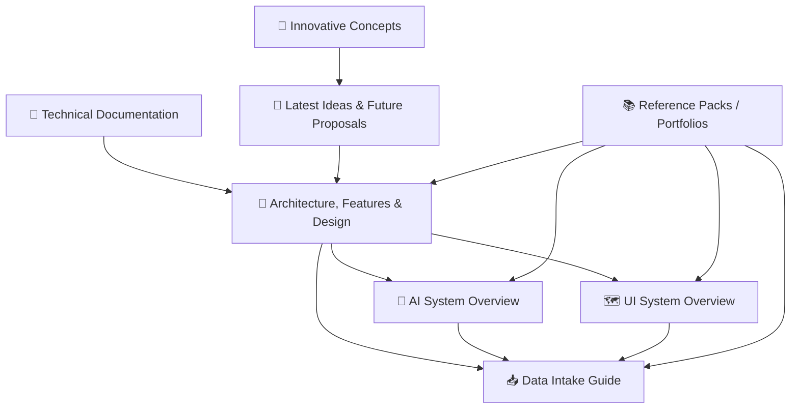

# 🗄️ docs/99_archive — KFM Source Docs Vault (PDFs + Reference Packs)


> [!IMPORTANT]
> This folder preserves **source PDFs** that shaped Kansas Frontier Matrix (KFM).  
> ✅ Use them for **traceability, context, and deep reference**.  
> 🚫 Do **not** treat them as the canonical “current system behavior” unless a maintained Markdown doc or code explicitly confirms it.

---

## 🔎 Quick links (pick your mission)

- 🧱 **Architecture & stack** → [Comprehensive Architecture, Features, and Design](<Kansas Frontier Matrix (KFM) – Comprehensive Architecture, Features, and Design.pdf>)
- 📘 **End‑to‑end technical blueprint** → [Comprehensive Technical Documentation](<Kansas Frontier Matrix (KFM) – Comprehensive Technical Documentation.pdf>)
- 📥 **Data intake + metadata standards** → [Data Intake – Technical & Design Guide](<📚 Kansas Frontier Matrix (KFM) Data Intake – Technical & Design Guide.pdf>)
- 🗺️ **UI/UX (2D/3D map, timeline, story nodes)** → [Comprehensive UI System Overview](<Kansas Frontier Matrix – Comprehensive UI System Overview.pdf>)
- 🧭 **AI / Focus Mode (RAG, provenance, governance)** → [AI System Overview](<Kansas Frontier Matrix (KFM) – AI System Overview 🧭🤖.pdf>)
- 🌟 **Roadmap & proposals** → [Latest Ideas & Future Proposals](<🌟 Kansas Frontier Matrix – Latest Ideas & Future Proposals.docx.pdf>) + [Innovative Concepts](<Innovative Concepts to Evolve the Kansas Frontier Matrix (KFM).pdf>)
- 📚 **Deep reference packs (portfolios/books)** → [AI Concepts & more](<AI Concepts & more.pdf>) · [Data Management bundle](<Data Managment-Theories-Architures-Data Science-Baysian Methods-Some Programming Ideas.pdf>) · [Maps/Geospatial bundle](<Maps-GoogleMaps-VirtualWorlds-Archaeological-Computer Graphics-Geospatial-webgl.pdf>) · [Programming languages/resources](<Various programming langurages & resources 1.pdf>)

---

## 🧭 Why this archive exists

KFM’s documentation repeatedly pushes a **“provenance-first / evidence-first”** design philosophy: every map layer, dataset, insight, and story should be traceable back to sources, transforms, and governance rules.

This archive is the **paper trail** for that philosophy 🧾✨:
- 📌 Original concept & system design PDFs
- 🧠 AI design notes + governance patterns
- 🗺️ UI/UX deep dives (map + timeline + story nodes)
- 📥 Intake standards, schema profiles, policy-as-code thinking
- 📚 “Library packs” of books/papers/tools that informed decisions

---

## 🗺️ How the docs connect (reading map)



> [!TIP]
> If you’re new: **Technical → Architecture → Intake → UI → AI → Proposals** (then dive into the reference packs).

---

## 📦 Inventory (snapshot: 2026-01-19)

### ✅ KFM core blueprints (the “big 5”)

| ID | File | Size | Best for | Key themes 🔑 |
|---:|---|---:|---|---|
| KFM-CORE-01 | 📘 [Kansas Frontier Matrix (KFM) – Comprehensive Technical Documentation](<Kansas Frontier Matrix (KFM) – Comprehensive Technical Documentation.pdf>) | 480K | The end‑to‑end blueprint | provenance-first · standards · APIs · security · integration |
| KFM-CORE-02 | 🧱 [Kansas Frontier Matrix (KFM) – Comprehensive Architecture, Features, and Design](<Kansas Frontier Matrix (KFM) – Comprehensive Architecture, Features, and Design.pdf>) | 222K | System architecture & major feature set | PostGIS + Neo4j · service layers · story nodes · policy gates |
| KFM-CORE-03 | 🧭 [Kansas Frontier Matrix (KFM) – AI System Overview 🧭🤖](<Kansas Frontier Matrix (KFM) – AI System Overview 🧭🤖.pdf>) | 134K | “Focus Mode” AI concepts | RAG · knowledge graph · evidence-backed answers · caching |
| KFM-CORE-04 | 🗺️ [Kansas Frontier Matrix – Comprehensive UI System Overview](<Kansas Frontier Matrix – Comprehensive UI System Overview.pdf>) | 215K | Frontend UX patterns | 2D/3D map · timeline · story nodes UI · layer mgmt · collaboration |
| KFM-CORE-05 | 📥 [📚 Kansas Frontier Matrix (KFM) Data Intake – Technical & Design Guide](<📚 Kansas Frontier Matrix (KFM) Data Intake – Technical & Design Guide.pdf>) | 393K | Data ingestion + governance | STAC/DCAT/PROV · QA/CI · W‑P‑E agents · federation · FAIR/CARE |

---

### 🌟 Roadmap & future direction

| ID | File | Size | Best for | Key themes 🔑 |
|---:|---|---:|---|---|
| KFM-PLAN-01 | 🌟 [Kansas Frontier Matrix – Latest Ideas & Future Proposals](<🌟 Kansas Frontier Matrix – Latest Ideas & Future Proposals.docx.pdf>) | 399K | Roadmap thinking & next features | testing/QA · security/governance · scaling · federation |
| KFM-PLAN-02 | 🚀 [Innovative Concepts to Evolve the Kansas Frontier Matrix (KFM)](<Innovative Concepts to Evolve the Kansas Frontier Matrix (KFM).pdf>) | 66K | “Big swing” ideas | temporal simulation · AR · AI storytelling · crowdsourced verification |

---

### 📚 Reference packs (large PDF portfolios / bundled libraries)

> [!NOTE]
> These files are **huge** and may contain **multiple embedded documents/books**.  
> Some viewers show only a “PDF portfolio” landing page—use **Adobe Acrobat/Reader** for best access, or extract embedded PDFs into `docs/99_archive/library/`.

| ID | File | Size | What it is | Typical use 🧰 |
|---:|---|---:|---|---|
| KFM-LIB-01 | 🤖 [AI Concepts & more](<AI Concepts & more.pdf>) | 272M | AI/ML concept library | grounding AI terminology · LLM/RAG background · model governance ideas |
| KFM-LIB-02 | 🧠 [Data Managment…Data Science…Bayesian Methods…](<Data Managment-Theories-Architures-Data Science-Baysian Methods-Some Programming Ideas.pdf>) | 233M | data management + analytics bundle | pipeline patterns · data architecture · probabilistic methods |
| KFM-LIB-03 | 🗺️ [Maps…Geospatial…WebGL…](<Maps-GoogleMaps-VirtualWorlds-Archaeological-Computer Graphics-Geospatial-webgl.pdf>) | 216M | geospatial/web mapping bundle | Map UX patterns · 3D/webgl concepts · geospatial tech references |
| KFM-LIB-04 | 🧰 [Various programming langurages & resources 1](<Various programming langurages & resources 1.pdf>) | 230M | programming resources bundle | language references · tooling · general software engineering material |

---

## 🧩 Notable “embedded/library” docs spotted inside the bundles (examples)

These titles appear in the bundled reference materials and/or are indexed by our project search tooling.  
If they become important, **extract them** into `docs/99_archive/library/` and add them to a manifest ✅

- 🧱 **Kansas-Frontier-Matrix: Open-Source Geospatial Historical Mapping Hub Design** (early architecture + layer catalog ideas)
- 🐍 **KFM – Python Geospatial Analysis Cookbook** (practical PostGIS/GDAL/Django/Folium recipes)
- 📊 **Data Mining Concepts & Applications** (data mining reference material)
- 🧪 **Foundational Templates & Glossary for Scientific Method / Research / Master Coder Protocol** (process + documentation templates)

> [!TIP]
> Keep this list short and curated. The full set of embedded items can be *huge*—track them via a `MANIFEST.yml` instead of bloating this README.

---

## 🧾 Archive rules (how we keep this folder useful)

### ✅ Do
- ✅ Treat PDFs as **immutable artifacts** (append new versions; don’t “edit in place”).
- ✅ Add/maintain a **manifest** with provenance + licensing for each PDF.
- ✅ Use **Git LFS** (or external artifact storage) for large binaries.
- ✅ Prefer extracting **actionable, maintained** docs into Markdown elsewhere in `/docs/`.

### 🚫 Don’t
- 🚫 Don’t rely on a PDF line from the archive as “current behavior” if code/docs diverged.
- 🚫 Don’t commit giant PDFs to Git without LFS (repo bloat = pain).
- 🚫 Don’t add copyrighted material without license clarity.

---

## 🧾 Suggested manifest format (drop-in)

Create a `docs/99_archive/MANIFEST.yml` (or `.json`) and track **source + license + role**:

```yaml
# docs/99_archive/MANIFEST.yml
archive:
  snapshot_date: "2026-01-19"
  items:
    - id: KFM-CORE-01
      title: "Comprehensive Technical Documentation"
      filename: "Kansas Frontier Matrix (KFM) – Comprehensive Technical Documentation.pdf"
      category: "core"
      role: "Blueprint / technical narrative"
      license: "TBD"
      source_url: "TBD"
      notes: ["provenance-first", "APIs", "security", "integration"]
      checksum_sha256: "TBD"

    - id: KFM-LIB-03
      title: "Maps / Geospatial / WebGL bundle"
      filename: "Maps-GoogleMaps-VirtualWorlds-Archaeological-Computer Graphics-Geospatial-webgl.pdf"
      category: "library_pack"
      role: "Reference portfolio (multiple embedded docs)"
      license: "Mixed / verify per embedded item"
      extraction_plan: "Extract important embedded PDFs to docs/99_archive/library/"
      checksum_sha256: "TBD"
```

---

## 🧰 Git LFS quick setup (recommended)

```bash
git lfs install
git lfs track "*.pdf"
git add .gitattributes
git add docs/99_archive/*.pdf docs/99_archive/README.md
git commit -m "docs(archive): add KFM source PDFs + index"
```

---

## 🔍 Finding things fast (keywords that matter)

Try these search terms in your PDF viewer (or repo search if text-extracted):

- 🧾 **provenance**, **lineage**, **audit**, **evidence-first**
- 📥 **STAC**, **DCAT**, **PROV**, **schema**, **profile**, **SHACL**
- 🕸️ **Neo4j**, **knowledge graph**, **graph CSV import**
- 🗺️ **MapLibre**, **Cesium**, **timeline**, **layer catalog**, **3D terrain**
- 🧭 **Focus Mode**, **RAG**, **retrieval**, **citations**, **human-in-the-loop**
- 🧯 **policy-as-code**, **OPA**, **conftest**, **governance gates**
- 🤝 **collaboration**, **review workflow**, **PR validation**, **CI/CD**

---

## 🧱 Extraction backlog (turn archive → living docs)

> [!NOTE]
> Archive PDFs are great for provenance. Shipping software needs **maintained Markdown** + **tests**.

- [ ] Extract “system pillars” into `docs/01_overview/` (provenance-first, evidence-first, trust model)
- [ ] Convert Architecture PDF → `docs/02_architecture/` (diagrams as Mermaid + ADRs)
- [ ] Convert Intake Guide → `docs/03_data-intake/` (schemas, examples, CI checks)
- [ ] Convert UI Overview → `docs/04_ui/` (components, workflows, UX contracts)
- [ ] Convert AI Overview → `docs/05_ai/` (Focus Mode contracts, citations policy, evals)
- [ ] Create `docs/99_archive/library/` + extraction scripts for portfolio PDFs
- [ ] Add `docs/99_archive/MANIFEST.yml` with licensing + provenance for every item

---

## 🧯 FAQ

**Why is this `99_archive`?**  
So it sorts last and is treated as **supporting material**, not the “front door” docs.

**Can I delete old PDFs?**  
Prefer *deprecating* (mark in manifest) over deleting. Provenance is a feature 🧾✅

**How do I cite these in issues/PRs?**  
Use the ID from the inventory table (e.g., `KFM-CORE-05`) + page reference when possible.

---

📌 **Owner note:** Keep this README tidy. The archive should feel like a *library index*, not a second architecture spec.