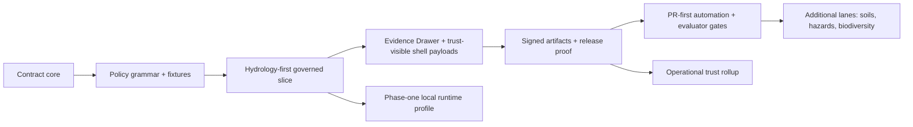

<!-- [KFM_META_BLOCK_V2]
doc_id: kfm://doc/NEEDS-VERIFICATION
title: KFM Backlog
type: standard
version: v1
status: draft
owners: NEEDS VERIFICATION
created: YYYY-MM-DD
updated: YYYY-MM-DD
policy_label: NEEDS VERIFICATION
related: [NEEDS VERIFICATION]
tags: [kfm, backlog, roadmap, verification, hydrology]
notes: [Derived from the attached March-April 2026 KFM corpus; metadata placeholders require mounted repo verification.]
[/KFM_META_BLOCK_V2] -->

# KFM Backlog

Doctrine-grounded implementation and verification backlog for the next smallest real things in Kansas Frontier Matrix.

> [!NOTE]
> **Status:** draft  
> **Owners:** NEEDS VERIFICATION  
>     
> **Quick jumps:** [Evidence boundary](#current-evidence-boundary) · [Status vocabulary](#status-vocabulary-used-here) · [Critical now](#critical-now) · [Next build window](#next-build-window) · [Verification backlog](#verification-backlog) · [Not now](#not-now) · [Definition of done](#definition-of-done)  
> **Repo fit:** `docs/BACKLOG.md` is the repo-level sequencing surface for doctrine-grounded implementation, lane admission, and verification closure. Exact neighboring roadmap, ADR, workflow, and contract paths remain **NEEDS VERIFICATION** until the mounted repo tree is directly inspected.

> [!IMPORTANT]
> This file is a governed backlog, not a release log and not proof that every path, schema, workflow, or runtime named below already exists in the mounted repository.

> [!WARNING]
> Current-session workspace inspection exposed a **PDF-rich corpus** but no mounted repository tree, schema registry, workflow inventory, tests, deployment manifests, dashboards, or runtime logs. Treat all file and folder paths below as **PROPOSED starter paths** unless they are directly reverified.

## Current evidence boundary

| Item | Current state | How to treat it |
| --- | --- | --- |
| Existing `docs/BACKLOG.md` | **NEEDS VERIFICATION** | This draft assumes the target path is needed, but does not claim an existing file was inspected |
| Mounted repo tree | **UNKNOWN** | Do not treat any path below as confirmed repo reality without direct inspection |
| Doctrinal baseline | **CONFIRMED** | Use the attached March-April 2026 KFM corpus as the controlling source base |
| Repo-native Markdown pattern | **CONFIRMED** | A current Markdown example shows KFM Meta Block v2, callout-led top matter, quick jumps, and checklist-driven closure |
| Implementation depth | **UNKNOWN** | Keep route names, DTOs, CI coverage, manifests, and runtime behavior visibly provisional until surfaced |

## Status vocabulary used here

| Label | Meaning in this backlog |
| --- | --- |
| **CONFIRMED** | Directly supported by the attached KFM corpus or by current-session visible workspace evidence |
| **INFERRED** | Small structural completion strongly implied by the corpus, but not directly surfaced as mounted implementation |
| **PROPOSED** | Recommended next work or starter shape that fits KFM doctrine |
| **UNKNOWN** | Not verified strongly enough in the current session to claim as project fact |
| **NEEDS VERIFICATION** | A review flag for metadata, ownership, inventory, or implementation claims that must be checked before commit |

## What belongs here

This backlog should hold repo-level work that changes at least one of the following:

- contract surface
- evidence flow
- promotion or correction behavior
- trust-visible shell behavior
- lane admission or expansion rules
- verification or release proof
- phase sequencing for the next smallest real thing

## What stays out

This file should **not** become any of the following:

- a changelog or release-history surface
- a catch-all idea notebook
- a second architecture manual
- a lane-local operating checklist that belongs in a narrower runbook
- a bluffing surface for unverified repo structure, workflow maturity, or runtime behavior

## Sequencing rule

KFM should grow by proving a **lane**, a **contract family**, a **policy gate**, a **correction drill**, or a **runtime envelope**—not by polishing shell chrome, expanding scope, or widening AI behavior faster than the evidence system beneath it.

## Planning horizons

| Horizon | Main objective | Exit signal |
| --- | --- | --- |
| **0-30 days** | Turn doctrine into machine-checkable contracts and a real first-slice plan | Canonical schema pack, policy grammar, valid/invalid fixtures, and one hydrology slice definition exist in reviewable form |
| **31-90 days** | Prove one public-safe slice end to end | A user can move from a hydrology map claim to an Evidence Drawer payload, EvidenceBundle, release manifest, and correction path |
| **91-180 days** | Expand only on top of the proven slice | Later lanes inherit the same proof-object family, policy grammar, and release discipline without ad hoc drift |

## Critical now

| ID | Priority | Status | Backlog item | Meaningful first proof artifact |
| --- | --- | --- | --- | --- |
| **BL-01** | Critical | **PROPOSED** | Canonical proof-object schema pack | Contract folder with schemas, fixtures, and validation tests |
| **BL-02** | Critical | **PROPOSED** | Evidence Drawer API and payload contract | One shared payload fixture that can power map, dossier, and Focus surfaces |
| **BL-03** | Critical | **PROPOSED** | Hydrology-first governed slice | One released hydrology item set with receipts, manifest, drawer payload, and correction path |
| **BL-04** | Critical | **PROPOSED** | Policy bundle v1 with deny-by-default release gates | CI job that rejects malformed or incomplete receipts/manifests for deterministic reasons |

### BL-01 — Canonical proof-object schema pack

The first durable move is not broader scope. It is a small, common object family that later lanes can inherit without field drift.

**PROPOSED starter outputs**

- [ ] `contracts/source/source_descriptor.schema.json`
- [ ] `contracts/core/dataset_version.schema.json`
- [ ] `contracts/policy/decision_envelope.schema.json`
- [ ] `contracts/release/release_manifest.schema.json`
- [ ] `contracts/runtime/evidence_bundle.schema.json`
- [ ] `contracts/runtime/runtime_response_envelope.schema.json`
- [ ] `contracts/correction/correction_notice.schema.json`
- [ ] `fixtures/valid/*`
- [ ] `fixtures/invalid/*`
- [ ] `tests/contracts/*`

**Why this is first**

The corpus repeatedly names the same proof objects, but without one common schema pack they remain rhetoric instead of executable structure.

**Upgrade signal**

Every lane can emit the same proof-object family without ad hoc field drift.

### BL-02 — Evidence Drawer API and payload contract

The shell doctrine is already strong. The missing move is a concrete, trust-bearing payload shared by backend and UI.

**PROPOSED starter outputs**

- [ ] `ui/evidence_drawer_payloads.json`
- [ ] `ui/trust_states.md`
- [ ] `tests/ui/surface_state/*`
- [ ] One layer claim payload fixture
- [ ] One dossier claim payload fixture
- [ ] One Focus claim payload fixture

**Why this is first-tier work**

If the drawer is still implicit, the shell can look trustworthy while hiding the most important data path.

**Upgrade signal**

The same drawer component can render layer claims, dossier claims, and Focus claims with no hidden transport or special-case payload.

### BL-03 — Hydrology-first governed slice

Hydrology remains the preferred first proof lane because it is public-safe, place/time-rich, and operationally legible.

**PROPOSED starter outputs**

- [ ] `examples/thin_slice/hydrology/source_descriptor.json`
- [ ] `examples/thin_slice/hydrology/ingest_receipt.json`
- [ ] `examples/thin_slice/hydrology/dataset_version.json`
- [ ] `examples/thin_slice/hydrology/catalog_closure.json`
- [ ] `examples/thin_slice/hydrology/release_manifest.json`
- [ ] `examples/thin_slice/hydrology/evidence_bundle.json`
- [ ] One STAC/DCAT/PROV-linked hydrology publication example
- [ ] One policy-safe export example
- [ ] One correction or supersession example

**Why this is the first real slice**

It proves the truth path, the catalog spine, the Evidence Drawer, and the release/correction model without forcing early exposure to the hardest sensitivity cases.

**Upgrade signal**

A user can move from map layer → drawer → evidence bundle → release proof → correction path without leaving the governed shell.

### BL-04 — Policy bundle v1 with deny-by-default release gates

KFM needs one small but real policy bundle more than it needs a broad but mostly aspirational policy library.

**PROPOSED starter outputs**

- [ ] `contracts/profiles/standards_profile.yaml`
- [ ] `policy/reason_codes.json`
- [ ] `policy/obligation_codes.json`
- [ ] `policy/reviewer_roles.json`
- [ ] `tests/policy/*`
- [ ] One CI gate that fails on broken receipt, missing sensitivity flag, or incomplete manifest

**Why this is critical**

Policy presence alone does not change system behavior. Deterministic deny reasons do.

**Upgrade signal**

A malformed receipt or incomplete release candidate fails in CI with documented reason and obligation codes.

[Back to top](#kfm-backlog)

## Next build window

| ID | Priority | Status | Backlog item | First proof artifact |
| --- | --- | --- | --- | --- |
| **BL-05** | High | **PROPOSED** | Signed non-container artifact lane | One signed hydrology asset family plus attestation references |
| **BL-06** | High | **PROPOSED** | PR-first automation skeleton | One draft-only promotion PR carrying receipt, manifest, and gate results |
| **BL-07** | High | **PROPOSED** | Evaluator harness v1 for public-safe artifacts | One run receipt with deterministic QA metrics and fail-closed policy result |
| **BL-08** | High | **PROPOSED** | Soils watcher and deterministic agricultural baseline lane | One descriptor-backed soils watcher emitting the same proof-object family |
| **BL-09** | High | **PROPOSED** | Hazards event lane with source-role differentiation | One hazard run that keeps authoritative observation, operational feeds, and derived summaries distinct |

### Notes for this window

The second wave should still inherit the first wave, not bypass it. In practice that means:

- no signed-artifact work without release manifests and receipt fields stable enough to sign
- no PR-first automation without deny-by-default policy and human review surfaces
- no evaluator harness without explicit evidence references, deterministic QA outputs, and non-sovereign AI posture
- no soils or hazards lane without source descriptors, rights posture, time semantics, and release-ready packaging rules

## Deferred until the first slice is real

| ID | Priority | Status | Backlog item | Gate before admission |
| --- | --- | --- | --- | --- |
| **BL-10** | Medium | **PROPOSED** | Biodiversity sensitivity and generalization workflow | Rights, geoprivacy, steward-review, and generalized-vs-precise comparison flow are visible |
| **BL-11** | Medium | **PROPOSED** | Conditional 3D story node demo | 2D insufficiency is demonstrated and the 3D route inherits drawer, audit, release, and correction state |
| **BL-12** | Medium | **PROPOSED** | Source descriptor registry and domain admission review board | New lanes cannot be admitted without explicit role, rights, precision, and update metadata |
| **BL-13** | Medium | **PROPOSED** | Operational trust rollup and observability dossier | One release has inspectable build, policy, signature, and publication state in one steward-readable surface |

## Verification backlog

The backlog below turns uncertainty into work instead of smoothing it into confident prose.

| Area to verify | Why it matters | Direct evidence needed |
| --- | --- | --- |
| Current repo tree and module inventory | Path-level claims remain speculative without it | Surface the mounted repository tree and current module list |
| Current schema and contract inventory | Contract claims remain target state until real files are visible | Surface schema folders, fixtures, and validation tests |
| Workflow / CI inventory | Merge-blocking gates and docs/test coverage remain unknown | Export workflow files, CI inventory, and recent run evidence |
| Deployment manifests / overlays | Runtime topology and secrets posture remain unverified | Surface Compose, systemd, Helm, or Kubernetes manifests |
| EvidenceBundle / EvidenceRef resolver | Central to runtime trust and outward explanation | Publish resolver contracts plus one positive and one negative trace |
| Release proof-pack implementation | Promotion and rollback remain conceptual until a real example exists | Surface one real release receipt or proof pack |
| Runtime response envelope and Focus negative-path behavior | Cite-or-abstain / deny / error behavior needs direct proof | Surface one contract and one evaluated sample for answer, abstain, deny, and error |
| Rights / sensitivity workflows | Later lanes cannot safely expand without them | Surface publication classes, steward payloads, and generalized-vs-precise comparison flow |
| Kansas data-gap closure | Several lane gaps remain named but not release-ready | Surface descriptor-backed packaging plans for groundwater quality, erosion, vegetation change, long-term soil moisture, LiDAR / historical-map derivatives, and core digitization |

### Verification tasks to open immediately

- [ ] Confirm whether `docs/BACKLOG.md` already exists and reconcile this draft against it
- [ ] Verify owners, created date, updated date, policy label, and related doc links for the meta block
- [ ] Confirm the actual contract, policy, runtime, UI, and runbook directory layout
- [ ] Confirm whether any proof-object schemas, fixtures, or CI gates already exist in checked-in form
- [ ] Confirm whether any hydrology, hazard, or soils lane already emits STAC/DCAT/PROV under one consistent contract
- [ ] Confirm whether any current release manifest, proof pack, or correction notice is already in operational use

[Back to top](#kfm-backlog)

## Not now

> [!CAUTION]
> The following are explicitly **not** first-wave backlog moves, even if they are attractive:
>
> - broad platform rewrites
> - autonomous publish flows
> - assistant-first or autopilot AI surfaces
> - spectacle-first 3D or digital-twin positioning
> - premature expansion into every Kansas lane at once
> - policy maturity claims that outrun surfaced evidence
> - route trees, DTO names, or service topology written as fact before repo verification

## Definition of done

This backlog has earned its keep when the following become true:

- [ ] The next maintainer can tell what is **critical now**, **next**, **deferred**, and **blocked by verification**
- [ ] At least one hydrology slice proves `Source edge → RAW → WORK / QUARANTINE → PROCESSED → CATALOG → PUBLISHED`
- [ ] The same proof-object family appears in contracts, fixtures, CI, and at least one published slice
- [ ] The Evidence Drawer contract is concrete enough to power layer, dossier, and Focus claims
- [ ] One policy bundle fails incomplete receipts/manifests for deterministic reasons
- [ ] One signed non-container artifact flow exists for a released hydrology asset family
- [ ] One runtime envelope proves `ANSWER / ABSTAIN / DENY / ERROR`
- [ ] This file’s placeholders are replaced only after direct repo verification, not by guesswork

## Appendix

<strong>PROPOSED starter path map</strong>

These are **starter paths from the attached corpus**, not asserted mounted repo facts.

| Workstream | PROPOSED starter path(s) |
| --- | --- |
| Contract core | `contracts/source/`, `contracts/core/`, `contracts/policy/`, `contracts/release/`, `contracts/runtime/`, `contracts/correction/` |
| Standards + decision grammar | `contracts/profiles/standards_profile.yaml`, `policy/reason_codes.json`, `policy/obligation_codes.json`, `policy/reviewer_roles.json` |
| Fixtures + tests | `fixtures/valid/*`, `fixtures/invalid/*`, `tests/contracts/*`, `tests/policy/*` |
| Hydrology thin slice | `examples/thin_slice/hydrology/*` |
| API + negative-path proof | `apis/public/openapi.yaml`, `apis/internal/README.md`, `tests/e2e/runtime_proof/*`, `tests/e2e/correction/*` |
| Runbooks | `docs/runbooks/publication.md`, `docs/runbooks/correction.md`, `docs/runbooks/stale_projection.md`, `docs/runbooks/rollback.md` |
| Observability joins | `observability/join_keys.md`, `observability/audit_ref_contract.md`, `tests/e2e/release_assembly/*` |
| Phase-one runtime | `runtime/phase1/local_ubuntu_profile.md`, `runtime/phase1/systemd_units/*`, `runtime/phase1/ollama_adapter_contract.md`, `runtime/phase1/api_membrane.md` |
| Trust-visible shell | `ui/trust_states.md`, `ui/evidence_drawer_payloads.json`, `ui/focus_envelope_examples/*`, `tests/ui/surface_state/*` |

<strong>Admission rules for later lanes</strong>

A new lane is not admitted only because data exists. It must arrive with:

1. source descriptors  
2. rights posture  
3. support and time semantics  
4. publication burden  
5. minimal verification obligations  
6. release-ready packaging expectations  
7. correction behavior that preserves lineage

[Back to top](#kfm-backlog)
