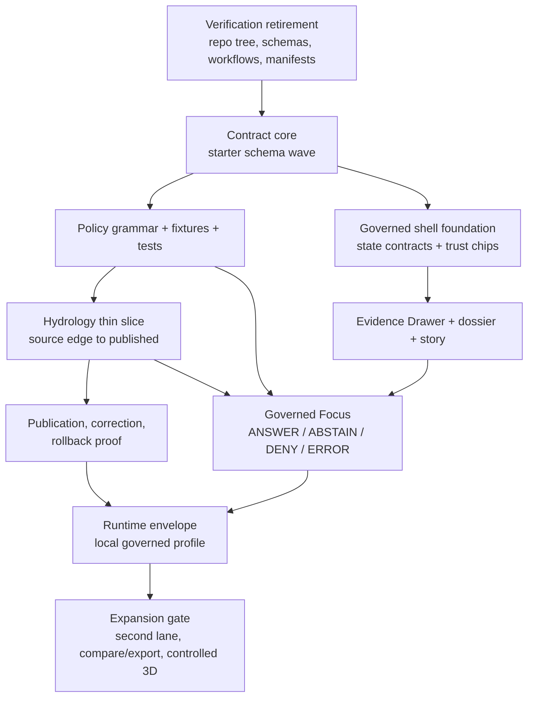

<!-- [KFM_META_BLOCK_V2]
doc_id: kfm://doc/<uuid-needs-verification>
title: BUILD PLAN
type: standard
version: v1
status: draft
owners: <owners-needs-verification>
created: <created-date-needs-verification>
updated: <updated-date-needs-verification>
policy_label: <policy-label-needs-verification>
related: [<related-paths-or-kfm-ids-needs-verification>]
tags: [kfm, build-plan, hydrology, contracts, trust-membrane]
notes: [Repo metadata fields remain placeholders until mounted repo ownership, dates, and related-path conventions are directly verified. Starter paths below are doctrine-grounded but PROPOSED unless explicitly confirmed.]
[/KFM_META_BLOCK_V2] -->

# BUILD PLAN

Contract-first, hydrology-first sequencing for turning Kansas Frontier Matrix doctrine into a governed, testable thin slice without overstating unverified repo reality.

> **Status:** Draft  
> **Owners:** NEEDS VERIFICATION  
> **Path:** `docs/BUILD_PLAN.md`  
> **Posture:** `CONFIRMED doctrine` · `INFERRED structure` · `PROPOSED realization` · `UNKNOWN mounted implementation depth`


**Quick jump:** [Scope](#scope) · [Evidence boundary](#current-evidence-boundary) · [Build laws](#build-laws) · [Dependency map](#dependency-map) · [Phase plan](#phase-plan) · [Acceptance gates](#acceptance-gates) · [Proposed starter tree](#proposed-starter-tree-needs-verification) · [Task list](#task-list) · [Definition of done](#definition-of-done)

> [!IMPORTANT]
> This document is a governed sequencing plan, **not** proof that the current repository already contains the paths, schemas, workflows, tests, manifests, or runtime behavior named here. The current session surfaced a PDF-rich workspace only, so every starter path below remains **PROPOSED** or **NEEDS VERIFICATION** unless directly rechecked from mounted repo evidence.

## Scope

This plan exists to convert KFM’s strongest doctrine into the **smallest inspectable build program** that can survive review. Its center of gravity is simple: prove one real governed slice before widening scope, polishing surfaces, or normalizing speculative repo structure.

The plan therefore prioritizes four things in order: contract core, decision grammar, one hydrology thin slice, and trust-visible runtime/shell behavior. Everything else is downstream of those proofs.

### Repo fit

| Slot | Current fit |
| --- | --- |
| **Document path** | `docs/BUILD_PLAN.md` |
| **Role** | Whole-system sequencing document for build order, phase gates, and proof obligations |
| **Upstream authority** | Attached KFM working master, project-visible replacement-grade deepening manuals, attached source atlas, attached UI architecture, attached bounded-AI/runtime guidance |
| **Downstream artifacts** | **PROPOSED** starter families for `contracts/`, `policy/`, `fixtures/`, `examples/thin_slice/hydrology/`, `docs/runbooks/`, `observability/`, `runtime/phase1/`, `ui/`, and `tests/` |
| **Primary audience** | Architecture, data, policy, product, delivery, stewardship, and verification workstreams |

### Accepted inputs

Use this file to organize:

- directly attached KFM doctrine and realization manuals
- project-visible replacement-grade deepening references
- mounted repo evidence when it is directly surfaced
- schema inventories, fixtures, CI/workflow evidence, manifests, and emitted proof objects
- lane-specific release packaging plans
- acceptance gates, rollback rules, and correction drills

### Exclusions

Do **not** use this file as:

- a release note
- a marketing roadmap
- a substitute for mounted repo inventory
- proof that CI, runtime, or route families already exist
- a license to widen domain scope before one governed slice is real
- a rationale for default 3D or broad shell polish ahead of evidence-system proof

## Current evidence boundary

The current session exposed **PDF-visible project evidence** rather than a mounted, directly inspectable repository tree. That means this plan can state doctrine confidently, but must keep path-level claims, workflow coverage, schema inventory, manifests, and runtime maturity visibly bounded.

In practice, that changes how this file should be read:

- doctrine and sequencing rules can be treated as strong
- file trees, exact path ownership, and implementation depth remain review items
- every path below is a **starter handle**, not a silent claim of current repo shape

## Status vocabulary used in this plan

| Label | How to read it here |
| --- | --- |
| **CONFIRMED** | Directly supported by the project corpus visible in this session |
| **INFERRED** | Small structural completion strongly implied by repeated KFM doctrine |
| **PROPOSED** | Recommended build move that fits KFM but is not directly verified as mounted implementation |
| **UNKNOWN** | Not verified strongly enough to claim as current repo fact |
| **NEEDS VERIFICATION** | Must be rechecked against mounted repo files, schemas, workflows, manifests, or runtime proof before merge confidence should increase |

## Build laws

These laws govern the sequence below.

1. **Prove a lane, not a vibe.** KFM should grow by proving a lane, a contract, a route family, a correction drill, or a runtime envelope.
2. **Contract core before shell confidence.** Machine-checkable schemas, fixtures, and decision grammar outrank surface polish.
3. **Hydrology first.** The first proof lane should be public-safe, place/time-rich, and operationally legible.
4. **Fail closed.** Hold, quarantine, deny, abstain, stale-visible, generalized, superseded, withdrawn, and errored outcomes are valid contract states.
5. **Trust must be visible at point of use.** Map, timeline, dossier, Evidence Drawer, story, export, and Focus must expose provenance, freshness, review, and policy context.
6. **No silent lane admission.** A new lane arrives with source descriptors, rights posture, support/time semantics, publication burden, and minimum verification obligations.
7. **2D first; controlled 3D only by burden.** 3D is conditional, not default spectacle.
8. **Do not smooth unknowns away.** Repo paths, route trees, DTO names, workflow coverage, and deployment overlays stay bounded until directly surfaced.

## Dependency map



## Phase plan

| Phase | Priority | Build target | Primary outputs | What it must prove | Status |
| --- | --- | --- | --- | --- | --- |
| **0. Verification retirement** | Immediate | Retire unknowns that change path-level claims | Repo tree snapshot; schema inventory; workflow/CI inventory; manifest inventory; one positive and one negative resolver trace | This plan can be reconciled to repo reality rather than forcing repo reality to mimic placeholder docs | **CONFIRMED need** / **UNKNOWN mounted evidence** |
| **1. Contract core** | 1 | Land the first schema wave | `SourceDescriptor`, `DatasetVersion`, `DecisionEnvelope`, `ReleaseManifest`, `EvidenceBundle`, `RuntimeResponseEnvelope`, `CorrectionNotice` starter schemas | Doctrine becomes machine-checkable instead of remaining prose | **PROPOSED** |
| **2. Policy grammar, fixtures, and tests** | 1 | Make policy and contract language executable | `standards_profile.yaml`; reason/obligation codes; reviewer roles; valid/invalid fixtures; contract tests; policy tests | Deny reasons, obligation grammar, and schema validity can be executed and diffed | **PROPOSED** |
| **3. Hydrology-first thin slice** | 1 | Prove one whole lane end to end | Hydrology `SourceDescriptor`; `IngestReceipt`; `DatasetVersion`; `CatalogClosure`; `ReleaseManifest`; `EvidenceBundle`; one outward read; one map portrayal; one policy-safe export | `Source edge -> RAW -> WORK/QUARANTINE -> PROCESSED -> CATALOG -> PUBLISHED` is real on a public-safe lane | **CONFIRMED priority** / **PROPOSED implementation** |
| **4. Publication, correction, and rollback proof** | 2 | Turn release truth into inspectable proof | `docs/runbooks/publication.md`; `correction.md`; `stale_projection.md`; `rollback.md`; one release proof pack; one correction drill; one rollback drill | Promotion, correction, and rollback are governed transitions, not prose promises | **PROPOSED** |
| **5. Governed shell foundation** | 2 | Establish trust-visible shell behavior | Shell-state contract; layer metadata contract; surface-state registry; map runtime; timeline rail; right stack; trust chips; saved-view hydration; Evidence Drawer payload; dossier payload; story choreography | Trust state is visible in the shell and not hidden in backend artifacts | **CONFIRMED direction** / **PROPOSED build** |
| **6. Governed Focus and runtime outcomes** | 2 | Make bounded synthesis accountable | Focus envelope examples; citation rehighlight; audit linkage; runtime fixtures for `ANSWER`, `ABSTAIN`, `DENY`, `ERROR`; surface-state tests | Focus remains one hop from evidence and visibly fails closed | **CONFIRMED doctrine** / **PROPOSED implementation** |
| **7. Runtime envelope and local build profile** | 3 | Stand up the thinnest credible governed runtime | `runtime/phase1/local_ubuntu_profile.md`; `api_membrane.md`; one governed API on loopback; one-shot ingest/build/publish jobs; local-only model runtime behind replaceable adapter | Plane boundaries remain explicit even in a single-host proof stack | **CONFIRMED doctrine** / **INFERRED–PROPOSED packaging** |
| **8. Expansion gate** | Later | Admit second lanes and advanced surfaces only after proof | Lane-admission checklist; rights/sensitivity workflow proof; compare/export preview; controlled 3D burden checklist; second-lane decision record | Later lanes do not silently inherit hydrology’s burden profile, and 3D stays conditional | **PROPOSED** / **NEEDS VERIFICATION** |

> [!NOTE]
> UI sequencing maps cleanly onto this plan: the MapLibre subsystem’s **Phase 0–2** fit inside phases **5–6** here; its **Phase 3** aligns with governed Focus; its **Phase 4–5** belong only after baseline proof and expansion gates.

[Back to top](#build-plan)

## Acceptance gates

| Gate | Minimum proof object(s) | Fail-closed consequence |
| --- | --- | --- |
| **Source-integrity gate** | Baseline decision recorded; PDF-only workspace boundary preserved; unsupported path claims still marked | Keep path-level claims **PROPOSED** / **UNKNOWN** |
| **Schema gate** | Starter schema wave plus valid and invalid fixtures | No contract family is called operational |
| **Policy gate** | Reason/obligation registries; policy tests; deny-by-default behavior | No promotion-ready language |
| **Thin-slice gate** | One hydrology slice with receipts, catalog closure, and outward read | No lane expansion |
| **Trust-surface gate** | Evidence Drawer payloads; Focus envelope fixtures; visible freshness/review/policy state | No shell maturity claims |
| **Runtime gate** | Local governed API profile; membrane documented; no direct client path to canonical stores or model runtime | No runtime maturity claims |
| **Correction gate** | One correction drill and one rollback drill with visible surface consequences | No release-truth claims beyond happy path |
| **Expansion gate** | Rights/sensitivity workflow proof; second-lane burden review; 2D burden checklist satisfied before 3D | No hazards+ / biodiversity+ / controlled 3D admission |

## Workstream focus

### A. Verification retirement

This is the least glamorous track and the most load-bearing one. Until repo tree, schema inventory, workflow coverage, deployment overlays, and resolver traces are directly surfaced, the build program should keep using explicit uncertainty labels rather than accidental confidence.

### B. Contract and policy core

The first schema wave is the canonical backbone. The point is not the literal filenames. The point is to make identity, intake, release, evidence, correction, and runtime outcomes explicit enough to validate, diff, and test.

### C. Hydrology proving field

Hydrology is the preferred first slice because it combines place, time, metadata, evidence, release logic, and map behavior without immediately forcing the most restrictive geoprivacy or rights posture. It is the lane that can prove KFM’s doctrine against reality fastest.

### D. Trust-visible shell

The shell only earns maturity when it can expose source basis, freshness, review, policy posture, and correction state at the point of use. A polished map without those cues is not a milestone in KFM terms.

### E. Runtime and operations

The first runtime should be thin, local, and explicit about boundaries. A single-host proof stack is acceptable only if plane separation, governed API access, proof artifacts, and fail-closed behavior remain intact.

## Proposed starter tree *(NEEDS VERIFICATION)*

<details>
<summary><strong>Starter paths surfaced by the corpus</strong></summary>

```text
docs/BUILD_PLAN.md

contracts/source/source_descriptor.schema.json
contracts/core/dataset_version.schema.json
contracts/policy/decision_envelope.schema.json
contracts/release/release_manifest.schema.json
contracts/runtime/evidence_bundle.schema.json
contracts/runtime/runtime_response_envelope.schema.json
contracts/correction/correction_notice.schema.json

contracts/profiles/standards_profile.yaml
policy/reason_codes.json
policy/obligation_codes.json
policy/reviewer_roles.json

fixtures/valid/*
fixtures/invalid/*
tests/contracts/*
tests/policy/*

examples/thin_slice/hydrology/source_descriptor.json
examples/thin_slice/hydrology/ingest_receipt.json
examples/thin_slice/hydrology/dataset_version.json
examples/thin_slice/hydrology/catalog_closure.json
examples/thin_slice/hydrology/release_manifest.json
examples/thin_slice/hydrology/evidence_bundle.json

docs/runbooks/publication.md
docs/runbooks/correction.md
docs/runbooks/stale_projection.md
docs/runbooks/rollback.md

observability/join_keys.md
observability/audit_ref_contract.md
tests/e2e/release_assembly/*
tests/e2e/runtime_proof/*
tests/e2e/correction/*

runtime/phase1/local_ubuntu_profile.md
runtime/phase1/systemd_units/*
runtime/phase1/ollama_adapter_contract.md
runtime/phase1/api_membrane.md

ui/trust_states.md
ui/evidence_drawer_payloads.json
ui/focus_envelope_examples/*
tests/ui/surface_state/*
```

</details>

> [!CAUTION]
> Treat the tree above as a **planning register**, not a verified file inventory. If mounted repo inspection surfaces different paths, keep the doctrine and revise the tree.

## Task list

### Now

- [ ] Surface the mounted repo tree and reconcile this plan against real directories
- [ ] Surface current schema and fixture inventory, if any
- [ ] Surface CI/workflow inventory and recent run evidence
- [ ] Decide whether the first schema wave maps to existing repo locations or needs ADRs
- [ ] Land the contract core and standards profile
- [ ] Land reason/obligation/reviewer registries and valid/invalid fixtures

### Next

- [ ] Build one hydrology source descriptor and one ingest receipt
- [ ] Produce one hydrology `DatasetVersion`, `CatalogClosure`, `ReleaseManifest`, and `EvidenceBundle`
- [ ] Emit one outward read and one policy-safe export from the same released slice
- [ ] Write publication, correction, stale-projection, and rollback runbooks
- [ ] Produce one release proof pack and one correction/rollback drill

### Then

- [ ] Land shell-state, Evidence Drawer, dossier, and Focus payload contracts
- [ ] Make freshness, policy, review, and correction cues visible in the map-first shell
- [ ] Land `ANSWER / ABSTAIN / DENY / ERROR` runtime fixtures and tests
- [ ] Stand up the local-only governed runtime profile behind the API membrane
- [ ] Reassess second-lane admission only after the thin slice is inspectable end to end

## Definition of done

This build plan is materially complete only when all of the following are true:

- one governed hydrology slice can move from source edge to published state with emitted proof objects
- the first schema wave validates with real fixtures and tests
- decision grammar is executable rather than descriptive
- release truth includes proof, correction, and rollback behavior
- the shell can expose provenance, freshness, review state, policy posture, and correction lineage
- governed Focus can return `ANSWER`, `ABSTAIN`, `DENY`, and `ERROR` with visible audit linkage
- the runtime profile preserves the trust membrane even in a thin local deployment
- every path-level statement in this file is either directly reverified or still clearly marked as uncertain

## Open verification items

The following should remain visibly open until directly resolved:

- actual repo tree and module inventory
- current schema and contract inventory
- workflow / CI inventory and merge-blocking gates
- deployment manifests and overlays
- EvidenceBundle / EvidenceRef resolver traces
- release proof-pack implementation
- runtime response envelope implementation
- rights and sensitivity workflow proof
- Kansas data-gap closure packaging plans

[Back to top](#build-plan)
