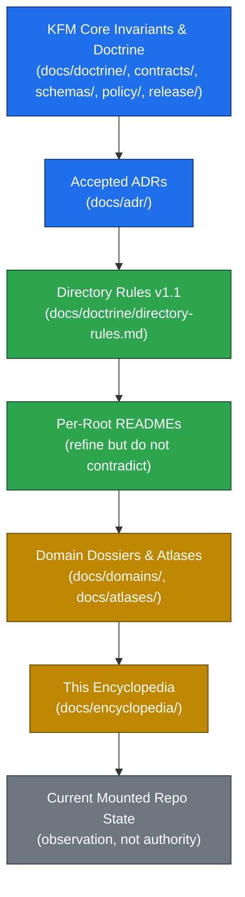
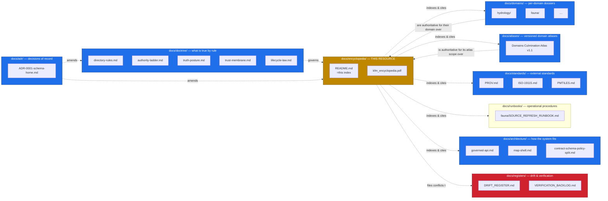

<!-- [KFM_META_BLOCK_V2]
doc_id: kfm://doc/encyclopedia-index
title: KFM Encyclopedia — Master Index
type: reference
subtype: encyclopedia-index
version: v0.1
status: draft
owners: <encyclopedia-stewards>  # PLACEHOLDER — assign before review
created: 2026-05-18
updated: 2026-05-18
policy_label: public
edition: v0.1 PDF-ready master planning manuscript (2026-05-05)
related:
  - docs/encyclopedia/kfm_encyclopedia.pdf       # PROPOSED placement; NEEDS VERIFICATION
  - docs/atlases/KFM_Domains_Culmination_Atlas_v1_1.pdf  # PROPOSED placement per ADR-S-02; NEEDS VERIFICATION
  - docs/doctrine/directory-rules.md
  - docs/doctrine/authority-ladder.md
  - docs/doctrine/truth-posture.md
  - docs/doctrine/trust-membrane.md
  - docs/doctrine/lifecycle-law.md
  - docs/architecture/contract-schema-policy-split.md
  - docs/architecture/governed-api.md
  - docs/architecture/map-shell.md
  - docs/domains/README.md
  - docs/standards/README.md
  - docs/runbooks/README.md
  - docs/registers/VERIFICATION_BACKLOG.md
  - docs/registers/DRIFT_REGISTER.md
  - docs/adr/README.md
  - control_plane/document_registry.yaml
extends:
  - KFM Domains Culmination Atlas v1.1 (full doctrinal core; supersession-by-extension model)
  - Pass 23 + Pass 32 Consolidated Deduplicated Atlas
  - kfm_encyclopedia.pdf §1–16 + Appendices A–L (the v0.1 manuscript this index spines)
authority_posture: synthesis/planning artifact — supersedes no source doctrine; subordinate to attached governing dossiers, ADRs, and contracts/schemas/policy.
truth_labels: [CONFIRMED, PROPOSED, NEEDS VERIFICATION, UNKNOWN, INFERRED, DENY, ABSTAIN, ERROR]
tags: [kfm, encyclopedia, reference, index, governance, planning, synthesis, doctrine-adjacent]
notes:
  - "This index navigates the kfm_encyclopedia.pdf v0.1 manuscript. The PDF remains the body; this README is the spine."
  - "Placement under docs/encyclopedia/ is PROPOSED. The alternative — folding the artifact under docs/atlases/ — is captured in §15 Open Questions and is ADR-class."
  - "No mounted repo was inspected in the authoring session. Every quoted repo path is PROPOSED or NEEDS VERIFICATION."
  - "Per Encyclopedia Appendix L: 'This encyclopedia is a synthesis and planning artifact. It supersedes no source doctrine, source report or official standard.' That posture is binding here."
-->

# KFM Encyclopedia — Master Index

> **Kansas Frontier Matrix Domain and Capability Encyclopedia** — navigable index for the v0.1 PDF-ready master planning manuscript (2026-05-05). Spines the 16-section, ~82-page synthesis into a repo-resident reference. Subordinate to doctrine, dossiers, ADRs, and the contract/schema/policy split — never a substitute for them.

[](#status--authority)
[](#3-edition-lineage-and-supersession)
[](#2-authority-and-truth-posture)
[](#)
[](#)
[](#)

> [!IMPORTANT]
> **This is a synthesis and planning artifact, not doctrine.** When this index disagrees with `docs/doctrine/`, accepted ADRs, `contracts/`, `schemas/`, or `policy/`, **those win**. File the disagreement to `docs/registers/DRIFT_REGISTER.md` per Directory Rules §2.5. The encyclopedia does not promote any path, route, or behavior to implementation truth; it organizes planning.

-----

## Mini TOC

- [0. Status & Authority](#0-status--authority)
- [1. Purpose and Non-Purpose](#1-purpose-and-non-purpose)
- [2. Authority and Truth Posture](#2-authority-and-truth-posture)
- [3. Edition Lineage and Supersession](#3-edition-lineage-and-supersession)
- [4. Resource Layout](#4-resource-layout)
- [5. Encyclopedia Structure — 16-Section Map](#5-encyclopedia-structure--16-section-map)
- [6. How the Encyclopedia Relates to the Rest of `docs/`](#6-how-the-encyclopedia-relates-to-the-rest-of-docs)
- [7. Cross-Reference Maps](#7-cross-reference-maps)
- [8. Source Ledger Reference](#8-source-ledger-reference)
- [9. How to Read This Resource](#9-how-to-read-this-resource)
- [10. Truth-Label Vocabulary](#10-truth-label-vocabulary)
- [11. Sensitive / Deny-by-Default Posture](#11-sensitive--deny-by-default-posture)
- [12. Maintenance and Update Cadence](#12-maintenance-and-update-cadence)
- [13. Authoring Contract for Encyclopedia Edits](#13-authoring-contract-for-encyclopedia-edits)
- [14. Self-Check Results — Inherited from v0.1](#14-self-check-results--inherited-from-v01)
- [15. Open Questions and Verification Backlog](#15-open-questions-and-verification-backlog)
- [16. Change Log for This Index](#16-change-log-for-this-index)
- [17. Footer and Provenance](#17-footer-and-provenance)

-----

## 0. Status & Authority

|Field                                     |Value                                                                                                   |
|------------------------------------------|--------------------------------------------------------------------------------------------------------|
|**Document type**                         |Reference index (encyclopedia spine)                                                                    |
|**Edition**                               |**v0.1 manuscript** — indexes `kfm_encyclopedia.pdf` dated 2026-05-05                                   |
|**Authority of this index**               |**PROPOSED** — placement under `docs/encyclopedia/` not yet ADR-confirmed (see §15 OPEN-ENC-01)         |
|**Authority of the manuscript it indexes**|**CONFIRMED as synthesis** — see `kfm_encyclopedia.pdf` Appendix L                                      |
|**Authority of any quoted repo path**     |**NEEDS VERIFICATION** until mounted-repo inspection                                                    |
|**Owner**                                 |Encyclopedia stewards (PLACEHOLDER) + Docs steward                                                      |
|**Reviewers required for change**         |Docs steward + at least one cross-domain reviewer; ADR required for placement change                    |
|**Supersedes**                            |Nothing. v0.1 is the inaugural edition.                                                                 |
|**Superseded by**                         |Nothing (current)                                                                                       |
|**Related doctrine**                      |`docs/doctrine/directory-rules.md` §6.1 (`docs/` tree), §2.5 (drift), §18 (open-DR backlog)             |
|**Lifecycle posture**                     |Doc artifact; not a lifecycle data object. Follows `docs/` review cadence, not data-lifecycle promotion.|
|**Last reviewed**                         |2026-05-18 (authoring session)                                                                          |


> [!NOTE]
> **Authority order (inherited from Directory Rules §2.1).** When sources disagree about anything indexed here, resolve in order: (1) core invariants and doctrine, (2) accepted ADRs, (3) Directory Rules, (4) per-root READMEs, (5) domain dossiers, (6) current mounted-repo state. This encyclopedia sits no higher than (5) “domain dossiers / prior architecture reports — lineage / proposed only.”

[↑ back to top](#kfm-encyclopedia--master-index)

-----

## 1. Purpose and Non-Purpose

### 1.1 Purpose — what this resource IS

The Encyclopedia is the **planning-synthesis** layer between the source dossiers and implementation. It consolidates:

- The **KFM Operating Law** (cite-or-abstain, evidence-first, governed-API public surface, deterministic identity, lifecycle invariant, watcher-as-non-publisher).
- The **Master Domain Atlas** — every named domain (Hydrology, Soil, Habitat, Fauna, Flora, Agriculture, Geology, Atmosphere, Hazards, Roads/Rail/Trade, Settlements/Infrastructure, Archaeology, People/Genealogy/DNA/Land, Frontier Matrix synthesis, Planetary/3D).
- The **Cross-Domain Capability Taxonomy** — features, actions, views, knowledge systems, functions, programming possibilities.
- The **Cross-Domain Systems Chapters** — MapLibre, Evidence Drawer, Focus Mode, graph, catalog/proof loop, review, public/restricted surfaces.
- The **Master Matrices** — feature × domain, action × domain, viewing-mode atlas.
- The **Programming Possibilities Backlog** — design space the implementation MAY draw from.
- The **Sensitive / Deny-by-Default Register** — cross-domain failure-closed lanes.
- An **Implementation Roadmap** and **Validation/Acceptance Plan**.
- A **Source Ledger** and **Self-Check** so the synthesis is inspectable.

It exists to make the *body of design pressure* discoverable: a single inspectable surface where a reviewer, steward, or implementer can locate “what KFM is trying to be, across all domains,” without rereading every dossier.

### 1.2 Non-Purpose — what this resource is NOT

> [!CAUTION]
> **The Encyclopedia is not implementation truth.** It is not allowed to play any of the following roles:

- **Not doctrine.** Doctrine lives in `docs/doctrine/`. The encyclopedia narrates and connects doctrine; it cannot amend or replace it.
- **Not a schema home.** Object shape lives in `schemas/contracts/v1/<…>` per ADR-0001.
- **Not a contract home.** Object meaning lives in `contracts/<…>/`.
- **Not a policy home.** Admissibility / release decisions live in `policy/<…>/`.
- **Not an ADR.** Decisions of record live in `docs/adr/ADR-NNNN-<slug>.md`.
- **Not a runbook.** Operational procedures live in `docs/runbooks/<…>/`.
- **Not a source dossier.** Per-domain authoritative dossiers remain canonical; encyclopedia chapters point to them, not the other way around.
- **Not a release manifest, evidence bundle, validation report, or proof.** Those live in `data/` and `release/` per the lifecycle invariant.
- **Not a substitute for verification.** Per Directory Rules §17 working method: presence of a chapter here does not establish implementation maturity for anything it describes.

[↑ back to top](#kfm-encyclopedia--master-index)

-----

## 2. Authority and Truth Posture

CONFIRMED, inherited verbatim in posture from `kfm_encyclopedia.pdf` Appendix L:

> *This encyclopedia is a synthesis and planning artifact. It supersedes no source doctrine, source report or official standard. It consolidates the supplied KFM domain reports, UI/AI manuals, pipeline manual, Directory Rules, greenfield plan and build companion into an encyclopedia view. Prior scaffold reports and older implementation references are retained as lineage and design pressure; none are upgraded to current implementation proof without a mounted repo, tests, logs or generated artifacts.*

### 2.1 Authority subordination



The encyclopedia sits at the **synthesis tier**: above current-repo observation, below dossiers, doctrine, and ADRs. A claim in the encyclopedia that conflicts with anything upstream is **the encyclopedia’s bug**, not the upstream’s.

### 2.2 Trust membrane

Public access to anything described here flows through the **governed API trust membrane** per `docs/architecture/governed-api.md`. The encyclopedia describes the design space but does not — and cannot — open new public surfaces. Any reader who wants to *act* on encyclopedia content does so by:

1. Reading the underlying dossier or doctrine.
1. Confirming the relevant contract, schema, and policy exist.
1. Opening an ADR if a placement, shape, or admissibility change is needed.
1. Implementing against the governed API.

[↑ back to top](#kfm-encyclopedia--master-index)

-----

## 3. Edition Lineage and Supersession

|Edition            |Date      |Form                        |Status             |Notes                                                              |
|-------------------|----------|----------------------------|-------------------|-------------------------------------------------------------------|
|**v0.1 manuscript**|2026-05-05|PDF (`kfm_encyclopedia.pdf`)|**CURRENT**        |82-page master planning manuscript; self-check passed (Appendix L).|
|v0.1 index         |2026-05-18|This `README.md`            |**CURRENT (draft)**|Repo-resident navigable spine. Does not modify the v0.1 manuscript.|

**CONFIRMED supersession rule (inherited from Atlas v1.1 lineage doctrine):** future editions of this encyclopedia extend by **integrated extension, not overwrite**. v0.1 content is preserved verbatim as the doctrinal core when a v0.2 / v1.0 is authored. Removal of any later edition reverts cleanly to v0.1.

**PROPOSED future editions** (not yet authored; tracked in §15):

- **v0.2** — incorporate Pass 23 + Pass 32 Consolidated Atlas cards by reference (the encyclopedia would gain cross-reference rows linking each capability to its stable card IDs).
- **v1.0** — first edition consumed by a mounted repo with verified paths, contracts, schemas, and CI; truth labels collapse from PROPOSED → CONFIRMED for items demonstrably present.

[↑ back to top](#kfm-encyclopedia--master-index)

-----

## 4. Resource Layout

**CONFIRMED current contents of this folder (PROPOSED placement):**

```
docs/encyclopedia/
├── README.md                          # this file — navigable spine and entry point
└── kfm_encyclopedia.pdf               # v0.1 PDF-ready master planning manuscript (2026-05-05)
                                       # PROPOSED home — see §15 OPEN-ENC-01 (atlases/ alternative)
```

**PROPOSED future contents (not authored in this PR):**

```
docs/encyclopedia/
├── README.md
├── kfm_encyclopedia.pdf
├── CHANGELOG.md                       # edition-to-edition lineage record (PROPOSED v0.2+)
├── chapters/                          # PROPOSED — only if ADR resolves chapter-split question
│   ├── 01-executive-summary.md
│   ├── 02-source-ledger.md
│   ├── 03-operating-law.md
│   ├── 04-master-domain-atlas.md
│   ├── 05-capability-taxonomy.md
│   ├── 06-domain-chapters/
│   ├── 07-cross-domain-systems.md
│   ├── 08-feature-matrix.md
│   ├── 09-action-matrix.md
│   ├── 10-viewing-mode-atlas.md
│   ├── 11-programming-possibilities.md
│   ├── 12-sensitive-deny-register.md
│   ├── 13-implementation-roadmap.md
│   ├── 14-validation-acceptance.md
│   └── appendices/
└── crosswalks/                        # PROPOSED — encyclopedia ↔ Pass 23/32 card-ID maps
    └── encyclopedia-to-pass23-32.csv
```

> [!WARNING]
> **No chapter-split file has been authored.** Splitting the PDF into 16+ Markdown chapter files is an ADR-class decision (see §15 OPEN-ENC-02): it doubles the surface area, creates a synchronization burden between PDF and chapters, and may collide with the dossier scope of `docs/domains/<domain>/`. Until the ADR is decided, the PDF remains the single body of record.

[↑ back to top](#kfm-encyclopedia--master-index)

-----

## 5. Encyclopedia Structure — 16-Section Map

CONFIRMED structure from `kfm_encyclopedia.pdf` p. 2 contents listing. Each row is a chapter in the PDF; the **Status** column reflects what is confirmed *in the manuscript itself*, not in any mounted repo.

|§ |Chapter                             |Manuscript status   |Implementation status (this session)                            |Maps to                                                                                          |
|--|------------------------------------|--------------------|----------------------------------------------------------------|-------------------------------------------------------------------------------------------------|
|1 |Cover Page                          |CONFIRMED           |n/a                                                             |—                                                                                                |
|2 |Executive Summary                   |CONFIRMED           |n/a (narrative)                                                 |KFM Operating Law (Ch. 4)                                                                        |
|3 |Source Ledger and Evidence Method   |CONFIRMED           |NEEDS VERIFICATION (mounted source registry)                    |`data/registry/sources/`, `control_plane/source_authority_register.yaml`                         |
|4 |KFM Operating Law                   |CONFIRMED (doctrine)|CONFIRMED (doctrine layer) / NEEDS VERIFICATION (enforced layer)|`docs/doctrine/`, `policy/runtime/`                                                              |
|5 |Master Domain Atlas                 |CONFIRMED           |PROPOSED (atlas chs.) / NEEDS VERIFICATION (lane existence)     |`docs/atlases/`, `docs/domains/`                                                                 |
|6 |Cross-Domain Capability Taxonomy    |CONFIRMED           |PROPOSED                                                        |`contracts/`, `packages/`, `apps/`                                                               |
|7 |Domain Chapters (per-domain)        |CONFIRMED           |PROPOSED per domain                                             |`docs/domains/<domain>/`, `contracts/domains/<domain>/`, `schemas/contracts/v1/domains/<domain>/`|
|8 |Cross-Domain Systems Chapters       |CONFIRMED           |PROPOSED                                                        |`docs/architecture/`, `packages/maplibre/`, evidence-drawer, focus-mode                          |
|9 |Master Feature Matrix               |CONFIRMED           |PROPOSED                                                        |feature × domain crosswalk                                                                       |
|10|Master Action Matrix                |CONFIRMED           |PROPOSED                                                        |governed-API action surface                                                                      |
|11|Master Viewing Mode Atlas           |CONFIRMED           |PROPOSED                                                        |MapLibre view modes, Focus Mode, time slider                                                     |
|12|Programming Possibilities Backlog   |CONFIRMED           |PROPOSED                                                        |`docs/intake/NEW_IDEAS_INDEX.md`, Pass 23/32 cards                                               |
|13|Sensitive / Deny-by-Default Register|CONFIRMED (doctrine)|NEEDS VERIFICATION (enforcement)                                |`policy/sensitivity/`, `policy/rights/`, `policy/domains/<…>/`                                   |
|14|Implementation Roadmap              |CONFIRMED (as plan) |PROPOSED                                                        |release-roadmap, milestones                                                                      |
|15|Validation and Acceptance Plan      |CONFIRMED (as plan) |NEEDS VERIFICATION (CI / tests)                                 |`tests/`, `schemas/tests/`, `policy/tests/`                                                      |
|16|Appendices and Self-Check           |CONFIRMED           |n/a                                                             |source family appendix, supersession ledger, self-check                                          |

### 5.1 Per-domain chapter index (Ch. 7 expansion)

CONFIRMED — each of the following has a dedicated Ch. 7 sub-chapter in the manuscript:

|Domain                                   |Manuscript Ch.|Dossier tag    |Primary responsibility root (PROPOSED)                                                |Sensitivity baseline                                         |
|-----------------------------------------|--------------|---------------|--------------------------------------------------------------------------------------|-------------------------------------------------------------|
|Spatial Foundation                       |7.1           |[SPATIAL]      |`schemas/contracts/v1/spatial/`, `packages/maplibre/`                                 |T0–T1                                                        |
|Hydrology                                |7.2           |[DOM-HYD]      |`schemas/contracts/v1/hydrology/`                                                     |T1–T2                                                        |
|Soil                                     |7.3           |[DOM-SOIL]     |`schemas/contracts/v1/soil/`                                                          |T1                                                           |
|Habitat                                  |7.4           |[DOM-HAB]      |`schemas/contracts/v1/habitat/`                                                       |T2                                                           |
|Fauna                                    |7.5           |[DOM-FAUNA]    |`schemas/contracts/v1/fauna/`, `policy/sensitivity/fauna/`                            |**T4 default** (sensitive occurrences)                       |
|Flora                                    |7.6           |[DOM-FLORA]    |`schemas/contracts/v1/flora/`, `policy/sensitivity/flora/`                            |T3–T4 (rare plants)                                          |
|Agriculture                              |7.7           |[DOM-AG]       |`schemas/contracts/v1/agriculture/`                                                   |T2; aggregation receipts; private-join **deny**              |
|Geology / Natural Resources              |7.8           |[DOM-GEOL]     |`schemas/contracts/v1/geology/`                                                       |T1–T3                                                        |
|Atmosphere / Air                         |7.9           |[DOM-AIR]      |`schemas/contracts/v1/air/`                                                           |T0–T1                                                        |
|Hazards                                  |7.10          |[DOM-HAZ]      |`schemas/contracts/v1/hazards/`, `policy/release/hazards/`                            |T1; **KFM is never an alert authority**                      |
|Roads / Rail / Trade                     |7.11          |[DOM-ROADS]    |`schemas/contracts/v1/transport/`                                                     |T1–T2                                                        |
|Settlements / Infrastructure             |7.12          |[DOM-SETTLE]   |`schemas/contracts/v1/settlement/`, `policy/sensitivity/infrastructure/`              |T2; **critical-asset deny lane**                             |
|Archaeology / Cultural Heritage          |7.13          |[DOM-ARCH]     |`schemas/contracts/v1/archaeology/`, `policy/sensitivity/archaeology/`                |**T4 default** (site coords deny); sovereignty review        |
|People / Genealogy / DNA / Land          |7.14          |[DOM-PEOPLE]   |`schemas/contracts/v1/people/`, `policy/sensitivity/people/`, `policy/consent/people/`|**T4** (living-person, DNA, person-parcel lanes deny-default)|
|Frontier Matrix (synthesis)              |7.15          |[DOM-FM]       |cross-domain                                                                          |n/a (composition)                                            |
|Planetary / 3D / Digital Twin / Synthetic|7.16          |[DOM-PLANETARY]|`packages/maplibre/`, `packages/cesium/` (PROPOSED)                                   |T0–T1; INFERRED scope                                        |

Sensitivity tier letters (T0–T4) follow the Master Sensitivity / Rights Tier Reference (Atlas v1.1 Ch. 24.5). T0 = open public, T4 = deny-default; intermediate tiers carry redaction, generalization, or staged access duties.

### 5.2 Cross-domain systems index (Ch. 8 expansion)

CONFIRMED — each of the following has a dedicated Ch. 8 sub-chapter:

- **MapLibre Map Surface** — base layers, style rules, projection transform, generalization, scale support, uncertainty surface. Source: `Master_MapLibre_Components-Functions-Features.pdf`.
- **Evidence Drawer** — per-claim EvidenceBundle resolution, citation surface, stale/uncertainty badges, public-safe redaction.
- **Focus Mode** — bounded-scope AI, evidence-before-model, ABSTAIN / DENY behavior, scope narrowing.
- **Graph Projection** — derived layer, never canonical truth; queryable via governed API.
- **Catalog / Proof Loop** — RAW → WORK/QUARANTINE → PROCESSED → CATALOG/TRIPLET → PUBLISHED lifecycle invariant.
- **Review Surface** — ReviewRecord, sign-off, separation-of-duties at release maturity.
- **Public / Restricted Surface Split** — governed API outside, canonical/internal stores inside; no public client touches canonical directly.

[↑ back to top](#kfm-encyclopedia--master-index)

-----

## 6. How the Encyclopedia Relates to the Rest of `docs/`

CONFIRMED structural relationship per Directory Rules §6.1:



### 6.1 Encyclopedia vs. Atlas

|Property             |`docs/encyclopedia/` (this)                                                    |`docs/atlases/`                                                     |
|---------------------|-------------------------------------------------------------------------------|--------------------------------------------------------------------|
|**Scope**            |Whole-system synthesis: all domains + cross-domain systems + matrices + backlog|Per-atlas dossier (e.g., Domains Culmination Atlas, by domain set)  |
|**Edition cadence**  |Manuscript editions (v0.1 → v0.2 → …)                                          |Per-atlas edition (v1.0 → v1.1 by extension)                        |
|**Authority posture**|Synthesis / planning — supersedes no doctrine                                  |Versioned dossier — supersedes prior edition by integrated extension|
|**Lifecycle**        |Doc artifact; review-driven                                                    |Doc artifact; review-driven (ADR-S-02 placement)                    |
|**Conflict**         |Files to DRIFT_REGISTER and defers to atlas, dossier, doctrine                 |Files to DRIFT_REGISTER and defers to doctrine, ADRs                |
|**Relationship**     |Encyclopedia *indexes and consolidates* atlases; atlases supply detail         |Atlas chapters supply per-domain detail; encyclopedia cites         |

**OPEN-ENC-01 (see §15):** whether the encyclopedia should fold into `docs/atlases/` as a master-atlas variant, given the overlapping shape.

### 6.2 Encyclopedia vs. Domain Dossier (`docs/domains/<domain>/`)

The encyclopedia carries **one chapter** per domain (Ch. 7.1–7.16). The domain dossier under `docs/domains/<domain>/` carries the **authoritative dossier** for that domain — README, ARCHITECTURE, PRESERVATION_MATRIX, VERIFICATION_BACKLOG, etc.

**Rule (CONFIRMED, inherited from Directory Rules §6.1 — `docs/` is the human-facing control plane):** when an encyclopedia chapter disagrees with the domain dossier, **the dossier wins**. File the disagreement to `docs/registers/DRIFT_REGISTER.md`.

### 6.3 Encyclopedia vs. Pass 23/32 Consolidated Atlas

The Pass 23 + Pass 32 Consolidated Deduplicated Atlas (`KFM Pass 23 + Pass 32 consolidated atlas`) is a **card-level idea index** carrying ~1,058 stable-ID cards organized by category (ANA, CAT, DAT, DOC, EVD, MAP, MDP, MOD, PIP, POL, REL, SEC, UIX). The encyclopedia is a **narrative chapter-level synthesis** of the same design pressure.

**PROPOSED crosswalk (v0.2):** `docs/encyclopedia/crosswalks/encyclopedia-to-pass23-32.csv` mapping every encyclopedia capability to the stable card IDs that support it. Not authored in this PR; tracked in §15 OPEN-ENC-03.

[↑ back to top](#kfm-encyclopedia--master-index)

-----

## 7. Cross-Reference Maps

### 7.1 Domain → Atlas section → Responsibility root

CONFIRMED from Atlas v1.1 Ch. 24.13 Atlas ↔ Dossier ↔ Responsibility-Root Crosswalk:

|Domain                         |Atlas §|Dossier tag                          |Primary responsibility root (PROPOSED)                                                                     |
|-------------------------------|-------|-------------------------------------|-----------------------------------------------------------------------------------------------------------|
|Spatial Foundation             |3      |spine: encyclopedia + MapLibre master|`schemas/contracts/v1/spatial/`, `contracts/spatial/`, `packages/maplibre/`                                |
|Hydrology                      |4      |[DOM-HYD]                            |`schemas/contracts/v1/hydrology/`, `contracts/hydrology/`                                                  |
|Soil                           |5      |[DOM-SOIL]                           |`schemas/contracts/v1/soil/`, `contracts/soil/`                                                            |
|Habitat                        |6      |[DOM-HAB] [DOM-HF]                   |`schemas/contracts/v1/habitat/`, `contracts/habitat/`                                                      |
|Fauna                          |7      |[DOM-FAUNA] [DOM-HF]                 |`schemas/contracts/v1/fauna/`, `contracts/fauna/`, `policy/sensitivity/fauna/`                             |
|Flora                          |8      |[DOM-FLORA]                          |`schemas/contracts/v1/flora/`, `contracts/flora/`, `policy/sensitivity/flora/`                             |
|Agriculture                    |9      |[DOM-AG]                             |`schemas/contracts/v1/agriculture/`, `contracts/agriculture/`                                              |
|Geology / Natural Resources    |10     |[DOM-GEOL]                           |`schemas/contracts/v1/geology/`, `contracts/geology/`                                                      |
|Atmosphere / Air               |11     |[DOM-AIR]                            |`schemas/contracts/v1/air/`, `contracts/air/`                                                              |
|Hazards                        |12     |[DOM-HAZ]                            |`schemas/contracts/v1/hazards/`, `contracts/hazards/`, `policy/release/hazards/`                           |
|Roads / Rail / Trade           |13     |[DOM-ROADS]                          |`schemas/contracts/v1/transport/`, `contracts/transport/`                                                  |
|Settlements / Infrastructure   |14     |[DOM-SETTLE]                         |`schemas/contracts/v1/settlement/`, `contracts/settlement/`, `policy/sensitivity/infrastructure/`          |
|Archaeology / Cultural Heritage|15     |[DOM-ARCH]                           |`schemas/contracts/v1/archaeology/`, `contracts/archaeology/`, `policy/sensitivity/archaeology/`           |
|People / Genealogy / DNA / Land|16     |[DOM-PEOPLE]                         |`schemas/contracts/v1/people/`, `contracts/people/`, `policy/sensitivity/people/`, `policy/consent/people/`|

All responsibility-root paths are **PROPOSED** per Directory Rules v1.1 §6.1 notes; mounted-repo presence is **NEEDS VERIFICATION**.

### 7.2 Cross-domain object-family family map

CONFIRMED — every domain consumes the same canonical object-family backbone, per Atlas v1.1 Ch. 24.14:

```
SourceDescriptor      → RAW capture
SchemaProfile         → shape contract
RightsBundle          → license / consent / sovereignty
SensitivityProfile    → tier T0..T4 + redaction rules
EvidenceRef           → resolves to EvidenceBundle
LayerManifest         → public surface (MapLibre)
                      + time slider, EvidenceDrawer, Focus Mode
ReleaseManifest       → published unit; correction + rollback target
ReviewRecord          → review state (where required)
```

This backbone is **invariant across domains** (CONFIRMED from `kfm_encyclopedia.pdf` Master Domain Atlas table; same row shape repeats for every domain). Domain-specific objects (e.g., `Taxon`, `Geologic Unit`, `AirObservation`) layer onto the backbone.

### 7.3 Capability category map (Pass 23/32)

PROPOSED v0.2 — full crosswalk file. CONFIRMED categories from Pass 23/32 consolidated atlas:

|Category                                                     |Cards (Pass 32 consolidated)                   |Encyclopedia anchor                 |
|-------------------------------------------------------------|----------------------------------------------:|------------------------------------|
|ANA — Analysis, Indicators, Statistics, ML                   |161                                            |§6, §11                             |
|CAT — Catalog, Discovery, Registration                       |83                                             |§3, §6                              |
|DAT — Data Lifecycle, Provenance, Receipts                   |115                                            |§3, §4                              |
|DOC — Documentation, Doctrine, Reader Surfaces               |50                                             |§1, §16                             |
|EVD — Evidence, EvidenceBundle, Cite-or-Abstain              |108                                            |§4 (Operating Law)                  |
|MAP — Map Surface, MapLibre, Tiles, Styling                  |137                                            |§8 (Cross-domain systems / MapLibre)|
|MDP — Metadata, Profiles, Crosswalks                         |75                                             |§6, §8                              |
|MOD — Data Modeling, Domain Semantics, Temporal              |113                                            |§5, §7                              |
|PIP — Pipelines, Pipeline Specs, Validators                  |300                                            |§14 (Validation), §3                |
|POL — Policy-as-Code, Sensitivity, Rights, Sovereignty       |124                                            |§13 (Deny register)                 |
|REL — Catalog Closure, Publication, Release, Rollback        |95                                             |§4, §13 (Roadmap)                   |
|SEC — Security, Auditability, Signatures, Attestation        |130                                            |§4, §13                             |
|UIX — UI / UX, Viewer Affordances, Focus Mode, EvidenceDrawer|(full count NEEDS VERIFICATION; 61+ in Pass 23)|§8, §11                             |

[↑ back to top](#kfm-encyclopedia--master-index)

-----

## 8. Source Ledger Reference

CONFIRMED — the manuscript’s **Source Ledger** (Appendix / §3) catalogs every PDF and dossier consulted, with explicit support/cannot-prove columns. The ledger is the authoritative source list for v0.1. **It is not duplicated here**; reproduce it from the PDF itself or from `control_plane/source_authority_register.yaml` once that register is populated.

### 8.1 Source families consulted by v0.1 (summary)

|Family               |Examples                                                                                                                                                                                                                                |Status in ledger                                                                     |
|---------------------|----------------------------------------------------------------------------------------------------------------------------------------------------------------------------------------------------------------------------------------|-------------------------------------------------------------------------------------|
|KFM doctrine corpus  |Unified Implementation Architecture Build Manual; Domains v1.1 + Pass23/Pass32 Consolidated Atlas; Pass 10 Idea Index; this Encyclopedia; Master MapLibre Components-Functions-Features; Domain-Driven Design Reference; Directory Rules|CONFIRMED supplied                                                                   |
|GIS reference        |`a-primer-of-gis-fundamentals.pdf`, `GIS Succinctly.pdf`, `Earth, Space, and Environmental Science Explorations with ArcGIS Pro ed2.pdf`, `GIS in Sustainable Urban Planning…`, `Archaeological 3D GIS.pdf`                             |CONFIRMED supplied; **background reference only — does not prove KFM implementation**|
|Software architecture|`Domain-Driven Design Reference.pdf`                                                                                                                                                                                                    |CONFIRMED supplied; does not define KFM-specific paths                               |
|Temporal databases   |`developing-time-oriented-database-applications-in-sql.pdf`                                                                                                                                                                             |CONFIRMED supplied; does not prove KFM DB design                                     |
|SQL / analytics      |`Advanced-SQL-Concepts.pdf`                                                                                                                                                                                                             |CONFIRMED supplied; general                                                          |
|API design           |`Designing Great Web APIs.pdf`                                                                                                                                                                                                          |CONFIRMED supplied; not KFM-specific authority                                       |
|UI / React           |`Building User Interfaces…React Programming.pdf`, `fullstack-react-with-typescript.pdf`                                                                                                                                                 |CONFIRMED supplied; no KFM UI implementation proof                                   |

**Rule (CONFIRMED, from `kfm_encyclopedia.pdf` Source Ledger):** background-reference sources **may inform vocabulary and patterns** but **do not promote** any KFM implementation claim. The encyclopedia never cites a background source as proof of KFM behavior.

[↑ back to top](#kfm-encyclopedia--master-index)

-----

## 9. How to Read This Resource

### 9.1 Reader paths by goal

|Goal                                      |Path                                                                                                                         |
|------------------------------------------|-----------------------------------------------------------------------------------------------------------------------------|
|“What is KFM, at a glance?”               |`kfm_encyclopedia.pdf` §1–2 (Cover + Executive Summary) → §4 (Operating Law)                                                 |
|“How does the system govern itself?”      |§4 (Operating Law) → `docs/doctrine/` (esp. `truth-posture.md`, `trust-membrane.md`, `lifecycle-law.md`)                     |
|“What domains exist and what do they own?”|§5 (Master Domain Atlas) → §7 (per-domain chapters) → `docs/domains/<domain>/`                                               |
|“What does the map do?”                   |§8 (Cross-domain systems / MapLibre) → `Master_MapLibre_Components-Functions-Features.pdf` → `docs/architecture/map-shell.md`|
|“What is sensitive? Who is denied?”       |§13 (Sensitive / Deny-by-Default Register) → `policy/sensitivity/`, `policy/rights/`, per-domain `policy/domains/<domain>/`  |
|“What can be built? In what order?”       |§6 (Capability taxonomy) + §12 (Programming possibilities) + §14 (Roadmap) → Pass 23/32 cards                                |
|“How do we know it works?”                |§15 (Validation/acceptance) → `tests/`, `schemas/tests/`, `policy/tests/`                                                    |
|“Where does a file live?”                 |`docs/doctrine/directory-rules.md` §6 — **not** the encyclopedia                                                             |
|“What decisions have been made?”          |`docs/adr/` — **not** the encyclopedia                                                                                       |

### 9.2 Reading discipline

> [!TIP]
> **Three rules for reading the encyclopedia honestly:**
> 
> 1. **Read the truth label before the claim.** Every assertion in the manuscript carries a label (CONFIRMED, PROPOSED, NEEDS VERIFICATION, UNKNOWN). The label is part of the claim, not decoration.
> 1. **Treat the manuscript as a map, not the territory.** Implementation maturity for anything described here remains UNKNOWN until the mounted-repo evidence is inspected.
> 1. **Confirm against doctrine before acting.** If a chapter implies a behavior, find the doctrine, ADR, contract, schema, or policy that backs it. Absence of upstream backing means the claim is design pressure, not implementation truth.

[↑ back to top](#kfm-encyclopedia--master-index)

-----

## 10. Truth-Label Vocabulary

CONFIRMED — inherited verbatim from the manuscript’s truth-posture row and from the user-supplied governance contract:

|Label                 |Meaning                                                                                              |
|----------------------|-----------------------------------------------------------------------------------------------------|
|**CONFIRMED**         |Verified in this session from attached docs, workspace evidence, tests, logs, or generated artifacts.|
|**PROPOSED**          |Design, recommendation, file path, placement, or inference not yet verified in implementation.       |
|**NEEDS VERIFICATION**|Checkable, but not yet checked strongly enough to act as fact.                                       |
|**UNKNOWN**           |Not verified strongly enough in this session, or not resolvable without more evidence.               |
|**INFERRED**          |Drawn from doctrine + composition rules; not in any source verbatim.                                 |
|**DENY**              |Policy outcome — request blocked by sensitivity, rights, sovereignty, or release-state rule.         |
|**ABSTAIN**           |Governed-AI outcome — evidence insufficient or scope unsupportable; system declines to speak.        |
|**ERROR**             |Pipeline/operational outcome — gate failure with reason code.                                        |


> [!CAUTION]
> **Memory is not evidence.** A claim that “the system does X” or “the repo contains Y” is only CONFIRMED when supported by file presence, schema shape, contract field, config, test, workflow, runtime/log, or a realistic governed flow. Recollection, guessed paths, “likely behavior,” and generic best practice are **not** evidence.

[↑ back to top](#kfm-encyclopedia--master-index)

-----

## 11. Sensitive / Deny-by-Default Posture

CONFIRMED, from `kfm_encyclopedia.pdf` §13 (Sensitive / Deny-by-Default Register) and per-domain dossiers:

### 11.1 Cross-cutting deny lanes

The encyclopedia documents — but does not enforce — the following deny-by-default lanes. Enforcement lives in `policy/`.

|Lane                                                                                                         |Default                                                       |Doctrine source                                   |
|-------------------------------------------------------------------------------------------------------------|--------------------------------------------------------------|--------------------------------------------------|
|Living-person identifiers, DNA/genomic data                                                                  |**DENY**                                                      |[DOM-PEOPLE]; `policy/consent/people/`            |
|Archaeological site coordinates                                                                              |**DENY** (generalized release only after sovereignty review)  |[DOM-ARCH]; `policy/sensitivity/archaeology/`     |
|Rare/sensitive fauna occurrences (nests, dens, roosts, hibernacula, spawning sites)                          |**DENY** (T4); generalized only after rights/sensitivity check|[DOM-FAUNA]; `policy/sensitivity/fauna/`          |
|Rare-plant precise locations                                                                                 |**DENY** (T4); ethnobotanical context governed                |[DOM-FLORA]; `policy/sensitivity/flora/`          |
|Critical-infrastructure precise locations                                                                    |**DENY**                                                      |[DOM-SETTLE]; `policy/sensitivity/infrastructure/`|
|Private agriculture join (farm/operator × parcel)                                                            |**DENY**                                                      |[DOM-AG]; aggregation receipts central            |
|Hazard alert authority claims                                                                                |**DENY** (“KFM is never an alert authority”)                  |[DOM-HAZ]; `policy/release/hazards/`              |
|Unknown rights, unresolved license, missing consent                                                          |**DENY**                                                      |trust membrane; cite-or-abstain                   |
|Public release without ReleaseManifest + EvidenceBundle + validation + policy + (where required) ReviewRecord|**DENY**                                                      |lifecycle invariant; Operating Law §4             |

### 11.2 Encyclopedia handling rule for sensitive material

> [!WARNING]
> **The encyclopedia describes deny lanes; it does not narrate sensitive details.** No chapter quotes living-person identifiers, precise sensitive locations, DNA sequences, or critical-infrastructure coordinates. When chapters need to illustrate a deny lane, they use **schematic examples**, not real values. This rule applies recursively to any future chapter file or crosswalk.

[↑ back to top](#kfm-encyclopedia--master-index)

-----

## 12. Maintenance and Update Cadence

PROPOSED — pending review by Docs steward and Encyclopedia stewards.

|Event                                               |Action                                                                                                |
|----------------------------------------------------|------------------------------------------------------------------------------------------------------|
|New ADR amends doctrine                             |Flag affected chapters in `docs/registers/DRIFT_REGISTER.md`; mark NEEDS VERIFICATION until reconciled|
|Domain dossier (`docs/domains/<domain>/`) is revised|Update the encyclopedia chapter cross-reference in §5.1 and §7.1                                      |
|New atlas edition lands in `docs/atlases/`          |Update §3 Edition Lineage and §6 cross-references                                                     |
|New `docs/standards/` profile authored              |Add row to §7 crosswalk if it affects a published encyclopedia capability                             |
|New Pass card index released                        |Bump §6.3 counts; refresh `crosswalks/encyclopedia-to-pass23-32.csv` once authored                    |
|Mounted repo first observed                         |Walk §5.1 and §7.1; collapse PROPOSED → CONFIRMED where mounted-repo evidence supports                |
|Quarterly review (PROPOSED cadence)                 |Docs steward verifies labels still match doctrine state; logs to `docs/reports/`                      |
|Edition bump (v0.1 → v0.2 → v1.0)                   |Author new PDF + extend this README §3; preserve v0.1 verbatim per supersession-by-extension rule     |

### 12.1 Edition rule

The encyclopedia edition rule mirrors Atlas v1.1’s supersession-by-extension model: **new editions extend; they do not overwrite**. Each prior edition remains a standalone, citable artifact. Removal of any later edition reverts cleanly to the prior edition.

[↑ back to top](#kfm-encyclopedia--master-index)

-----

## 13. Authoring Contract for Encyclopedia Edits

PROPOSED — codifies how new content lands in this resource.

### 13.1 What an edit MUST do

1. **Cite-or-abstain.** Every material claim carries a truth label and a source citation (doctrine, dossier, atlas, ADR, or Pass card ID).
1. **Stay subordinate.** No edit promotes the encyclopedia above its tier in the authority order (§2.1). When the encyclopedia and an upstream source disagree, the edit either fixes the encyclopedia or files a drift entry.
1. **Preserve the lifecycle invariant.** No edit implies a public path that bypasses the trust membrane. No edit implies a release that bypasses RAW → WORK/QUARANTINE → PROCESSED → CATALOG/TRIPLET → PUBLISHED.
1. **Preserve sensitivity defaults.** No edit narrates sensitive material directly; deny lanes remain deny by default; schematic examples only.
1. **Preserve reversibility.** Edits are small, scoped, and reversible. Broad rewrites require a PR with explicit justification and an entry in §16.
1. **Update §16 changelog.** Every PR ends with a new row.

### 13.2 What an edit MUST NOT do

- Create a parallel doctrine, contract, schema, policy, source registry, release, or proof home. (Directory Rules §2.4)
- Promote a PROPOSED claim to CONFIRMED without mounted-repo or test/log evidence.
- Quote sensitive material directly.
- Add badges that are not deterministic (i.e., not computed by recorded checks).
- Drop or rewrite v0.1 manuscript content. The PDF is the body of record.

### 13.3 Review burden

|Edit class                                   |Required reviewers                                                                     |
|---------------------------------------------|---------------------------------------------------------------------------------------|
|Typographical / formatting only              |Docs steward                                                                           |
|Add row to a matrix, update a cross-reference|Docs steward + one domain reviewer                                                     |
|New chapter or major restructure             |Docs steward + cross-domain reviewer + ADR (if structure changes)                      |
|Edition bump (v0.x → v0.y)                   |Docs steward + Encyclopedia stewards + at least one subsystem owner per affected domain|
|Placement change (folder move)               |**ADR required** per Directory Rules §2.4                                              |

[↑ back to top](#kfm-encyclopedia--master-index)

-----

## 14. Self-Check Results — Inherited from v0.1

CONFIRMED — `kfm_encyclopedia.pdf` p. 82, “Final self-check”:

|# |Self-check question                                                                              |v0.1 result              |This index inherits                                                                                  |
|-:|-------------------------------------------------------------------------------------------------|-------------------------|-----------------------------------------------------------------------------------------------------|
|1 |Are all domains covered?                                                                         |YES                      |YES — §5.1 enumerates all 16                                                                         |
|2 |Are all cross-domain systems covered?                                                            |YES                      |YES — §5.2 enumerates all                                                                            |
|3 |Are features, actions, views, knowledge systems, functions and programming possibilities covered?|YES                      |INHERITED — index points to manuscript chapters                                                      |
|4 |Are sensitive domains fail-closed?                                                               |YES                      |YES — §11 deny lanes preserved                                                                       |
|5 |Are AI and maps subordinate to evidence?                                                         |YES                      |YES — §2 Authority and §9.2 reading discipline                                                       |
|6 |Are old conversations used only when actually available?                                         |YES (none were available)|YES — no transcript fabricated                                                                       |
|7 |Are unsupported claims labeled?                                                                  |YES                      |YES — §10 vocabulary applied throughout                                                              |
|8 |Are tables readable?                                                                             |YES                      |YES — narrow rows, wrapped, split where needed                                                       |
|9 |Are publication, correction and rollback included?                                               |YES                      |INHERITED — manuscript §4, §13, §14                                                                  |
|10|Is the document useful for future implementation?                                                |YES                      |INHERITED — manuscript ledger, chapters, roadmap, validators, APIs, thin slices, verification backlog|

### 14.1 Self-check for THIS index (v0.1 README)

|#|Check                                                                             |Result                                                                                                                               |
|-|----------------------------------------------------------------------------------|-------------------------------------------------------------------------------------------------------------------------------------|
|A|Does this index supersede the manuscript?                                         |NO — index spines and cross-references; manuscript remains body of record                                                            |
|B|Does this index promote any PROPOSED claim to CONFIRMED without evidence?         |NO — labels preserved                                                                                                                |
|C|Does this index introduce a new authority root, lifecycle phase, or object family?|NO                                                                                                                                   |
|D|Does this index narrate sensitive material directly?                              |NO — schematic only                                                                                                                  |
|E|Does this index point to a verified mounted-repo path?                            |NO — every repo path is PROPOSED or NEEDS VERIFICATION                                                                               |
|F|Does this index have a reversible placement?                                      |YES — single folder, easy to move under ADR                                                                                          |
|G|Is the placement question open?                                                   |YES — §15 OPEN-ENC-01                                                                                                                |
|H|Does this index include a changelog?                                              |YES — §16                                                                                                                            |
|I|Does this index use deterministic badges only?                                    |The truth-posture and status badges are deterministic; the doc-lint and license badges are placeholders pending CI/legal verification|

[↑ back to top](#kfm-encyclopedia--master-index)

-----

## 15. Open Questions and Verification Backlog

Tracked here for triage; resolutions migrate to `docs/registers/VERIFICATION_BACKLOG.md` or `docs/adr/` as appropriate.

### 15.1 Placement and structure (ADR-class)

- **OPEN-ENC-01 — `docs/encyclopedia/` vs `docs/atlases/`.** Whether the encyclopedia should live as its own subfolder under `docs/` (current PROPOSAL) or fold into `docs/atlases/` as a master-atlas variant. The encyclopedia overlaps in shape with an atlas (versioned dossier, supersession-by-extension), but differs in posture (whole-system synthesis vs. domain-set atlas). **Resolution required by ADR.** Until resolved, this README and the PDF live under `docs/encyclopedia/`; any new cross-reference to `docs/atlases/kfm_encyclopedia.pdf` is treated as a drift candidate.
- **OPEN-ENC-02 — Chapter-split convention.** Whether the 16-section PDF should be split into 16+ Markdown chapter files under `docs/encyclopedia/chapters/`, kept as a monolithic PDF, or both (with the chapters indexing into the PDF). Each path has costs: chapter files duplicate content but enable diff-review and link granularity; monolithic PDF preserves single body of record but resists version control. **Resolution required by ADR.**
- **OPEN-ENC-03 — Pass 23/32 crosswalk file.** Whether `docs/encyclopedia/crosswalks/encyclopedia-to-pass23-32.csv` should be authored and on what cadence. The file would map every encyclopedia capability claim to its stable Pass-card IDs, enabling round-trip auditing. **Resolution via routine PR + Docs steward decision; not ADR-class.**
- **OPEN-ENC-04 — Per-domain dossier naming alignment.** Encyclopedia §7.8 PROPOSES `docs/domains/geology-and-natural-resources/`; prior user-authored work uses `docs/domains/geology/`. Parallel to OPEN-DR-01 (PROV vs PROVENANCE). **Resolution via ADR**, then alias the other; the encyclopedia chapter naming aligns with whatever ADR decides.

### 15.2 Naming and casing

- **OPEN-ENC-05 — `kfm_encyclopedia.pdf` filename casing.** Lowercase-with-underscores per current artifact. The Atlas v1.1 uses `KFM_Domains_Culmination_Atlas_v1_1.pdf` (UPPERCASE_WITH_UNDERSCORES). Pattern mismatch parallels OPEN-DR-04. **Resolution via per-root README** at `docs/encyclopedia/README.md` (this file, once finalized) or via the docs steward decision documented in Directory Rules §6.1.a equivalent.

### 15.3 Authoring / lifecycle

- **OPEN-ENC-06 — Encyclopedia stewards roster.** No owner names have been assigned. Meta block carries `<encyclopedia-stewards>` as placeholder. **Resolution by Docs steward + project lead before review.**
- **OPEN-ENC-07 — Review cadence.** Quarterly review (§12) is PROPOSED, not adopted. **Resolution by Docs steward.**
- **OPEN-ENC-08 — Edition-bump trigger.** When v0.1 → v0.2 happens (e.g., once Pass 23/32 crosswalk is in, or once first mounted-repo verification pass is done) is not yet decided. **Resolution by Encyclopedia stewards.**

### 15.4 Mounted-repo NEEDS VERIFICATION items

|ID       |Item                                                                                                                          |Evidence that would settle it                                        |
|---------|------------------------------------------------------------------------------------------------------------------------------|---------------------------------------------------------------------|
|VB-ENC-01|`docs/encyclopedia/` exists in the mounted repo                                                                               |Repo tree listing                                                    |
|VB-ENC-02|`kfm_encyclopedia.pdf` is at the indexed path                                                                                 |Repo file inspection                                                 |
|VB-ENC-03|All §7.1 responsibility-root paths exist                                                                                      |Repo tree listing for `schemas/contracts/v1/<…>` and `contracts/<…>/`|
|VB-ENC-04|Sensitivity policy bundles (`policy/sensitivity/fauna/`, `…/archaeology/`, `…/people/`, `…/flora/`, `…/infrastructure/`) exist|Repo tree listing                                                    |
|VB-ENC-05|`control_plane/document_registry.yaml` registers this doc                                                                     |Registry inspection                                                  |
|VB-ENC-06|Doc-lint CI runs against this file                                                                                            |Workflow file + recent run                                           |
|VB-ENC-07|License badge resolves to actual repo license                                                                                 |LICENSE file + meta block                                            |
|VB-ENC-08|`docs/atlases/` actually exists (parallel to OPEN-DR Atlas v1.1 §6.1 NEEDS VERIFICATION)                                      |Repo tree listing                                                    |
|VB-ENC-09|Pass 23/32 Consolidated Atlas has a canonical repo home                                                                       |Repo tree listing                                                    |
|VB-ENC-10|All §6 cross-referenced docs (doctrine, architecture, registers, etc.) exist                                                  |Repo tree listing                                                    |

[↑ back to top](#kfm-encyclopedia--master-index)

-----

## 16. Change Log for This Index

|Date      |Edition          |Author               |Change                                                                                                            |Rationale                                                                                                                                                |
|----------|-----------------|---------------------|------------------------------------------------------------------------------------------------------------------|---------------------------------------------------------------------------------------------------------------------------------------------------------|
|2026-05-18|v0.1 (this draft)|<pending-attribution>|Inaugural authoring of `docs/encyclopedia/README.md` as navigable spine for `kfm_encyclopedia.pdf` v0.1 manuscript|Build the new Encyclopedia resource per project request; expose the PDF as a first-class repo-resident reference under governed truth-posture conventions|


> [!NOTE]
> All future edits to this file MUST add a row. Per §13.1, the changelog is non-optional.

[↑ back to top](#kfm-encyclopedia--master-index)

-----

## 17. Footer and Provenance

### 17.1 Evidence basis for this draft

- **CONFIRMED inputs:** `kfm_encyclopedia.pdf` (v0.1 PDF-ready master planning manuscript, 2026-05-05); `Kansas_Frontier_Matrix_-_Domains_v1_1___Pass_23_32_Consolidated_Atlas.md`; `directory-rules.md` (v1.1); `kfm_full_atlas_seed_cards.md`; `Master_MapLibre_Components-Functions-Features.pdf`; `KFM_Unified_Implementation_Architecture_Build_Manual.pdf`; `DomainDriven_Design_Reference.pdf`; prior-session authoring conventions retrieved via past-chat search.
- **No mounted repo, CI, workflow, dashboard, or runtime log was inspected.** All repo paths in this file are PROPOSED or NEEDS VERIFICATION per Directory Rules §0.
- **No fabricated paths or identifiers.** Where a path is unknown, it is left as a placeholder with the appropriate label, not invented.

### 17.2 Inheritance statement

This index inherits the truth posture, supersession rule, sensitivity defaults, lifecycle invariant, trust-membrane subordination, and cite-or-abstain discipline from `kfm_encyclopedia.pdf` v0.1, Atlas v1.1, and Directory Rules v1.1. Where this index appears to add a new rule, it is restating an inherited one in this file’s context.

### 17.3 Reversibility

This file is fully reversible: delete `docs/encyclopedia/README.md` and the encyclopedia returns to its prior state (PDF only, no repo-resident navigable spine). No other file is modified. No contract, schema, policy, registry, or release artifact is touched.

### 17.4 Contact

- **Docs steward:** PLACEHOLDER (assign before review)
- **Encyclopedia stewards:** PLACEHOLDER (assign before review)
- **Drift entries:** `docs/registers/DRIFT_REGISTER.md`
- **Verification backlog:** `docs/registers/VERIFICATION_BACKLOG.md`
- **ADR intake:** `docs/adr/`

### 17.5 Closing rule

> [!IMPORTANT]
> **The encyclopedia is a synthesis, not a sovereign.** Maps, tiles, graphs, AI answers, scenes, dashboards, indexes — and this index — are downstream carriers. The durable public unit of value remains the inspectable claim, supported by evidence, governed by policy, released by manifest, correctable by notice, and reversible by rollback. Everything in this folder serves that, or it does not belong here.

-----

*End of `docs/encyclopedia/README.md` v0.1 draft.*

*[↑ back to top](#kfm-encyclopedia--master-index)*