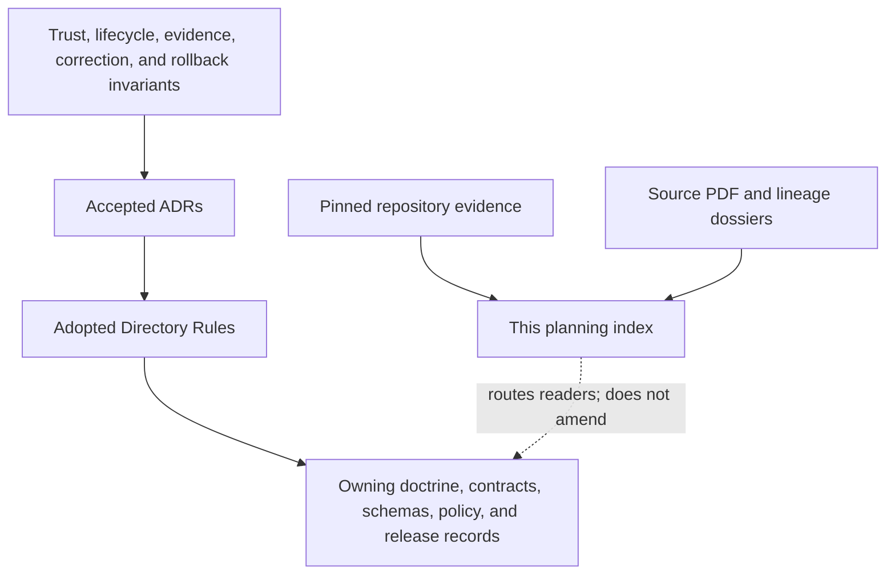

<!-- [KFM_META_BLOCK_V2]
doc_id: kfm://doc/encyclopedia-index
title: KFM Encyclopedia — Domain and Capability Planning Index
type: reference
subtype: planning-encyclopedia-index
version: v0.2
prior_version: v0.1
status: draft; repository-grounded; planning-synthesis; non-authoritative; no-publication
owners: "NEEDS VERIFICATION — .github/CODEOWNERS routes this path through the default @bartytime4life rule; no accepted encyclopedia stewardship assignment or independent approval control was verified"
created: 2026-05-18
updated: 2026-08-01
policy_label: public; planning-reference; cite-or-abstain; no-sensitive-detail
current_path: docs/KFM-encyclopedia.md
owning_root: docs/
canonical_relationship: same-path planning reference; distinct from and subordinate to docs/doctrine/encyclopedia.md
source_edition: Kansas Frontier Matrix Domain and Capability Encyclopedia v0.1 PDF-ready master planning manuscript, 2026-05-05
source_artifact:
  pages: 82
  bytes: 239723
  sha256: cc899a7a57cbadb5870709be07d9b0dbfd01712cd794d63dc4d640485970419a
  repository_path: UNKNOWN
authority_posture: synthesis and planning artifact; supersedes no doctrine, source report, official standard, contract, schema, policy, evidence, review, release, correction, or rollback object
truth_labels: [CONFIRMED, PROPOSED, UNKNOWN, NEEDS VERIFICATION]
evidence_snapshot:
  repository: bartytime4life/Kansas-Frontier-Matrix
  base_ref: main
  base_commit: 6161830859c8a51a942fcbadb7f718527b8250bb
  target_prior_blob: f48e05a314da6f975c8360599b5412516dba1a36
  directory_rules_blob: fd49a0b83e55cef52c1124281f093e263526898d
  directory_rules_adoption_adr_blob: cd044a38047cc9b3725d2e083eb201eb86109308
  doctrine_encyclopedia_blob: a5c8f452ca02cc63770b973bf47bd7c1f286a3fa
  domain_index_blob: 0477583eb94b060e92d0aa33c085325a62422280
  atlases_index_blob: 71a2bc4e2b150a324ac05389dbe89f9ac8f1cba5
  codeowners_blob: dd2a84aa514d8ecd9208bc347f90f9a2ed37dd61
  link_check_workflow_blob: ebf97093ed26b51de3aa1e8a0c90301115667d2a
related:
  - docs/doctrine/encyclopedia.md
  - docs/doctrine/directory-rules.md
  - docs/adr/ADR-0029-adopt-directory-governance-standard-v2.md
  - docs/domains/README.md
  - docs/atlases/README.md
  - docs/registers/DRIFT_REGISTER.md
  - docs/registers/VERIFICATION_BACKLOG.md
  - control_plane/document_registry.yaml
  - .github/CODEOWNERS
  - .github/workflows/link-check.yml
tags: [kfm, encyclopedia, planning, synthesis, domains, capabilities, governance, evidence, map-first, time-aware]
notes:
  - "v0.2 is a same-path repository-grounded modernization of docs/KFM-encyclopedia.md; it does not move the source PDF, create docs/encyclopedia/, or change doctrine."
  - "The source PDF was inspected as an attached lineage artifact. No repository path for those exact PDF bytes was verified at the pinned base."
  - "The manuscript's sixteen-section map is preserved as source lineage; current repository state is reported separately and does not retroactively rewrite the PDF."
  - "Static badges summarize document posture only. The workflow badge reports the default-branch link-check workflow, not this document's review, release, or publication state."
[/KFM_META_BLOCK_V2] -->

<a id="top"></a>

# KFM Encyclopedia — Master Index

> **A repository-grounded guide to the 82-page KFM Domain and Capability Encyclopedia v0.1: what the manuscript covers, how it relates to current KFM authority surfaces, and where readers must verify before acting.**

[](#0-status--authority)
[](#3-edition-lineage-and-supersession)
[](./adr/ADR-0029-adopt-directory-governance-standard-v2.md)
[](https://github.com/bartytime4life/Kansas-Frontier-Matrix/actions/workflows/link-check.yml)
[](#1-purpose-and-non-purpose)
[](#12-maintenance-and-update-cadence)

> [!IMPORTANT]
> **This file and the source manuscript are planning references, not doctrine or implementation proof.** For terminology and KFM-wide rules, use the [Doctrine Encyclopedia](./doctrine/encyclopedia.md), the [adopted Directory Rules v2](./doctrine/directory-rules.md), accepted ADRs, and the owning contracts, schemas, policy, evidence, validation, and release records. If a planning claim conflicts with an owning authority, the planning claim must be corrected or explicitly retained as superseded lineage.

> [!CAUTION]
> A map, badge, diagram, repository path, workflow result, generated explanation, or planning matrix does not establish source authority, rights clearance, sensitivity clearance, review, promotion, release, or KFM publication.

---

## Mini TOC

| Orientation | Manuscript map | Governance and use | Maintenance |
|---|---|---|---|
| [Status](#0-status--authority) · [Purpose](#1-purpose-and-non-purpose) · [Authority](#2-authority-and-truth-posture) · [Lineage](#3-edition-lineage-and-supersession) | [Resource layout](#4-resource-layout) · [16-section map](#5-encyclopedia-structure--16-section-map) · [Relationship to docs](#6-how-the-encyclopedia-relates-to-the-rest-of-docs) · [Cross-references](#7-cross-reference-maps) · [Source ledger](#8-source-ledger-reference) | [How to read](#9-how-to-read-this-resource) · [Truth labels](#10-truth-label-vocabulary) · [Sensitive material](#11-sensitive--deny-by-default-posture) | [Maintenance](#12-maintenance-and-update-cadence) · [Authoring](#13-authoring-contract-for-encyclopedia-edits) · [Self-check](#14-self-check-results--inherited-from-v01) · [Open work](#15-open-questions-and-verification-backlog) · [Changelog](#16-change-log-for-this-index) · [Provenance](#17-footer-and-provenance) |

---

## 0. Status & Authority

| Field | Current posture |
|---|---|
| **Current file** | **CONFIRMED** at `docs/KFM-encyclopedia.md` on the pinned repository snapshot |
| **Document role** | Planning-encyclopedia index and repository crosswalk |
| **Source edition** | **CONFIRMED** 82-page PDF-ready v0.1 manuscript dated 2026-05-05 |
| **Source PDF repository path** | **UNKNOWN** — the exact inspected PDF bytes were supplied to this update; no canonical repository path was verified |
| **Authority** | Synthesis / planning only; subordinate to doctrine, accepted decisions, semantic and machine contracts, policy, evidence, tests, and release records |
| **Distinct authority surface** | [`docs/doctrine/encyclopedia.md`](./doctrine/encyclopedia.md) is the doctrine-vocabulary index; this file must not redefine it |
| **Directory Rules basis** | [Directory Rules v2](./doctrine/directory-rules.md) assigns human-readable explanation to `docs/`; [ADR-0029](./adr/ADR-0029-adopt-directory-governance-standard-v2.md) adopts its exact bytes |
| **Review route** | **CONFIRMED** default CODEOWNERS route to `@bartytime4life`; stewardship and independent approval remain **NEEDS VERIFICATION** |
| **Publication authority** | None |
| **Last evidence review** | 2026-08-01 against `main@6161830859c8a51a942fcbadb7f718527b8250bb` |

The v0.1 manuscript accurately records its original evidence boundary: no mounted KFM repository was available in its authoring session. This v0.2 index has a different evidence boundary. It inspected current repository bytes and therefore replaces stale path-presence claims in this index, but it does **not** rewrite the historical evidence conditions stated inside the PDF.

> [!NOTE]
> Current repository evidence is authoritative for what is present at the pinned commit. Presence alone is not canon, adoption, implementation maturity, policy approval, release, or publication.

[Back to top](#top)

---

## 1. Purpose and Non-Purpose

### 1.1 Purpose — what this resource IS

This file makes the planning manuscript usable inside the current repository. It:

- preserves the manuscript's domain, capability, action, viewing-mode, evidence, policy, roadmap, and validation coverage;
- routes readers from planning concepts to current repository authority surfaces;
- separates source-manuscript facts from current repository facts;
- exposes stale, conflicting, unresolved, and unregistered relationships;
- keeps map and AI surfaces subordinate to evidence, policy, review, and release;
- provides a bounded authoring and validation contract for later encyclopedia updates.

The durable public unit of KFM value remains the **inspectable claim**: a claim whose evidence, source role, spatial and temporal scope, rights and sensitivity posture, policy decision, review state, release state, correction lineage, and rollback target can be inspected.

### 1.2 Non-Purpose — what this resource is NOT

- **Not doctrine.** KFM-wide vocabulary and rules belong in [`docs/doctrine/`](./doctrine/README.md).
- **Not an ADR.** Architecture decisions belong in [`docs/adr/`](./adr/INDEX.md).
- **Not a semantic contract, schema, or policy source.** Those belong in `contracts/`, `schemas/`, and `policy/`.
- **Not a source registry, EvidenceBundle, receipt, proof, or release record.**
- **Not a complete recursive repository inventory.**
- **Not a claim that every manuscript feature or domain object is implemented.**
- **Not a public API, map, viewer, AI runtime, review surface, release gate, or publisher.**
- **Not a repository home for the source PDF unless a later governed decision and provenance record establish one.**

This file may explain and cross-reference authority. It cannot create authority outside its planning-reference role.

[Back to top](#top)

---

## 2. Authority and Truth Posture

The source manuscript closes with a binding lineage statement: it is a synthesis and planning artifact, supersedes no source doctrine, source report, or official standard, and does not promote earlier planning material to implementation proof without repository, test, log, or generated-artifact evidence.

### 2.1 Authority subordination


```mermaid
flowchart TD
    INV["Trust, lifecycle, evidence, correction, and rollback invariants"] --> ADR["Accepted ADRs"]
    ADR --> DIR["Adopted Directory Rules"]
    DIR --> OWN["Owning doctrine, contracts, schemas, policy, and release records"]
    REPO["Pinned repository evidence"] --> ENC["This planning index"]
    SRC["Source PDF and lineage dossiers"] --> ENC
    ENC -. "routes readers; does not amend" .-> OWN
```

The diagram separates two questions:

1. **What controls?** Invariants, accepted decisions, adopted placement law, and the owning authority surface.
2. **What is currently present?** Pinned repository evidence.

The encyclopedia helps readers navigate both. It cannot convert observation or source lineage into governing authority.

### 2.2 Trust membrane

Anything described here that could reach a public or semi-public user remains subject to the KFM trust membrane:

```text
RAW -> WORK / QUARANTINE -> PROCESSED -> CATALOG / TRIPLET -> PUBLISHED
```

Promotion is a governed state transition, not a file move, branch, commit, pull request, merge, badge, or release tag. Public and ordinary UI surfaces use governed interfaces and released public-safe artifacts; they do not read RAW, WORK, QUARANTINE, restricted, canonical/internal, or unreleased candidate stores directly.

[Back to top](#top)

---

## 3. Edition Lineage and Supersession

| Edition | Date | Form | Current relationship |
|---|---|---|---|
| **Source v0.1** | 2026-05-05 | 82-page PDF-ready master planning manuscript | **CONFIRMED source lineage**; exact inspected bytes are not at a verified repository path |
| **Index v0.1** | 2026-05-18 | Earlier bytes at this path | Initial planning index; carried unverified folder, path, owner, badge, and repository-state claims |
| **Index v0.2** | 2026-08-01 | This same-path Markdown revision | Repository-grounded reconciliation; preserves manuscript coverage and corrects index-level drift |

v0.2 does **not** supersede or rewrite the PDF. It supersedes only the prior repository index bytes at this same path.

Future manuscript editions should preserve explicit source lineage, content identity, and a clear relationship to prior editions. “Extension” is a planning preference from the source corpus, not permission to duplicate canonical authority or retain a false claim. Corrections may narrow or remove unsupported index content while preserving the historical source reference.

[Back to top](#top)

---

## 4. Resource Layout

### Current verified relationship

| Surface | Role | Relationship to this file |
|---|---|---|
| `docs/KFM-encyclopedia.md` | Planning encyclopedia index | **This file; same-path target** |
| [`docs/doctrine/encyclopedia.md`](./doctrine/encyclopedia.md) | Doctrine vocabulary and concept index | Separate, higher-rank authority for KFM terminology |
| [`docs/domains/`](./domains/README.md) | Human domain-lane documentation | Current repository domain orientation and bounded status |
| [`docs/atlases/`](./atlases/README.md) | Atlas documentation lane | Versioned atlas carriers and references; naming conflicts remain visible |
| [`docs/registers/`](./registers/VERIFICATION_BACKLOG.md) | Human drift and verification views | Destination for repository-wide unresolved evidence, when governed there |
| Source PDF v0.1 | Full planning manuscript | Inspected input; canonical repository carrier remains **UNKNOWN** |

### Reclassified v0.1 layout claims

The former index described `docs/encyclopedia/README.md`, `docs/encyclopedia/kfm_encyclopedia.pdf`, future `chapters/`, and a crosswalk CSV as if this file already governed that folder. Current evidence does not establish that relationship.

| Prior claim | v0.2 disposition |
|---|---|
| This file is `docs/encyclopedia/README.md` | **STALE / repaired** — the verified path is `docs/KFM-encyclopedia.md` |
| The PDF is present under `docs/encyclopedia/` | **UNKNOWN** — no exact repository carrier was verified |
| A chapter-split folder is the planned next structure | **PROPOSED only** — requires duplication, authority, generation, and maintenance analysis |
| A Pass 23/32 CSV belongs under a new encyclopedia folder | **PROPOSED only** — no path is authorized by this index |

This update creates no folder, mirror, generated copy, or parallel authority.

[Back to top](#top)

---

## 5. Encyclopedia Structure — 16-Section Map

The source PDF contains the following sixteen sections. “Source status” describes the manuscript; “repository reading” describes only bounded current evidence.

| § | Manuscript section | Source status | Repository reading |
|---:|---|---|---|
| 1 | Cover Page | CONFIRMED | Source identity only |
| 2 | Executive Summary | CONFIRMED | Planning narrative, not implementation proof |
| 3 | Source Ledger and Evidence Method | CONFIRMED | Machine and human source registers exist, but completeness and authority remain mixed |
| 4 | KFM Operating Law | CONFIRMED as manuscript synthesis | Doctrine surfaces exist; adoption and document status must be checked per surface |
| 5 | Master Domain Atlas | CONFIRMED | Current human domain index documents 13 lanes |
| 6 | Cross-Domain Capability Taxonomy | CONFIRMED | Planning taxonomy; implementation varies by owning root |
| 7 | Domain Chapters | CONFIRMED | Manuscript has 16 chapter scopes; current `docs/domains/` has 13 registered lane names |
| 8 | Cross-Domain Systems Chapters | CONFIRMED | Architecture and app/package surfaces exist with mixed maturity |
| 9 | Master Feature Matrix | CONFIRMED | Planning matrix, not a current feature inventory |
| 10 | Master Action Matrix | CONFIRMED | Planning action surface; permissions remain policy- and role-dependent |
| 11 | Master Viewing Mode Atlas | CONFIRMED | Planning view catalog; current Explorer baseline is narrower |
| 12 | Programming Possibilities Backlog | CONFIRMED | Design space, not accepted implementation scope |
| 13 | Sensitive / Deny-by-Default Register | CONFIRMED as planning synthesis | Policy enforcement must be verified in owning policy and tests |
| 14 | Implementation Roadmap | CONFIRMED as plan | Historical sequencing, not current authorization |
| 15 | Validation and Acceptance Plan | CONFIRMED as plan | Repository tests and workflows provide bounded, surface-specific evidence |
| 16 | Appendices and Self-Check | CONFIRMED | Source lineage and self-assessment |

### 5.1 Per-domain chapter index (Ch. 7 expansion)

The manuscript's 16 chapter scopes and the current 13 human domain lanes are related but not identical.

| Manuscript scope | Current repository relationship | Current boundary |
|---|---|---|
| Spatial Foundation | Cross-domain foundation; not one of the 13 `docs/domains/` lane slugs | Spatial contracts, schemas, packages, and standards must be checked in their owning roots |
| Hydrology | [`hydrology`](./domains/hydrology/README.md) | Early proof-lane documentation; flood context is not alert authority |
| Soil | [`soil`](./domains/soil/README.md) | Human landing page remains a minimal placeholder |
| Habitat | [`habitat`](./domains/habitat/README.md) | Suitability and connectivity are evidence- and sensitivity-dependent |
| Fauna | [`fauna`](./domains/fauna/README.md) | Exact sensitive occurrences restrict or deny by default |
| Flora | [`flora`](./domains/flora/README.md) | Rare and culturally sensitive detail fails closed |
| Agriculture | [`agriculture`](./domains/agriculture/README.md) | Private joins and field-level exposure require rights and policy support |
| Geology / Natural Resources | [`geology`](./domains/geology/README.md) | Sensitive subsurface or resource detail requires policy gating |
| Atmosphere / Air | [`atmosphere`](./domains/atmosphere/README.md) | Context only; not emergency or life-safety authority |
| Hazards | [`hazards`](./domains/hazards/README.md) | KFM is never a life-safety alert authority |
| Roads / Rail / Trade | [`roads-rail-trade`](./domains/roads-rail-trade/README.md) | Infrastructure-vulnerability detail may require restriction |
| Settlements / Infrastructure | [`settlements-infrastructure`](./domains/settlements-infrastructure/README.md) | Critical-asset exactness fails closed |
| Archaeology / Cultural Heritage | [`archaeology`](./domains/archaeology/README.md) | Sites, burials, sacred places, and sovereignty-sensitive records restrict or deny |
| People / Genealogy / DNA / Land | [`people-dna-land`](./domains/people-dna-land/README.md) | Living-person, genomic, kinship, title-like, and person-parcel joins fail closed |
| Frontier Matrix synthesis | Cross-domain composition, not a current domain-lane slug | Composition does not own the underlying domain truth |
| Planetary / 3D / Digital Twin / Synthetic | Planning scope, not a current domain-lane slug | Renderer and representation choices require current architecture and evidence |

The [domain index](./domains/README.md) is the current human-facing lane inventory. It reports 13 lane README paths, mixed documentation maturity, and an empty machine domain register at its evidence snapshot. That finding does not establish complete domain implementation.

### 5.2 Cross-domain systems index (Ch. 8 expansion)

The manuscript's systems remain useful as a planning checklist:

- **Map surface** — released layer context, time, uncertainty, generalization, and correction visibility.
- **Evidence Drawer** — EvidenceRef-to-EvidenceBundle resolution and claim support.
- **Focus Mode** — bounded scope, evidence before generation, and finite negative outcomes.
- **Graph projection** — derived, queryable representation; never canonical truth.
- **Catalog / proof loop** — lifecycle closure, receipts, proofs, manifests, and release boundaries.
- **Review surface** — accountable review and separation of duties where required.
- **Public / restricted split** — governed public interfaces outside; canonical and restricted stores inside.

These are responsibilities and trust constraints. Their appearance in the manuscript does not prove a route, component, package, test, deployment, or release.

[Back to top](#top)

---

## 6. How the Encyclopedia Relates to the Rest of `docs/`

| Reader need | Current starting point | Authority relationship |
|---|---|---|
| KFM-wide term or invariant | [Doctrine Encyclopedia](./doctrine/encyclopedia.md) and [doctrine index](./doctrine/README.md) | Doctrine and accepted amendments outrank this planning index |
| Placement | [Directory Rules v2](./doctrine/directory-rules.md) and [ADR-0029](./adr/ADR-0029-adopt-directory-governance-standard-v2.md) | Adopted placement law |
| Architecture | `docs/architecture/` and accepted ADRs | Architecture explains realization; accepted decisions control within scope |
| Domain guidance | [`docs/domains/`](./domains/README.md) | Human lane documentation; contracts, schemas, policy, and evidence remain elsewhere |
| Atlas material | [`docs/atlases/`](./atlases/README.md) | Curated atlas lane with visible naming and carrier conflicts |
| Operational procedure | `docs/runbooks/` | Procedures, not doctrine or release authority |
| Drift and verification | [drift register](./registers/DRIFT_REGISTER.md) and [verification backlog](./registers/VERIFICATION_BACKLOG.md) | Human views; machine projections and status must be checked separately |

### 6.1 Encyclopedia vs. Atlas

| Planning encyclopedia | Atlas lane |
|---|---|
| Whole-system narrative spanning domains, capabilities, actions, views, systems, roadmap, and validation | Versioned atlas carriers, crosswalks, and atlas-derived references |
| Current repository carrier is this same-path Markdown index; source PDF carrier is unknown | Current lane is [`docs/atlases/`](./atlases/README.md) |
| Subordinate synthesis | Human-facing reference lane; individual carriers may still be proposed or conflicted |

This file does not resolve the atlas lane's carrier-name conflicts and does not create a new encyclopedia collection.

### 6.2 Encyclopedia vs. Domain Dossier (`docs/domains/<domain>/`)

The manuscript gives broad chapter-level synthesis. Domain landing pages give current repository orientation for one lane. Neither replaces the contracts, schemas, policy, fixtures, lifecycle records, or release decisions that own enforceable state.

When the planning manuscript and a current domain landing page disagree about repository presence or bounded status, use the current pinned repository evidence. When either disagrees with an owning authority, use the owning authority and record the drift.

### 6.3 Encyclopedia vs. Pass 23/32 Consolidated Atlas

The Pass 23/32 material is a stable-card idea and capability corpus. The planning encyclopedia is a narrative synthesis. A future crosswalk could connect chapter claims to stable card IDs, but its identity, canonical input, path, generation method, review burden, and update cadence remain **PROPOSED**.

[Back to top](#top)

---

## 7. Cross-Reference Maps

### 7.1 Domain → Atlas section → Responsibility root

The v0.1 index mixed manuscript domains with proposed flat contract and schema paths. Current Directory Rules instead require choosing the responsibility owner first, then adding a domain lane. Use these patterns as routing rules, not universal presence claims:

| Question | Owning surface | Encyclopedia role |
|---|---|---|
| What does a domain object mean? | `contracts/`, commonly a reviewed domain lane | Summarize and link; never redefine |
| What machine shape is valid? | `schemas/`, commonly a versioned contract-schema lane | Summarize and link; never embed parallel authority |
| When is it allowed, denied, held, restricted, or abstained? | `policy/` | Preserve finite outcomes and fail-closed posture |
| What proves representative behavior? | `tests/` and `fixtures/` | Report bounded evidence and its limits |
| Where does lifecycle material live? | Governed `data/` phases | Never promote by documentation |
| Who decides release, correction, withdrawal, or rollback? | `release/` and its governed records | Never approve from this file |
| What may normal public clients read? | Governed API plus released/public-safe artifacts | Preserve the trust membrane |

### 7.2 Cross-domain object-family family map

The source manuscript repeatedly uses the following planning backbone. The family names are retained as design lineage; current field shape, status, implementation, and authority must be verified in the owning repository surface.

| Family | Planning role | Verification route |
|---|---|---|
| `SourceDescriptor` | Source identity, role, rights, cadence, and admission context | Semantic contract, schema, registry, fixtures, validator, tests |
| `RightsBundle` / sensitivity profile | Rights, consent, sovereignty, sensitivity, and transform obligations | Policy, contracts, evidence, review, public-safe fixtures |
| `EvidenceRef` / `EvidenceBundle` | Claim support and evidence closure | Contract, schema, resolver, fixtures, citation/evidence tests |
| `LayerManifest` | Released map-layer delivery context | Contract, schema, release binding, map/client tests |
| `ReviewRecord` | Accountable review state where required | Review contract, identity and subject binding, separation controls |
| `ReleaseManifest` | Release identity, contents, correction, and rollback target | Release authority, proofs, signatures where required, rollback evidence |

Do not collapse receipts, proofs, evidence bundles, catalogs, review records, promotion decisions, release manifests, correction notices, or rollback records merely because they participate in one lifecycle.

### 7.3 Capability category map (Pass 23/32)

The prior index recorded these category labels and counts from its Pass 23/32 source lineage. They are retained for continuity, not represented as a current repository inventory:

| Category | Prior index count | Planning relationship |
|---|---:|---|
| ANA — Analysis, Indicators, Statistics, ML | 161 | Analysis and programming possibilities |
| CAT — Catalog, Discovery, Registration | 83 | Catalog and discovery |
| DAT — Data Lifecycle, Provenance, Receipts | 115 | Source ledger and operating law |
| DOC — Documentation, Doctrine, Reader Surfaces | 50 | Reader and governance surfaces |
| EVD — Evidence and Cite-or-Abstain | 108 | Evidence method and trust posture |
| MAP — Map Surface, Tiles, Styling | 137 | Cross-domain map systems and views |
| MDP — Metadata, Profiles, Crosswalks | 75 | Crosswalk and metadata design |
| MOD — Data Modeling, Domain Semantics, Temporal | 113 | Domain atlas and object modeling |
| PIP — Pipelines, Specs, Validators | 300 | Validation and implementation planning |
| POL — Policy, Sensitivity, Rights, Sovereignty | 124 | Sensitive and deny-by-default register |
| REL — Publication, Release, Correction, Rollback | 95 | Lifecycle closure and reversibility |
| SEC — Security, Auditability, Attestation | 130 | Trust and assurance |
| UIX — UI/UX, Viewer, Focus Mode, Evidence Drawer | NEEDS VERIFICATION | Cross-domain interaction surfaces |

The counts require source-card reconciliation before they may be treated as a complete, deduplicated, current inventory.

[Back to top](#top)

---

## 8. Source Ledger Reference

The manuscript's source ledger is a control surface: each source states what it supports and what it cannot prove. v0.2 preserves that method.

| Evidence input | What it supports here | What it cannot prove |
|---|---|---|
| Source encyclopedia PDF v0.1 | Title, date, 82-page structure, planning scope, lineage statement, and final self-check | Current repository implementation or a canonical repository carrier |
| Current target bytes | Prior index content, stable headings, gaps, and stale claims | Correctness of the underlying manuscript or system |
| Directory Rules v2 + ADR-0029 | Current placement authority and adoption boundary | Whether every repository path already conforms |
| Doctrine Encyclopedia | Current distinction between doctrine vocabulary and planning synthesis | Adoption or enforcement of every doctrine statement |
| Domain and atlas indexes | Bounded current documentation-lane status | Complete recursive implementation, policy, release, or publication |
| Registers, CODEOWNERS, and workflows | Current human/machine scaffolds, review routing, and bounded CI behavior | Stewardship, independent approval, complete controls, release, or publication |

### 8.1 Source families consulted by v0.1 (summary)

<details>
<summary>Preserved source-family lineage from the prior index</summary>

| Family | Examples | Evidence limit |
|---|---|---|
| KFM doctrine and architecture | Unified implementation architecture, Directory Rules, connected-dots architecture, AI operating contract, pipeline and MapLibre manuals | Doctrine and design lineage; current implementation requires repository evidence |
| Domain reports | Hydrology, soil, habitat, fauna, flora, agriculture, geology, atmosphere, hazards, transport, settlements, archaeology, people/DNA/land | Domain planning and source vocabulary; not live connector, policy, or release proof |
| GIS and spatial references | GIS primers, spatial-analysis references, 3D GIS material | Background patterns only |
| Software and data architecture | Domain-driven design, temporal database, SQL, API, React/UI references | Generic technique; not KFM-specific authority |
| Atlas and card corpora | Domains v1.1, Pass 23/32 consolidated atlas, full atlas seed cards | Planning coverage and stable idea lineage; reconciliation remains required |

</details>

Background references may inform vocabulary and design patterns. They do not prove KFM-specific paths, behavior, adoption, security, compliance, or release.

[Back to top](#top)

---

## 9. How to Read This Resource

### 9.1 Reader paths by goal

| Goal | Recommended path |
|---|---|
| Understand the planning vision | Source PDF executive summary → operating law → domain and systems chapters |
| Resolve a KFM term | [Doctrine Encyclopedia](./doctrine/encyclopedia.md) → owning doctrine, contract, schema, or policy |
| Find a current domain lane | [Domain index](./domains/README.md) → selected lane README → owning roots |
| Understand placement | [Directory Rules v2](./doctrine/directory-rules.md) → accepted ADRs → adjacent README |
| Inspect atlas lineage | [Atlas index](./atlases/README.md) |
| Verify a claim about code or behavior | Pinned implementation/config → representative fixture/test/run |
| Verify public readiness | Evidence + rights + sensitivity + policy + validation + review + release + correction + rollback |
| Record unresolved evidence | [Verification backlog](./registers/VERIFICATION_BACKLOG.md) or [drift register](./registers/DRIFT_REGISTER.md), when their scope applies |

### 9.2 Reading discipline

1. **Read the truth label as part of the claim.**
2. **Distinguish source lineage from current repository evidence.**
3. **Follow the responsibility root before acting.**
4. **Treat maps, AI, badges, diagrams, and summaries as derived surfaces.**
5. **Narrow or abstain when evidence is insufficient.**
6. **Keep rights, sensitivity, correction, and rollback visible.**

[Back to top](#top)

---

## 10. Truth-Label Vocabulary

### Core truth labels

| Label | Meaning |
|---|---|
| **CONFIRMED** | Verified in the current evidence boundary from source artifacts, pinned repository bytes, tests, logs, or generated artifacts |
| **PROPOSED** | A design, recommendation, future state, or unaccepted decision |
| **UNKNOWN** | Evidence is insufficient or inaccessible |
| **NEEDS VERIFICATION** | A concrete check is known but not yet closed strongly enough to rely on |

### Separate qualifiers and outcomes

`INFERRED`, `CONFLICTED`, `STALE`, and `SUPERSEDED` may qualify a core truth label; they do not replace it.

`ANSWER`, `ABSTAIN`, `DENY`, `HOLD`, `ALLOW`, `PASS`, `FAIL`, and `ERROR` are decision, policy, runtime, validation, or workflow outcomes only where the applicable contract defines them. Document lifecycle, component maturity, test status, and release state remain separate axes.

> [!CAUTION]
> Memory, plausibility, a filename, an old pull request, a badge, or a planning document is not current implementation evidence.

[Back to top](#top)

---

## 11. Sensitive / Deny-by-Default Posture

The manuscript correctly treats sensitive scope as fail-closed planning territory. This index preserves the categories without publishing sensitive values.

### 11.1 Cross-cutting deny lanes

| Sensitive lane | Default planning posture |
|---|---|
| Living-person identifiers, DNA/genomic data, kinship, and person-parcel joins | Restrict, quarantine, abstain, or deny until consent, rights, purpose, policy, and review close |
| Archaeological sites, burials, sacred places, and sovereignty-sensitive records | Deny precise public detail; require sovereignty-aware review and public-safe generalization |
| Rare fauna and flora occurrences | Deny or generalize precise locations according to rights, sensitivity, and stewardship controls |
| Critical infrastructure and vulnerability-revealing detail | Restrict or deny precise exposure |
| Private agriculture/operator joins | Deny public person/operator-to-parcel or field-level joins without explicit governed authority |
| Unknown rights, license, consent, or redistribution posture | Hold, quarantine, abstain, or deny |
| Hazard or emergency-authority claims | Deny authority substitution; KFM is contextual and not a life-safety alert service |
| Public release without governed closure | Hold or deny until evidence, policy, validation, review, release, correction, and rollback requirements are met |

### 11.2 Encyclopedia handling rule for sensitive material

This file may name a sensitive category, risk, transform, or finite outcome. It must not include living-person data, genomic detail, private title-like assertions, precise sensitive species or archaeological locations, sacred-place detail, critical-infrastructure coordinates, credentials, signed URLs, or restricted evidence.

Examples must be synthetic and visibly non-operational.

[Back to top](#top)

---

## 12. Maintenance and Update Cadence

Review is event- and risk-based under Directory Rules v2, not an invented blanket quarterly timer.

Re-review this index when:

- a source encyclopedia edition changes;
- an accepted ADR changes relevant authority or placement;
- the doctrine encyclopedia changes a term used here;
- a domain lane is added, renamed, merged, retired, or materially re-scoped;
- the canonical source-PDF carrier or provenance record is established;
- atlas or Pass-card identity changes;
- link-check coverage, CODEOWNERS routing, or the document registry changes;
- a drift, correction, withdrawal, security event, or rollback affects a material claim.

### 12.1 Edition rule

Every revision must distinguish:

1. **source-manuscript edition**;
2. **repository-index edition**;
3. **evidence snapshot**;
4. **authority or lifecycle state**.

Do not use a documentation version bump to imply implementation, release, or publication.

[Back to top](#top)

---

## 13. Authoring Contract for Encyclopedia Edits

### 13.1 What an edit MUST do

1. Read the complete current file and preserve its stable identity.
2. Keep this path unless a separately authorized migration decision exists.
3. Separate manuscript lineage, current repository observation, and governing authority.
4. Cite or link the owning surface for consequential claims.
5. Preserve the lifecycle and governed public boundary.
6. Fail closed on sensitive or rights-unclear material.
7. Update the evidence snapshot, validation statement, open work, and changelog.
8. Keep the source PDF's historical evidence boundary intact.

### 13.2 What an edit MUST NOT do

- create `docs/encyclopedia/`, a sibling “v2” file, chapter mirrors, or a crosswalk merely because the manuscript describes them;
- redefine a doctrine term, contract, schema, policy outcome, or release state;
- convert a path or workflow presence claim into maturity;
- promote a proposal to confirmed without current evidence;
- add placeholder owners, badges, licenses, commands, routes, counts, or states;
- hide critical trust, sensitivity, correction, or rollback guidance in collapsed content;
- publish the source PDF or derivative material without provenance, rights, and placement review.

### 13.3 Review burden

- CODEOWNERS currently routes this path to `@bartytime4life`.
- That route is not a StewardshipAssignment, ReviewRecord, required approval, independent review, release approval, or publication authority.
- A planning-only same-path clarification is a bounded documentation change.
- A doctrine, placement, object-family, public-boundary, sensitivity, or release change must be made in the owning authority surface through its applicable decision and review process.

### Validation commands

Run the repository-owned, no-network local-link checks when a checkout is available:

```bash
python -m unittest discover \
  --start-directory tests/validators/docs/link-check \
  --pattern 'test_*.py' \
  --verbose

python tools/validators/docs/link-check/check_links.py \
  --repo-root . \
  --format text \
  docs/KFM-encyclopedia.md
```

The checker validates bounded local Markdown targets and fragments. It does not request external URLs or prove content truth, accessibility, GitHub rendering, review, release, or publication.

[Back to top](#top)

---

## 14. Self-Check Results — Inherited from v0.1

The following results are claims made by the source PDF's final self-check. They describe coverage in that manuscript, not current repository implementation.

| # | Source self-check | v0.1 result |
|---:|---|---|
| 1 | Are all named domains covered? | YES |
| 2 | Are cross-domain systems covered? | YES |
| 3 | Are features, actions, views, knowledge systems, functions, and programming possibilities covered? | YES |
| 4 | Are sensitive domains fail-closed? | YES |
| 5 | Are AI and maps subordinate to evidence? | YES |
| 6 | Were unavailable conversation transcripts avoided as evidence? | YES |
| 7 | Are unsupported claims labeled? | YES |
| 8 | Are the PDF tables readable? | YES |
| 9 | Are publication, correction, and rollback included? | YES |
| 10 | Is the manuscript useful for future implementation? | YES |

### 14.1 Self-check for THIS index (v0.2)

| Check | Result |
|---|---|
| Same canonical path and `doc_id` retained | PASS |
| Planning and doctrine encyclopedia roles separated | PASS |
| Historical source boundary preserved | PASS |
| Stale no-repository and false self-path claims repaired | PASS |
| Placeholder owner, lint, metadata, and license badges removed | PASS |
| Current Directory Rules adoption reflected | PASS |
| Sensitive categories retained without sensitive values | PASS |
| Manuscript's 16-section and domain coverage retained | PASS |
| Current repository maturity kept bounded | PASS |
| Source PDF canonical repository carrier resolved | OPEN / UNKNOWN |

[Back to top](#top)

---

## 15. Open Questions and Verification Backlog

### 15.1 Placement and structure (ADR-class)

| ID | Current state | Closure evidence |
|---|---|---|
| OPEN-ENC-01 | **PARTIALLY RESOLVED.** This planning index is confirmed at `docs/KFM-encyclopedia.md`; the doctrine encyclopedia is confirmed separately. The durable long-term planning-reference path and any collection structure remain undecided. | Reviewed decision only if a move, collection, mirror, or generated relationship is proposed |
| OPEN-ENC-02 | **OPEN.** No chapter-split convention is authorized. | Canonical source, generator/parity rule, inbound-link plan, review burden, correction, and rollback |
| OPEN-ENC-03 | **OPEN.** Pass 23/32 crosswalk remains proposed. | Stable input identity, deduplication rules, canonical path, deterministic generation or maintenance process, tests, and reviewer |
| OPEN-ENC-04 | **OPEN.** The 16 manuscript scopes and 13 current domain lanes need an explicit conceptual crosswalk without inventing new lanes. | Reviewed crosswalk grounded in domain register and source chapter identities |

### 15.2 Source identity and provenance

| ID | Current state | Closure evidence |
|---|---|---|
| OPEN-ENC-05 | **UNKNOWN.** Exact source PDF bytes have no verified canonical repository carrier. | Approved provenance record and canonical path or durable external reference |
| OPEN-ENC-06 | **NEEDS VERIFICATION.** The PDF's rights and redistribution posture were not established by its embedded metadata. | Rights record and approved repository visibility/publication posture |
| OPEN-ENC-07 | **NEEDS VERIFICATION.** No machine registry entry for `kfm://doc/encyclopedia-index` is present in the inspected `control_plane/document_registry.yaml`. | Reviewed registry entry or explicit decision that this planning document remains unregistered |

### 15.3 Stewardship and validation

| ID | Current state | Closure evidence |
|---|---|---|
| OPEN-ENC-08 | **NEEDS VERIFICATION.** CODEOWNERS routing exists; encyclopedia stewardship and independent approval do not. | Approved responsibility assignment and repository control evidence |
| OPEN-ENC-09 | **NEEDS VERIFICATION.** Hosted exact-head checks for this revision begin only after a draft PR exists. | PR check results for the verified head |
| OPEN-ENC-10 | **KNOWN LIMIT.** The local link checker excludes external availability, reference-style links, inline HTML links, and full GitHub render proof. | Expanded reviewed validator coverage or separately recorded bounded checks |

### 15.4 Closed or reclassified v0.1 items

- `docs/KFM-encyclopedia.md` existence: **CONFIRMED**.
- `docs/domains/` and `docs/atlases/` existence: **CONFIRMED**.
- Current Directory Rules authority: **CONFIRMED adopted** through ADR-0029.
- “No mounted repo inspected” as a current index claim: **STALE and repaired**; retained only as the PDF's historical source boundary.
- Placeholder document-lint and license badges: **REMOVED** because they represented no verified fact.

[Back to top](#top)

---

## 16. Change Log for This Index

| Date | Edition | Change | Authority effect |
|---|---|---|---|
| 2026-05-18 | v0.1 | Initial planning index; described an intended `docs/encyclopedia/README.md` relationship and source PDF placement that were not repository-verified | None; planning draft |
| 2026-08-01 | v0.2 | Same-path repository-grounded modernization: preserved manuscript coverage, corrected file and authority relationships, separated truth labels from outcomes, repaired badges and navigation, added verified links and validation commands, and exposed unresolved provenance and registration | None; planning reference only |

Every substantive update must add a row without converting a documentation change into doctrine, implementation, release, or publication.

[Back to top](#top)

---

## 17. Footer and Provenance

### 17.1 Evidence basis for this draft

**CONFIRMED source evidence**

- `Kansas Frontier Matrix Domain and Capability Encyclopedia` v0.1 PDF-ready master planning manuscript, created 2026-05-05;
- 82 pages, 239,723 bytes, SHA-256 `cc899a7a57cbadb5870709be07d9b0dbfd01712cd794d63dc4d640485970419a`;
- visual inspection of the cover, contents, and final lineage/self-check page;
- text extraction used for section and lineage verification, not as a substitute for visual review.

**CONFIRMED repository evidence**

- `bartytime4life/Kansas-Frontier-Matrix` at `main@6161830859c8a51a942fcbadb7f718527b8250bb`;
- complete prior target bytes and blob `f48e05a314da6f975c8360599b5412516dba1a36`;
- adopted Directory Rules v2 bytes and accepted ADR-0029;
- doctrine encyclopedia, domain index, atlas index, registers, CODEOWNERS, and bounded link-check workflow;
- no open pull request at the overlap preflight.

Current implementation, policy, evidence, review, release, and publication claims remain bounded to the specific inspected sources. This index does not claim a full recursive repository audit.

### 17.2 Inheritance statement

The planning index inherits the source manuscript's evidence-first, map-first, time-aware, cite-or-abstain, fail-closed, correction-visible, and reversible posture. Current doctrine and accepted decisions control when terminology or authority has changed since the manuscript was authored.

### 17.3 Reversibility

Before merge, rollback is to close the draft PR and abandon the feature branch. After an authorized merge, revert the single documentation commit. Do not delete this path or move it as a shortcut: deletion or migration changes document identity and inbound-link behavior and requires separate evidence and authority.

### 17.4 Contact

- **GitHub review route:** [`.github/CODEOWNERS`](../.github/CODEOWNERS) → `@bartytime4life`
- **Encyclopedia steward:** NEEDS VERIFICATION
- **Drift:** [`docs/registers/DRIFT_REGISTER.md`](./registers/DRIFT_REGISTER.md)
- **Verification:** [`docs/registers/VERIFICATION_BACKLOG.md`](./registers/VERIFICATION_BACKLOG.md)
- **ADRs:** [`docs/adr/INDEX.md`](./adr/INDEX.md)

### 17.5 Closing rule

> [!IMPORTANT]
> **The encyclopedia is a synthesis, not a sovereign.** Maps, tiles, graphs, AI answers, scenes, dashboards, indexes, and this document are downstream carriers. KFM earns public trust only through inspectable evidence, bounded authority, policy-aware decisions, review, governed release, visible correction, and reversible rollback.

---

*End of `docs/KFM-encyclopedia.md` v0.2 draft.*

[Back to top](#top)
