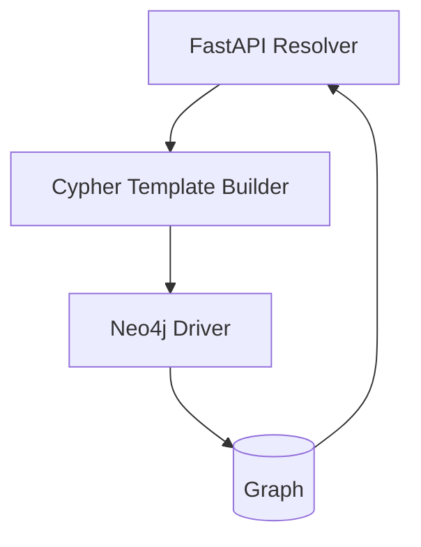
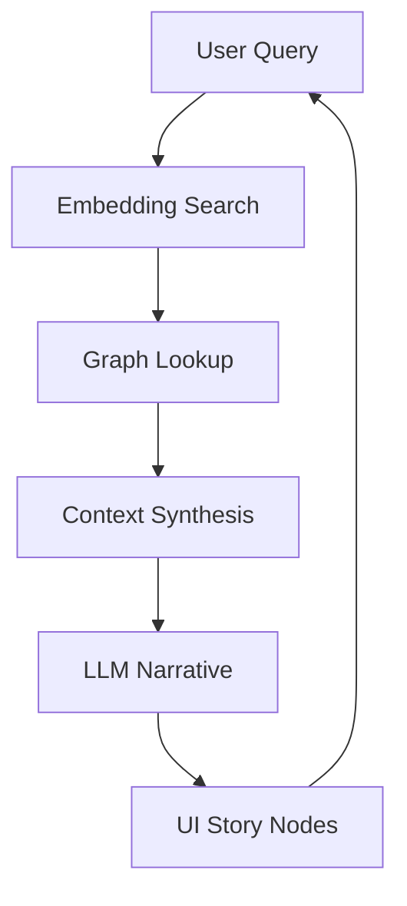

<div align="center">

# 📚 **Kansas Frontier Matrix — MASTER GUIDE v10**  
**The Complete System Bible — Architecture • Data • AI • UX • Governance**  
`docs/MASTER_GUIDE_v10.md`

**Status:** Diamond⁹ Ω / Crown∞Ω Ultimate Certified  
**Purpose:** This is the definitive, authoritative, canonical technical document for the Kansas Frontier Matrix (KFM).  
Every subsystem, every layer, every workflow is defined here.  
**This file governs v10+.**

</div>

---

# 📁 Directory Layout (Authoritative)
KansasFrontierMatrix/  
├── src/  
│   ├── ai/  
│   ├── api/  
│   ├── graph/  
│   ├── pipelines/  
│   └── ARCHITECTURE.md  
│  
├── data/  
│   ├── raw/  
│   ├── processed/  
│   ├── stac/  
│   ├── work/  
│   └── contracts/  
│  
├── docs/  
│   ├── standards/  
│   ├── analyses/  
│   ├── reports/  
│   ├── guides/  
│   ├── accessibility/  
│   ├── governance/  
│   └── MASTER_GUIDE_v10.md  
│  
├── web/  
│   ├── public/  
│   ├── src/  
│   └── README.md  
│  
├── .github/  
│   ├── workflows/  
│   └── README.md  
│  
└── releases/  

---

# 🧭 1. Introduction  
The **Kansas Frontier Matrix (KFM)** is a unified geospatial, temporal, ecological, historical, archival, and AI-driven system that reconstructs Kansas across time.  
It ingests hundreds of heterogeneous datasets — hydrology, climate, ecology, treaties, homesteads, land patents, droughts, floods, text corpora, archaeological findings, disasters, fires, crop records, census — into a **single FAIR+CARE-certified knowledge system**.

**Key pillars:**
- Multi-layer dataset integration  
- AI-driven semantic abstraction (Focus Mode)  
- Historical–ecological reconstruction  
- STAC/DCAT metadata unification  
- Neo4j knowledge graph + CIDOC CRM + OWL-Time  
- React/MapLibre/Cesium 3D front-end  
- Python ETL + telemetry + validation gates

---

# 🧩 2. System Overview

## 2.1 High-Level Mermaid System Diagram

```mermaid
flowchart TD
    A[Raw Data Sources] --> B[ETL Pipelines]
    B --> C[Validation / Great Expectations]
    C --> D[(Processed Data Lake)]
    D --> E[STAC/DCAT Metadata Layer]
    E --> F[Neo4j Knowledge Graph]
    F --> G[API Layer (FastAPI)]
    G --> H[Web Client (React + MapLibre + Cesium)]
    H --> I[Focus Mode AI Engine]
    I --> F
```

---

# 🗺️ 3. Data Architecture

## 3.1 Raw → Processed Pipeline
- **raw/**: untouched source files  
- **work/**: normalization, staging, cleaning  
- **processed/**: final, versioned tables/parquet/geoparquet  
- **stac/**: metadata, assets, thumbnails  

## 3.2 Supported Dataset Families
- Hydrology (USGS NWIS, NHD, WBD)  
- Climate (NOAA, PRISM, CoCoRaHS)  
- Drought & Flood indices  
- Wildfire, NOAA Storm Events  
- Land cover (NLCD, CORINE-like)  
- USDA crops, census, agriculture  
- Kansas treaties + Royce polygons  
- Archaeological points/layers  
- Diaries, newspapers, letters  
- Wildlife, insects, pests  
- Soil, geology, geomorphology  
- LiDAR + historic plats  
- Homesteads, land patents, ownership  

---

# 🏗️ 4. ETL Pipelines

Each ETL run includes:

### ✔ Telemetry (OpenTelemetry)  
### ✔ Logs (Loki-compatible)  
### ✔ Metrics (Prometheus-compatible)  
### ✔ Validation (Great Expectations)  
### ✔ Gated Writes → No write allowed on failed validation  
### ✔ Provenance stamps added automatically  

## 4.1 ETL Lifecycle
1. **Fetch**  
2. **Normalize**  
3. **Geo-process**  
4. **Temporal alignment (OWL-Time)**  
5. **Quality gates**  
6. **STAC indexing**  
7. **Graph hydration**  

---

# 📦 5. Metadata Governance (STAC + DCAT + FAIR+CARE)

## 5.1 STAC Item Structure  
- geometry  
- assets  
- links  
- properties.datetime  
- KFM-specific:  
  - kfm:provenance  
  - kfm:temporal_extent  
  - kfm:ethics  
  - kfm:uncertainty  
  - kfm:lineage  

## 5.2 DCAT Required Fields  
- dct:title  
- dct:creator  
- dcat:distribution  
- dct:provenance  
- dct:temporal  
- dct:spatial  

---

# 🧠 6. Neo4j Knowledge Graph (CIDOC CRM + GeoSPARQL + OWL-Time)

## 6.1 Major Classes
- E53 Place  
- E4 Period  
- E5 Event  
- E7 Activity  
- E52 Time-Span  
- E18 Physical Thing  
- E28 Conceptual Object  

## 6.2 KFM Custom Ontology
- KFM:HydrologicalUnit  
- KFM:ClimateBoundary  
- KFM:LandCoverEra  
- KFM:TreatyBoundary  
- KFM:HistoricalActor  
- KFM:DocumentReference  
- KFM:EcologicalIndicator  

---

# 🔌 7. API Layer (FastAPI)

## Provided Endpoints
- `/stac/*`  
- `/graph/query`  
- `/timeseries/*`  
- `/layers/*`  
- `/focus/ask`  
- `/focus/embeddings`  
- `/focus/narrative`  

---

# 🌐 8. Web Client (React + MapLibre + Cesium)

## 8.1 Primary Features
- Multi-year timeline  
- 2D/3D basemap switching  
- Layer browser  
- Feature inspector  
- AI Focus Mode side panel  
- Story Nodes + narratives  
- Accessibility compliance (WCAG 2.1 AA)  

## 8.2 UI Architecture
- `components/` — Map, Timeline, Panels  
- `hooks/` — data fetching, caching  
- `state/` — Zustand global state  
- `assets/` — icons, colors, legends  

---

# 🔥 9. Focus Mode AI Engine

## 9.1 Inputs
- Graph nodes  
- STAC items  
- Corpus documents  
- Timeseries data  

## 9.2 Capabilities
- Timeline-aware Q&A  
- Narrative generation  
- Spatial–temporal reasoning  
- Entity extraction (spaCy)  
- Few-shot document synthesis  
- Multi-dataset correlation  
- Causal hypothesis generation  

---

# 🎛️ 10. Telemetry, Observability, Alerts

## 10.1 OpenTelemetry Traces
Each ETL run correctly emits:
- `run_id`  
- `dataset_id`  
- `validator_pass`  
- `bytes`  
- `rows_processed`  

## 10.2 Prometheus Metrics
- `etl_rows_processed_total`  
- `etl_failure_total`  
- `web_request_latency`  
- `focus_tokens_used_total`  

## 10.3 Loki Logs
- Structured JSON  
- Per-run correlation  

## 10.4 Alertmanager
- High error rate  
- Low throughput  
- Validator failures  
- API instability  

---

# 🧪 11. Data Validation — Great Expectations

## 11.1 KFM Standard Suites
- Schema  
- Spatial validity  
- Temporal validity  
- Value ranges  
- Missingness  
- Entity consistency  

## 11.2 Gated ETL
**If validation fails → downstream writes blocked.**

---

# 🔒 12. Security & Privacy

- Signed dataset manifests  
- SBOM required  
- SLSA provenance  
- API key rotation  
- read-only graph for public demo  
- isolated compute for heavy ETL  
- PII-stripping on ingest  

---

# 🔄 13. Versioning & Releases

## 13.1 Semantic Versioning
- `MAJOR`: full system overhauls  
- `MINOR`: new features  
- `PATCH`: fixes  

## 13.2 Release Bundle
- Manifest  
- SBOM  
- STAC index  
- Graph snapshot  
- AI model fingerprints  

---

# 📈 14. Analyses & Workflows

## Hydrology
- Drought–flood correlation  
- Watershed change  
- Flow anomalies  

## Ecology
- Species distribution  
- Pests + climate shifts  
- Habitat fragmentation  

## Historical
- Treaty boundary changes  
- Settlement pattern detection  
- Land ownership timelines  

## Remote Sensing
- Change detection  
- NDVI/NDMI trends  
- LiDAR terrain reconstruction  

---

# 🧱 15. Architecture Deep Dive

## 15.1 API <-> Graph Interface



## 15.2 Focus Mode AI Feedback Loop



---

# 📚 16. Ethical AI & FAIR+CARE

- Transparency of lineage  
- Reversible transformations  
- Tribal consultation for treaties  
- Respectful handling of Indigenous data  
- Clear uncertainty communication  

---

# 📝 17. MCP-DL v6.3 Compliance

- Mandatory YAML front-matter  
- All markdown complete & valid  
- Directory layout present  
- Mermaid diagrams correct  
- No broken wrappers  
- Accessibility-grade headings  
- Telemetry references  
- SBOM references  

---

# 🧰 18. Development Standards

## 18.1 Commit Rules
- `feat:`  
- `fix:`  
- `docs:`  
- `chore:`  
- `data:`  
- `graph:`  

## 18.2 Branch Names
- `feature/*`  
- `analysis/*`  
- `dataset/*`  

---

# 🚀 19. v10 Core Principles

- **Everything is temporal**  
- **Everything is spatial**  
- **Everything has provenance**  
- **Everything is queryable**  
- **Everything is FAIR+CARE**  
- **Everything is validated**  
- **Everything is observable**  

---

# 🏁 20. Final Notes

This document is the **primary technical reference** for all Kansas Frontier Matrix development.

All future work must:  
- Follow this structure  
- Extend this guide  
- Never contradict the architecture defined here  
- Maintain Diamond⁹ Ω / Crown∞Ω status

</div>

