<div align="center">

# 📚 **Kansas Frontier Matrix — MASTER GUIDE v11**  
**The Complete System Bible — Architecture · Data · AI · UX · Governance**  
`docs/MASTER_GUIDE_v11.md`

**Status:** Diamond⁹ Ω / Crown∞Ω Ultimate Certified  

**Purpose**  
Serve as the **definitive, canonical reference** for the Kansas Frontier Matrix (KFM) v11+.  
Every subsystem, layer, workflow, and governance rule is defined here.  
**This file governs v11+.**

[](README.md)  
[](docs/standards/kfm_markdown_protocol_v11.md)  
[](../LICENSE)  
[](standards/faircare.md)  
[]()

</div>

--- ✦ ---

## 📘 Overview

The **Kansas Frontier Matrix (KFM)** is a unified, semantic, geospatial–temporal system reconstructing **Kansas through time** — historically, ecologically, hydrologically, and culturally.

KFM integrates:

- **Environmental & physical systems**  
  - Hydrology, climate, drought/flood indices, hazards  
  - Land cover, terrain, soils, geology, geomorphology  
- **Legal & social systems**  
  - Treaties, homesteads, land patents, deeds, plats  
  - Census, agriculture, economic and demographic records  
- **Cultural & historical records**  
  - Archaeological data, diaries, newspapers, letters, archives  
  - Tribal histories, culturally significant places (with CARE governance)  
- **Biodiversity & ecology**  
  - Wildlife, insects, pests, vegetation, habitat change  

All of this is coordinated through:

- **Python ETL pipelines + LangGraph orchestrated agents**  
- **STAC 1.x / DCAT 3.0 metadata** (raster/vector/catalog)  
- **Neo4j knowledge graph** with **CIDOC-CRM + GeoSPARQL + OWL-Time + PROV-O**  
- **React + MapLibre + Cesium 3D** front-end  
- **FAIR+CARE governance + telemetry + validation gates**  
- **Reliable pipelines + Validation & Observability** architecture (v11)  

This guide defines how those pieces fit together.

--- ✦ ---

## 📁 Directory Layout (Authoritative v11)

```text
KansasFrontierMatrix/
├── src/
│   ├── ai/                     # AI models, Focus Mode, explainability, embeddings
│   ├── api/                    # FastAPI / GraphQL services, STAC/DCAT endpoints
│   ├── graph/                  # Neo4j schema, migrations, Cypher queries
│   ├── pipelines/              # ETL, ingestion, validation, reliable pipelines
│   └── ARCHITECTURE.md         # Source system architecture
│
├── data/
│   ├── raw/                    # Unaltered sources (NOAA, USGS, KHS, etc.)
│   ├── work/                   # Normalization, staging, AI-assisted enrichment
│   ├── processed/              # Published datasets (tables, GeoJSON, Parquet, COGs)
│   ├── stac/                   # STAC Collections & Items
│   ├── contracts/              # Data contracts (JSON/Schema)
│   └── ARCHITECTURE.md         # Data architecture specification
│
├── docs/
│   ├── README.md               # Documentation hub
│   ├── standards/              # Markdown rules, FAIR+CARE, governance
│   ├── architecture/           # System, web, data, AI, graph, Focus Mode
│   ├── pipelines/              # Reliable pipelines, validation & observability
│   ├── analyses/               # Domain-specific analyses & research docs
│   ├── reports/                # Validation, audit, telemetry, governance logs
│   ├── guides/                 # Contributor, data governance, self-validation
│   ├── accessibility/          # A11y standards & patterns
│   ├── glossary.md             # Glossary & terminology index
│   └── MASTER_GUIDE_v11.md     # This master guide
│
├── web/
│   ├── public/                 # Static assets, icons, manifest
│   ├── src/                    # React + MapLibre + Cesium client
│   └── README.md               # Web architecture & dev guide
│
├── .github/
│   ├── workflows/              # CI/CD, validation, security, telemetry
│   └── README.md               # GitHub infrastructure overview
│
├── schemas/                    # JSON Schema, SHACL, ontology definitions
├── tests/                      # Unit, integration, E2E, schema, governance, a11y tests
├── releases/                   # Manifests, SBOMs, telemetry per version
└── Makefile                    # Common automation targets
```

--- ✦ ---

## 🧩 System Overview

```mermaid
flowchart TD
  A["Raw Data Sources<br/>NOAA · USGS · KGS · KHS · BLM · GBIF · Archives"] --> B["ETL Pipelines"]
  B --> C["Validation & Observability<br/>Schemas · FAIR+CARE · AI Checks"]
  C --> D["Data Work / Processed Layers"]
  D --> E["STAC/DCAT Metadata Layer"]
  E --> F["Neo4j Knowledge Graph"]
  F --> G["API Layer<br/>FastAPI / GraphQL / STAC"]
  G --> H["Web Client<br/>React · MapLibre · Cesium"]
  H --> I["Focus Mode v3 AI Engine"]
  I --> F
```



Key principles:

- **Every artifact is versioned, typed, and validated**  
- **Every dataset has spatial + temporal + provenance metadata**  
- **Every narrative is grounded in data and governed by FAIR+CARE**  

--- ✦ ---

## 🗺️ Data Architecture

### 1. Raw → Processed Pipeline

- `data/raw/`  
  - Untouched sources (archives, APIs, files)  
  - Immutable snapshots where licenses allow  

- `data/work/`  
  - Normalization, unit conversion, CRS reprojection  
  - AI-assisted extraction (OCR, NER, geocoding, summarization)  
  - Intermediate artifacts used for validation  

- `data/processed/`  
  - Final, **certified** tables, GeoJSON, Parquet, COGs  
  - Only produced after full validation & FAIR+CARE checks  

- `data/stac/`  
  - STAC Collections & Items describing each geospatial asset  
  - References to `raw`, `work`, and `processed` as appropriate  

- `data/archive/` (optional in tree, but conceptual)  
  - Immutable historical copies of key releases  

### 2. Dataset Families (non-exhaustive)

- **Hydrology** — USGS NWIS, NHD, WBD, streamflow, flood histories  
- **Climate** — NOAA, PRISM, Daymet, drought indices, future projections  
- **Hazards** — storms, floods, fires, tornadoes, disasters, FEMA data  
- **Land Cover & Terrain** — NLCD, LiDAR, DEMs, soils, geomorphology  
- **Agriculture & Demography** — crop records, census, land use patterns  
- **Treaties & Land Tenure** — Royce polygons, BLM patents, homesteads, deeds  
- **Archaeology & History** — sites, surveys, diaries, newspapers, letters  
- **Ecology & Biodiversity** — wildlife, insects, pests, vegetation, eBird/GBIF  

All datasets must include:

- Spatial extent (`bbox`, CRS)  
- Temporal extent (OWL-Time aligned)  
- License & rights metadata  
- Provenance (PROV-O)  
- CARE / sensitivity labels where applicable  

--- ✦ ---

## 🏗️ ETL Pipelines & Reliable Pipelines (v11)

Each ETL pipeline is:

- **Deterministic** — same inputs → same outputs  
- **Observable** — emits OTel traces, metrics, logs  
- **Gated** — blocked by validation failures  
- **Reproducible** — fully captured in WAL & configs  
- **Governed** — subject to FAIR+CARE, licensing, and sovereignty checks  

**Lifecycle**

1. **Fetch** — ingest from external sources (HTTP, APIs, archives)  
2. **Normalize** — standardize columns, units, CRS, and IDs  
3. **Enrich** — AI-assisted NER, geocoding, summarization, tagging  
4. **Align** — align with KFM schema & ontologies (CIDOC, OWL-Time, GeoSPARQL)  
5. **Validate** — structural + semantic + spatiotemporal + AI + ethical checks  
6. **Publish** — write to `data/processed/` and update STAC/DCAT metadata  
7. **Hydrate Graph** — selectively load entities and relations into Neo4j  

**Reliable Pipelines** add:

- Write-Ahead Log (WAL)  
- Deterministic retry behavior  
- Automatic rollback to last-known-good state  
- Blue/green dataset promotion into graph & UI  

See also: `docs/pipelines/reliable-pipelines.md` and `docs/pipelines/validation-observability/README.md`.

--- ✦ ---

## 📦 Metadata Governance (STAC + DCAT + FAIR+CARE)

### STAC

Every geospatial asset is described by a **STAC Item** with:

- `geometry`, `bbox`, `properties.datetime` or temporal interval  
- `assets` describing COGs, GeoJSON, tables, or derived rasters  
- `links` to Collections, related Items, and upstream sources  

KFM-specific properties:

- `kfm:provenance` — provenance chain IDs (PROV-O references)  
- `kfm:care_label` — CARE classification (`public`, `restricted`, `sensitive`)  
- `kfm:lineage` — pipeline IDs, ETL versions, run IDs  
- `kfm:ethics_notes` — optional governance notes  

### DCAT

Each logical dataset is described as a **DCAT Dataset**:

- `dct:title`, `dct:description`  
- `dct:creator`, `dct:publisher`, `dct:license`  
- `dct:temporal`, `dct:spatial`  
- `dcat:distribution` referencing STAC Items or other assets  

Validation is enforced via:

- `stac_validate.yml`  
- `dcat_validate.yml`  
- FAIR+CARE governance workflows  

--- ✦ ---

## 🧠 Neo4j Knowledge Graph (CIDOC-CRM + GeoSPARQL + OWL-Time + PROV-O)

### Major Classes (simplified)

- **CIDOC-CRM Core**  
  - `E53 Place` — towns, landscapes, sites, administrative units  
  - `E4 Period` / `E5 Event` — historical periods and events  
  - `E7 Activity` — human actions (e.g., treaty negotiations, surveys)  
  - `E52 Time-Span` — temporal extent of events and periods  
  - `E18 Physical Thing` — artifacts, documents, physical sites  

- **KFM Extensions**  
  - `KFM:HydrologicalUnit`, `KFM:Watershed`  
  - `KFM:ClimateBoundary`  
  - `KFM:TreatyBoundary`  
  - `KFM:HistoricalActor`  
  - `KFM:EcologicalIndicator`  
  - `KFM:Dataset`  

- **PROV-O Integration**  
  - `prov:Entity`, `prov:Activity`, `prov:Agent`  
  - ETL runs, transformation steps, decisions, and AI modules are modeled as `prov:Activity`  

### Example Relations

- `(Person)-[:ATTENDED]->(Event)`  
- `(Event)-[:LOCATED_AT]->(Place)`  
- `(Document)-[:MENTIONS]->(Place|Event|Person)`  
- `(Dataset)-[:COVERS]->(Place)`  
- `(StoryNode)-[:NARRATES]->(Event|Place|Person)`  
- `(Dataset)-[:WAS_GENERATED_BY]->(ETL_Run)`  

This graph powers Focus Mode, Story Nodes, semantic search, and analysis.

--- ✦ ---

## 🔌 API Layer (FastAPI / GraphQL / STAC)

The API layer provides a governed interface to data and narratives.

Representative endpoints:

- `/stac/*` — STAC browsing, search, filter by temporal/spatial extent  
- `/dcat/*` — dataset catalog queries  
- `/graph/query` — graph queries (Cypher or GraphQL)  
- `/timeseries/*` — time series for climate, hydrology, hazards  
- `/layers/*` — map layers for frontend (with metadata)  
- `/focus/ask` — Focus Mode Q&A, entity-centric queries  
- `/focus/narrative` — AI narrative generation with provenance links  

Security:

- OAuth2/OIDC for authenticated/privileged operations  
- RBAC for sensitive content and editing capabilities  
- Read-only defaults for public endpoints  

--- ✦ ---

## 🌐 Web Client (React + MapLibre + Cesium)

### Primary UX Concepts

- **Linked map + timeline**  
  - MapLibre for 2D maps  
  - Integrated timeline for temporal filtering & animation  

- **3D visualization (Cesium)**  
  - Terrain and historical overlays  
  - Time-layered scenes for landscape change and events  

- **Focus Mode v3**  
  - Entity-centric panel with narrative, facts, maps, and timelines  
  - Graph-driven context windows  

- **Story Nodes**  
  - Guided narratives with stepwise maps, timelines, and content blocks  

### Implementation Highlights

- Accessible, WCAG 2.1 AA UI  
- Responsive layout with emphasis on large-screen exploration  
- Clear layering and legends; accessible color choices  
- Keyboard and screen-reader friendly  

See also: `web/ARCHITECTURE.md` (if present) and `docs/architecture/web/`.

--- ✦ ---

## 🎯 Focus Mode AI Engine (v3)

### Inputs

- Graph subgraphs centered on an entity  
- STAC/DCAT metadata for relevant datasets  
- Extracted text from documents and archives  
- Time-series summaries and raster statistics  

### Capabilities

- Entity-centric Q&A (Who/What/When/Where/How)  
- Narrative synthesis over multiple datasets  
- Spatial–temporal pattern highlighting  
- Story Node suggestions and cross-links  
- Explainability artifacts (e.g. references, evidence lists)  

### Guardrails

- Grounding: all claims traceable to graph data or sources  
- No speculative causal claims beyond available data  
- Hallucination detection with rejection of unverified details  
- CARE and governance checks for sensitive entities  

--- ✦ ---

## 📡 Telemetry, Observability & Alerts

### Telemetry

Emits:

- ETL run stats: rows, bytes, latency, failure types  
- Web metrics: response times, error rates, Core Web Vitals  
- AI metrics: latency, token count, success/failure, alignment metrics  
- Governance metrics: FAIR+CARE pass rates, data classification stats  

Collected into:

- `releases/<version>/focus-telemetry.json`  

### Observability

- OpenTelemetry traces with `run_id`, `dataset_id`, `span_id`  
- Prometheus-compatible metrics  
- Structured logs (e.g., Loki)  

### Alerts

- High error or failure rate  
- Persistent validator failures  
- Security anomalies  
- Resource exhaustion patterns  

--- ✦ ---

## 🧪 Data Validation & Self-Validation

Validation stack (v11):

1. **Structural** — schema, types, required fields  
2. **Semantic** — ontology alignment, domain constraints  
3. **Spatiotemporal** — geometry validity, CRS, time intervals  
4. **AI/ML** — OCR confidence, NER precision, hallucination guardrails  
5. **FAIR+CARE** — licensing, CARE labeling, sensitivity, sovereignty  

Tools:

- Great Expectations or equivalent suites  
- JSON Schema & SHACL  
- STAC & DCAT validators  
- Custom FAIR+CARE validation pipelines  

**If any validator fails → dataset does not promote** into `processed/` or the graph.

--- ✦ ---

## 🔒 Security & Privacy

Core security posture:

- Signed manifests and SBOMs for releases  
- SLSA-inspired build provenance for critical workflows  
- Secret-free repository; secrets stored in external providers  
- Principle-of-least-privilege in CI/CD and runtime  
- PII scrubbing and minimal PII ingestion by default  
- Strict handling of sensitive locations and community-specific data  

Security docs live under `docs/security/` (where present) and `.github/`.

--- ✦ ---

## 🔄 Versioning & Releases

### Semantic Versioning

- **MAJOR** — architecture, schema, or ontology-breaking changes  
- **MINOR** — new features, datasets, or Story Nodes with backward compatibility  
- **PATCH** — bug fixes, documentation improvements, small refinements  

### Release Bundle Contents (v11)

- `manifest.zip` — asset inventory + checksums  
- `sbom.spdx.json` — dependency SBOM  
- STAC root catalog snapshot  
- Optional graph snapshot or data exports  
- Model cards and AI metrics (where applicable)  
- `focus-telemetry.json` — telemetry & governance metrics  

Releases are validated end-to-end before being marked production-ready.

--- ✦ ---

## 📈 Analyses & Workflows

Examples of supported analyses:

- **Hydrology** — drought–flood correlation, flow anomalies, watershed transitions  
- **Ecology** — species distribution change, habitat fragmentation, pest spread  
- **Historical** — treaty boundary evolution, settlement dynamics, land tenure shifts  
- **Remote Sensing** — NDVI/NDMI trends, burn scars, erosion analysis, LiDAR-based morphology  

Each analysis should document:

- Data sources and licenses  
- Methodology and assumptions  
- Validation, uncertainty, and limitations  
- Story Nodes and visualizations that interpret the results  

--- ✦ ---

## 🧱 Architecture Deep Dive (Selected Patterns)

### API ↔ Graph Interface


### Focus Mode Feedback Loop

```mermaid
flowchart TD
  A["User Focus Selection<br/>(Person · Place · Event · Story)"] --> B["Context Builder<br/>Graph Subgraph + STAC/DCAT"]
  B --> C["LLM / Focus Transformer"]
  C --> D["Narrative & Insights<br/>+ Evidence & Links"]
  D --> E["UI Rendering<br/>Panels · Map · Timeline"]
  E --> A
```



--- ✦ ---

## 📚 MCP-DL v6.3 & KFM-MDP v11 Compliance

This master guide embodies:

- Required YAML front-matter, including governance metadata  
- CI-safe markdown (no broken fences, predictable structure)  
- Directory layout sections using fenced `text` blocks  
- Mermaid diagrams with valid syntax  
- References to telemetry and governance artifacts  
- Alignment with `docs/standards/kfm_markdown_protocol_v11.md`  

It should be treated as the **source of truth** for:

- What belongs where in the repo  
- How new modules and datasets are documented  
- How pipelines and validation must be described  

--- ✦ ---

## 🧰 Development Standards (Summary)

### Commits

Use conventional-style prefixes:

- `feat:`, `fix:`, `docs:`, `data:`, `graph:`, `ci:`, `security:`, `chore:`  

### Branching

- `feature/*`, `analysis/*`, `dataset/*`, `fix/*`, `docs/*`  

### Pull Requests

- Must include documentation updates where relevant  
- Must pass all CI stages (lint, tests, schemas, FAIR+CARE, security)  
- Must fill PR template fields (CARE, provenance, a11y, telemetry)  

See `CONTRIBUTING.md` for full contributor workflow rules (v11).

--- ✦ ---

## 🌾 Core Principles (v11)

1. **Everything is temporal** — OWL-Time-backed intervals and instants  
2. **Everything is spatial** — explicit geometries, BBoxes, and CRS  
3. **Everything has provenance** — PROV-O, STAC/DCAT references, lineage logs  
4. **Everything is queryable** — graph, STAC, API, and catalog interfaces  
5. **Everything is FAIR+CARE** — ethical, documented, and governed  
6. **Everything is validated** — schema, semantics, AI, and ethics checks  
7. **Everything is observable** — telemetry, metrics, logging, and audit trails  

These principles guide **all** design and implementation decisions.

--- ✦ ---

## 🕰️ Version History

| Version  | Date         | Author        | Summary                                                                                           |
|---------:|-------------:|--------------|---------------------------------------------------------------------------------------------------|
| v11.0.0  | 2025-11-18   | KFM Core Team | Upgraded to v11: integrated reliable pipelines, validation/observability, updated web/AI stack.  |
| v10.3.1  | 2025-11-13   | KFM Core Team | Master guide aligned to v10.3; diagrams fixed; telemetry & governance references updated.        |
| v10.2.2  | 2025-11-13   | KFM Core Team | Expanded architecture coverage; added Focus Mode and telemetry sections.                          |
| v10.x    | 2025-??-??   | KFM Core Team | Earlier v10 iterations of the master guide (pre-v11 architecture refinements).                    |

--- ✦ ---

<div align="center">

**Kansas Frontier Matrix — MASTER GUIDE v11**  
*Architecture · Data · AI · UX · Governance*  

© 2025 Kansas Frontier Matrix — CC-BY 4.0  

[Back to Docs Index](README.md) · [System Architecture](../src/ARCHITECTURE.md) · [Data Governance Guide](guides/data-governance/README.md)

</div>
